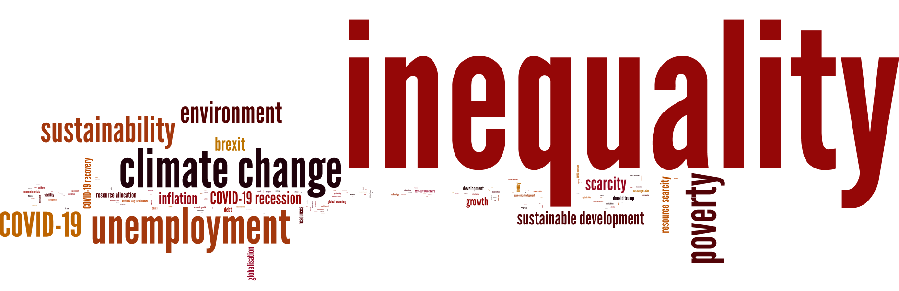
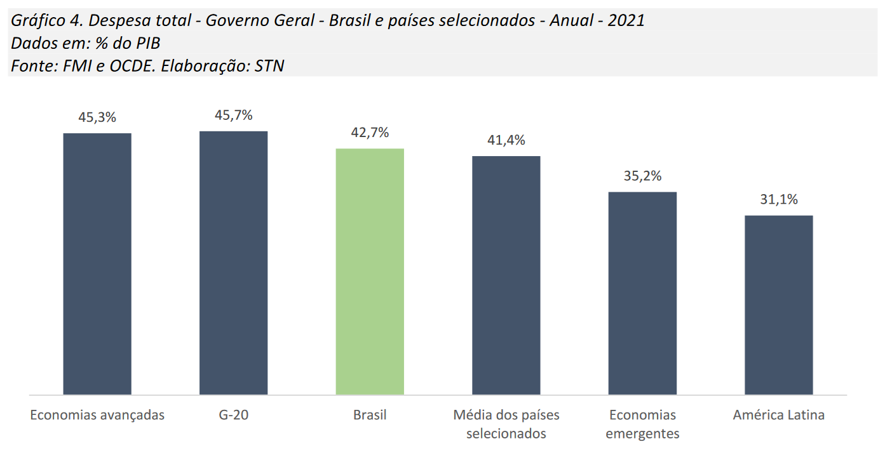
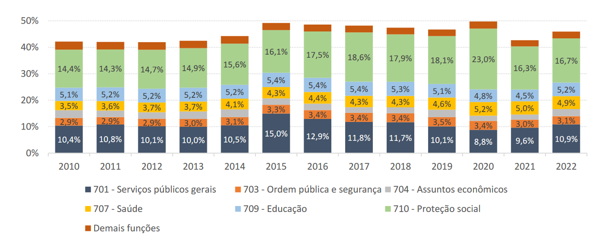
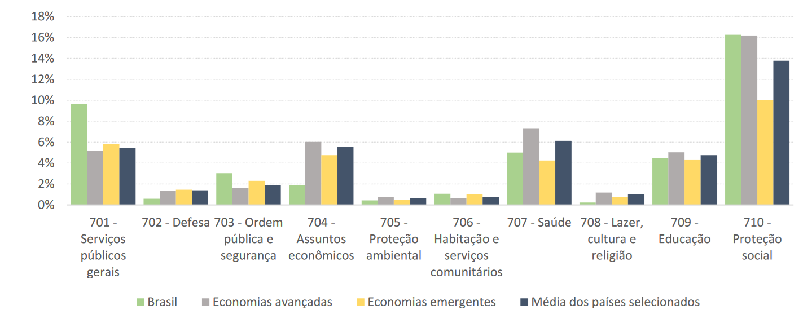
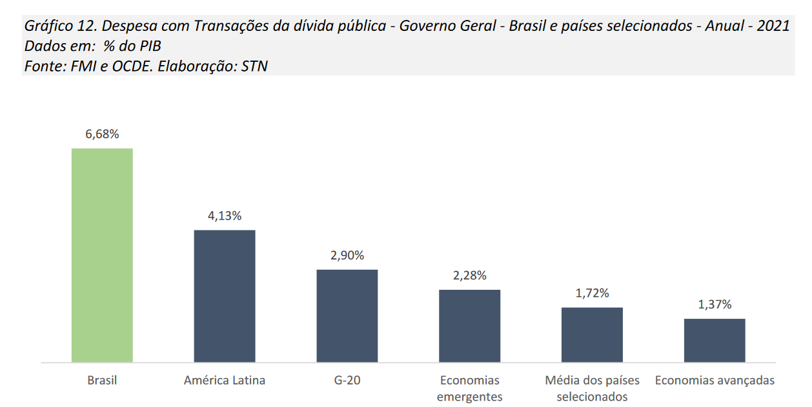
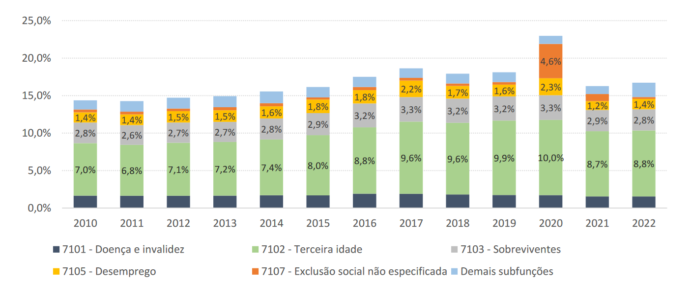

class: inverse, middle, center

```{r, load_refs, include=FALSE, cache=FALSE}
library(RefManageR)
BibOptions(check.entries = FALSE,
           bib.style = "alphabetic",
           cite.style = "alphabetic",
           style = "markdown",
           hyperlink = FALSE,
           dashed = FALSE)
myBib <- ReadBib("./esp_bib.bib", check = FALSE)
```

# Introduction

---
class: middle

```{r, echo=FALSE, out.width = '80%', fig.align="center"}

```

---
class: middle
## English

These slides were translated to English by the PUB scholarship holder Chen Xiaoting, I thank her for her effort!

All course materials are in English. Lectures are also in English, but questions in Portuguese are allowed &mdash; any words you do not know, feel free to ask (maybe I even made it up `r emo::ji("flushed")`)

Exercise lists and exams can also be written in Portuguese, but essays must be delivered in English &mdash; presentations should also be in English so everyone can understand, but we can talk personally if anyone feels uncomfortable


---
class: middle

```{r, echo=FALSE, out.width = '90%'}

```

The most important words in economics studies for undergraduate students around the world &mdash; almost all of the main ones are related to the government

---
class: middle
## Public sector economy

The government has a huge participation in modern economies:

1. Regulating activities and whole sectors (*industrial organization*)
2. Acting directly to provide public goods or correct externalities
3. Governments collect income from some agents and transfer to others, affecting the distribution of resources in the economy
4. Policy of business cycles and public debt (*macro*)

---
class: middle
## Positive vs normative economics

**Positive economics** is the study of issues about *how the world is*: *factual* points of discussion, and therefore, can be argumented in empirical and "scientific" ways

**Normative economics** is the study of issues about *how the world should be*: therefore, it involves *value judgments*, and it is not "refutable" &mdash; it is ethics, not "science"

Public policies *always* involve value judgments &mdash; and as economists, we can help by establishing to which social values each public policy will be desirable

---
class: middle
## Public economics

In public economics, we study four types of questions:

1. In which situations *should* the government intervene in the economy? (normative economics)
2. How the government *should* intervene? (normative economics)
3. What is the effect of these interventions on society? (positive economics)
4. How the government *actually* intervene, and why? (positive economics)

The fourth question is what we know as (modern) **political economy**


---
class: middle
## 1. When should the government intervene?

**Traditional theory:** the role of governmental intervention is *only* to solve **market failures** &mdash; the most well known are *externalities* and *public goods*

Also important are informational asymmetries, incomplete (insurance) markets and, more recently, internalities &mdash; discussing another market failure: *market power*, is the role of antitrust policy

**Modern theory:** besides correcting market failures, taxation and governmental redistribution is the main tool to *reduce inequalities*


---
class: middle

```{r, echo=FALSE, out.width = '90%'}

```

Capitalism tolerates completely disparate distributions of the social product: from extreme inequality, as in Brazil, to surprisingly small inequality as in Scandinavia in the 1970s, when the richest 10% received (on average) only 2.5 times as much as the average income! `r Citep(myBib, "piketty2018capital")`

---
class: middle

```{r, echo=FALSE, out.width = '80%'}
knitr::include_graphics("figs/aula-1-grafico-2.png")
```

Why focus on inequality in this course? Governments have a central role in mitigating inequality &mdash; in modern economies, income inequality after taxes and transfers is significantly smaller than the taxable income inequality

---
class: middle

```{r, echo=FALSE, out.width = '80%'}
knitr::include_graphics("figs/aula-1-grafico-16.png")
```

The proportion of academic articles in the public sector area of NBER, which mentions the "richest 1%" `r Citep(myBib, "kleven2018language")`

---
class: middle

```{r, echo=FALSE, out.width = '90%'}

```

Brazil has always been an extremely unequal economy (compare with the previous chart), with the richest 1% receiving 1/4 of the income and 1-in-10,000 richest (20,000 people) earned 5% of Brazilian income `r Citep(myBib, "souza2016")`

---
class: middle

```{r, echo=FALSE, out.width = '90%'}

```

If the share of "dominant class" did not change since the beginning of the historical series, there was a considerable decline of the 10% richest proportion in the income with redemocratization `r Citep(myBib, "souza2016")`

---
class: middle

```{r, echo=FALSE, out.width = '80%'}

```

Brazil being extremely unequal at the top, someone who receives R$ 5.25 k/month (2024 reais) is already on the richest 10%, and R$ 10k on the richest 5%, but to join the "dominant class", a person needs to have an income >5x higher (~35k/month), and the "ultra-rich" >25x higher (~130k/month) `r Citep(myBib, "souza2016")`

---
class: middle

```{r, echo=FALSE, out.width = '90%', fig.align="center"}

```

Brazil is more unequal than any other large economy (5th largest of the world/UNDP), although the recent growth of inequality in the US has brought it close to our country `r Citep(myBib, "souza2016")`

---
class: middle

```{r, echo=FALSE, out.width = '70%', fig.align="center"}

```

While in Brazil the 5% poorest have an income comparable to the 5% poorest in India and rural China, the 5% richest in the country have income close to the 1% richest in United States [@BrankoMilan](https://twitter.com/BrankoMilan)

---
class: middle

```{r, echo=FALSE, out.width = '50%', fig.show="hold"}

knitr::include_graphics("figs/eae0310-7-17b.png")
```

Consistently with the **Great Gatsby curve**, Brazil not only has huge inequality in income, but also intergenerational inequality: a child born in a family in the upper quintile has almost 50% chance of remaining in the upper quintile, and the same for the bottom quintile `r Citep(myBib, "gc2022intergenerational")`
 
---
class: middle

```{r, echo=FALSE, out.width = '70%', fig.align="center"}

```

Intergenerational mobility is smaller in the North and Northeast regions, and higher in the South, Southeast and Center-east `r Citep(myBib, "gc2022intergenerational")`

---
class: middle
## 2. How can the government intervene in the economy?

Let's say the government wants to encourage the production of desirable goods (say, health services) or discourage the production of undesirable goods. Then it can: 

1. Intervene in the price mechanism (agents' incentives) through taxation or subsidy
2. Forbid or oblige directly the consumption of a certain good (usually offered by the market)
3. Direct public provision of the good (SUS - Unified Health System) or finance the private provision (administrative concessions, public-private partnerships)

---
class: middle

```{r, echo=FALSE, out.width = '100%'}
knitr::include_graphics("figs/eae0310-1-5.png")
```

In all the modern economies, transfers and governmental expenses (education, health, defense, etc.) constitute a large part &mdash; and in some countries the largest part &mdash; of the national product `r Citep(myBib, "gruber")`

---
class: middle
## 3. What are the effects of these interventions?

Any governmental intervention has two effects: the direct effects and the indirect effects (or **mechanical effects** and **behavioral effects**)

> In the economic world an economic action, an institution, a law, do not generate only one effect but a whole series of effects. Only the first effect is obvious. It is manifested simultaneously with its cause: *it can be seen*. 

> The others only unroll in succession. *They cannot be seen*: we are lucky if we can predict them. Here is the whole difference between a good and a bad economist: the
latter only minds the visible effect, while the former accounts for both the effect that can be seen and those that must be predicted... `r Citep(myBib, "bastiat1873")`

---
class: middle
## 3. What are the effects of these interventions?

**Direct/mechanical effects** of a public policy are those effects which would occur *if the individuals did not change their behavior in response to the policy* &mdash; effects that arise because of the agents' behavior changes are called **indirect or behavioral effects**

*It is in order to calculate these indirect effects that exist microeconomics models*: behavioral models to foresee how individuals respond to different interventions

But the economic theory rarely can give a definitive answer &mdash; the magnitude of indirect effects turns out to be an empirical question

---
class: middle
## 4. Why does the government act like it does?

Although it is an important step to define what the governors would do *if they were* "benevolent planners" (1 and 2), we know that in practice they are not

Public policy decisions are *political decisions*, and the study of how politics affects the implementation of economic policies is called **political economy** 

The existence of market failures opens up the *possibility* for governmental intervention to increase efficiency &mdash; however, in order for it actually happen, societies must overcome **government failures** (interest groups, corruption, populism)


---
class: inverse, middle, center

# Public spending in Brazil

---
class: middle
## Public spending in Brazil

Overall, government in Brazil spends 45.9% of GDP accross its 3 spheres of government [[Boletim COFOG/2022]](https://sisweb.tesouro.gov.br/apex/f?p=2501:9::::9:P9_ID_PUBLICACAO:48752) &mdash; about 34% of GDP from the federal government, 13.6% states and 9.6% municipalities (with double counting)

In Brazilian federal pact, the federal government is responsible for the social protection (39.3% of the federal budget, mostly retirement and PBF), the states for the security policy, and  municipalities for the primary health care services

In education, the federal government provides university education, high school is frequently provided by state governments, and municipalities offer the childcare and primary schools (roughly speaking)

---
class: middle

```{r, echo=FALSE, out.width = '100%'}

```

Public spending in Brazil is about level with advanced economies, the OECD and G20, but substantially larger than developing countries and Latin American economies [[Boletim COFOG/2022]](https://sisweb.tesouro.gov.br/apex/f?p=2501:9::::9:P9_ID_PUBLICACAO:48752)

---
class: middle

```{r, echo=FALSE, out.width = '100%'}

```

The largest share of public spending in Brazil is with social protection (16.7% of GDP in 2022), followed by "general public services" (mostly interest on public debt), then education (5.2% of GDP) and health (4.9%) [[Boletim COFOG/2022]](https://sisweb.tesouro.gov.br/apex/f?p=2501:9::::9:P9_ID_PUBLICACAO:48752)

---
class: middle

```{r, echo=FALSE, out.width = '100%'}

```

Brazil spends in social protection in line with advanced economies (generally older populations), but much ahead of developing countries &mdash; in health and education Brazilian public spending is also comparable to world average (in percentage of GDP) [[Boletim COFOG/2022]](https://sisweb.tesouro.gov.br/apex/f?p=2501:9::::9:P9_ID_PUBLICACAO:48752)

---
class: middle

```{r, echo=FALSE, out.width = '100%'}

```

In 2021, Brazil spent 6.7% of GDP on interest payments, 2x the G20 average, and more than the total public expenditure on education or health [[Boletim COFOG/2022]](https://sisweb.tesouro.gov.br/apex/f?p=2501:9::::9:P9_ID_PUBLICACAO:48752)

---
class: middle

```{r, echo=FALSE, out.width = '100%'}

```

The lion's share of social potection spending is on retirement expenses, about 9% of GDP, followed by "survivor's pension" (2.8%) and unemployment insurance (1.4%) &mdash; even with their recent growth, poverty relief programs like *Bolsa Família* respond to only about 1.2% of GDP [[Boletim COFOG/2022]](https://sisweb.tesouro.gov.br/apex/f?p=2501:9::::9:P9_ID_PUBLICACAO:48752)

---
class: middle

<iframe width="600" height="371" seamless frameborder="0" scrolling="no" src="https://docs.google.com/spreadsheets/d/e/2PACX-1vQWjA0CiuIqQYZEk7SaiQkI8nak6NkhiYOicXjb0jaV6VVDxAOsIjz7ELQgJz5FZqu4Bz6sDWPYOMzL/pubchart?oid=1665153157&amp;format=interactive"></iframe>

The states are responsible for public security (10% of the budget from São Paulo State Government), in addition to part of education (18%) and health (12%). Public servants' social security consume almost 1/5 of the state budget of 11,4% of São Paulo's GDP [[SFP/ESP]](https://www.fazenda.sp.gov.br/SigeoLei131/Paginas/FlexConsDespesa.aspx)

---
class: middle

<iframe width="600" height="371" seamless frameborder="0" scrolling="no" src="https://docs.google.com/spreadsheets/d/e/2PACX-1vQWjA0CiuIqQYZEk7SaiQkI8nak6NkhiYOicXjb0jaV6VVDxAOsIjz7ELQgJz5FZqu4Bz6sDWPYOMzL/pubchart?oid=1124154423&amp;format=interactive"></iframe>

Meanwhile, the prefecture spends 9% of the city's GDP (from 2018), and it is the one responsible for primary health services (21% of São Paulo budget), in addition to (mostly primary) education (20%), urban planning and transportation (18%) [[Prefeitura de SP]](https://www.prefeitura.sp.gov.br/cidade/secretarias/licenciamento/desenvolvimento_urbano/dados_estatisticos/info_cidade/financas_municipais/)

---
class: middle

```{r, echo=FALSE, out.width = '80%', fig.align="center"}

```

In the 2000s, there was a decentralization in public goods provision, with the number of municipal servants almost doubling in the period to 62% of public employment and around 6.5% of total Brazilian workforce (while the state and federal employment remained constant at 3% and 0.8% of workforce, respectively) [[Atlas do Estado Brasileiro/IPEA]](https://www.ipea.gov.br/atlasestado/)

---
class: middle

```{r, echo=FALSE, out.width = '80%', fig.align="center"}

```

Almost all Brazilian public sector employees work in the Executive branch (94%), with the rest almost evenly distributed between Legislative and Judiciary [[Atlas do Estado Brasileiro/IPEA]](https://www.ipea.gov.br/atlasestado/)

---
class: middle

```{r, echo=FALSE, out.width = '100%', fig.align="center"}

```

There is a lot of talk about the high salaries in Brazilian public service, and they do exist: but almost only in the federal government and, especially, in the Judiciary. In the prefectures, the *public-sector wage premium* is estimated to be even a little negative [[Atlas do Estado Brasileiro/IPEA]](https://www.ipea.gov.br/atlasestado/)

---
class: inverse, middle, center

# Normative analysis

---
class: middle
## The surplus of consumer and producer

*When there is no income effect*, we can represent the welfare gain of consumers and producers of a market through their "surplus"

**Consumer surplus** is located below the demand curve (*willingness to pay* for a certain unit) and above the market price

**Producer surplus** is the profit of selling a certain unit: the difference between the marginal cost (of that unit), representing the supply curve, and the market price

---
class: middle

```{r, echo=FALSE, out.width = '90%'}

```

The more elastic the demand, the smaller is the *consumer surplus*: if I am indifferent about butter or margarine (a very elastic demand), the existence of the butter market does not generate much welfare gain `r Citep(myBib, "gruber")`

---
class: middle

```{r, echo=FALSE, out.width = '90%'}
knitr::include_graphics("figs/eae0310-1-11.png")
```

The same goes for the *producer surplus*, which measures the economic rent of plants that are more productive than the marginal ones &mdash; in the long run, if the productive processes have *constant returns to scale*, the producer surplus is zero (there is no economic profit) `r Citep(myBib, "gruber")`

---
class: middle

```{r, echo=FALSE, out.width = '70%'}
knitr::include_graphics("figs/eae0310-1-12.png")
```


The effect of a price ceiling $P_R$ on social welfare: consumers receive $B - D$ and producers lose $B + E$: there is a loss of efficiency, **but whether it is desirable depends on the social weight of welfare for each group** `r Citep(myBib, "gruber")`

---
class: middle
## Pareto Efficiency

The most uncontroversial concept in normative analysis is **Pareto improvement**: an intervention which improves the situation of some individuals without harming any other is clearly desirable

If an allocation does not allow Pareto improvement, we call it *Pareto efficient* &mdash; the problem with this concept is that it is *weak*: in general, there are infinite such allocations

Pareto improvement is convenient (and extremely convincing) because it is an intervention which would be *approved unanimously*: we must be very reluctant in relation to policies that are not Pareto efficient

---
class: middle
## First Fundamental Theorem

Public economics starts with the principle that the *benchmark* should be non-intervention, and the government should only act when there are special reasons for it, namely to *fix market failures* &mdash; the theoretical justification for this "ideology" is the 1st welfare theorem

**First "Fundamental" Theorem of Welfare Economics**: If (i) domiciles and firms are *price-takers*, in other words, they act in a *perfectly competitive* way taking prices as given; (ii) the *markets are complete*; and (iii) information is complete, then *if* there exists a competitive equilibrium, it is *Pareto efficient*

---
class: middle
## When the First Theorem fails

The main difficulty of 1st FTWE is probably the requirement for markets to be **complete** and **perfectly competitive**

In many important markets, returns to scale reduce the market to a few firms (*oligopolies*): chemical, petroleum, steel, processed foods, etc &mdash; in general, most firms have at least some *market power* (both monopoly power in product market and monopsony power in the labor market)

The complete market hypothesis involves not only the absence of public goods and externalities, but also the existence of present and future markets which price all the possible eventualities (incl. perfect insurance and credit markets)

---
class: middle
## When the First Theorem fails

In the real world, **informational asymmetries** produce pervasive moral hazard and adverse selection problems in the economy: in work relationships, (incomplete) contracts between firms, relationship with the consumer

If acquiring information is costly (there are **transaction costs**), the equilibrium with complete markets is logically inconsistent, because if all the information is priced, it is not worth the cost to "price the information" `r Citep(myBib, "grossman1980impossibility")`

The argument of the 1st FTWE is not that these market failures do not exist, it is that if the government wants to intervene on the free market, it should be clear about *which market failure makes this intervention desirable*

---
class: middle
## Second Fundamental Theorem

**Second Fundamental Theorem of Welfare Economics:** If the conditions of the 1st FTWE are valid, curves of indifference and production possibility sets are convex and *lump-sum transfers can be used freely*, then any Pareto efficient allocation can be achieved as a competitive equilibrium of a given reallocation of initial allocations by lump-sum transfers

**Lump-sum transfers** do not depend on individual choice variables and therefore do not distort behavior (i.e. do not generate inefficiencies): e.g., poll taxes, universal basic income (UBI), and similar instruments

---
class: middle
## Second Fundamental Theorem

Pareto efficient allocations are the ones in which there is **no unanimous** improvement &mdash; Pareto efficiency is very unrestrictive: extremely unequal allocations (plausibly undesirable) can be Pareto efficient, it is not enough for normative analysis!

A historical attempt to solve this issue with normative economics was the 2nd FTWE: we can separate the efficiency problem from the equity problem

For example, by the 2nd FTWE the price ceiling will **always** be a bad policy, because it is Pareto dominated by the market allocation with *lump-sum* transfers from producers to consumers

---
class: middle
## Price ceiling in the world of the 2nd FTWE

With the price ceiling, consumer surplus is $A + B$, and the producer surplus is $C$ &mdash; as the consumer surplus with the price ceiling is greater than in the free market, $A + D$, *removing the ceiling is not Pareto improvement, even though the ceiling generates deadweight loss*

But note that (because of deadweight loss) the producers lose more than consumers gain from the ceiling: their surplus drops from $C + B + E$ to $C$

So if producers reward consumers in a *lump-sum way* for removing the ceiling with an amount between $B - D$ and $B + E$, it is possible to improve the situation of (at least) one group without worsening anyone’s situation


Given that $A + D + (B - D) \geq A + B$ and $C + B + E - (B - D) > C$, and equally $A + D + (B + E) > A + B$ and $C + B + E - (B + E) \geq C$

---
class: middle
## Second Fundamental Theorem

The problem with that argument is that in the real world it is impossible to redistribute income only with lump-sum transfers, so *any income redistribution is costly* &mdash; therein lies the **fallacy of the 2nd FTWE**

There is a **trade-off between efficiency and equity**: it is not possible to evaluate public policies by separating the efficiency discussion ("economics") from the equity discussion ("political philosophy")


Since considering equity is an essential part of the process, it becomes essential to make *value judgments* &mdash; in economics these judgments are embodied in the format of *social welfare functions*

---
class: middle
## Government instruments

The 2nd FTWE fundamentally depends on the existence of lump-sum transfers, but they are:

> not very helpful in securing desired redistributions unless we tax different men differently. But on what criteria should we discriminate between different men? (...) If we start taxing the poor less than the rich, we are simply reintroducing an income-tax. If we tax able men more than dunderheads, we open the door to all forms of falsification: we make stupidity seem profitable—and any able man can make himself seem stupid. `r Citep(myBib, "atkinson")` quoting Graaf (1957)

Lump-sum transfers would depend on unobservable informations that are not **incentives compatible** for people to disclose

---
class: middle
## First best and second best

The solution when lump-sum transfers are allowed is called **first best** ("the best possible world"). Problems:

1. The characteristics used for *screening* are under the agents' control (effort, education, labor supply, etc)
2. Fixed characteristics of the individual are imperfectly correlated with our goals and to observe these characteristics is costly

When we limit the possible instruments to those that distort behavior (by 1), the solution becomes **second best**: it is not Pareto efficient, but it is the best possible given the government's *informational constraints*

---
class: middle

```{r, echo=FALSE, out.width = '60%', fig.align="center"}
knitr::include_graphics("figs/eae0310-1-14.png")
```

In the real world, any income redistribution moves the economy to *second-best* allocations, which are allocations strictly dominated ("within" the *Pareto frontier*) by achievable allocations with lump-sum transfers — the last ones are not feasible given informational constraints `r Citep(myBib, "atkinson")`

---
class: middle
## First best and second best

**Common misconceptions** about *first-best* and *second-best* allocations:

1. A Pareto efficient allocation is **not** necessarily better than an allocation that is not Pareto efficient (but there is always one that is)
2. When there are market failures, eliminating them do **not** (necessarily) improve welfare

For example, if there is **monopsony power** in the labor market, giving market power to unions (or imposing minimum wages) can *increase* the economy efficiency


---
class: middle
## Social welfare functions

Although few modern economists would agree with Jevons that "economics is a subdiscipline of utilitarianism", the utilitarian influence is still gigantic in normative analysis in economics

**Utilitarianism** is an ethical philosophy that says that actions are good when they maximize an aggregation of the societies' utility — applied to public policy, we can analyze the impact of a public policies by comparing some aggregation of the citizens' utility with the policy vs without it

Utilitarianism is a **consequentialist** philosophy: what matters is the final result, not the means by which we got there (e.g. human rights, individual liberties, equality of opportunity, capabilities)

---
class: middle
## Interpersonal comparison of utilities

A problem with this type of analysis is that it requires **interpersonal comparability of utility** &mdash; ideally, we would like to generate a social welfare function of *social preferences* (analogously to individual choice), but the *Arrow Impossibility Theorem* throws a bucket of cold water on this dream

For much of the 20th century, (the old) social welfare economics was contested for requiring the possibility of comparing utility between different individuals — which involves clear problems, although we do this in everyday life (A. Sen)

The problem is that comparing utilities is *inevitable* &mdash; as Keynes said, “economics is essentially a moral science”, and unanimous concepts such as Pareto efficiency are not a reasonable basis for making policy decisions

---
class: middle
## Benthamite welfare function

The **Benthamite welfare function** is the one that maximizes the sum of *utilities*, as in Bentham $$\mathcal{W}_{B} = \sum_{i=1}^{N} U_i$$

Edgeworth believed that it would result in the *principle of equimarginal sacrifice*: equalizing all the marginal utility in the economy

> The solution of this problem in the abstract is that the richer should be taxed for the benefit of the poorer up to the point where complete equality of fortunes is attained. `r Citep(myBib, "edgeworth")`

---
class: middle
## Rawlsian welfare function

If Edgeworth was right, it would be all over (and this would be a pretty short course...), but the complete equality is only valid with lump-sum transfers; in the real world equimarginal sacrifice is not **egalitarianism**

John Rawls proposed a mental experiment in which people would decide social redistribution *behind a veil of ignorance* &mdash; for him (this is debatable), that would involve maximizing the welfare of the least advantaged in society: 

$$\mathcal{W}_R =  \min \left\{ U_i \right\}_i$$

---
class: middle
## Rawlsian welfare function

The Rawlsian allocation is the one that proposes the most redistribution *among the Pareto efficient allocations*

The **Rawlsian welfare function** is very demanding! If you tax me R$1000, and give 1 real to the poorest and burn everything else, it improves social welfare &mdash; but it is still *not* (necessarily) egalitarian, when complete equality involves unanimous worsening

As well as utility functions, we can draw SWFs of more general forms, such as isoelastic (where $\nu = 0$ is Benthamite and $\nu \rightarrow \infty$ Rawlsian): $$\mathcal{W}_I = \frac{1}{1 - \nu} \sum_{i=1}^N \left( U_i^{1-\nu} - 1 \right)$$

---
class: middle
## Normative theories of the State

> (...) a minimal state, limited to the narrow functions of protection against force, theft, fraud, enforcement of contracts, and so on, is justified; that any more extensive state will violate persons’ rights not to be forced to do certain things, and is unjustified... `r Citep(myBib, "nozick")` apud `r Citep(myBib, "atkinson")`

The **minimal state** is one that exercises only the *monopoly of force* and enforces the social contract, preventing men from "being the wolf of men"

We can add government interventions *unanimously approved* (Pareto improvements) &mdash; and from there, we have to choose between allocations that benefit some and harm others

---
class: middle

```{r, echo=FALSE, out.width = '60%', fig.align="center"}

```

The minimal state is $N$, which allows for government interventions that are Pareto improvements up to $N^{\prime}$ &mdash; from there, we are on the **Pareto frontier** up to the Rawlsian allocation $R$, note that it is not egalitarian (as $E$), passing through benthamite $B$ and isoelastic $W$ (for $\nu \in (0, \infty)$) `r Citep(myBib, "atkinson")`

---
class: inverse, middle, center

# Cost-benefit analysis

---
class: middle
## Applied normative analysis

So far we had a more conceptual discussion of **normative analysis**, which in economics is focused on *social welfare functions*

But this theory is not directly applicable: public sector managers often do not explicitly maximize social welfare functions to decide public policies (although academic researchers often do!)

The need to assist in practical policy decisions has generated more applied methods of normative analysis &mdash; but conceptual understanding is important to comprehend its limitations

---
class: middle
## Cost-benefit analysis

Let us say that the governor of São Paulo wants to create a subway station at USP: how can we, as economists, inform the discussion of whether this is a good idea or not?

This type of (*normative!*) question motivated economists to create a theory of **cost-benefit analysis** of public policies

In the private sector, we "only" need to calculate the NPV of the project &mdash; in the public sector it is more complicated: while the firm only cares about maximizing profit, the public cares about maximizing *social welfare*

---
class: middle
## Cost-benefit analysis

Public policy choices involve pricing things which we usually do not consider to have a price, such as people's time (e.g. commuting) and their own lives (e.g. increasing maximum speed on riverside roads or health care spending)

Another difference is that, apart from *incidence* (which is important!), what matters to society is the **marginal social cost** (and not the marginal *private* cost)

The marginal social cost of any input is its **opportunity cost**, that is, its value in the next best use &mdash; this is often different from the input's *monetary cost* (what matters for a private firm)

---
class: middle
## Opportunity cost

If a good (including labor) is commercialized in a *perfectly competitive* market, then its opportunity cost is its price &mdash; but suppose that the public sector pays R$2k and the private sector only pays R$1.2k (public-private differential)? 

Then the opportunity cost is only R$1.2k! If workers are willing to work (in the private sector) for that wage, then that is their marginal utility cost of working: what the *society* loses by using that labor

We always need to differentiate between **economic costs** and **transfer of economic incomes**: the *economic cost* of the labor is R$1.2k, but we are also transferring R$800 of income to these workers


---
class: middle
## Opportunity cost

Unlike the firm, the public wants to improve the well-being of *everyone* in the economy (and certainly not the government budget!), so *income transfers do not count as a cost*

Furthermore, future expenditures (e.g. building maintenance) must be brought to *present value* (MatFin): here the "economic" difficulty is choosing the correct **social discount rate** 

The opportunity cost of using social savings for a governmental project is the rate of return on that savings in the private sector *before taxes* (or debt financing if financed by public debt)

---
class: middle
## The value of time

A subway station at USP would reduce the travel time for most students and employees, but how do we calculate the benefit of this reduction (to compare with the monetary costs)?

**If** the labor market is perfectly competitive and **if** the worker freely chooses the hours worked *and* the work is not (particularly) unpleasant, then he will choose to work until the wages equals his willingness to pay for leisure

A simpler solution would be to merely ask people how much they would pay for more free time, but this also creates problems &mdash; changing the order or wording of the questions frequently changes substantially the response

---
class: middle
## The value of time

The natural solution for those who has studied microeconomics is to use **revealed preference**: people reveal their value of time by their *economic choices* when they pay to save them time

For example, the market price of housing (the manner how apartments closer to city center are more expensive) reveals the society's willingness to pay for living closer or farther away from work

Comparing the line at gas stations with and without a price cap, `r Citep(myBib, "deacon1985rationing")` estimate that Americans are willing to wait 15 minutes to save on average US$5, which is close to the US wage (then) of US$20 an hour


---
class: middle
## Value of a statistical life

It is morally questionable for society to judge the monetary value of a *particular* life, but public policy decisions often involve saving (or failing to save) **statistical lives**

For example, increasing the speed limit on riverside roads costs lives — but if social preferences were lexicographic in relation to loss of lives ("a life does not have a price"), then the maximum speed would be 5 km/h (or zero)

Not only in public policy, but in everyday life we make trade-offs between a higher probability of death and time, money or well-being

---
class: middle
## Value of a statistical life

To compute the **value of a statistical life** (VSL), we can also use questionnaires, revealed preference, or a market-based approach, as before

For example, `r Citep(myBib, "bhattacharya2007value")` ask people how much they are willing to pay for reductions in the risk of death in traffic accidents in India, and use this to calculate a VSL of 150,000 PPP dollars

To go to the airport in Sierra Leone, you can take a Soviet-era helicopter (fast but dangerous) or a water taxi (slower but safer) &mdash; the transportation choice therefore *reveals* people willingness to pay for their lives: `r Citep(myBib, "leon2017risky")` calculate a VSL of  US$577,000 for Africans and US$924,000 for non-Africans

---
class: middle
## Value of a statistical life

A *market-based* method is to consider the present value of future wages (we would have to multiply it by 5-10 times to take into account that the person only spends 10-20% of his life working)

It is important to note here that we are **not** saying a person's "life's worth" is how much they earn, but instead using their wages to compute the value people give to their time, and valuing a life as "all the time a person has left"

Still, all of these methods will always **give more value to the life of richer people**, since the rich's willingness to pay for safety is larger due to a *lower marginal utility of wealth* (income effect) &mdash; but they can be useful on average

---
class: middle
## Ethics of willingness to pay

This point is exemplified in the famous *Summers memo*, from when Larry Summers was the chief economist at The World Bank:

>  The measurements of the costs of health impairing pollution depends on the foregone earnings from increased morbidity and mortality. From this point of view a given amount of health impairing pollution should be done in the country with the lowest cost, which will be the country with the lowest wages. I think the economic logic behind dumping a load of toxic waste in the lowest wage country is impeccable and we should face up to that. 

There are also companies that sell "places in line", putting poor people to wait in place of rich people for money: efficient!

---
class: middle
## Intertemporal discounting

As in MatFin, future income/utility streams should be discounted to present value &mdash; one problem is that when we talk about benefits very far into the future, such as global warming, small differences in the discount rate can have a huge effect on normative analysis

For example, every $1 of global warming costs 100 years from now is worth ¢14 today if the discount rate is 2% p.a., ¢5 if 3%, and ¢2 if 4%

Another problem: the cost of 100 years from now will not affect the same people who decide today, but their grandchildren or great-grandchildren

---
class: middle

```{r, echo=FALSE, out.width = '100%'}

```
`r Citep(myBib, "gruber")`

---
class: middle
## Job creation

In cost-benefit analysis, employing labor is always considered as a cost of public policy &mdash; even so, in the public debate, creating jobs is usually defended as something beneficial to social welfare

Labor is an *opportunity cost* to society, as it imposes disutility &mdash; if the goal is to help someone who is facing difficulties, direct transfer is more efficient (*if it is lump-sum!*) as long as the project has negative cost-benefit

With structural unemployment, the idea remains the same &mdash; but now the *opportunity cost* is not the market wage, it is the disutility of labor (the minimum that the worker would be willing to receive)

---
class: middle
## Kaldor-Hicks criterion

Generally, public policies will have *winners and losers*: in theory, if the net benefit is positive, winners could reward the losers &mdash; this is the idea behind the **Kaldor-Hicks criterion**:  a policy is desirable if winners could *hypothetically* reward losers, and cost-benefit analysis finds such policies

`r Citep(myBib, "sen1999ethics", after=", p.33")`: the criterion is either *unconvincing* (if there is no reward) or *redundant* (if there is a reward, since it is simply a *Pareto improvement*)

Another problem is that it also suffers from the **2nd FTWE fallacy**: without *lump-sum transfers*, rewarding losers (usually) involves deadweight loss!

---
class:middle
# References
<small>
```{r refs, echo=FALSE, results="asis"}
PrintBibliography(myBib, start=1, end=5)
```
</small>

---
class:middle
# References
<small>
```{r refs2, echo=FALSE, results="asis"}
PrintBibliography(myBib, start=6, end=10)
```
</small>


---
class:middle
# References
<small>
```{r refs3, echo=FALSE, results="asis"}
PrintBibliography(myBib, start=11)
```
</small>
