class: inverse, middle, center

```{r, load_refs, include=FALSE, cache=FALSE}
library(RefManageR)
BibOptions(check.entries = FALSE,
           bib.style = "alphabetic",
           cite.style = "alphabetic",
           style = "markdown",
           hyperlink = FALSE,
           dashed = FALSE)
myBib <- ReadBib("./esp_bib.bib", check = FALSE)
```

# Social assistance

---
class: middle
## Social assistance

As we have seen, due to the diminishing marginal utility of wealth, even without direct redistributive reasons, income transfer from the rich to the poor increases social welfare

Societies dislike poverty, but the private sector cannot solve it entirely with private contributions (donations), as there is a **free rider problem** &mdash; there is room for government intervention, because *social assistance is a public good*

This assistance can be in cash or *in-kind* &mdash; the most obvious is food (e.g. food stamps), but it can also be education, health, and housing

---
class: middle

```{r, echo=FALSE, out.width = '80%', fig.align='center'}
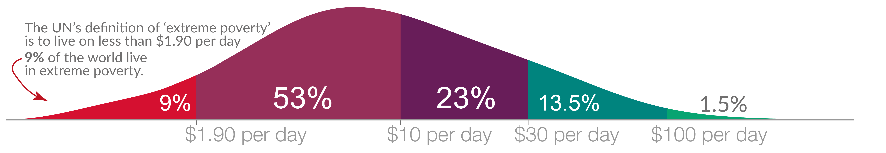
```

Worldwide distribution of income &mdash; 9% of the world's population lives below the UN extreme poverty line of 1.9 USS PPP per day, and 62% below 10 USS PPP per day [(WID)](https://ourworldindata.org/extreme-poverty)

---
class: middle

```{r, echo=FALSE, out.width = '70%', fig.align='center'}
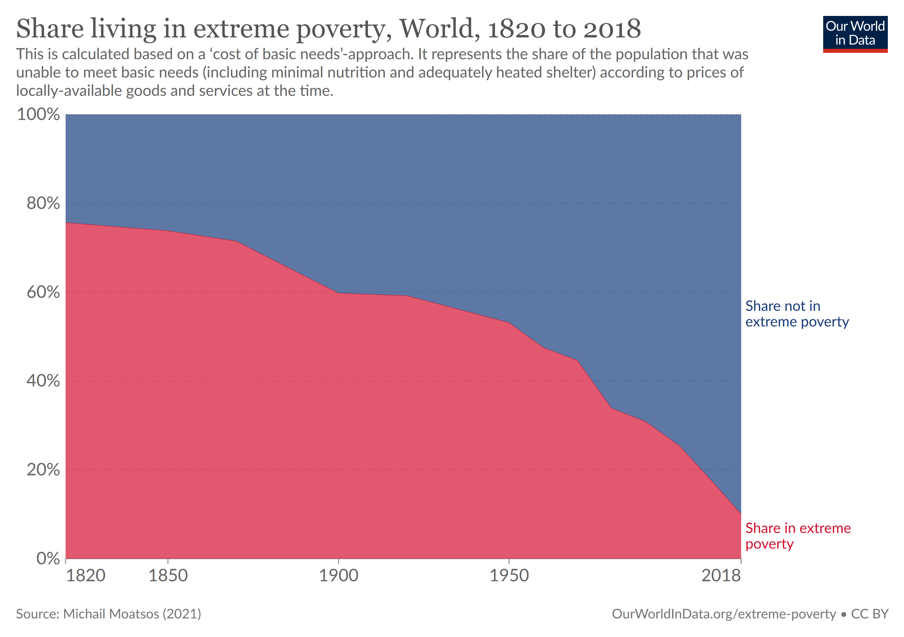
```

If before the Industrial Revolution 3/4 of the world's population lived in extreme poverty, in 1950 they were still more than half. Since then, the progress has been remarkable, reducing the extreme poverty rate by 80% in half a century to 9% today [(WID)](https://ourworldindata.org/extreme-poverty)

---
class: middle

```{r, echo=FALSE, out.width = '75%', fig.align='center'}
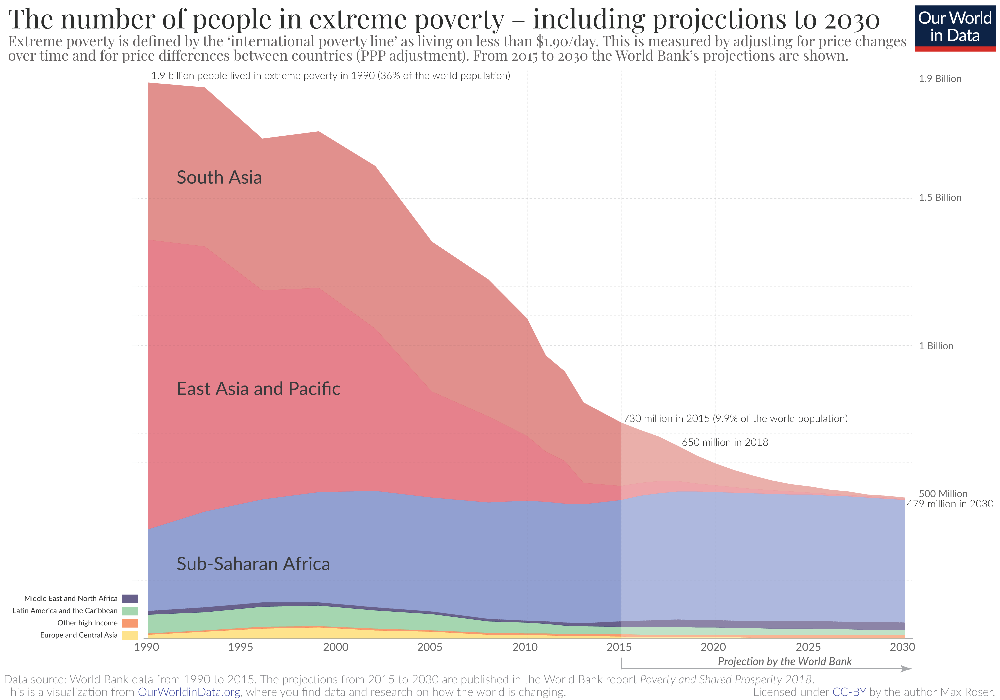
```

But this immense progress over the last 3 decades has been concentrated in Asia, especially in China &mdash; in absolute terms, extreme poverty in Africa has not improved and tends to get worse with population increase [(WID)](https://ourworldindata.org/extreme-poverty)

---
class: middle

<iframe src="https://ourworldindata.org/grapher/share-of-population-in-extreme-poverty?country=BGD~BOL~MDG~IND~CHN~ETH~COD" loading="lazy" style="width: 100%; height: 600px; border: 0px none;"></iframe>

---
class: middle

<iframe src="https://ourworldindata.org/grapher/share-healthy-diet-unaffordable?country=KEN~BGD~IND~NGA~BRA~ZAF~RWA~USA~GBR~FRA" loading="lazy" style="width: 100%; height: 600px; border: 0px none;"></iframe>

---
class: middle

```{r, echo=FALSE, out.width = '80%', fig.align='center'}
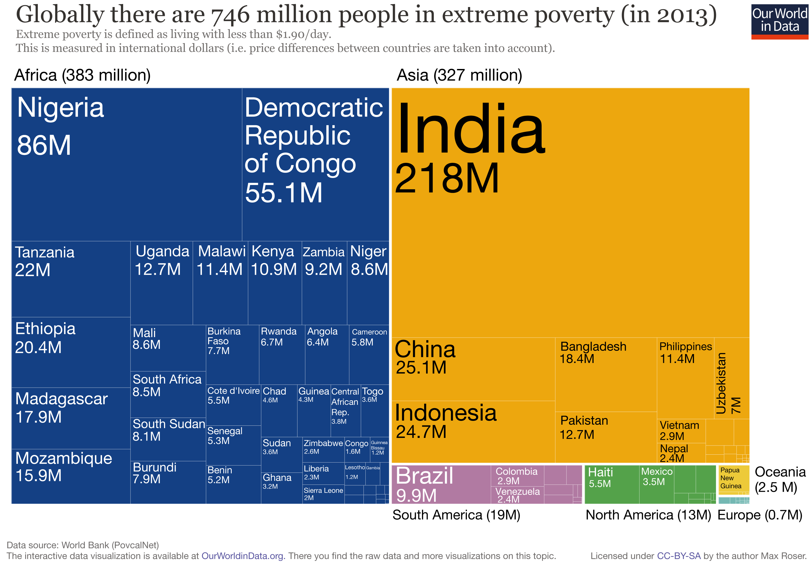
```

In 2013, 51% of the world's extremely poor are in Sub-Saharan Africa, 29% in India, and 1.3% in Brazil [(WID)](https://ourworldindata.org/extreme-poverty)

---
class: middle

<iframe width="600" height="371" seamless frameborder="0" scrolling="no" src="https://docs.google.com/spreadsheets/d/e/2PACX-1vT-vGIhk_RhMoUJerytiO8YSINlGzDfT47vhY7bltL-MjiggyhgHV7mX6i3w5BBbYIHQgOMaDpxMh_v/pubchart?oid=473456845&amp;format=interactive"></iframe>

Between 1977 and 1990, the proportion of destitute and poor remained constant at around 20% and 40% of the population, respectively, but we see a downward trend starting from redemocratization, reaching 14% and 33% in 1998 `r Citep(myBib, "barros2000desigualdade")` 

---
class: middle

```{r, echo=FALSE, out.width = '90%', fig.align='center'}
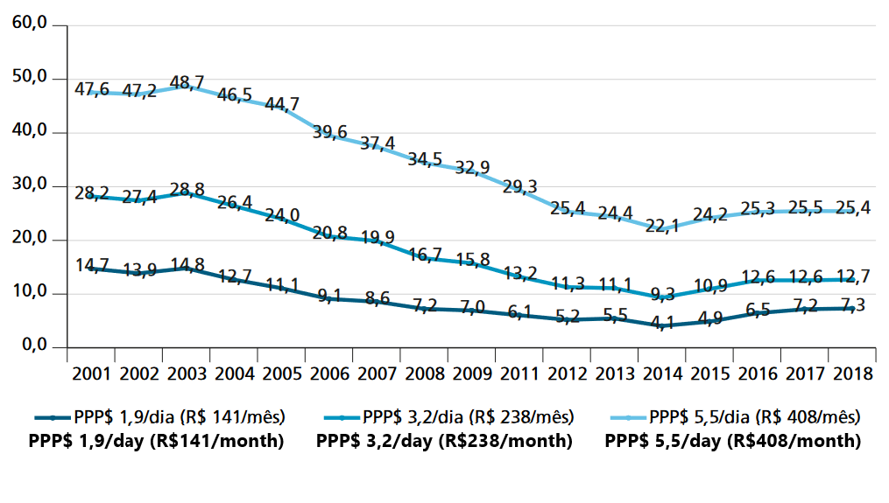
```

The great reduction of poverty took place from 2003 onwards, with extreme poverty dropping to 1/3 in about 10 years &mdash; poverty fell from 49% to 25% in 2018, and as of extreme poverty (national line) from 28% to 13% and on the international line from 14% to 7% `r Citep(myBib, "ipea2020politicas")`

---
class: middle

```{r, echo=FALSE, fig.show="hold", out.width="50%"}
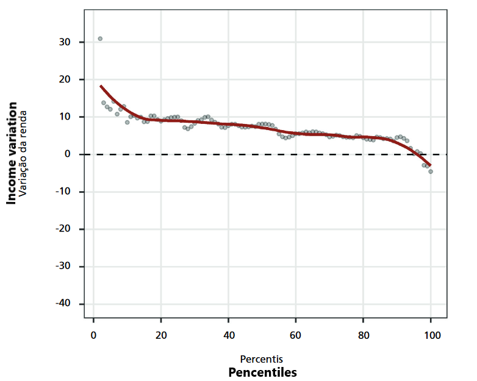
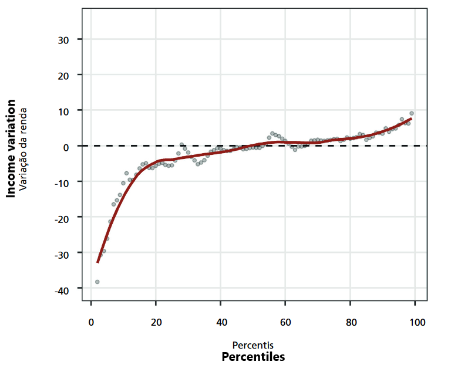
```

Growth in GDP can have very different implications for income in different percentiles of the distribution: income variation by income percentile between: (a) 2012-2015; (b) 2015-2018 `r Citep(myBib, "barbosa2020distribuiccao")` 

---
class: middle

```{r, echo=FALSE, out.width = '100%', fig.align='center'}
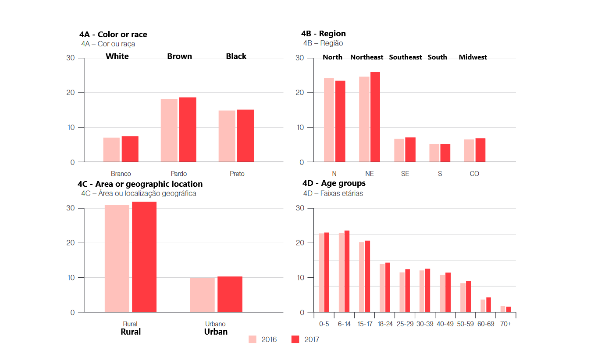
```

In Brazil, the incidence of extreme poverty (USD 3,20 per capita PPP) is more than double among blacks and browns than white people, triple in the North and Northeast than in other regions, as well as in rural vs urban, and afflict especially children (Cadernos ODS/IPEA)

---
class: middle
## Moral hazard of social assistance

Transferring money from the rich to the poor is not free, as it has a **behavioral effect** &mdash; taxation discourages work from the rich, and 

If the transfers are *means-tested* (all in Brazil are), then it also generates an **implicit tax** on the poorest

$$\tau_{\text{implicit}} = \frac{\Delta \text{market income} - \Delta  \text{disposable income} }{\Delta \text{market income}}$$

The optimal level of assistance will then depend on comparing the behavioral effect effect with the benefit generated by transferring income from agents with low marginal utility of wealth to those with high MU

---
class: middle

```{r, echo=FALSE, out.width = '75%'}
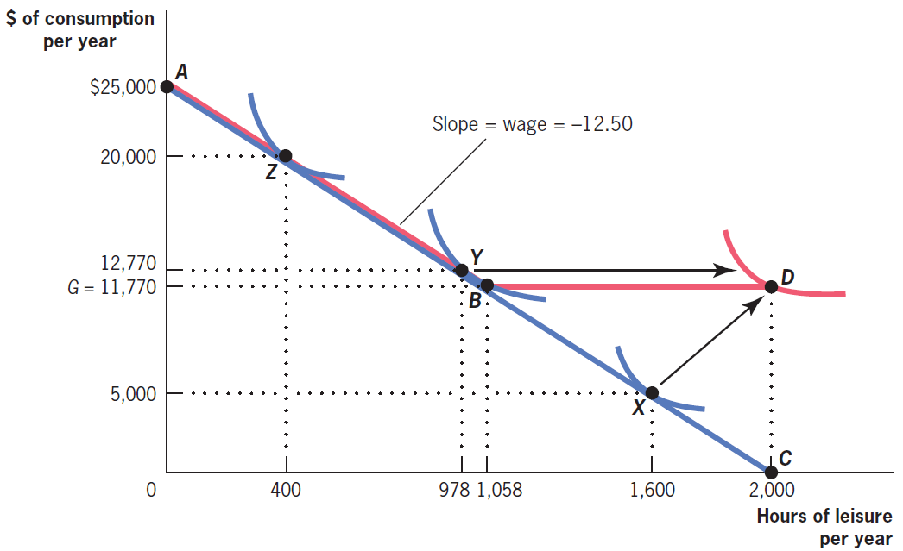
```

A program that guarantees everyone enough income to escape poverty, with a *benefit reduction rate* of 1 involves an **implicit tax** of 100% on those earning below the poverty line (family $X$), and it can also reduce the labor supply of people who earn more than the benefit (11,770 here), like family $Y$ `r Citep(myBib, "gruber")`

---
class: middle
## Moral hazard of social assistance
 
If we only calculate the **accounting cost** of the program (number of families that today earn less than the extreme poverty line times the distance to the line), we will underestimate the real cost of assistance

A more realistic estimate would be the number of families that earn less than the range times the value of the range (89 reais per capita/month): $X$ in the image

It would still be a lower limit on program costs since it ignores **behavioral effects** on families like $Y$ and the **fiscal externality** of a reduction in labor supply

---
class: middle
## Moral hazard of social assistance 

Perhaps at first glance, it appears that the problem is exacerbated by the 100% benefit reduction rate (a *implicit tax* of 100%)

But no: a lower rate of reduction does not necessarily reduce the *behavioral effect* (and therefore, the **deadweight loss**)

This is the **iron triangle** of welfare: there is no way to change the value of the benefit and the reduction rate at the same time, such as (i) encouraging more work; (ii) redistributing more income; and (iii) having lower cost

---
class: middle

```{r, echo=FALSE, out.width = '85%', fig.align='center'}
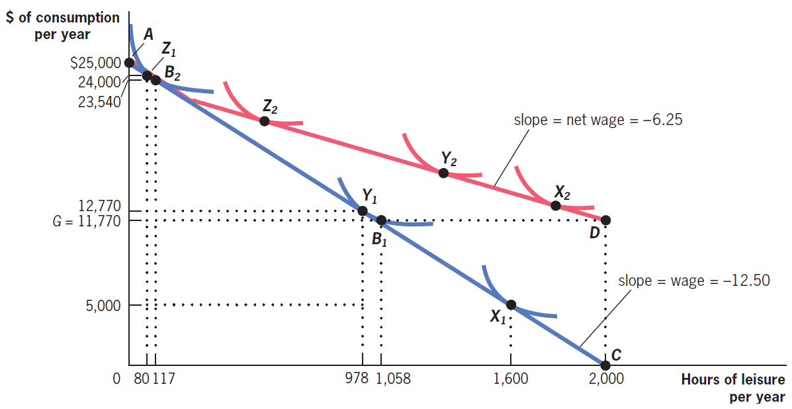
```

A lower benefit reduction rate (here it is 50%) reduces the *implicit tax* on $X$,  increasing their labor supply, as well as $Y$, but it reduces the labor supply of families previously unaffected by the policy, such as the family $Z$: it is not necessarily true that the deadweight loss is smaller than previously `r Citep(myBib, "gruber")`

---
class: middle
## Potential solutions

Moral hazard comes from *asymmetric information*:  the government only observes individuals' income, which depends on their behavior, not their income earning capacity (which the government would like to use)

One solution is **tagging**: directing assistance based on "non-behavioral" characteristics of individuals that are related to their income earning capacity

For example, targeting the elderly or people with disabilities (like BPC, but it is also *means-tested*); children (like PBF, but ditto, or proposals like Naércio's) or single mothers (like in the US)

---
class: middle
## Potential solutions

Another possibility is to try to make individuals *reveal their type* through **"ordeal mechanism"**: characteristics of programs that make them unattractive

An example is forcing unemployed people to look for a job or do training (**workfare**): this can be too costly for those who do not really need that money, or *in-kind transfers*, such as popular housing or basic food baskets

This generates a paradox in which it may be desirable to "worsen" the program since it prevents part of the budget from going to those who do not need it

---
class: middle
## Potential solutions

A final possibility is *to make work more attractive* &mdash; increasing individuals' labor income makes them less willing to stop working for assistance

The government can do this directly by transferring income to those who work (EITC in the US or "abono salarial" here) as **negative marginal income tax**

But subsidies for *complementary goods to work* (daycare center, public transport, etc) also have the same effect 

---
class: middle
## Social assistance in Brazil

In Brazil, the main income transfer programs for poverty alleviation are the [Bolsa Família Program (PBF)](https://www.gov.br/mds/pt-br/acoes-e-programas/bolsa-familia)  and the Benefício de Prestação Continuada (BPC)

The PBF involves: 
1. A basic benefit of 142 reais per person, paid for families with per capita income up to R$218 per month
2. A complementation to reach a a minimum benefit per family of R$600
2. Variable benefits, of 50 reais paid one per child (7-18) or pregnant woman
3. A first childhood benefit of 150 reais per child of 0-6 years old

As of Oct 2024, PBF benefitted 54 million people (about 25% of the population) with an average transfer of R$678, amounting to 14 billion reais per month

---
class: middle
## Social assistance in Brazil

PBF is a **conditioned transfer** program, as it requires specific behaviors from beneficiaries: for PBF, school attendance, vaccination, prenatal care, and medical follow-up

[Benefício de Prestação Continuada (BPC)](https://www.gov.br/mds/pt-br/acoes-e-programas/suas/beneficios-assistenciais/beneficio-assistencial-ao-idoso-e-a-pessoa-com-deficiencia-bpc) is the guarantee of one minimum wage per month to the elderly aged $\geq$ 65 years old or disabled people of any age, as long as the per capita household income is less than 1/4 of the minimum wage (R$1,412 in 2024)

Unlike PBF, BPC is an unconditional transfer &mdash; but both programs are **means-tested**: only those with an income below a threshold receive the transfers, creating an **implicit tax** on work

---
class: middle

```{r, echo=FALSE, out.width = '80%', fig.align='center'}
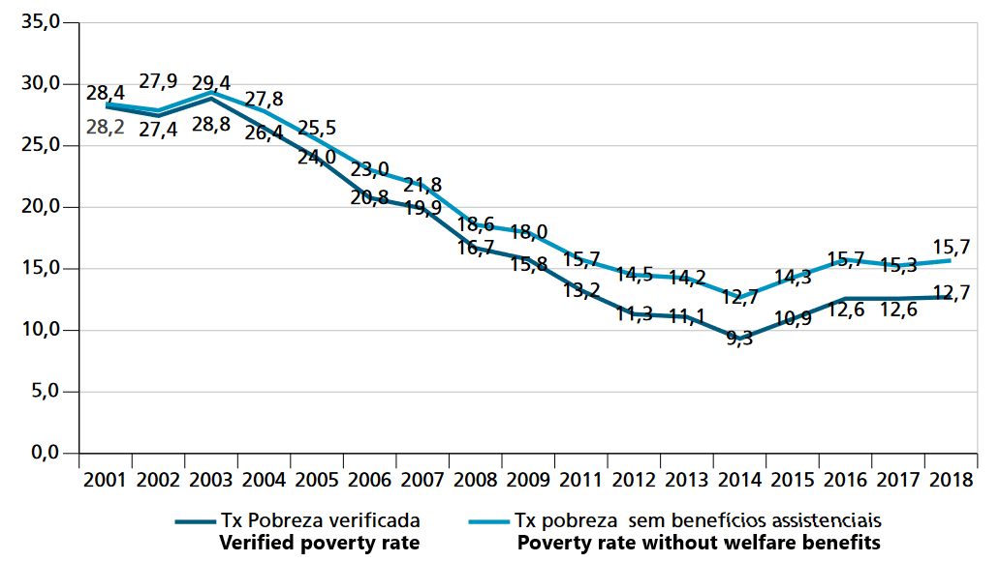
```

Until 2001, social programs had little effect on reducing poverty. Since then, they have grown to reduce as much as 3 percentage points in the extreme poverty rate &mdash; but still, they do not seem to be the main reason for the sharp reduction in poverty observed between 2003 and 2014 `r Citep(myBib, "ipea2020politicas")`

---
class: middle

```{r, echo=FALSE, out.width = '70%', fig.align='center'}
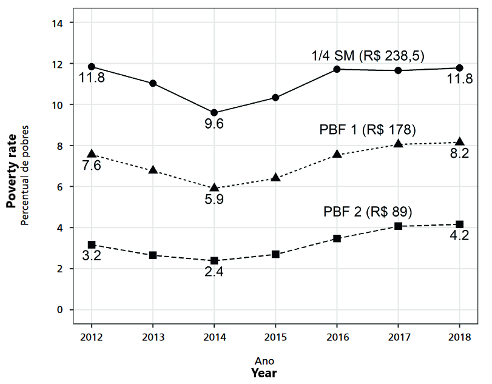
```

A practical difficulty of social assistance programs is universalizing the program **coverage**: even with the PBF, 4.2% of the population still has income below the extreme poverty line (they should be covered by the BSP!) and 8.2% below the PBF line (of 2018) `r Citep(myBib, "barbosa2020distribuiccao")` 

---
class: middle

```{r, echo=FALSE, out.width = '90%', fig.align='center'}
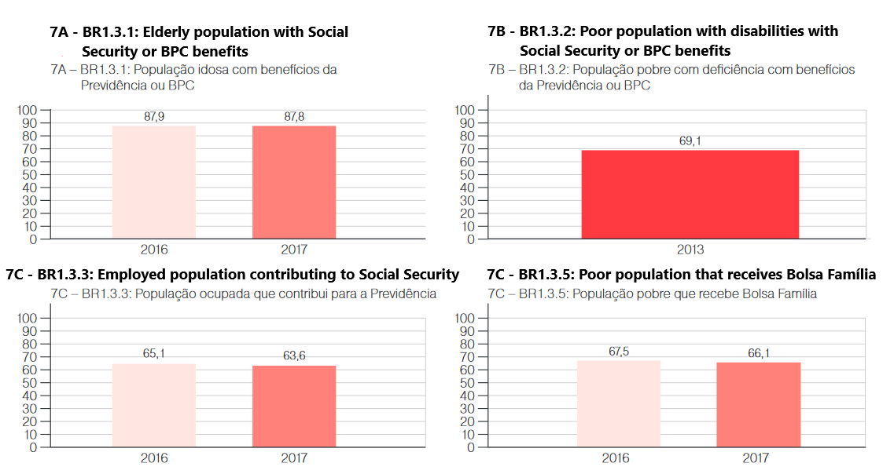
```

In fact, in Brazil, no social program is universal in its target population &mdash; the policy that comes closest to universalization is retirement (BPC e INSS) [[Cadernos ODS/IPEA 2019]](https://www.ipea.gov.br/portal/images/stories/PDFs/livros/livros/190524_cadernos_ODS_objetivo_1.pdf)

---
class: middle
## Bolsa Família Program

PBF predecessors were first implemented in 1995, in Federal District and Campinas, and in 2001 at the national level, as 4 separate programs

In 2016, PBF expenses represented 0.44% of GDP (30x less than social security and around the cost of Zona Franca de Manaus) &mdash; after the pandemic, the program incorporated the benefit increases from Auxílio Emergencial and Auxílio Brasil and now accounts for 1.5% of GDP

There is a huge literature examining the (generally beneficial) side effects of the program `r Citep(myBib, "ribeiro2017bolsa")` &mdash; for example, `r Citep(myBib, "gerard2021cash")` find that the PBF *increased* local employment, by fiscal multipliers &mdash; at LabPub [we find a MVPF of 1.86 for PBF](https://labpub.fea.usp.br/notas/)

---
class: middle

```{r, echo=FALSE, fig.show="hold", out.width="50%"}
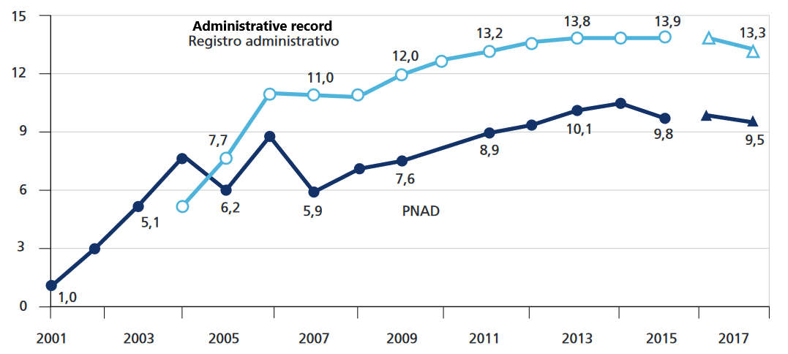
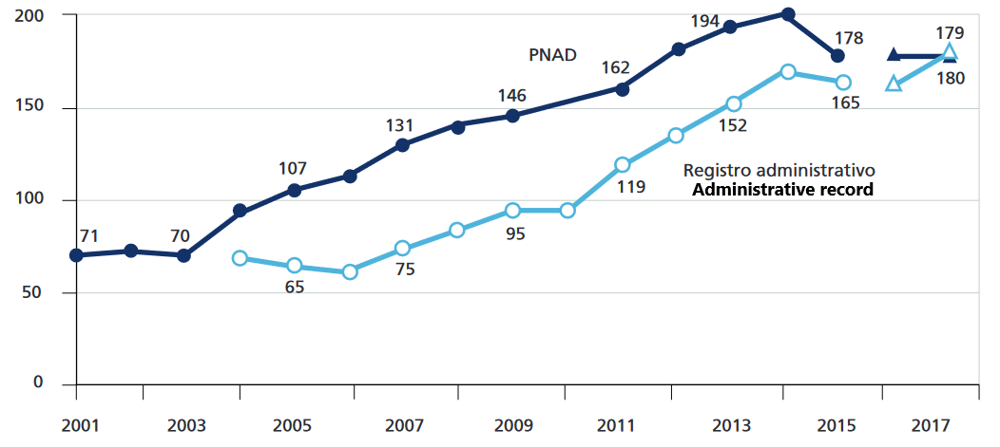
```

In the last two decades, the PBF grew rapidly, both in the number of beneficiaries (millions of families), in panel (a), and in the average amount paid (R$/2018) in panel (b) &mdash; and as we've seen, since the pandemic the average benefit more than doubled to about R$500 in 2018 reais `r Citep(myBib, "de2019efeitos")` 

---
class: middle
## Empirical evidence on PBF

The evidence points in the direction that the PBF increased the enrollment, retention, and grade progression of children in schools &mdash; the program is also associated with greater use of the health service and vaccination, and lower infant mortality `r Citep(myBib, "rasella2013effect")`

`r Citep(myBib, "chioda2016spillovers")` find a 6,5% reduction in crime near schools with the expansion of the PBF to 16-17 years old

The same expansion increased by 1p.p. the enrollment of teenagers in schools `r Citep(myBib, "chitolina2016impact")`

---
class: inverse, middle, center

# Banerjee, Niehaus & Suri (2019). "Universal Basic Income in the Developing World"

---
class: middle
## Restrictions on the poor

A wide social assistance program like Universal Basic Income (UBI) might increase efficiency when we realize that the poor act under many economic constraints that generate inefficiencies

A very important type of constraint on the poor are *credit constraints* &mdash; it limits investment and creates **poverty traps**: the need for immediate cash prevents investments that increase productivity, such as education, even if they have *positive net present value*

The poor also have **insurance constraints**: it makes them especially risk averse and pushes them to invest less than the optimal 


---
class: middle

```{r, echo=FALSE, fig.show="hold", out.width="50%"}
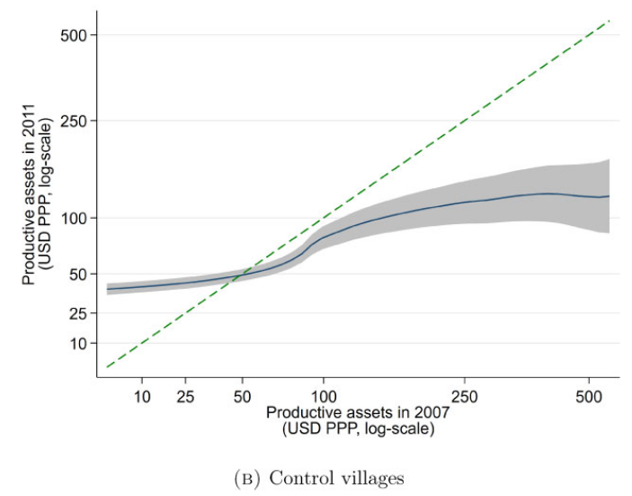
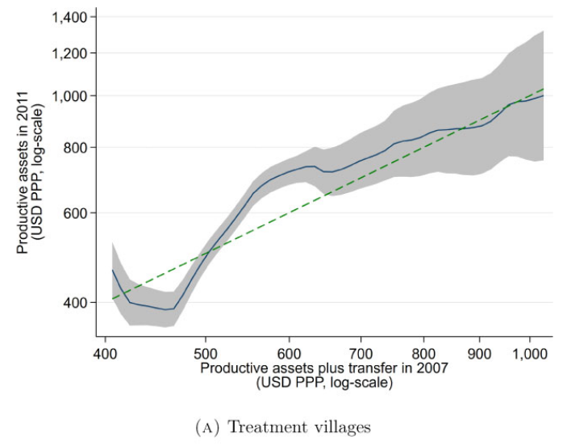
```

`r Citep(myBib, "balboni2022people")` examine a wealth transfer program for the "ultra-poor" in Bangladesh:  the control group (B) is in a **poverty trap**, as increases in wealth do not last long term &mdash; but transfers *above a value* in (A) break this trap, and generate wealth in 2011 equal to or higher than in 2007


---
class: middle
## Restrictions on the poor

Poverty is also extremely *psychologically costly*, and it makes making good decisions more difficult &mdash; transfers in Kenya are shown to reduce cortisol (related to stress); in Indonesia, transfers reduced suicide rate by 18%

[Research](https://www.youtube.com/watch?v=hd-WWdl8A5s&t=1s) shows that in the Brazilian Northeastern semi-arid, people have worse cognitive abilities when they are afraid of drought

Poor people are also more pessimistic about their abilities and possibilities for improving their lives (a **pessimism trap**) &mdash; there is evidence that mentoring policies can have a positive effect


---
class: middle
## Universal basic income

A proposal for an assistance policy that has recently gained public debate is **universal basic income**: giving a *lump-sum* amount of money to everyone in that given country or region

UBI differs from **means-tested** programs because it is *not targeted*: it is transferred to all individuals in the economy &mdash; hence the name "universal": in practice, it would probably still have some kind of targeting, but much less than programs like PBF

What are the pros and cons of UBI versus targeted transfers?

---
class: middle
## Universal basic income

The *cons* are clear: removing means-testing increases the cost of the program (or lowers the transfer size) and makes it less progressive &mdash; as we are giving money to those with lower *marginal utility*, there is less social welfare gain

But with **imperfect markets**, even this is not so obvious: maybe we want to redistribute to whoever can alleviate those imperfections the most (e.g., as mentioned, credit and entrepreneurship constraints)

The *pros* of UBI involve avoiding difficulties arising from the **targeting** of social policies

---
class: middle
## Problems with targeting

There are 4 central problems with targeting: first, as we saw, means-tested transfers generate *disincentives* by applying an **implicit tax** on labor supply

UBI solves this, because (at least in its pure form) it is a *lump-sum transfer* &mdash; since it is universal, the family continues to receive even if its income increases, so it does not distort behavior

Being a lump-sum transfer, the UBI **does not generate deadweight loss** &mdash; it does not change the relative prices of labor *vs*  leisure (since everyone receives UBI regardless of labor income), and so there is no *substitution effect*

---
class: middle
## Problems with targeting

Note that this does **not** mean that UBI will not change agents' behavior: any income transfer will generate an *income effect* &mdash; as we've seen, since leisure is a normal good, UBI *decreases* labor supply

Research of lottery winners estimate the income elasticity of labor supply of about $-0.1$, while `r Citep(myBib, "golosov2024americans")` find that 1 dollar of extra income decreases labor income by 50 cents &mdash; but note that **only the substitution effect generates deadweight loss** 

The 2nd problem with targeting is the much higher *administrative costs* of targeted transfer &mdash; although in PBF it is relatively low, ~5%, it is still relevant


---
class: middle

```{r, echo=FALSE, fig.show="hold", out.width="50%"}
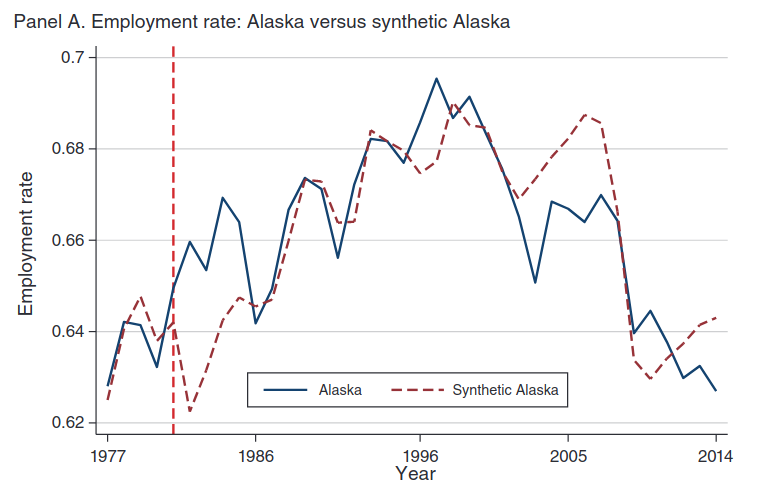
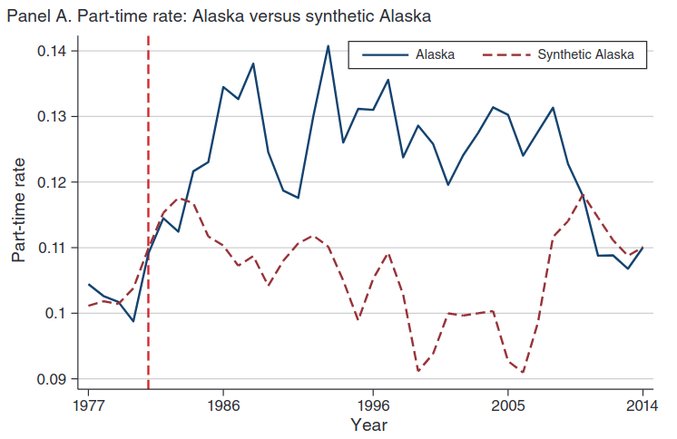
```

Although UBI generates a **negative income effect**, an analysis of Alaska Permanent Fund found no aggregate effect on labor supply, only an increase of 17% (1.8p.p.) in part-time work &mdash; the decrease in labor supply may be counterbalanced by increased labor demand due to greater economic dynamism `r Citep(myBib, "jones2022labor")` 


---
class: middle
## Problems with targeting

The third problem is *targeting itself*: it is not clear that targeted programs really reach who we want to reach

There is strong evidence that **intra-family distribution** is important: `r Citep(myBib, "duflo2003grandmothers")` finds that retirement paid to grandmothers impacts granddaughter nutrition, but not retirement paid to grandfathers   

In addition, income transfers are redistributed across support networks and can generate final redistribution very different from what is on paper (e.g. `r Citep(myBib, "duflo2003grandmothers")` above, which is probably also true for Brazil)

---
class: middle
## Exclusion errors

Any targeting method will have **exclusion errors** (type I error) and **inclusion errors** (type II error)

Studies in Indonesia and Peru estimate that to include 80% of the poor (exclusion error = 20%) the policy must have an inclusion error of 22-31% &mdash; in Africa, exclusion errors are around 25%, and we have already seen that in Brazil only 2/3 of the very poor receive PBF

Poverty is also *dynamic*: in an 8-year panel of households in India, only 22% of individuals are "always poor" and 12% "never poor", with the other 65% moving in and out of poverty over time

---
class: middle
## Problems with targeting

The last potential problem of targeting is a **political economy** issue, since the beneficiaries of a program form the *core constituency* that backs it

Expanding the mass of beneficiaries can make the program politically sustainable, especially when the poor suffer from a collective action problem

The political process makes it so the budget for social assistance is not fixed: in China, increasing the scope of a transfer program by 1% increases its budget by 0.3%

---
class: middle
## Political economy

On the contrary, transferring income to some members of the community and not others (maybe just a little less needy) can generate social division and dissatisfaction

Targeting also creates the potential for **corruption**, when local agents influence who would and would not be part of the program’s scope: the simpler are the rules of the program (especially without targeting), there is less room for corruption

---
class: middle
## Other forms of targeting

An alternative to income targeting is **proxy targeting** &mdash; the government surveys family properties (fridges, TV, number of bathrooms) and uses it to *proxy* a person's income

The benefit is that it is more difficult for families to lie about possessions than about income (almost always in the informal sector)

But even that is not fool-proof: incentivized response experiments in India saw respondents underreport their possessions by 15% when the answer affected their benefits (without changes in the questioner's possessions assessment)

---
class: middle
## Other forms of targeting

Proxy targeting can also generate *measurement errors*, potentially more serious given that these are poor households with little information

Studies in Mexico show that 10% of households are poor according to the answers given by the husband, but not according to the wife's answers, and 8% vice versa (!)

In Ghana, when husbands are asked separately about consumption, there are several items consumed by the household that one of the parties is unaware of

---
class: middle
## Other forms of targeting

Other possibilities are: (i) **community targeting**, when we go to a community and ask the local residents who are more in need

Or (ii) **self-selection**, which we have already seen in the *ordeal mechanism* case

In developing countries, the best example of the last one is the rural employment guarantee program in India: only the neediest will be willing to work all day in agriculture 

---
class: middle
## Assistance in money or goods

A common objection to monetary income transfer programs is that they will be wasted on *temptation goods*, such as alcohol and tobacco &mdash; this leads to political pressure for **in-kind transfers**

Actually, a literature review found that transfers *reduce* consumption of these goods by 0.18 s.d. on average between studies (plausibly due to the reduction in psychological problems)

In the real world, each household needs different things: some need to pay for education, others for food, and others still want to invest in the family business &mdash; cash transfers give each family flexibility to spend where its *particular* marginal utility is the highest

---
class: middle
## The Mankiw quiz

Consider an unequal economy which the average income is US$50.000. Economists propose two alternative policies to combat poverty:

1. A US$ 10.000 transfer for all (UBI), paid at a flat rate of 20% of income
2. A *means-tested* transfer of US$ 10.000 just for those with no income, dropping by ¢20 per dollar for those earning more. This policy is paid with the taxation of 20% of income only for those who earn more than the national average income

[Mankiw asks on his blog:](http://gregmankiw.blogspot.com/2016/07/a-quick-note-on-univeral-basic-income.html) which one would you prefer?

---
class: middle

```{r, echo=FALSE, out.width = '75%'}
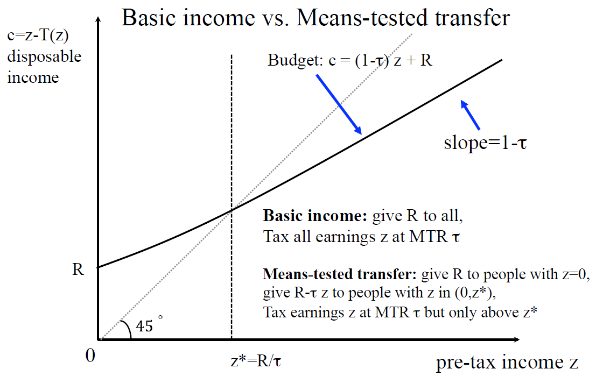
```

This is a trick question: the two policies are the same! An UBI paid with proportional taxation is *economically equivalent* to a means-tested transfer (Saez)

---
class:middle
# References
<small>
```{r refs, echo=FALSE, results="asis"}
PrintBibliography(myBib, start=1, end=5)
```
</small>


---
class:middle
# References
<small>
```{r refs2, echo=FALSE, results="asis"}
PrintBibliography(myBib, start=6, end=10)
```
</small>

---
class:middle
# References
<small>
```{r refs3, echo=FALSE, results="asis"}
PrintBibliography(myBib, start=11)
```
</small>
