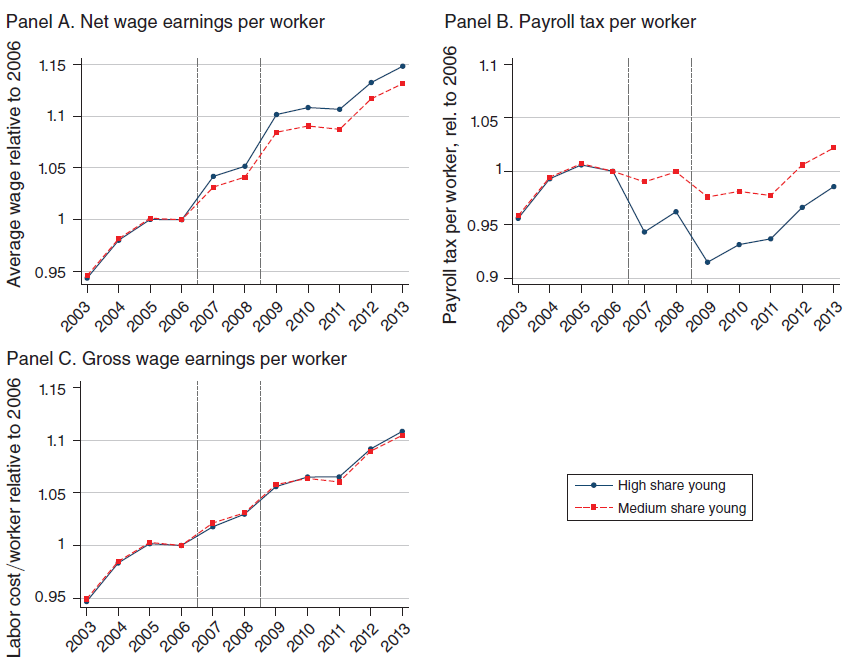

class: inverse, middle, center

```{r, load_refs, include=FALSE, cache=FALSE}
library(RefManageR)
BibOptions(check.entries = FALSE,
           bib.style = "alphabetic",
           cite.style = "alphabetic",
           style = "markdown",
           hyperlink = FALSE,
           dashed = FALSE)
myBib <- ReadBib("./esp_bib.bib", check = FALSE)
```

# Corporate Taxes


---
class: middle

```{r, echo=FALSE, out.width = '50%', fig.align='center'}

```

Brazil has [comparatively high](https://taxsummaries.pwc.com/quick-charts/corporate-income-tax-cit-rates) corporate taxation, reaching 34% (see slides for topic 6); on the other hand, it does not tax the distribution of dividends &mdash; note that some countries have regional corporate taxes (in the US around 4% and in Canada reaching 15%), while Brazil only charges corporate taxes at the federal level

---
class: middle

```{r, echo=FALSE, out.width = '65%', fig.align='center'}

```

Over the past 40 years, we have seen a sharp and persistent decrease in the median statutory corporate tax rates, for all (country) income groups &mdash; effectively a *race to the bottom* in corporate taxes, because of international tax competition and *beggar-thy-neighbor* policies `r Citep(myBib, "keen2013theory")`

---
class: middle
## Corporations

**Corporations** are for-profit organizations owned by shareholders with *limited liability*: if the corporation goes bankrupt, the shareholder loses the value of his ownership stake, but is not responsible for unpaid debts

Corporations are "legal people" in Brazilian law code, but this obviously does not exist: corporations do not pay taxes, *only people* &mdash; and to understand corporate taxes we need to understand their **incidence**

Analogously to government, publicly traded and less concentrated firms have an **agency problem** due to the *separation between ownership and control*: shareholders are the firm owners, but who manage them are the CEOs

---
class: middle
## Corporations

While **owners** would be interested in maximizing their profit, **managers** are interested in higher wages and benefits, visibility, and power

Recently, economists have questioned whether owners are really only interested in maximizing their profits `r Citep(myBib, "hart2017companies")` &mdash; and note that only under extremely strong conditions corporations' maximization of shareholder profits would be the best for society [[Friedman’s Legacy]](https://www.promarket.org/2020/10/13/milton-friedman-legacy-doctrine-theorem/)

Several countries such as Germany have a corporate law structure focused on the interests of *stakeholders*: everyone impacted by the company's actions, such as workers, consumers and the local community

---
class: middle
## Corporate finance

Companies finance productive investments through 3 mechanisms: *debt*, *equity* and *retained earnings*

**Debt** financing promises a fixed payment for any firm's economic achievement (apart from *default*) &mdash; this does not generate moral hazard, as the entrepreneur is still a **residual claimant** of the firm's success

But it generates an *adverse selection* problem, since entrepreneurs have more knowledge about the risk of an investment than external investors, and they will choose debt when the investment is risky (because of **limited liability**)

---
class: middle
## Corporate finance

The company can also sell an **ownership share**, which pays a proportion of the venture's return to the (then) external investor

Now, *adverse selection* is less important, but equity generates a *moral hazard* problem, as it lowers the entrepreneur's incentives: the costs of effort in project success remain the same, but now he receives only a smaller share of the benefits (his ownership share in the firm)

Because of *moral hazard*, shareholders generally have greater internal influence (e.g., voting power) in the operation of the firm (insiders) than creditors (outsiders), while creditors because of *adverse selection* have priority in the disposal of assets in the case of bankruptcy

---
class: middle

```{r, echo=FALSE, out.width = '90%'}
knitr::include_graphics("figs/eae0310-14-4.png")
```

There are three forms of firm financing that can be affected by taxation: retained earnings or raising money through equity (internal sources in blue) and debt (external source in orange) &mdash; the last one pays interest, while equity can be paid by dividends or capital gains `r Citep(myBib, "gruber")`

---
class: middle

```{r, echo=FALSE, out.width = '60%', fig.align='center'}
knitr::include_graphics("figs/eae0310-14-16.png")
```

*Corporate taxation * $\tau_c$ is levied on revenue with deduction for costs of input, wages, **interest** and capital depreciation; and *operating profit* (EBIT) is distributed and subjected to income taxation at (potentially different) rates for interest, dividends and capital gains `r Citep(myBib, "gruber")`

---
class: middle
## Corporate taxation

When we tax a corporation, we tax **people** who own the factors of production involved in business activity: workers, capitalists, and landowners.

But the *economic incidence* of the tax can also be **shifted forward** for consumers or **shifted backward** for input producers (and then, affect the factors of production of that industry)

But then, why tax companies and not factors directly? A practical reason is that it is *easier to collect*: corporations are large, quite visible, and have detailed accounting

---
class: middle

```{r, echo=FALSE, out.width = '100%'}

```

In most countries (the figure above is for USA) a small percentage of firms are responsible for a large (and growing!) share of the total corporate equity and revenue &mdash; indeed, only the top 0.1% of firms own about 90% of total corporate equity and 2/3 of total revenue (and therefore corporate tax liabilities) [[Source]](https://www.aeaweb.org/research/charts/rising-corporate-concentration-us)

---
class: middle
## Taxation of economic profits

From a theoretical point of view, taxation of profits is also desirable: if a firm earns **pure profits**, we would like to tax them entirely, since this taxation does not distort behavior (they are *economic rents*)

As $\Pi = p F(k, l) - wl - rk$, a tax on pure profit $\tau_L$ generates the objective function: $$(1 - \tau_L)\Pi = (1 - \tau_L)p F(k, l) - wl - rk + \tau_L(wl + rk)$$

In other words, it is equivalent to a tax on revenue with deductions for costs with factors of production &mdash; and in both cases $\{k,l\}$ profit maximizers $\Pi$ are the same as $(1 - \tau_L)\Pi$: *there is no productive distortion*

---
class: middle
## Reasons for corporate income taxation

Now, note that this only applies if we tax *economic profit* taking into account the **opportunity cost** of factors, while corporate taxation is on *accounting profit*, which uses actual prices

Another reason to tax corporate income is that without it, **retained earnings** could accumulate tax-free forever within the firm, being distributed in the future with taxation only on simple interest

By taxing other forms of capital income (dividends, interest, capital gains) but not retained earnings, this creates an implicit subsidy for *corporate income* in relation to other forms of savings (e.g. stocks)

---
class: middle
## Reasons for corporate income taxation

And indeed, the evidence seems to point out to retained earnings as the main source of firms' financing, implying that not charging corporate taxes could generate relevant distortions

Furthermore, if we only tax capital income, business owners can make up their personal consumption as business expenses or use their corporate wealth as collateral, never distributing the income and therefore never being taxed

Corporate taxation also increases the **tax base**, decreasing tax evasion with, for e.g., the realization of profits in accounts in tax havens

---
class: middle

```{r, echo=FALSE, out.width = '85%', fig.align='center'}
knitr::include_graphics("figs/eae0310-14-1.png")
```

International competition and lobbying of large companies drastically reduced corporate taxation at the end of the last century in the US (graph) and in most central economies (Saez)

---
class: middle

```{r, echo=FALSE, out.width = '80%', fig.align='center'}
knitr::include_graphics("figs/eae0310-14-2.png")
```

And this reduction is associated with a decrease in progressivity of the tax system, since corporate income is a considerable portion at the top of income distribution (Saez)


---
class: middle
## Depreciation schedules

Taxation of economic profits should tax revenues net of expenses on all factors of production: labor, input, land, and also capital &mdash; its **economic depreciation**, the loss of value of that capital between $t$ and $t+1$

The problem is that assets have different maturities, and the loss of value is not well observable due to the lack of used machine markets, and the same machine in different uses will have different rates of *physical depreciation*

That is why the government works with **depreciation schedules**: straight-line, accelerated (or front-loaded), or immediate (*expensing investments*) &mdash; the important is to remember that *the faster the deductibility of depreciation, the greater is the tax benefit*

---
class: middle

```{r, echo=FALSE, fig.show="hold", out.width = '50%'}
knitr::include_graphics("figs/eae0310-14-5.png")
knitr::include_graphics("figs/eae0310-14-6.png")
```

Effects of a corporate tax without (a) and with (b) deduction for capital depreciation: in the 1st case, it decreases the marginal product of capital, reducing investment; in the 2nd case, the allowance for expenses with present discounted value $z$ of an investment (depending on the depreciation schedule) and a investment tax credit $\alpha$ decreases the cost of capital $\delta$ (*economic depreciation*) plus $\rho$ (the *dividend yield*), with ambiguous effect `r Citep(myBib, "gruber")`

---
class: middle
## Effective corporate tax rate

A corporate tax with a depreciation policy generates an **effective corporate tax rate**: the percentage increase in the rate of pre-tax return to capital that is necessitated by taxation to reach the no-tax return

For example, if the cost of capital is 20%, and the corporate tax rate is 35%, without deductions for depreciation, then the investment needs an internal rate of return of $0.2/(1 - 0.35) = 30.7\%$ with taxes to be worth doing

And then the effective corporate rate (here it is the same 35%, since there is no depreciation policy or tax credit) is given by: $$ETR = \frac{r_{\text{after tax}} - r_{\text{before tax}}}{r_{\text{after tax}}} = \frac{\tau - \tau z - \alpha}{1 - \tau z - \alpha}$$


---
class: middle

```{r, echo=FALSE, out.width = '80%', fig.align="center"}

```

Because most tax systems involve depreciation schedules and tax credits, the **effective tax rate** is generally much smaller than the oficial rate &mdash; in Brazil, it is estimated to be about 20% (60% of the statutory rate) `r Citep(myBib, "pires2023tributaccao")`

---
class: middle
## Incidence of corporate taxation

If we want to tax *foreign* capital (invested in the country), corporate taxation is the only way &mdash; we cannot tax foreign income (received abroad), but we can tax foreign capital while inside the firm (which operates in national territory)

Therefore, taxation on the firm and on the individual generate different effects in terms of *international finance*: (i) charging international investors in local companies, while (ii) charging local investors in international companies

How this will affect the *incidence* of the tax depends on assumptions about the local and international mobility of capital (and therefore, the elasticity of capital input)

---
class: middle
## International incidence

If the capital has **perfect international mobility** and consider the case of a **small economy** (like Brazil), then national taxation does not affect the international profit rate, which has to be homogeneous: $r^{\text{BR}} = r^*$

And after taxation also equally $(1-\tau_c) r^{\text{BR}} = r^*$ &mdash; that is, there is capital flight until the rate of return go back to the international rate (infinitely elastic input): this flight reduces the marginal productivity of labor and its wages in a competitive market: **the incidence is all on labor**

The taxation of dividends, in this case, affects (levied) entirely on the national capitalist, since taxation does not affect the international rate of return

---
class: middle
## International competition

Therefore, countries are under pressure to reduce their corporate taxes in a **race to the bottom**, since lower taxes attract international capital from other countries in a zero-sum game

This feature of corporate taxation creates the potential for international competition to "outbid" other countries in **beggar-thy-neighbor** policies

This generates the need for *international organizations* for cooperation &mdash; there is a real movement in this direction: in 2021, 141 countries agreed to structure a global minimum corporate tax of 15% (but it is still low)


---
class: middle
## Incidence in closed economy

If the capital is not internationally mobile (a *closed economy*), then the profit rate in the corporate sector must equal rate of return in the *non-corporate sector* &mdash; with free mobility between them, the corporate sector loses capital and decreases wages 

In the real world, however, because of barriers to entry (not perfectly mobile capital), the corporate sector plausibly makes abnormal profits: in this case, corporate capital absorbs all taxation

If the tax is levied on all firms (e.g., no non-corporate sector), then it becomes a usual tax on capital, as a tax on dividends

---
class: middle

```{r, echo=FALSE, out.width = '60%', fig.align='center'}

```

Growth in firm size following a cut in *state* corporate tax rate in the US &mdash; workers actually absorb part of corporate tax cuts (30-35%), and 25-30% for landowners (only 40% for capitalists): capital input is quite elastic and responds to tax cuts with growth in firm size `r Citep(myBib, "suarez2016benefits")`

---
class: middle

```{r, echo=FALSE, out.width = '100%'}
knitr::include_graphics("figs/eae0310-14-7.png")
```

In the US, reduction of 1 p.p. in the effective corporate tax rate for companies with domestic production (blue) increased investment by 4.7% of installed capital and decreased debt by 5.3%, compared with companies with less domestic production (dotted) `r Citep(myBib, "ohrn2018effect")`

---
class: middle

```{r, echo=FALSE, out.width = '70%', fig.align="center"}
knitr::include_graphics("figs/eae0310-14-8.png")
```

In Germany, increases in corporate taxation are associated with significant reductions in real wages: workers absorb around half of the incidence of the tax (especially new and less skilled workers) `r Citep(myBib, "fuest2018higher")`

---
class: middle
## Taxation and corporate finance

A classic result of corporate finance is the **Modigliani-Miller theorem:** without taxation, bankruptcy, or asymmetric information, the *capital structure* is irrelevant (i.e., whether financed by *debt* or *equity*)

But since interest on debt is almost always tax deductible, and dividend payments are not, this generates a tax system's **preferential treatment for debt over equity**

This generates a paradox: why do firms raise money through equity? Possible answers involve decreasing bankruptcy risk and mitigating the *conflict of interests between shareholders and debt holders*

---
class: middle
## Taxation and corporate finance

Evidence is that U.S. state corporate tax increases of an average of 13% led to a 4.5% growth in the proportion of debt in capital structure of companies `r Citep(myBib, "heider2015certain")` &mdash; corroborating the tax preference for debt

Another mystery is that firms pay dividends (**dividend paradox**), when they could reinvest the money and increase the value of the firm, therefore, remunerating investors with less taxed capital gains

The dominant view is that it is again an **agency problem**: since shareholders cannot perfectly control managers, they prefer to "take the money out of their hands"

---
class: middle
## Dividend taxation

The effect of dividend taxation *depends on the company's form of financing*: if it finances itself by issuing stocks, the taxes lower the stock price and make investment financing more expensive (a given ownership share raises less money)

On the other hand, if the company finances the investment with retained earnings or debt, dividends do not affect their choice

Like with profit taxation, if the tax is on economic profit, then there is no behavioral effect of taxation, and the incidence is entirely on shareholders in the short-term &mdash; but in the long-term it depends on the mobility of capital

---
class: middle
## Dividend taxation

The old view on taxation on dividends is that by making more expensive corporate financing by equity, dividend taxes would decrease investment

But this view arises from a model that does not explain why dividends exist in the first place: in the agency model, taxing dividends would **increase** investment &mdash; since it incentivizes reivesting profits inside the firm

The modern view is that corporate investment is mostly made through *retained earnings*: therefore, taxation of dividends has little effect on the level of investment [[Article in Jornal da USP]](https://jornal.usp.br/artigos/afinal-a-taxacao-de-dividendos-reduz-o-investimento/)


---
class: middle

```{r, echo=FALSE, out.width = '80%', fig.align='center'}
knitr::include_graphics("figs/eae0310-14-21.png")
```

Sources of corporate financing for (non-financial) American companies, share of the total &mdash; in the real world, almost all investment is financed by retained earnings and depreciation funds: therefore dividend taxes affect little the cost of financing of firms `r Citep(myBib, "brealey2006corporate")`

---
class: middle

```{r, echo=FALSE, out.width = '70%', fig.align="center"}
knitr::include_graphics("figs/eae0310-14-3.png")
```

In the US, the only effect of 23 p.p. cut in the taxation of dividends in 2003 was higher payment of dividends to shareholders, comparing a group of affected companies (C-corps) with non-affected companies (S-corps) `r Citep(myBib, "yagan2015capital")`

---
class: middle
## Simples Nacional

In almost all countries, small companies have beneficial tax regimes &mdash; in Brazil, it is the *Simples Nacional*, which replaces all corporate and sales taxes with a single tax on revenue

The idea is that the tax system is too complex for small companies to handle, incentivizing informality &mdash; `r Citep(myBib, "monteiro2012coming")` estimate a Simples effect of 13 p.p. (almost 50%) in formalizing retail stores, but no effect on other sectors

As there is a ceiling in firm size to participate in Simples, the program can generate an inefficient "flattening" of the size of firms

---
class: middle
## Payroll taxes

A form of hybrid taxation between income tax and corporate tax are payroll taxes &mdash; in the model they are equivalent to an income tax, but in practice the incidence tends to vary

In 2011, the government approved the temporary exemption on payroll, which replaces payroll taxation for tax on revenues for several sectors (participation is optional), in practice giving tax benefits (a **tax expenditure**) of around 0.5% of GDP to these sectors

`r Citep(myBib, "leandro2021payroll")` (among others) point to a negligible effect on employment and wages, but even so, the exemption is scheduled to phase out only in 2025 (hopefully)

---
class: middle

```{r, echo=FALSE, out.width = '70%', fig.align="center"}
knitr::include_graphics("figs/eae0310-14-9.png")
```

Payroll tax reductions did not stimulate employment in Brazil, but *targeted* reductions in that tax have been shown to work in subgroups where unemployment is higher: a payroll tax cut for young people in Sweden (2007-09) reduced the unemployment rate of this group by 5 p.p. (33%) `r Citep(myBib, "saez2019payroll")`

---
class: middle

```{r, echo=FALSE, out.width = '75%', fig.align='center'}
knitr::include_graphics("figs/eae0310-14-10.png")
```

Firms with more young people received a *tax windfall* and increased their employment by 4.6%, in addition to higher sales and profits after the reform, compared to less affected firms (the control group) `r Citep(myBib, "saez2019payroll")`

---
class: middle

```{r, echo=FALSE, out.width = '75%', fig.align='center'}

```

This growth in employment increased net wages by 1.9-2.6%, but gross wages remained the same (because the tax decreased), indicating that the incidence was entirely on labor `r Citep(myBib, "saez2019payroll")`

---
class: middle

```{r, echo=FALSE, out.width = '70%', fig.align='center'}
knitr::include_graphics("figs/eae0310-14-18.png")
```

Corporate taxation also affects innovation: lower state taxation of personal and corporate income (higher net-of-tax rate) both increase the number of patents and encourage inventor in-migration `r Citep(myBib, "akcigit2022taxation")`


---
class: middle

```{r, echo=FALSE, out.width = '70%', fig.align='center'}

```

In Brazil, employee's social security contributions are capped at the pension ceiling, but for employers it is not &mdash; this generates incentives to collude (and report lower wages), since employers are paying contributions that do not benefit the employee `r Citep(myBib, "feinmann2022employer")`

---
class: middle

```{r, echo=FALSE, out.width = '50%', fig.show='hold'}


```

In a survey, about 25% of Brazilian formal employees admit to engaging in *payments under the table* (PUT), which account to on average about 20% of their salaries &mdash; a form of partial tax evasion characteristic of developing countries `r Citep(myBib, "feinmann2022employer")`


---
class: middle
## Tax heavens

We have seen how the "ultra-rich" use **tax havens** to evade taxes on capital and wealth, but perhaps even more relevant is the use of tax havens by multinational corporations

`r Citep(myBib, "torslov2018missing")` estimate that 14% of corporate tax revenue in Brazil is evaded by using tax havens (23% in the US) [[World missing profits database]](https://missingprofits.world/)

18% of all profits made by American companies (inside or outside the US) are now realized in tax havens, and they pay almost no taxes (on average 3%) [[Our article in Valor]](https://www.pedroforquesato.com/files/paraisos.jpeg)

---
class: middle
## International corporate taxation

Corporate taxation is "simple" in a closed economy, but much more complex in an international context &mdash; Bruins et al (1923)  proposed 3 principles for **international corporate taxation**:

1. Corporate taxes should be paid to the source (country) where the income is generated (**source-based taxation**) rather than based on the firm's residence
2.  In intra-firm (international) commercial relationships, corporations should use **arm's length pricing**: "trade" goods between themselves as if "at market price(*)" and calculate their profit separately
3. International taxation, unlike international trade, it should be dealt with *bilateral agreements*, and not multilaterally

---
class: middle

```{r, echo=FALSE, out.width = '80%', fig.align='center'}
knitr::include_graphics("figs/eae0310-14-12.png")
```

If until the early 1970s the proportion of profits of American companies made outside the US was small, it has grown significantly in the last decades (*globalization*), reaching 35% in 2010 &mdash; but 2/3 of this international profit share is realized in tax havens `r Citep(myBib, "zucman")`

---
class: middle
## International corporate taxation

A multitude of bilateral agreements generated a Swiss cheese of *loopholes* that multinational giant companies use to avoid taxes (as the "double Irish Dutch sandwich")

Another common practice is to transfer intangible assets (patents and trademarks) to tax havens and collect royalties from there for their use in countries of economic activity

Multinationals can also manipulate the realization of their profits using loans between subsidiaries and *transfer pricing*, since prices of input traded intra-firm rarely exist in the market


---
class: middle
## Double Irish Dutch sandwich

In 2003, shortly before its IPO, Google US sold its intangible assets (search and advertisement technologies) to "Google Holdings", which operated in Ireland, but with tax residence in Bermuda &mdash; which then created another Irish subsidiary to licence these technologies to Google affiliates across the world

While Ireland already has low corporate tax rate, the goal is to pay 0% tax rate in Bermuda (by making "Ireland Limited" pay royalties to "Google Holdings" in Bermuda) &mdash; but to avoid paying tax on these royalties, they are first sent to "Google BV" in Netherlands

According to Google's company filings, its effective corporate tax rate on foreign profits is between 2-8% `r Citep(myBib, "zucman")`

---
class: middle

```{r, echo=FALSE, out.width = '90%'}
knitr::include_graphics("figs/eae0310-14-13.png")
```

While the nominal corporate tax rate in the US is 35%, because of tax avoidance in tax havens and other *loopholes*, the effective tax rate is 20%, and only 80% of that is paid to the US government `r Citep(myBib, "zucman")`

---
class: middle

```{r, echo=FALSE, out.width = '80%', fig.align='center'}
knitr::include_graphics("figs/eae0310-14-14.png")
```

The share of US assets whose owner is registered in a tax haven (hedge funds, mutual funds, shell companies) rose from 2% by the 80s to 9% in 2010 `r Citep(myBib, "zucman")`

---
class: middle

```{r, echo=FALSE, out.width = '80%', fig.align='center'}
knitr::include_graphics("figs/eae0310-14-19.png")
```

Countries often give tax benefits to repatriation of resources in tax havens: one such event, in 2005 in the US, made the share of profits realized in tax havens to drop, but this did not generate employment, investment or national R&D, and soon after the proportion held *offshore* continued to grow `r Citep(myBib, "zucman")`

---
class: middle

```{r, echo=FALSE, out.width = '80%', fig.align='center'}
knitr::include_graphics("figs/eae0310-14-15.png")
```

In developing countries the situation is even worse: Zucman estimates that in Latin America 22% of wealth is held in *offshore* accounts in tax havens, and in countries like Russia and the Middle East it reaches more than half `r Citep(myBib, "zucman")`

---
class: middle
## Tax evasion and avoidance

Not only does this tax avoidance make the tax system less progressive, but it generates huge inefficiencies: multinationals spend billions (with zero marginal social benefit) manipulating the system to avoid paying taxes

Corporate tax collection has historically remained around 3% of GDP in the US even with the decrease of effective rate, because the share of corporate profit in GDP rose from 9% in 1980 to 14% in 2010

And it matters: if the US solved the problem of tax evasion by tax havens, it would increase the tax burden of the richest 0.1% by 18%

---
class: middle
## Global corporate taxation reform

In 2021, a group of 140 countries approved the "Base Erosion and Profit Shifting" (BEPS) Project

**Pillar One** attacks problems with source-based taxation and arm's-length pricing, by allowing countries where digital services are provided to tax a share of the companies' profits (Amount A), and by establishing fixed rules for pricing in intra-firm trade or marketing (Amount B)

**Pillar Two** establishes a minimum 15% corporate tax rate, that if the country where income is generated does not collect, can be collected by the country that owns the MNE or other jurisdictions where the firm operates


---
class:middle
# References
<small>
```{r refs, echo=FALSE, results="asis"}
PrintBibliography(myBib, start=1, end=5)
```
</small>

---
class:middle
# References
<small>
```{r refs2, echo=FALSE, results="asis"}
PrintBibliography(myBib, start=6, end=10)
```
</small>

---
class:middle
# References
<small>
```{r refs3, echo=FALSE, results="asis"}
PrintBibliography(myBib, start=11, end=15)
```
</small>


---
class:middle
# References
<small>
```{r refs4, echo=FALSE, results="asis"}
PrintBibliography(myBib, start=16)
```
</small>

<!-- --- -->
<!-- class: middle -->

<!-- ```{r, echo=FALSE, out.width = '100%'} -->
<!-- knitr::include_graphics("figs/eae0310-14-17.png") -->
<!-- ``` -->

<!-- Quanto maior a proporção de dívida no financiamento da firma, maior o **conflito de interesses** entre detentores de dívida e acionistas &mdash; como acionistas "têm pouco a perder", eles aceitam investimentos de má qualidade; em expectativa disso, credores só estariam dispostas a financiar firmas com pouco capital acionário a taxas de juros elevadas `r Citep(myBib, "gruber")` -->

<!-- --- -->
<!-- class: middle -->
<!-- ## Tax Cuts and Jobs Act -->

<!-- In 2017, Donald Trump enacted the largest business tax cut in US history &mdash; projected to reduce revenue by US$100-150 billion a year, which accounts nominally to 17% of Brazilian budget (~3-4% of American one) -->

<!-- It cut statutory tax rate from 35% to 21%, and allowed for immediate write-off of equipment purchases, giving further tax benefits, as we have seen -->

<!-- Proponents of the change defended this tax cut would increase investments, create jobs (vide the tax cut name) and increase wages &mdash; and that this additional economic growth would offset some of the revenue costs of the policy -->

<!-- --- -->
<!-- class: middle -->
<!-- ## Lessons -->

<!--  `r Citep(myBib, "chodorow2024lessons")` review the evidence evaluating this tax cut and point to 5 lessons we learned from its consequences: -->

<!-- + Tax cuts are very expensive: the policy cut corporate tax revenue by 40% -->
<!-- + Corporate tax affects investments: more affected firms raised investment by 8-14% (but that is not near enough to offset the policy costs) -->
<!-- + Reductions in taxation of profits abroad by corporations also raise their investments domestically -->
<!-- + Effects on economic growth and wages are smaller than proponents advertise: while the Council of Economic Advisers predicted wages would grow by 4-9k dollars, they actually increased only 750 -->
<!-- + "Economic bang for fiscal buck" depends on the specific provisions: investment incentives have large impact, while corporate income tax cuts only enrich old capital    -->
