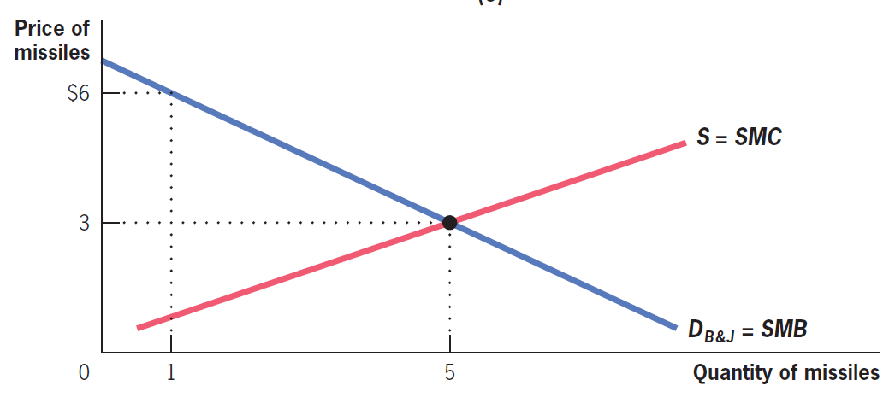
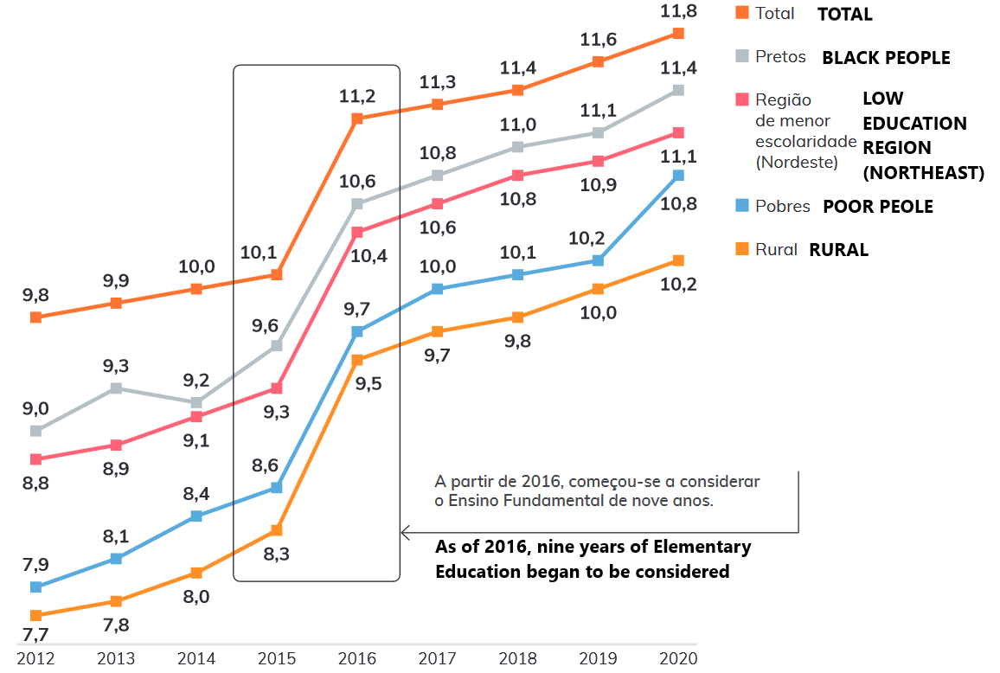
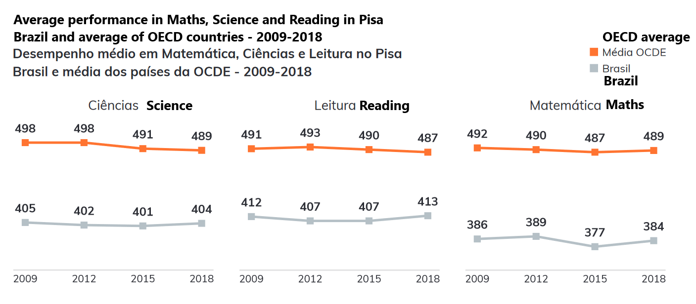
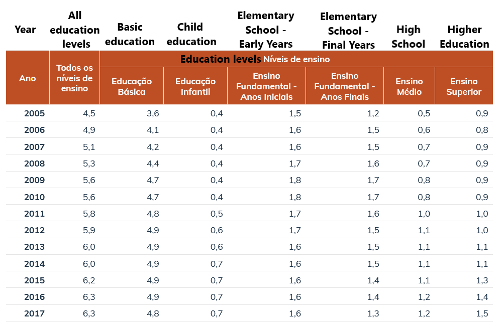
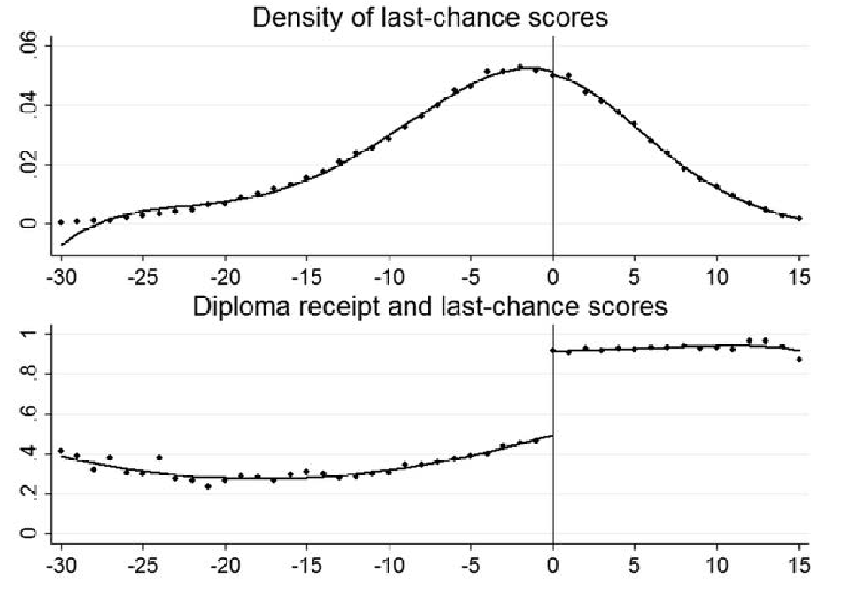
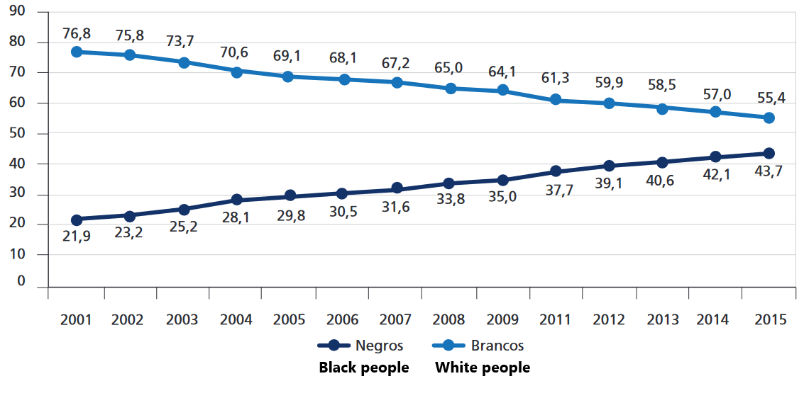
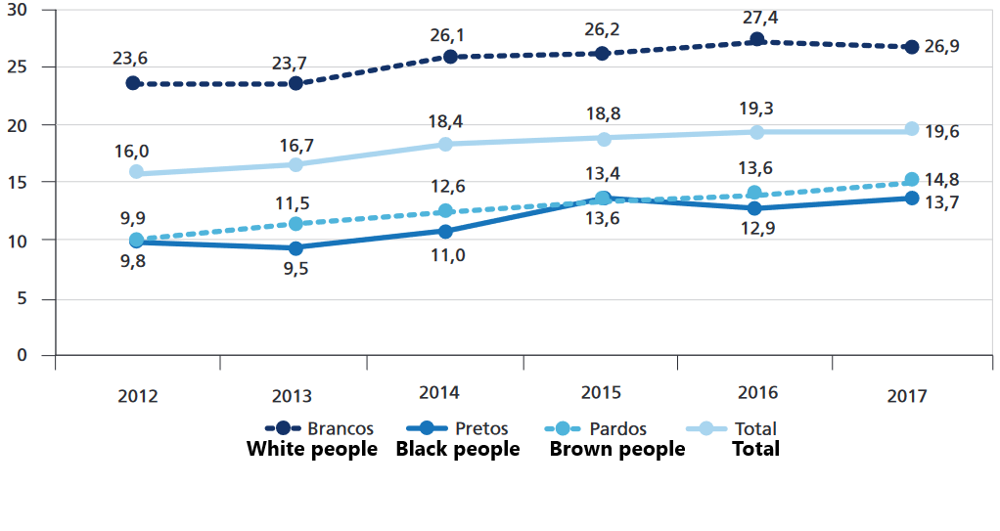

class: inverse, middle, center

```{r, load_refs, include=FALSE, cache=FALSE}
library(RefManageR)
BibOptions(check.entries = FALSE,
           bib.style = "alphabetic",
           cite.style = "alphabetic",
           style = "markdown",
           hyperlink = FALSE,
           dashed = FALSE)
myBib <- ReadBib("./esp_bib.bib", check = FALSE)
```

# Public goods

+ 3-lobbying, corruption, PPP, privatization

---
class: middle
## Public goods

**Common goods** are *non-excludable* goods: when it is impossible (or unfeasible, or undesirable) to prevent certain individuals from consuming the good

In this case, there is an incentive for *free riders*: individuals could not contribute for financing (or exhaust the resource of) the common good they use

When common goods are also *non-rival*, that is, consumption by an individual does not decrease the available quantity to others, then we call the good a **pure public good**

---
class: middle

```{r, echo=FALSE, out.width = '70%'}
knitr::include_graphics("figs/eae0310-3-1.png")
```

A *pure* public good is non-rival and non-excludable &mdash; non-rival goods (externalities) and non-excludable (common) goods have some of the characteristics of public goods, and can be called *impure public goods* `r Citep(myBib, "gruber")`

---
class: middle

```{r, echo=FALSE, out.width = '100%'}
knitr::include_graphics("figs/eae0310-3-2.png")
```

In the private goods market, the demand curve is the *horizontal* sum of individual demands &mdash; the private social benefit of $3\text{rd} + \epsilon$ unit is `$`2 because *either* $B$, which already consumes 2, *or* $J$, which already consumes 1, will buy the good, and both give it a value of `$`2 at current consumption levels `r Citep(myBib, "gruber")`

---
class: middle

```{r, echo=FALSE, fig.show="hold", out.width = '60%'}
knitr::include_graphics("figs/eae0310-3-3.png")

```

However, SMB of 5 missiles is `$`3 because $B$ gives them a value of `$`2 *and* $J$ gives `$`1 value, and defense spendings are non-rivals (*vertical sum*) `r Citep(myBib, "gruber")`

???

- Que característica dos bens públicos faz com que a demanda seja vertical?

---
class: middle
## Public goods

The optimal provision of a private good equates the substitution marginal rate of the good in relation to "money" (*horizontal sum* of demands) with the marginal cost of producing that good (supply curve)

Samuelson realized that the optimal provision of the public good equates the production marginal cost with the *sum of the marginal rate of substitution* between individuals (**vertical sum** of individual demands)

We call this result **Samuelson condition**, which comes from the public good being *non-rival*

---
class: middle
## Private provision

Assuming decision without strategic interaction, only the agent with the highest $MRS$ will contribute to the good and will do in its private optimum: **sub-provision of public good**

In the real world, agents expect that others will provide part of public goods, and this reduces their contribution (**free riding**): as it is less beneficial to contribute to the public good, the greater the contribution of other members, this generates a negative *response curve* sloping

The intersection of the response curves indicates the point at which the action of each agent is optimal given the actions of the other agents (**Nash equilibrium**)

---
class: middle
## Private provision

Consider two families privately contributing to pave a street, a public good $F = f_1 + f_2$. The utility of each individual is $U_i = 2 \ln c_i + \ln F$, with budget constraint $c_i + f_i = 100$. Family $1$ resolves:

$$\max_{f_1} 2 \ln (100 - f_1) + \ln (f_1 + f_2)$$

The first order condition $dU_1/df_1 = 0$ implies: $$\frac{-2}{100 - f_1} + \frac{1}{f_1 + f_2} = 0$$

And then we have that the *response curve* is $f_1^* = (100 - 2f_2)/3$: the higher is $f_2$, lower is $f_1$!

---
class: middle
## Private provision

On the other hand, the socially optimal value is one that respects Samuelson condition: $MRS_{Fc}^1 + MRS_{Fc}^2 = MC_F$

The marginal cost $dF/df_1 = 1$, it remains to calculate $MRS_{Fc}^1$

$$MRS_{Fc}^1 = \frac{MU_F^1}{MU_c^1} = \frac{1/F}{2/c_1} = \frac{c_1}{2F}$$
$$\Rightarrow MRS_{Fc}^1 + MRS_{Fc}^2 = \frac{c_1 + c_2}{2F} = \frac{200 - F}{2F}$$

Equaling the two, we have $200 - F = 2F$, i.e., $F = 200/3$ is the optimal provision

---
class: middle

```{r, echo=FALSE, out.width = '80%'}
knitr::include_graphics("figs/eae0310-3-17.png")
```

In the Nash equilibrium of this game (fix point of the response curves), the private contribution $2 \times 20$ is less than the socially optimal value (*Samuelson condition*) of $200/3$

---
class: middle
## When private provision works

There are some situations in which public goods are successfully offered without (direct) government intervention, such as when (few) people involved can design private contracts of minimal provision

Or if the individual benefit to some agent is higher than the cost of provision, or the agents manage to organize themselves into cooperatives or associations with (formal or social) punishment for those who do not contribute, as in the management of commons

When there is altruism (**social capital**), prestige, or utility in providing the public good, private provision can be efficient &mdash; for example, open source software

---
class: middle
## Contribution to the public good

One way to empirically study the private provision of public goods is through **public goods games** 

Players have a number of tokens that (privately) decide how many to contribute to a common pot. All money in the common pot is multiplied by $\lambda > 1$ and redistributed to everyone equally

The efficient scenario then is for everyone to contribute all of their tokens, but the only balance is zero contribution (**free riding**) &mdash; in the real world, however, generally 30%-70% of participants contribute (in one study: economics students 20% of tokens, other students 49%)

---
class: middle
## Public provision

When there is a public and private provision of a public good, the public provision can result in **crowding-out** (expulsion) of private provision &mdash; for example, income redistribution can drive out private donations

In the real world, however, crowd out estimates are small (but not negligible): between ¢13 and ¢20 for $1

Even if the government wants to intervene, it can *grant* (to auction) the service to the private sector &mdash; here the auction works as *ex-ante* competition, even if the concessionaire is a monopolist when offering the service

---
class: middle
## Public provision

Competitive auctions are efficient, but there can be collusion or corruption. If there are difficult quality aspects to observe (or put into contract), there may be a worsening of quality &mdash; for example, private prisons in the US

The big advantage of the private sector to the public in economic activities is that it has a **residual claimant** &mdash; the capitalist gets all the surplus profit, which mitigates *moral hazard* problems

[Barkley (2021)](https://www.aeaweb.org/research/government-outsourcing-dredging-industry) estimates that outsourcing projects to private builders saves up to 23% of the cost in the US, especially where competition is higher

---
class: middle
## Tragedy of the commons

*Common goods* are non-excludable goods that are *rivals* &mdash; they can lead to the **tragedy of the commons**: each individual has the incentive to consume more of the good than would be socially optimal, leading to its depletion

> Therein is the tragedy. Each man is locked into a system that compels him to increase his herd without limit - in a world that is limited. Ruin is the destination toward which all men rush, each pursuing his own best interest in a society that believes in the freedom of the commons. Hardin (1968) apud `r Citep(myBib, "ostrom1990governing")`

The simplest way to think of the tragedy of the commons is as a *Prisoner's dilemma*

---
class: middle
## Prisoner's dilemma

> The idea that groups tend to act in support of their group interests is supposed to follow logically from this widely accepted premise of rational, self-interested behavior. In other words, if the members of some group have a common interest or object, and if they would all be better off if that objective were achieved, it has been thought to follow logically that the individuals in that group would, if they were rational and self-interested, act to achieve that objective. Olson (1965) apud `r Citep(myBib, "ostrom1990governing")`

The **Prisoner's dilemma** was important to oppose the view above, common at the beginning of the 20th century, that rational agents should always coordinate to avoid bad situations for everyone &mdash; which is wrong!

---
class: middle
## Ruling the commons

In the 2nd half of the 20th century, it was believed that there were only two *possible* solutions to the tragedy of the commons: either *Leviathan* or demarcation of the commons in *private property* &mdash; no room for self-managed communities

`r Citep(myBib, "ostrom1990governing")` noted that in the real world, commons exist and function efficiently &mdash; the applicability of tragedy of the commons depends on the *practical* circumstances of the analyzed environment (*metaphor-based public policy*)

She highlights the difference between *common property* and **open-access property**: the first one has *property rights for the community*  that give them the incentive to create *institutions* and *social norms* to manage it

---
class: middle
## Local public goods

What determines which expenditures should be included at the federal, state, or municipal level? (**optimal fiscal federalism**)

Tiebout (1956) proposed that an advantage of local provision is that it generates *competition* between localities: citizens can *vote with their feet*, moving to where the provision of public goods satisfies their preferences

Intuitively, the public sector would imitate the private sector, giving residents ("consumers") the opportunity to choose where to "buy" the public goods &mdash;  this reveals their real preferences (without *free riding*) over public goods, leading to an efficient result

---
class: middle
## Local public goods

In the real world, spatial mobility is limited, but the Tiebout model gives an intuition of a big difference between federal and local spending: people can more easily move to other cities than countries

The provision of only public goods that are useful to the majority of local residents (*tax-benefit linkages*) should be decentralized, as opposed to benefits to specific groups, such as social assistance

Expenditures that generate significant spatial externalities should be centralized, as in this case, they will be underprovided at the local level, and which have relevant economies of scale

---
class: inverse, middle, center

# Education

---
class: middle
## Education

When we learn in micro about the public sector, the justification for its performance is in these last two classes **public goods** and **externalities**

If until the beginning of the 20th century, it was true that government action was almost entirely for the provision of public goods (security, defense, infrastructure), today it is not anymore: only 5-10% of the current Brazilian government budget follows these justifications

Now let us discuss one of the main expenditures of modern governments, which is **not** a public good: education

---
class: middle

```{r, echo=FALSE, out.width = '70%'}

```

Years of schooling (18-29 years) have increased in Brazil, rising from 10 to 12 years of schooling in the last decade &mdash; but in a very uneven way, with blacks, Northeast people and the poor having much lower education (although the difference has been reduced) `r Citep(myBib, "pela2021anuario")`

---
class: middle

```{r, echo=FALSE, out.width = '90%'}

```

But Brazil still performs well below the OECD average in Pisa, with no clear convergence in this period &mdash; which suggests that this greater *amount* of study did not turn into a **quantifiable** improvement in the *quality* of learning `r Citep(myBib, "pela2021anuario")`

---
class: middle

```{r, echo=FALSE, out.width = '90%'}
knitr::include_graphics("figs/trad_eae0310-3-10.png")
```

Brazil has almost eliminated formal illiteracy (4-8%), but functional illiteracy is still prevalent, reaching 30% of the population aged 15-64 years old &mdash; only 12% of Brazilians are considered proficient in literacy (able to write texts and interpret graphs and tables) `r Citep(myBib, "pela2021anuario")`

---
class: middle
## Public education

Education is *excludable* and (mostly) *rival*: it is a **private good**! Even so, in most countries it is majoritarily offered by the government

Education makes citizens more productive, which: (i) increases the productivity of colleagues; (ii) it increases the taxes they pay, a **fiscal externality** &mdash; many investments in education "pay for themselves"

*If* the worker does not receive all of their marginal product (for example, *monopsony power in the labor market*), education also generates *positive externality*

---
class: middle
## Public education

Another *positive externality* generated by education is increasing *civic capital*. Educated people (plausibly) vote better, commit fewer crimes, and dishonest attitudes, etc

Education involves present expenditures and future returns. People will be willing to make these investments if the NPV (certainty equivalent) is positive (*and if they act rationally*)

But if they do not have capital, they will only be able to invest with **complete markets**. In the real world, there are flaws in the credit market that can make unfeasible the education of the poorest

---
class: middle
## Public education

Education is a choice of parents for the benefit (mostly) of their children &mdash; the family cannot always be trusted to make decisions in the best interests of their children: that is why in most countries education is **mandatory**

Since education is a normal good, rich families will always be more *willing to pay* for education than poorer families: private education acts as a force against **social mobility**

"Less economic" reason: education is a human right, a fundamental freedom or ability (Sen)

---
class: middle
## Interactions between the public and private market

Education is provided for free by the public sector and bought by the private sector &mdash; greater investment in the public sector generates **crowding out** of the private sector: at the limit, it could even make education worse

[Dinerstein & Smith (2021)](https://www.aeaweb.org/research/public-private-schools-funding-reform) estimate that in NYC $1,000 per student leads to a 6% drop in the number of private schools in the neighborhood &mdash; 1/5 of the increase in demand for public schools generates the closing of private schools, expelling students who did not want to change

One way to mitigate this problem is with the use of **educational vouchers**

---
class: middle

```{r, echo=FALSE, out.width = '90%'}
knitr::include_graphics("figs/eae0310-3-4.png")
```

Entry of a public sector in education: family $X$ (poor) spends almost nothing on education and increases his spending, family $Z$ (rich) does not change behavior &mdash; but the possibility of free public education makes the family $Y$ ("middle class") **reduce**  their educational spending `r Citep(myBib, "gruber")`

---
class: middle

```{r, echo=FALSE, out.width = '90%'}
knitr::include_graphics("figs/eae0310-3-5.png")
```

**Vouchers**, on the other hand, guarantee that all families (weakly) increase education consumption: poor families choose public (free) schools, middle and rich class remain in private schools, which improve the quality (and increase the price) `r Citep(myBib, "gruber")`

---
class: middle
## Vouchers

In a 2012 [panel of economists](https://www.igmchicago.org/surveys/school-vouchers/), 46% agreed that vouchers would make "most of people better" and only 6% disagreed &mdash; because vouchers increase the power of consumers' choice and generate **competition** in the education market

On the other hand, vouchers segregate students by income, skill and motivation, leaving students who stay in the public system with worse classmates and schools with less money

Vouchers also represent a subsidy for wealthy students and private schools, which is unfair (regressive) and ineffective (subsidy has little effect on Z's educational demand) &mdash; solution: vouchers for income?

---
class: middle
## Vouchers

Economies of scale in the production of education can make it more efficient for the state to be solely (or majoritily) responsible for education (**natural monopoly**) &mdash; also, families do not have a good capacity to judge the quality of education they receive

Vouchers have generated a huge and ongoing debate. A review of the empirical literature in 2017 says:
> Our assessment is that the evidence to date is **not sufficient** to warrant recommending that vouchers be adopted on a widespread basis; however, multiple positive findings support continued exploration. `r Citep(myBib, "epple2017school")`

---
class: middle
## How much to invest in education?

We have discussed so far how public money should be spent on education, but how do we decide *how much* to spend?

We can use the cost-benefit analysis that we saw in Class 2 &mdash; calculating the costs is a direct application of that class, but what about the benefits?

It depends on measuring **returns to education**:  is it easy to see that people with higher education earn more, but do they earn more *because* of higher education?

---
class: middle

```{r, echo=FALSE, out.width = '90%'}

```

Public expenditure on education in Brazil as a percentage of GDP grew by 40% since 2005, with growth focused on early childhood education and especially high school (240%) &mdash; the country spends on higher education a proportion of GDP only lower than for the initial years of elementary school, although the number of students is many times lower `r Citep(myBib, "pela2021anuario")`

---
class: middle

```{r, echo=FALSE, out.width = '90%'}
knitr::include_graphics("figs/trad_eae0310-3-7.png")
```

Nowadays, Brazil spends a considerable proportion of its GDP on education. Still, as a poor country, the expenditure per student in US$ PPP is more than $2\times$  lower than the OECD average &mdash; except for higher education, which is at the same level `r Citep(myBib, "pela2021anuario")`

---
class: middle
## The value of education

Two theories of the value of education: (i) it increases the productivity of individuals (**human capital**); (ii) it is a way of **signaling** their ability

As it is more costly for less intelligent people to learn calculus, firms require calculus in the interview even if it is not useful at work, to separate (**screening**) "high types" from "low types"

There are also general *equilibrium effects*: the salary of doctors will be higher the rarer they are in society

---
class: middle

```{r, echo=FALSE, out.width = '85%'}
knitr::include_graphics("figs/eae0310-3-11.png")
```

In the US, the increase in the supply of workers with higher education in relation to those with secondary education in the 70s and 80s generated a relative decrease in their salary, with the opposite trend occurring in the following decades: private gains of education depend on **general equilibrium** conditions (WID)


---
class: middle

```{r, echo=FALSE, out.width = '80%'}

```

In the US, students must pass a test to graduate from high school. `r Citep(myBib, "clark2014signaling")` use it to test theories of *human capital* value vs *signaling* in education. Students who barely pass the test are much more likely to leave school with a diploma…

---
class: middle

```{r, echo=FALSE, out.width = '80%'}
knitr::include_graphics("figs/eae0310-3-13.png")
```

...but the diploma has no effect on future income, either in the short or long run, contrary to the signaling theory &mdash; the income from education seems to actually come from gains in acquired skills `r Citep(myBib, "clark2014signaling")`

---
class: middle
## Higher Education

Basic education in almost all countries is provided almost entirely by the state &mdash; in Brazil, in SP around 80%, and in other states even more `r Citep(myBib, "pela2021anuario")`

The same applies to technical education, which now accounts for 20% of high school enrollment in Brazil

On the other hand, Higher Education is usually mainly private &mdash; in Brazil, in 2019, 82% of admissions to Higher Education were at private ones, a higher proportion even than in the US `r Citep(myBib, "da2019notas")`

---
class: middle
## Private higher education

The externalities of HE are plausibly smaller, since the *private* return to higher education is high: the average salary of those who have completed higher education is more than twice the national average salary

Furthermore, HE does not increase *civic capital* as much as basic education (studying economics even plausibly decreases it). The family conflict argument is also less convincing, as college students are adults.

Even without externalities, it remains the problem of **credit market** and **social justice failures**: government intervention in higher education generally goes in the direction of addressing these problems

---
class: middle
## Government intervention in Brazil

In Brazil, the government establishes FIES, which **finances** private university courses at subsidized interest (zero for families up to 3 mw/person), offering around 200,000 contracts per year

As in the US, the default rate of the program is huge: 52% in 2021 &mdash; education is a risky investment (although the expected present value is quite high) and students rarely have collateral

The government also **directly manages** 108 universities (63 federal, 40 state, and 5 municipal) and 143 colleges, accounting for 559,000 admissions per year

---
class: middle
## Government intervention in Brazil

PROUNI offers 140 thousand of **full scholarships** in private universities for students with income up to 1,5 mw/person (full-time) and 3 mw/person (50%) &mdash; note that the 1st threshold places the family in the richest 25% and the 2nd in the richest 10% of the country

In total, there are 3,6 million new entrants and 1,2 million graduate students in Brazilian higher education per year, such that the number of HE students represents 48,6% of the population aged 18-24

But only 23,8% of this aged 18-24 population is in universities, a percentage that has grown by 50% in the last 8 years &mdash; 50% in the richest quartile and 13,2% in the poorest quartile `r Citep(myBib, "pela2021anuario")`

---
class: middle

```{r, echo=FALSE, out.width="90%"}
knitr::include_graphics("figs/eae0310-3-14.png")
```

The proportion of private higher education enrollments with some type of scholarship or funding has doubled since 2009 to almost half of enrollments: even in private higher education, the government intervention is extensive (Radar IPEA/2018)

---
class: middle

```{r, echo=FALSE, out.width="90%"}
knitr::include_graphics("figs/trad_eae0310-3-14b.png")
```

PROUNI doubled in 8 years, but most of the increase in the proportion of enrollments with scholarships or student loans came from FIES, which between 2011-2013 jumped 6x (Radar IPEA/2018)

---
class: middle
## Quotas

Racial quotas at universities were introduced in 2003 at UERJ &mdash; 20% for public schools, 20% for black and indigenous people, all with income limits

Quotas expanded across the country over the decade, reaching 129 HEIs, 51 of them had racial quotas by 2012

The judgment of the constitutionality of quotas by the STF (Supreme Federal Court) boosted the Lei das Cotas (Quota Law) in 2012, which solidified and expanded these quotas for all federal universities: 50% for public schools, 50% of which are low-income with racial quotas

---
class: middle

```{r, echo=FALSE, out.width="90%"}
knitr::include_graphics("figs/trad_eae0310-5-9.png")
```

The proportion of public school students (a) and PPI (Black, Brown, and Indigenous) (b) in federal institutions of higher education &mdash; the effect of the implementation of the Lei das Cotas (Quota Law) between 2012 and 2016, is evident in eliminating the lower tail of distribution `r Citep(myBib, "senkevics2019perfil")`

---
class: middle

```{r, echo=FALSE, out.width="90%"}

```

In 2001, 3/4 of undergraduates were white, while only 1 in 5 were black, a proportion that doubled in 14 years, and today 43% of college students are black (while this group represents 56% of the population) &mdash; but it is hard to precise how much of this trend is due to quotas (TD2569/IPEA)

---
class: middle

```{r, echo=FALSE, fig.show="hold", out.width="90%"}

```

Although racial inequality has declined, white students aged 18-24 still attend higher education as a proportion of the population of appropriate age (TD2569/IPEA)

---
class: middle

```{r, echo=FALSE, out.width = '90%'}
knitr::include_graphics("figs/eae0310-5-5.png")
```

**Empirical evidence**: the ban on affirmative action at The University of California in 1998 decreased the number of black and Hispanic applicants, even among those who performed so well academically that they would almost certainly get into college `r Citep(myBib, "bleemer2022affirmative")`

---
class: middle

```{r, echo=FALSE, out.width = '90%'}
knitr::include_graphics("figs/eae0310-5-6.png")
```

Individuals from affected minorities attended more community colleges and worse graduations, having persistent loss of future income `r Citep(myBib, "bleemer2022affirmative")` &mdash; `r Citep(myBib, "ribeiro2016affirmative")` finds similar results for the effect of quotas at UERJ in the OAB exam (Ordem dos Advogados do Brasil - Order of Attorneys of Brazil)

---
class:middle
# References
<small>
```{r refs, echo=FALSE, results="asis"}
PrintBibliography(myBib, start=1, end=5)
```
</small>

---
class:middle
# References
<small>
```{r refs2, echo=FALSE, results="asis"}
PrintBibliography(myBib, start=6)
```
</small>
