class: inverse, middle, center

```{r, load_refs, include=FALSE, cache=FALSE}
library(RefManageR)
BibOptions(check.entries = FALSE,
           bib.style = "alphabetic",
           cite.style = "alphabetic",
           style = "markdown",
           hyperlink = FALSE,
           dashed = FALSE)
myBib <- ReadBib("./esp_bib.bib", check = FALSE)
```

# Externalities

---
class: middle

> [E]very individual (...), indeed, neither intends to promote the public interest,
nor knows how much he is promoting it (...) he intends only his own security; ... he
intends only his own gain, and he is in this... led by an invisible hand to promote an end which was no part of his intention... By pursuing his own interest he frequently promotes that of the society more effectually than when he
really intends to promote it.

Adam Smith (1776), *The Wealth of Nations*

---
class: middle
## Externalities

*In the perfectly competitive market*, the interests of the producer and society are completely synchronized (*invisible hand*)

> It is not from the benevolence of the butcher, the brewer, or the baker, that we expect our dinner, but from their regard to their own interest... (Smith)

The individual marginal cost of production (MC) is the **marginal social cost** and the marginal benefit of the firm (the given price) is the **marginal social benefit**

---
class: middle
## Externalities

This is what is behind the 1st WT: each agent maximizing his social problem does the same as what a *benevolent dictator* would do, because his individual incentives are the same as the social ones

A *market failure* is any kind of "wedge" between individual and social cost/benefit &mdash; which invalidates the 1st FTWE 

For example, when the production process of a firm reduces the welfare of others (pollution) and does not compensate them for it, it is generating **negative externalities** in production


---
class: middle

```{r, echo=FALSE, out.width = '60%'}
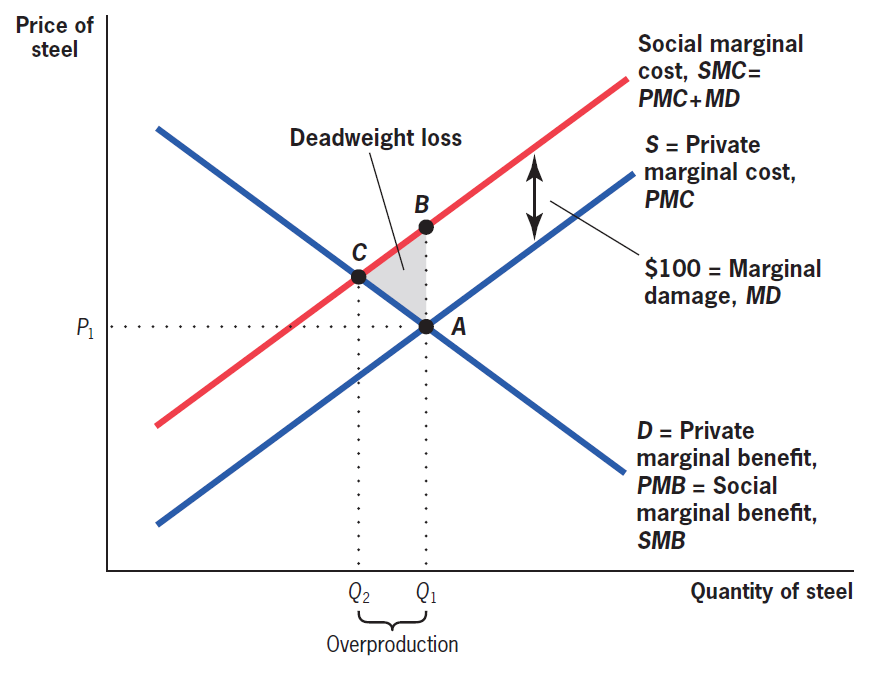
```

Negative externalities make the marginal private cost be less than the marginal social cost, leading to overproduction and deadweight loss &mdash;  the market equilibrium is not **Pareto efficient** `r Citep(myBib, "gruber")`

---
class: middle
## The Coase theorem

Externalities are a problem of *incomplete markets*: if we could **internalize** the external effect by creating a market for it, we would solve the problem

This is the principle behind **Coase Theorem**: if *property rights* are well-defined and there are no **transaction costs**, the market can solve the externality by itself

*Second part of Coase Theorem:* the result of Coase's bargain does not depend on who owns the property rights (but the incidence does for sure!)

---
class: middle
## Problems with Coase theorem

It is difficult to determine precisely who is generating the externality (does a certain company produce what proportion of Tietê's pollution?), which damages the externality generates and precisely, for whom?

**Holdout problem:** if many individuals own the property right, each one of them has the power over the others to block the deal &mdash; the last seller can charge the full value of the property right

If many individuals are on the side *without* the property right,  then the Coase bargain becomes a problem of private contribution to a public good, generating a **free rider** effect

---
class: middle
## The economics of electronic spam

`r Citep(myBib, "rao")` studies the externalities generated by electronic spam (e-mail)

A study observed 347 million sent spam: 83 million were not blocked by IP black-listing (23%), 4.2 million of these were not in the spam box (1,2%), which generated 10,500 ad clicks (0,003%), generating a purchase for every 375 clicks (28 purchases)

90 billion spam emails were sent per day in 2010: if 1,2% enters the inbox, and takes 5 seconds to deal with it, if the time value is `$`25/hour, the cost is `$`14bn per year &mdash; in addition to `$`6bn per year in anti-spam technology spending

---
class: middle

```{r, echo=FALSE, out.width = '100%'}
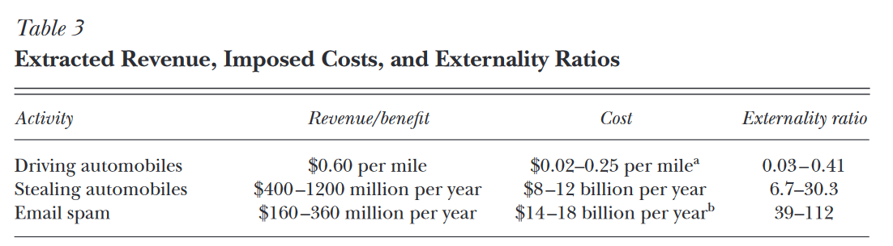
```

It is estimated that spam profit is between `$`180-360 million annually: *gigantic inefficiency of the order of 100-1* (!) &mdash; the ratio of negative externality generated to private gains in the electronic spam market is 3 orders of magnitude higher than in other economic activities `r Citep(myBib, "rao")`

---
class: middle
## Governmental solutions

How should the government intervene to solve externalities?

One possible way is to intervene in the price mechanism in a manner to match the decision maker's *private* MC with the *social* MC (**Pigovian tax**) &mdash; or analogously, subsidize activities that generate positive externalities

Another alternative is for the government to directly regulate the amount of production that generates externalities (**quotas**) &mdash; economists tend to prefer the 1st solution, because it is a "lighter" interference in the market mechanism

---
class: middle
## Governmental solutions

With multiple firms with different costs, quotas do not allow low cost firms to reduce the externality: it removes informational content of price mechanism

But this can be solved by imposing **quotas with tradable permits**: the total is fixed, but more productive firms can buy permits (which are more valuable to them) from less productive firms

The big difference between quotas and taxation appears when there is **uncertainty about the marginal cost of externalities reduction**:  in this case, which is better will depend on how costly it is to generate a little more externality than planned

---
class: middle

```{r, echo=FALSE, fig.show="hold", out.width = '50%'}
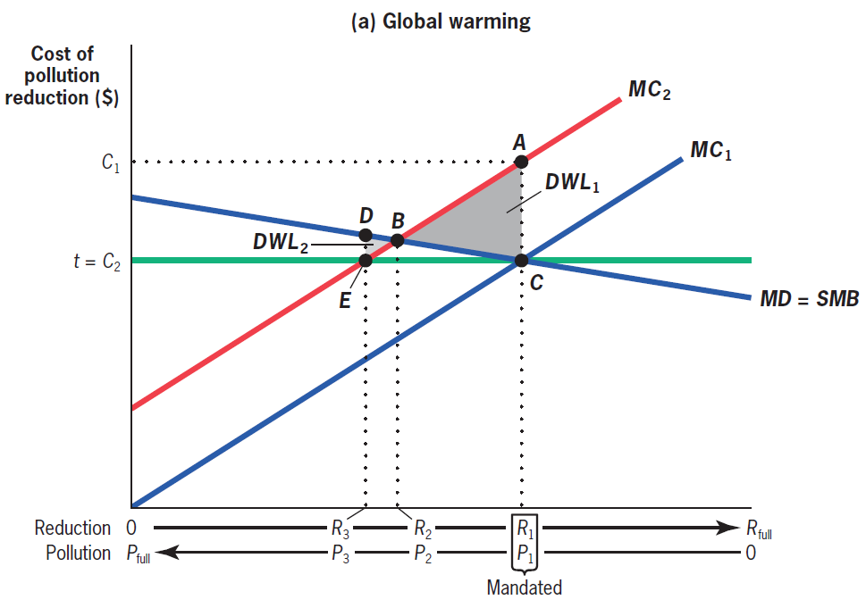
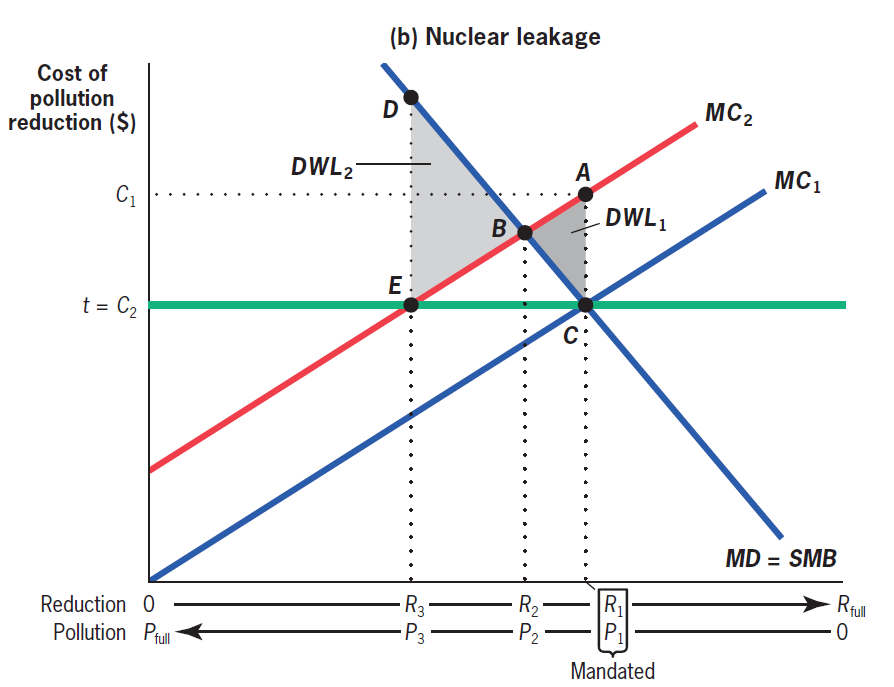
```

Comparison between quotas and taxes when we get wrong the marginal cost of reducing pollution from $MC_1$ to $MC_2$ &mdash;  if the marginal damage grows drastically, such as nuclear leakage in (b), the taxation deadweight loss $DWL_2$ it is higher; if it grows slowly (a), the deadweight loss of the quota $DWL_1$ is higher `r Citep(myBib, "gruber")`
 
---
class: middle
## Tobacco smoking

Cigarettes kill more than 8 million people a year worldwide, which 1.2 million of them are passive smokers (WTO)

In Brazil, there are 161,000 preventable deaths per year: 37,000 COPD, 33,000 heart disease, 24,000 lung cancer, 25,000 other cancers, 12,000 pneumonia and 10,000 stroke `r Citep(myBib, "INC")` &mdash; but this is not an externality!

In reality, if a smoker dies early and ceases to receive pension, then this is a *positive* externality (Brazil has a state pension for death, which counterbalances this effect)

---
class: middle

```{r, echo=FALSE, out.width = '75%', fig.align="center"}
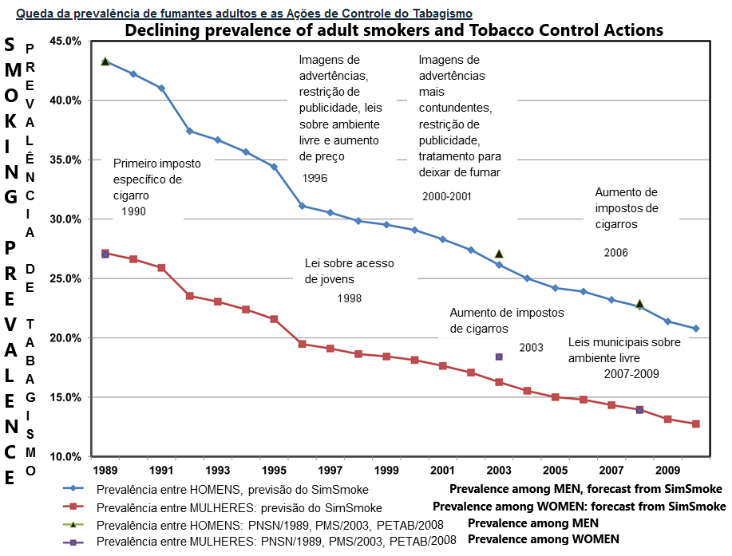
```

In 1989, almost half of men and more than 1/4 of women in Brazil smoked &mdash; since then, that number has halved, driven by cultural changes, but also by various public policies focused on the issue `r Citep(myBib, "INC")`

---
class: middle
## Quantifying externalities

It is estimated that tobacco smoking costs R$ 70  billion in medical treatments and generates losses of R$ 42 billion in potential years of life lost &mdash; *is that an externality*?

In 2018, Brazil consumed 106 billion (!!) of cigarettes (IBOPE), so even if only 50% of the cost mentioned above is an externality, this gives R$ 10 of externalities per pack (with 20)

Although in Brazil, almost 80% of the cigarette price is tax, which includes ICMS, IPI and, a fixed tax $\approx$ 5 reais per packet of tax, it seems that the taxation is still lower than necessary to correct externalities

---
class: middle
## Quantifying externalities

That was a back-of-the-envelope calculation &mdash; more careful estimates exist for the US: `r Citep(myBib, "gruber2001tobacco")` estimates that in the US the externality is 52¢, half the tax there (see also `r Citep(myBib, "chaloupka2000economics")`)

`r Citep(myBib, "manning1989taxes")` makes a discussion on how to calculate these externalities: 27¢ *positive* externality from premature deaths: 3¢ from nursing homes and 24¢ from retirement pension &mdash; negative externalities: medical costs 26¢, sick leave 3¢, group health insurance 5¢, fires 2¢

As externalities occur in the future, we need to take into account the discount rate (above, 5%)

---
class: middle
## Quantifying externalities

If the health care costs paid by the smoker and even their death might not generate externalities (but perhaps *internalities*), for **passive smokers** (ETS) they most likely do

The most affected by ETS is the family: we price the externality at 19¢ for spouse mortality, 19¢ for fetus death, 3¢ for infant mortality, family members killed in fire 9¢, using an estimate of the *value of statistical life*

But if the smoker takes into account the utility of the family in his decision to smoke (questionable), then the externality is *internalized*, and it should not be taken into account in public policy

---
class: middle

```{r, echo=FALSE, out.width = '100%'}
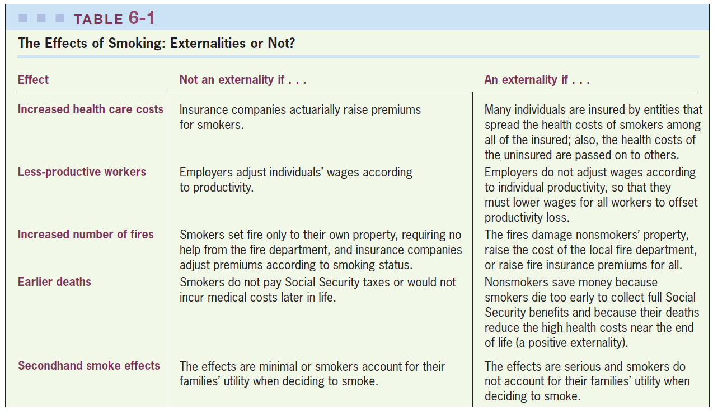
```

---
class: middle
## Taxing cigarette

One problem is that smoking is very concentrated among the poorest &mdash; cigarette taxation is very **regressive**

Another problem is **tax evasion**: contraband accounts for 57% of cigarettes consumed in the country (IBOPE)

So, as much as demand for cigarettes is inelastic (it is estimated that around $-0.4$), the elasticity of demand for legal cigarettes can be quite high &mdash; making taxation ineffective and causing high deadweight loss

---
class: middle
## Internalities

As we have seen, when consumers are totally *rational* and know the effects of smoking, 161,000 preventable deaths per year is not an economic argument for state intervention

And if it is an addiction? For an optimizing agent, this is not a problem: he chose to start smoking in an **intertemporal optimization** knowing that cigarettes are addictive (*rational addiction*)

In the past, any state attempt to prevent "bad decisions" was considered (pejoratively) a kind of paternalism &mdash; nowadays, it is more popular the view that there is a role for the state to correct decision errors (**internalities**)

---
class: middle
## Internalities

In the US, of all adults who smoke, 75% start smoking before age 19 &mdash; an age plausibly most vulnerable to marketing and social pressures

A survey asked teenage smokers if they would be smoking in 5 years and then checked back 5 years later: from those who said they would have quit by then, 74% were still smoking &mdash; evidence against the *rational addiction* hypothesis

8 out of 10 smokers want to quit, and the average smoker tries to quit once every 8 months (**self-control problem**) &mdash; if smokers make mistakes when young and would like to quit but cannot, then smoking also generates a *negative internality*

---
class: middle
## Internalities

**Hyperbolic Discount:** People prefer $100 today to $200 in 2 years, but they do *not* prefer $100 in 6 years to $200 in 8 years: but for a rational agent these are the same decision problem!

Another evidence is the demand for **commitment instruments**, for example, compulsory savings or annual gym membership

`r Citep(myBib, "FRIEDSON2023104877")` find that a dollar rise in cigarette taxation at ages 14-17 lowers by 8% the chance of that person smoking as an adult and by 4% their mortality rate (**habit formation**)

---
class: middle
## Internalities

Internalities work just like externalities: the government can help by taxing the good so that the *presumed*  marginal cost of smoking equals the *actual* marginal cost

Internalities can be gigantic! If smoking costs a person in average 6 years of life, and if the value given to an extra year of life is 200k dollars,  then the cost is `$`35 per pack

So even if the smoker underestimates his personal cost of smoking by only 10%, that is 3.5x the tax charged today!

---
class: middle

<!-- <iframe src="https://ourworldindata.org/grapher/share-of-tobacco-retail-price-that-is-tax" loading="lazy" style="width: 100%; height: 600px; border: 0px none;"></iframe> -->

```{r, echo=FALSE, out.width = '80%'}
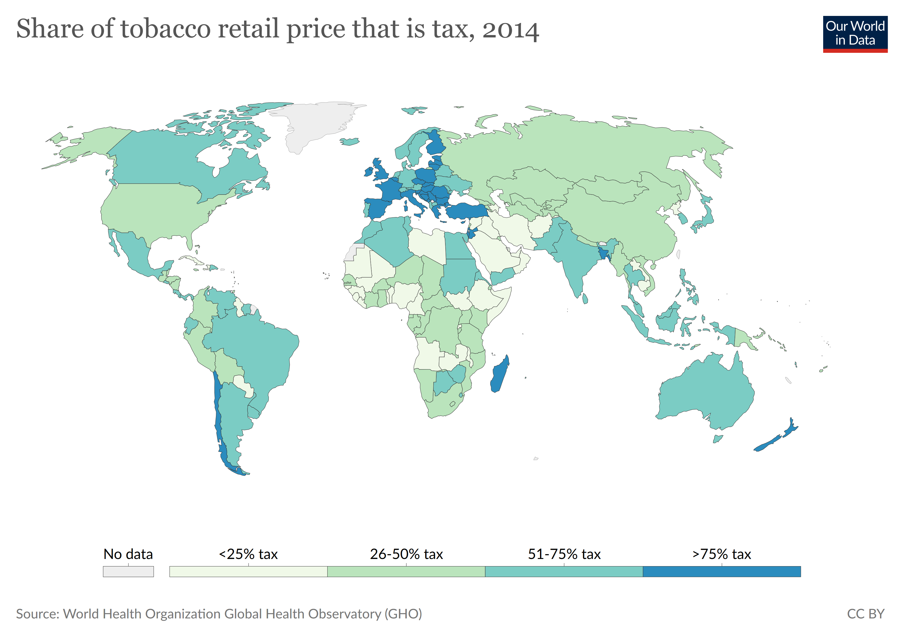
```

Due to corrective taxation, taxes form an important part of the price of cigarettes in almost all over the world &mdash; in several countries, such as Brazil, it is more than half of the final price, and in most parts of Europe it is more than 3/4

---
class: middle

<!-- <iframe src="https://ourworldindata.org/grapher/share-of-tobacco-retail-price-that-is-tax" loading="lazy" style="width: 100%; height: 600px; border: 0px none;"></iframe> -->

```{r, echo=FALSE, out.width = '80%'}
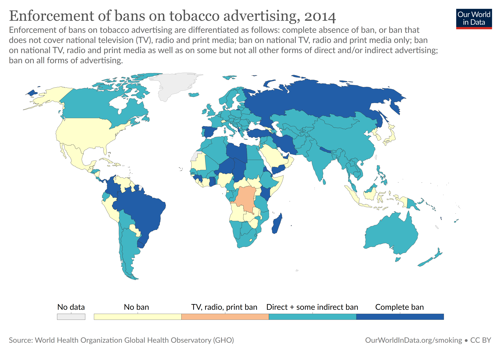
```

The view that *internalities* encourage cigarette consumption has led most countries (such as Brazil) to go beyond the price mechanism to discourage consumption, with policies such as banning tobacco advertising

---
class: middle
## Alcohol

More than 600 traffic fatalities per year with suspected drunkenness in São Paulo State alone, 42% of the total (G1) &mdash; another externality is violence: alcohol consumption is behind 18% of domestic violence cases (WHO)

`r Citep(myBib, "manning1989taxes")` estimates externalities for the US at `$`1.2 per ounce (30ml) of pure alcohol &mdash; but theory says we should always **specifically tax the activity that generates externalities**

Alcohol taxation (inefficiently) reduces a lot of consumption among those who do not drive drunk or are violent, but only giving fines for drunk driving is hardly able to sufficiently dissuade this practice

---
class: middle
## Empirical evidence (alcohol)

In general, we would like to compare the health (*potentially* internality) and undesirable behavior (externality) of alcohol drinkers with non-drinkers &mdash; problem: they are different in several dimensions

Raising minimum age to 21 in some US states (**quasi-experiment**) in the 80s: 18 year olds before the reform consumed 6-17% more alcohol between 18-21 *and* when older (**habit formation**)

Studies have also found a 17% increase in driving deaths among young people and a higher probability of teenage mothers giving birth to children with poorer health outcomes (lower weight or premature)

---
class: middle

```{r, echo=FALSE, out.width = '90%'}
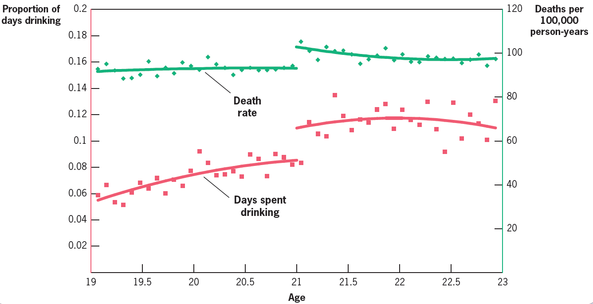
```

Young people a few weeks before their 21st birthday (minimum legal drinking age) in the US drink 30% fewer days and have a 9% lower death rate than young people a few weeks later (academic performance also drops): legal prohibitions are effective in reducing externalities/internalities `r Citep(myBib, "gruber")`

---
class:middle
# References
<small>
```{r refs, echo=FALSE, results="asis"}
PrintBibliography(myBib, start=1, end=5)
```
</small>

---
class:middle
# References
<small>
```{r refs2, echo=FALSE, results="asis"}
PrintBibliography(myBib, start=6)
```
</small>

<!-- --- -->
<!-- class: inverse, middle, center -->

<!-- # Global warming -->

<!-- --- -->
<!-- class: middle -->

<!-- ```{r, echo=FALSE, out.width = '90%'} -->
<!-- 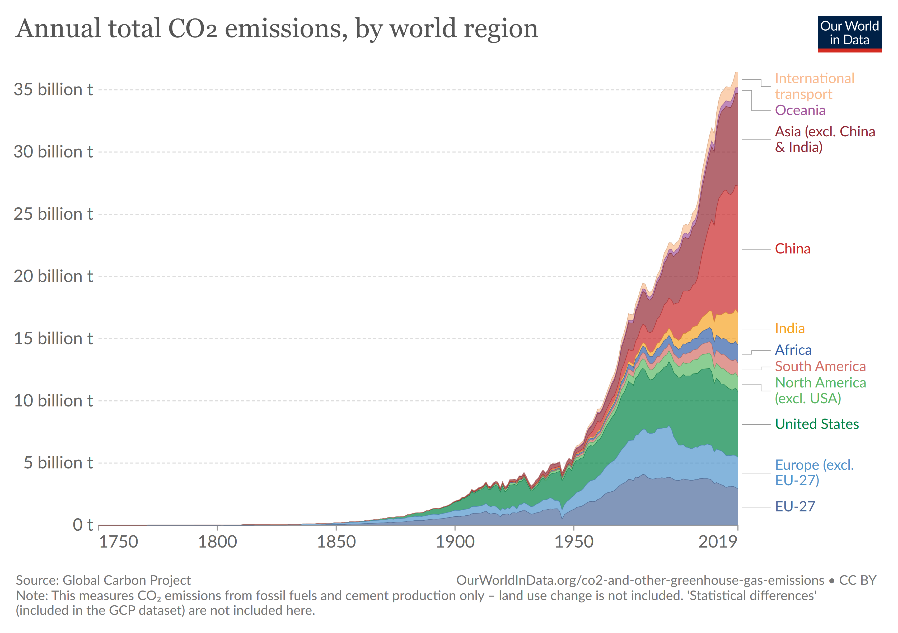 -->
<!-- ``` -->

<!-- The emission of pollutants has grown steadily and exponentially since the Industrial Revolution, but the source of emissions has changed: if until 1950 almost all emission came from Europe and the US, today more than half is from Asia (esp. China) -->

<!-- --- -->
<!-- class: middle -->

<!-- ```{r, echo=FALSE, out.width = '90%'} -->
<!-- knitr::include_graphics("figs/eae0310-2-9.png") -->
<!-- ``` -->

<!-- Even so, per inhabitant, emissions are still concentrated in rich countries, especially the US, the world's biggest polluter -->

<!-- --- -->
<!-- class: middle -->

<!-- ```{r, echo=FALSE, out.width = '90%'} -->
<!-- 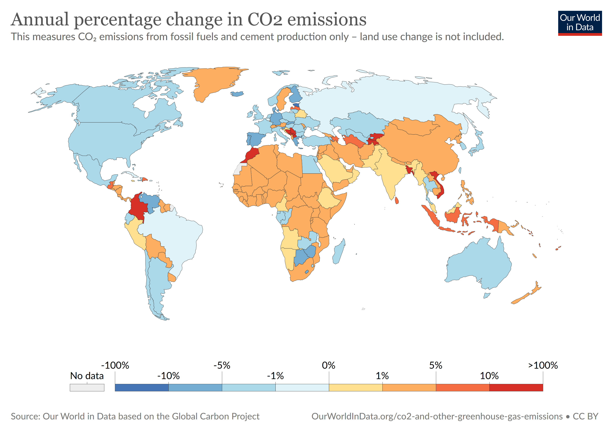 -->
<!-- ``` -->

<!-- The problem on the first derivative: most developed countries (esp. Europe) are reducing emissions, while developing countries, and more importantly China, continue to increase -->

<!-- --- -->
<!-- class: middle -->

<!-- ```{r, echo=FALSE, out.width = '80%'} -->
<!-- 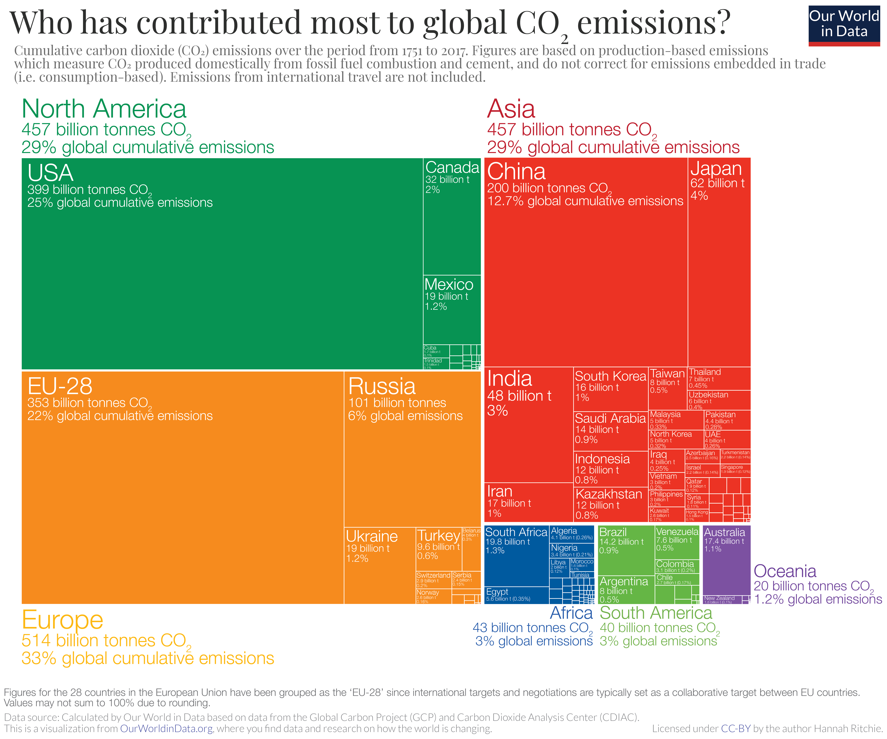 -->
<!-- ``` -->

<!-- Another interesting way to look at it is cumulatively: from 1750 to 2017, the US is responsible for 1/4 of global emissions, Europe 22% and China 13% &mdash; although it started much later, as emissions grow exponentially, the recent decades are more important -->

<!-- --- -->
<!-- class: middle -->

<!-- ```{r, echo=FALSE, out.width = '100%'} -->
<!-- #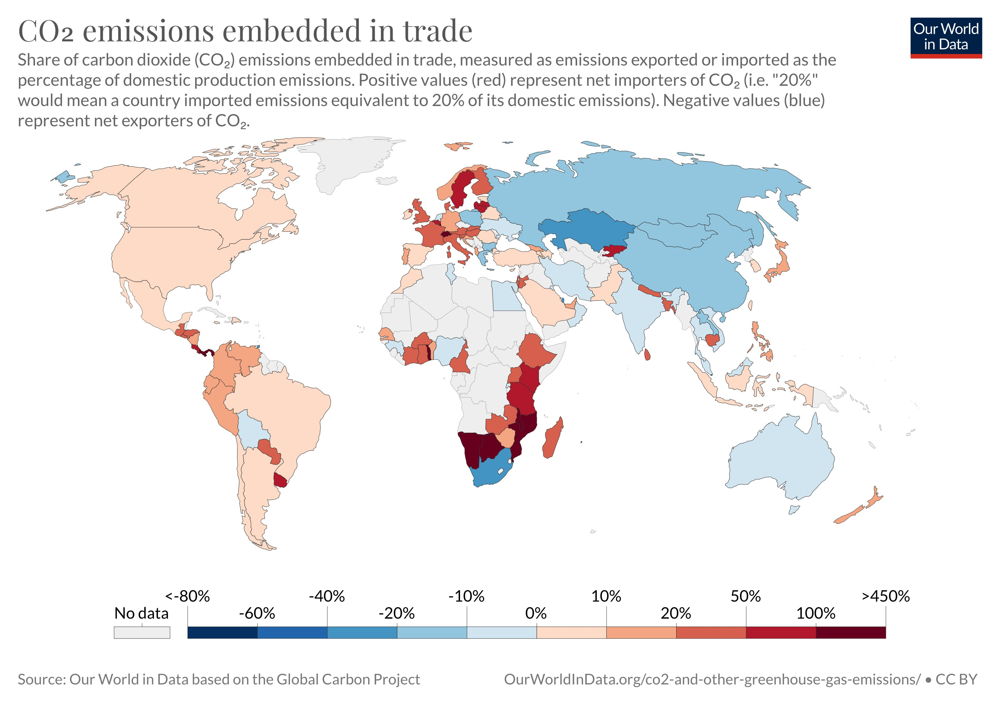 -->
<!-- ``` -->
<!-- <iframe src="https://ourworldindata.org/grapher/share-co2-embedded-in-trade" loading="lazy" style="width: 100%; height: 500px; border: 0px none;"></iframe> -->

<!-- But is the *production* or the *consumption* important? While 10% of Chinese emissions are "exported" by China, the US "imports" the equivalent of 7% of its emissions, France 33% and Sweden 66% (!) -->

<!-- --- -->
<!-- class: middle -->
<!-- ## Reducing greenhouse gas emissions -->

<!-- How do we solve the problem of global warming? The answer "micro III" answer is simple: charge a **Pigouvian tax** that equates private marginal cost with social marginal cost and let the free market reorganize itself -->

<!-- But in the real world we do *not* see that! On the contrary, governments use a variety of policies to attack global warming: automobile regulation, renewable energy subsidies, etc &mdash; why? -->

<!-- Perhaps governments have goals other than reducing global warming, political economy constraints or dynamic effects concern -->

<!-- --- -->
<!-- class: middle -->
<!-- ## Cost of different policies -->

<!-- `r Citep(myBib, "gillingham2018cost")` evaluates the cost of different interventions to build the **marginal emission reduction cost curve** -->

<!-- US government (Obama) has estimated the **marginal social cost** of each ton of CO2 as `$`46 &mdash; as burning 1 liter of gasoline generates 2.37 kg of CO2, this implies a marginal cost of `$`0.12/liter -->

<!-- Engineers usually estimate the *direct costs* of reduction &mdash; the role of economists is also to take into account the *behavioral effects* -->

<!-- --- -->
<!-- class: middle -->
<!-- ## Cost of different policies -->

<!-- Some policies in the US are *free lunches*, such as mixing 10% bioethanol with gasoline and switching from coal to natural gas &mdash; firms or consumers are not optimizing or there is some serious market failure -->

<!-- Other policies that common sense says that are good, do not actually reduce emissions: for example, replacing combustion cars with electric ones in states that produce energy with coal-fired power plants -->

<!-- The energy sector has gigantic and irreversible fixed costs that take decades to pay: potential for **lock-in** on an inefficient type of energy (in the future)  -->

<!-- --- -->
<!-- class: middle -->

<!-- ```{r, echo=FALSE, out.width = '80%'} -->
<!-- 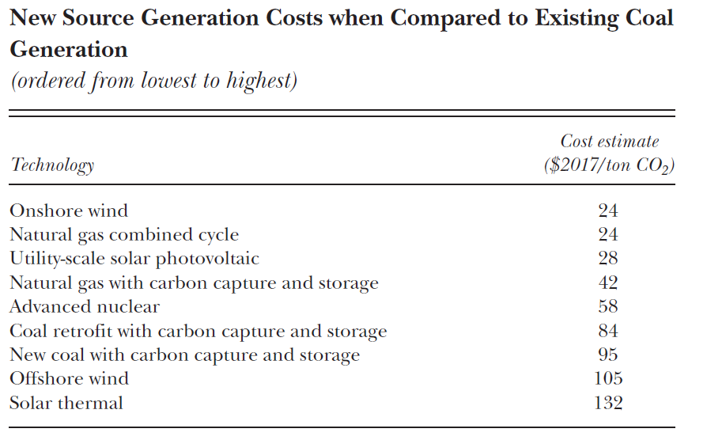 -->
<!-- ``` -->

<!-- Most energy technologies today are cheaper than new coal-fired power plants with carbon capture, but there is a lot of investment in coal already done (**lock-in**) `r Citep(myBib, "gillingham2018cost")` -->

<!-- --- -->
<!-- class: middle -->

<!-- ```{r, echo=FALSE, out.width = '70%'} -->
<!-- 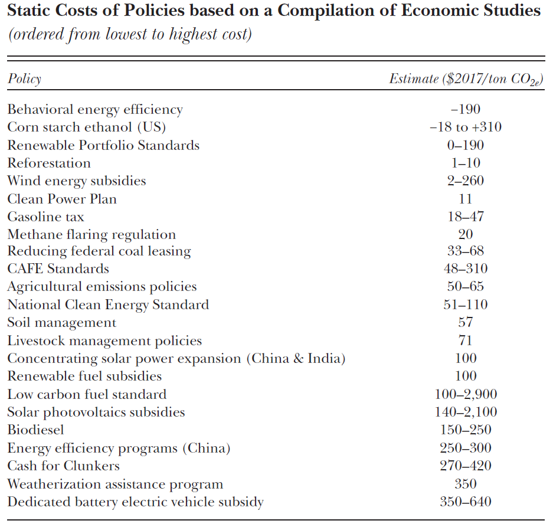 -->
<!-- ``` -->

<!-- Cost of emission reduction per ton of CO2 in economic studies of impact assessment `r Citep(myBib, "gillingham2018cost")` &mdash; why are the most expensive policies exactly the most common ones? -->

<!-- --- -->
<!-- class: middle -->
<!-- ## Dynamic costs -->

<!-- Generally, low-cost technologies have low reduction potential, while *scalable technologies* are the most expensive -->

<!-- And society does not minimize the costs of reducing emissions *today*, but the costs of reduction *throughout the adjustment period*: technologies that are not *statically* worth can be **dynamically efficient** -->

<!-- There are also *complementarities*: electric cars are only economically worth when there are enough chargers (**network externalities**) -->

<!-- --- -->
<!-- class: middle -->
<!-- ## Dynamic costs -->

<!-- Another *productive externality*: technological advancements are only partially appropriable by the firm that generated them &mdash;  justification for state support for R&D, especially in infant industries -->

<!-- Productive externalities and complementarities generate **external economies of scale**: industries may not be viable in a small scale, but only when large enough &mdash; room for *big push* policies -->

<!-- Dynamic effects can also lead to *less* investment in a technology if costs tend to increase (nuclear energy) or can be ignored if costs are constant in the time -->


<!-- --- -->
<!-- class: middle -->
<!-- ## Solar panels -->

<!-- In the last 30 years, the cost per Watt of solar panels has dropped 90%, and their energy production has increased more than 1000 times &mdash; it is estimated that of this cost drop, 43% was scale gains, and the rest was innovation -->

<!-- And the increase in production started *before* much of the fall in price, because of government policies, which allowed this gain of scale -->

<!-- But this stimulus is expensive: the cost per ton of CO2 is estimated to be `$`130-190 in California and €500-1300 in Germany &mdash;  for productive externalities, these programs effectively subsidize renewable energy in other countries, creating a problem of *free rider* -->

<!-- --- -->
<!-- class: middle -->

<!-- ```{r, echo=FALSE, out.width = '75%'} -->
<!-- 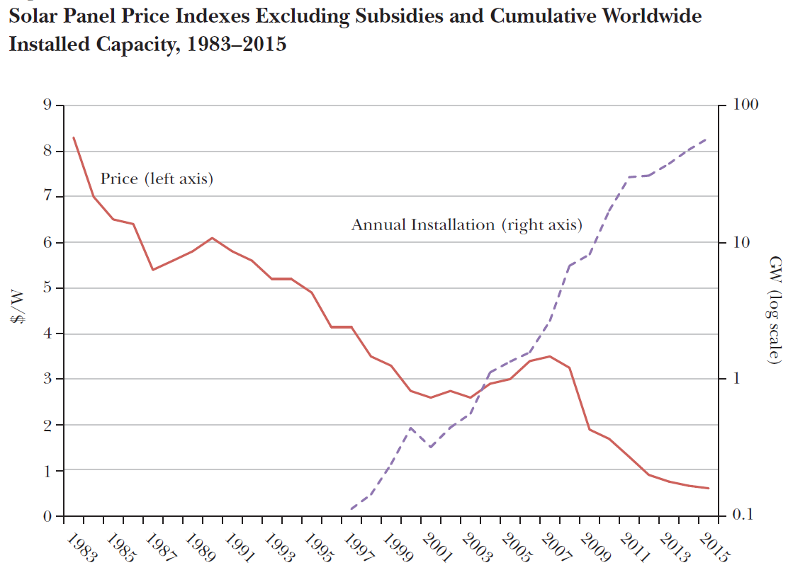 -->
<!-- ``` -->

<!-- Much of the decline in solar energy prices occurred *after* the first increase in its use in the late 90s, demonstrating the government's role in inducing scale gains, technological innovations and **learning-by-doing** `r Citep(myBib, "gillingham2018cost")` -->

<!-- --- -->
<!-- class: middle -->
<!-- ## Electric cars -->

<!-- Another example is electric cars: from 2009 to 2015, the price of electric car batteries dropped 75%, while their autonomy has increased -->

<!-- And electric cars reduce global emissions more the cleaner is the energy matrix &mdash; externalities *complement each other* -->

<!-- Network externalities can generate **multiple balances** &mdash; research shows that subsidies for charging stations are more efficient in increasing consumption of electric cars than direct subsidies for vehicle purchases -->

<!-- --- -->
<!-- class: middle -->

<!-- ```{r, echo=FALSE, out.width = '80%'} -->
<!-- 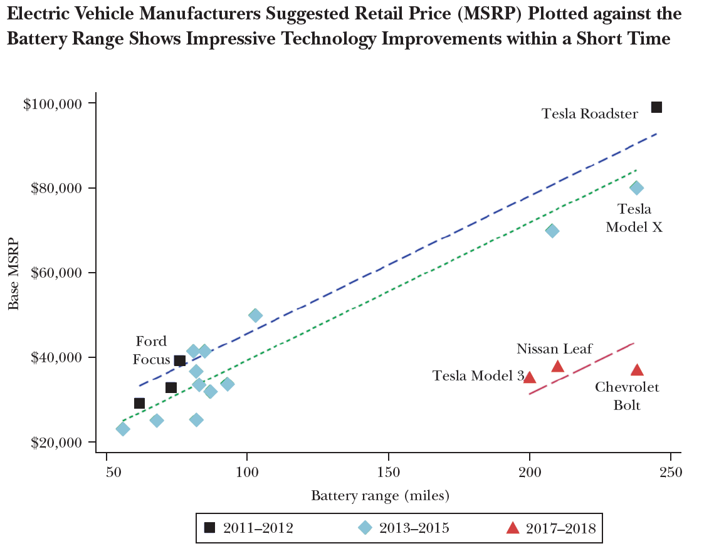 -->
<!-- ``` -->

<!-- The frontier of production possibilities in electric vehicles has moved considerably in the last decade `r Citep(myBib, "gillingham2018cost")` -->

<!-- --- -->
<!-- class: middle -->

<!-- ```{r, echo=FALSE, out.width = '85%'} -->
<!-- 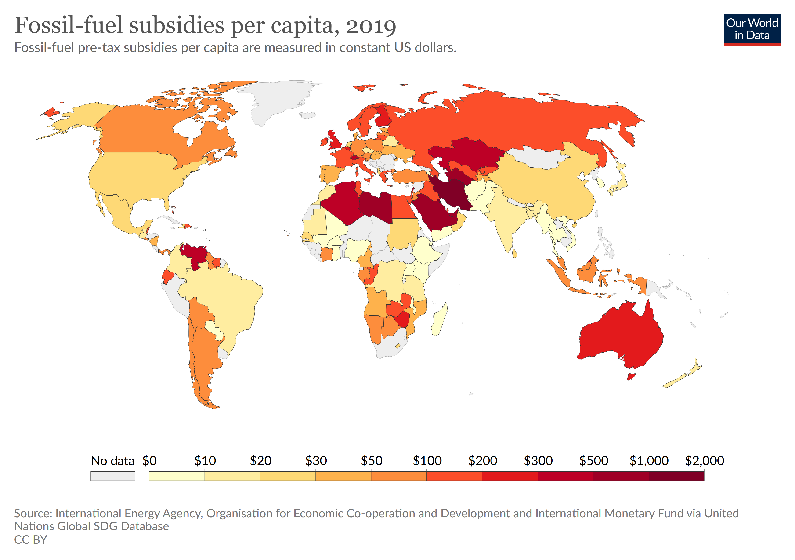 -->
<!-- ``` -->

<!-- Not only are current public policies plausibly insufficient to correct environmental externalities, but most governments actively subsidize fossil fuels, generating overproduction in relation to market equilibrium without interference -->

<!-- --- -->
<!-- class: middle -->

<!-- ```{r, echo=FALSE, out.width = '90%'} -->
<!-- 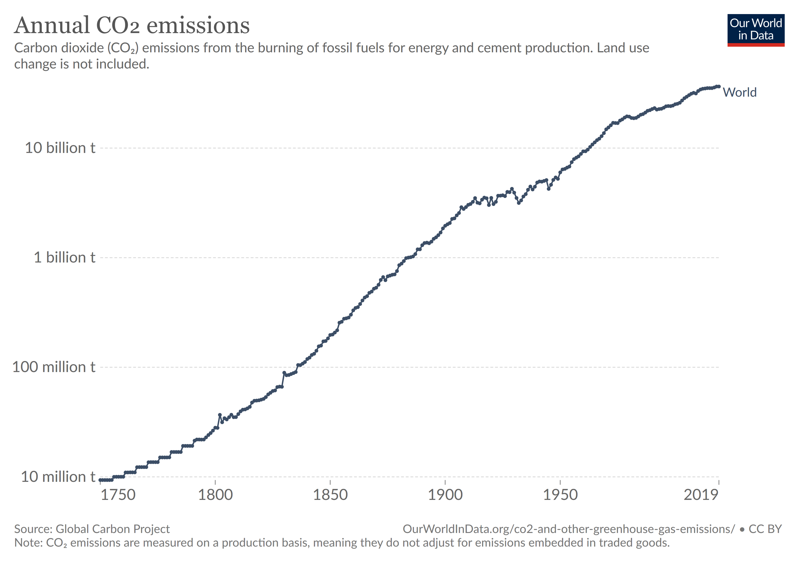 -->
<!-- ``` -->

<!-- Desde o século XVIII, com a Revolução Industrial, as emissões de CO2 crescem de forma constantemente exponencial, sendo hoje 1000x maior que há 200 anos -->

<!-- --- -->
<!-- class: middle -->

<!-- ```{r, echo=FALSE, out.width = '80%'} -->
<!-- 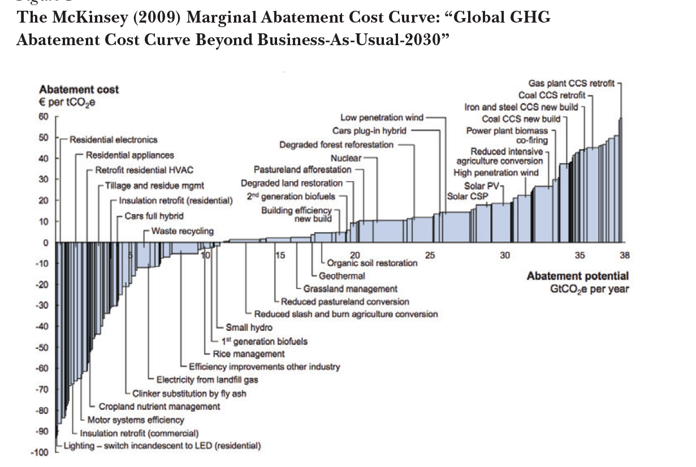 -->
<!-- ``` -->

<!-- Custo marginal (de engenharia) de redução de emissões varia bastante, e várias políticas são "lanches grátis" `r Citep(myBib, "gillingham2018cost")` -->
