class: inverse, middle, center

```{r, load_refs, include=FALSE, cache=FALSE}
library(RefManageR)
BibOptions(check.entries = FALSE,
           bib.style = "alphabetic",
           cite.style = "alphabetic",
           style = "markdown",
           hyperlink = FALSE,
           dashed = FALSE)
myBib <- ReadBib("./esp_bib.bib", check = FALSE)
```

# Principles of government intervention

---
class: middle
## The invisible hand

> [E]very individual (...), indeed, neither intends to promote the public interest,
nor knows how much he is promoting it (...) he intends only his own security; ... he
intends only his own gain, and he is in this... led by an invisible hand to promote an end which was no part of his intention... By pursuing his own interest he frequently promotes that of the society more effectually than when he
really intends to promote it.

Adam Smith (1776), *The Wealth of Nations*

---
class: middle
## The invisible hand

*In the perfectly competitive market*, the interests of the producer and society are completely synchronized (*invisible hand*)

> It is not from the benevolence of the butcher, the brewer, or the baker, that we expect our dinner, but from their regard to their own interest... (Smith)

The individual marginal cost of production (MC) is the **marginal social cost** and the marginal benefit of the firm (the given price) is the **marginal social benefit**

---
class: middle
## Market failures

This is what is behind the 1st WT: each agent maximizing his social problem does the same as what a *benevolent dictator* would do, because his individual incentives are the same as the social ones

A *market failure* is any kind of "wedge" between individual and social cost/benefit &mdash; which invalidates the 1st FTWE 

For example, when the production process of a firm reduces the welfare of others (pollution) and does not compensate them for it, it is generating **negative externalities** in production

---
class: middle
## Externalities and the Coase theorem

Externalities are a problem of *incomplete markets*: if we could **internalize** the external effect by creating a market for it, we would solve the problem

This is the principle behind **Coase Theorem**: if *property rights* are well-defined and there are no **transaction costs**, the market can solve the externality by itself

*Second part of Coase Theorem:* the result of Coase's bargain does not depend on who owns the property rights (but the incidence does for sure!)

---
class: middle
## Problems with Coase theorem

It is difficult to determine precisely who is generating the externality (does a certain company produce what proportion of Tietê's pollution?), which damages the externality generates and precisely, for whom?

**Holdout problem:** if many individuals own the property right, each one of them has the power over the others to block the deal &mdash; the last seller can charge the full value of the property right

If many individuals are on the side *without* the property right,  then the Coase bargain becomes a problem of private contribution to a public good, generating a **free rider** effect


---
class: middle
## Public goods

**Common goods** are *non-excludable* goods: when it is impossible (or unfeasible, or undesirable) to prevent certain individuals from consuming the good

In this case, there is an incentive for *free riders*: individuals could not contribute for financing (or exhaust the resource of) the common good they use

When common goods are also *non-rival*, that is, consumption by an individual does not decrease the available quantity to others, then we call the good a **pure public good**

---
class: middle

```{r, echo=FALSE, out.width = '70%', fig.align='center'}
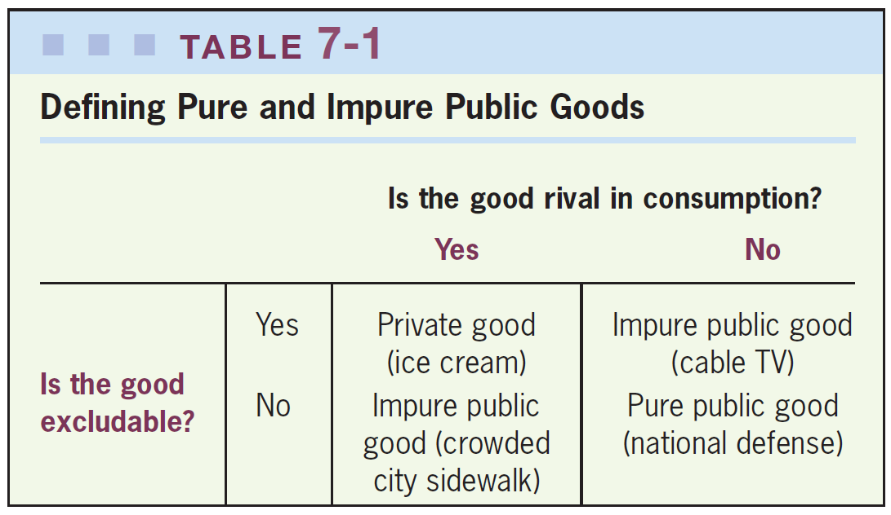
```

A *pure* public good is non-rival and non-excludable &mdash; non-rival goods (externalities) and non-excludable (common) goods have some of the characteristics of public goods, and can be called *impure public goods* `r Citep(myBib, "gruber")`

---
class: middle

> Two neighbors may agree to drain a meadow, which they possess in common; because
’tis easy for them to know each others mind; and each must perceive, that the immediate consequence of his failing in his part, is the abandoning of the whole project.

> But ’tis very difficult and indeed impossible, that a thousand persons shou’d agree in any such action; it being difficult for them to concert so complicated a design, and still more difficult for them to execute it; while each seeks a pretext to free himself of the trouble and expense, and wou’d lay the whole burden on others.

David Hume, *A Treatise of Human Nature* (1742)

---
class: middle
## When private provision works

There are some situations in which public goods are successfully offered without (direct) government intervention, such as when (few) people involved can design private contracts of minimal provision

Or if the individual benefit to some agent is higher than the cost of provision, or the agents manage to organize themselves into cooperatives or associations with (formal or social) punishment for those who do not contribute, as in the management of commons

When there is altruism (**social capital**), prestige, or utility in providing the public good, private provision can be efficient &mdash; for example, open source software

---
class: middle
## Public and private provision

When there is a public and private provision of a good, the public provision can result in **crowding-out** (expulsion) of private provision &mdash; for example, income redistribution can drive out private donations

In the real world, however, crowd out estimates are small (but not negligible): between ¢13 and ¢20 for $1

Even if the government wants to intervene, it can *grant* (auction) the service to the private sector &mdash; here the auction works as *ex-ante* competition, even if the concessionaire is a monopolist when offering the service

---
class: middle
## Auctioning

Competitive auctions are efficient, but there can be [collusion](https://www.nber.org/reporter/2025number2/reporter/collusion-public-procurement) or corruption. If there are quality aspects difficult to observe (or to put into contract), there may be a worsening of quality &mdash; for example, private prisons in the US

The big advantage of the private sector to the public in economic activities is that it has a **residual claimant** &mdash; the capitalist gets all the surplus profit, which mitigates *moral hazard* problems

[Barkley (2021)](https://www.aeaweb.org/research/government-outsourcing-dredging-industry) estimates that outsourcing projects to private builders saves up to 23% of the cost in the US, especially where competition is higher

---
class: middle

```{r, echo=FALSE, out.width = '100%', fig.align='center'}
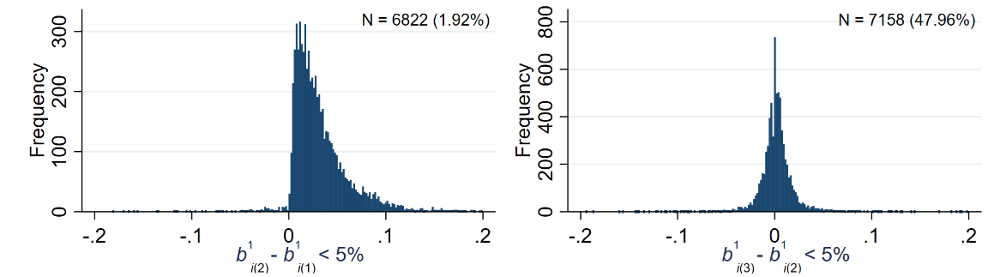
```

Although collusion in auctions is hard to observe (because illegal), we can try to infer it statistically &mdash; `r Citep(myBib, "kawai2022detecting")` analyze for Japan auctions that do not meet a secret reserve price and therefore are reauctioned: although the 2nd and 3rd place change often their bids (right panel), the winner remains the same in 96% of the time (left panel), even when first auction bids were close

---
class: middle
## Privatization and partnerships

A perennial debate in economics is the state participation in economic activities &mdash; in the 1980s and 1990s this discussion centered on **privatization**: the outright sale of state firms and assets to private individuals

But in many markets (e.g. *natural monopolies*) goverment participation is unavoidable: since then **public concessions** and **public-private partnerships** (PPP) became more and more common, now accounting for 10% of yearly investments in developing countries

PPP contracts involve a private actor investing in building (**build-operate-transfer**, BOT, or *greenfield* projects) or rehabilitating/extending a public good (*brownfield* projects), while *concessions* trade the maintenance of a good for the right to collect user fees


---
class: middle
## Public-private partnerships

But while praised in public debate, the actual efficiency gains of PPPs is debatable: in Latin America the wave of PPPs in 1990s and 2000s led to a large amount of costly renegotiations and government bailouts

`r Citep(myBib, "guasch2008renegotiation")` document that 53% of the concessions in the transport sector and 76% in the water sector in LatAm and were renegotiated, on average
only 3.1 and 1.6 years after it was initiated

Also, whether private involvement combats corruption is doubtful: `r Citep(myBib, "campos2021ways")` looks at the Odebrecht case files and finds no evidence that bribes were lower in PPP than standard government procurement

---
class: middle

```{r, echo=FALSE, out.width = '100%', fig.align='center'}
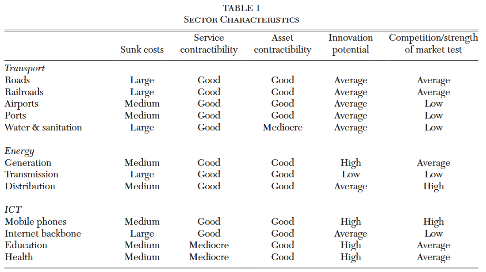
```

Whether private provision might be more efficient depends on the characteristics of the market: whether public-private contracts can be bidding (which depends on **contractibility**) and if the advantages of the market can shine through large innovation potential and competition `r Citep(myBib, "campos2021ways")`

---
class: middle
## Tragedy of the commons

*Common goods* are non-excludable goods that are *rivals* &mdash; they can lead to the **tragedy of the commons**: each individual has the incentive to consume more of the good than would be socially optimal, leading to its depletion

> Therein is the tragedy. Each man is locked into a system that compels him to increase his herd without limit - in a world that is limited. Ruin is the destination toward which all men rush, each pursuing his own best interest in a society that believes in the freedom of the commons. Hardin (1968) apud `r Citep(myBib, "ostrom1990governing")`

The simplest way to think of the tragedy of the commons is as a *Prisoner's dilemma*

---
class: middle
## Prisoner's dilemma

> The idea that groups tend to act in support of their group interests is supposed to follow logically from this widely accepted premise of rational, self-interested behavior. In other words, if the members of some group have a common interest or object, and if they would all be better off if that objective were achieved, it has been thought to follow logically that the individuals in that group would, if they were rational and self-interested, act to achieve that objective. Olson (1965) apud `r Citep(myBib, "ostrom1990governing")`

The **Prisoner's dilemma** was important to oppose the view above, common at the beginning of the 20th century, that rational agents should always coordinate to avoid bad situations for everyone &mdash; which is wrong!

---
class: middle
## Ruling the commons

In the 2nd half of the 20th century, it was believed that there were only two *possible* solutions to the tragedy of the commons: either *Leviathan* or demarcation of the commons in *private property* &mdash; no room for self-managed communities

`r Citep(myBib, "ostrom1990governing")` noted that in the real world, commons exist and function efficiently &mdash; the applicability of tragedy of the commons depends on the *practical* circumstances of the analyzed environment (*metaphor-based public policy*)

She highlights the difference between *common property* and **open-access property**: the first one has *property rights for the community*  that give them the incentive to create *institutions* and *social norms* to manage it

---
class: middle
## Corruption

Political economy also studies situations when the government does not want (or does not succeed) to act in the public interest, which we call **government failures** &mdash; perhaps the main one is *corruption* 

But if corruption is only transfer of economic incomes to politicians, it does not generate inefficiencies &mdash; consider two scenarios: (i) politician A's salary is `$`30, but he receives `$`10 for fuel overbilling; or (ii) politician A's salary is `$`40

Or even: (i) monopolist B builds a construction with an economic cost of `$`800, receives `$`1000 from the government and pays `$`200  to shareholders; or (ii) he pays `$`200 in bribe instead

---
class: middle
## Corruption

In practice, corruption is (almost) never pure rent transfers: illegal activities usually involve generating deadweight-loss for its concealment

Corruption is also often linked to the choice of public policies that favor *special interests* against the common good &mdash; furthermore, it encourages low cost-benefit investments that are easy to corrupt

Another economic cost of corruption is that it encourages more bureaucracy (*red tape*) in the public service: if opening a firm takes 90 days, there is room to ask for a bribe to make it in 10 days

---
class: middle
## Corruption

In the real world, corruption has relevant negative effects: `r Citep(myBib, "ferraz2012corrupting")` find that in Brazilian municipalities where corruption was found in audits, grades are 0.35 std lower and (dropout) rates are higher

Still, it is important to correctly measure the importance of corruption for public sector productivity

`r Citep(myBib, "bandiera2009active")` show that in Italy *active* waste (corruption) represents only 17% of general public sector waste, the rest is *passive* waste (lack of effort, incompetence, lack of autonomy, avoidance of complaints or investigations)

---
class: middle
## Corruption

A way to keep corruption in check is **electoral accountability**: if politicians want to keep their mandates, they will avoid being corrupted in case it costs them votes

Analyzing random CGU audits, `r Citep(myBib, "ferraz2008exposing")` show that information about corruption indeed drastically reduces the chances of reelection &mdash; furthermore, politicians with electoral incentives (who can be reelected) steal 27% less than those who cannot `r Citep(myBib, "ferraz2011electoral")`

`r Citep(myBib, "campante2014isolated")` show that, in the US, states with capitals far from large urban centers (less *accountability*) have more cases of corruption

---
class: inverse, middle, center

# Public spending in Brazil

---
class: middle
## Public spending in Brazil

Overall, government in Brazil spent in 2024 45.8% of GDP across its 3 spheres of government [[Boletim COFOG/2024]](https://thot-arquivos.tesouro.gov.br/publicacao/53401) &mdash; about 22% of GDP from the federal government, 13.6% states and 9.6% municipalities

In Brazilian federal pact, the federal government is responsible for social protection (39.3% of the federal budget, mostly retirement and PBF), the states for security policy, and municipalities for primary health care services

In education, the federal government provides university education, high school is frequently provided by state governments, and municipalities offer childcare and primary schools (roughly speaking)

---
class: middle

```{r, echo=FALSE, out.width = '100%'}
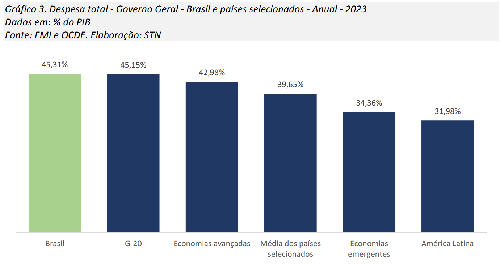
```

Public spending in Brazil is about on level with the advanced economies, the OECD and G20, but substantially larger than developing countries and Latin American economies [[Boletim COFOG/2024]](https://thot-arquivos.tesouro.gov.br/publicacao/53401)


---
class: middle

```{r, echo=FALSE, out.width = '90%', fig.align="center"}
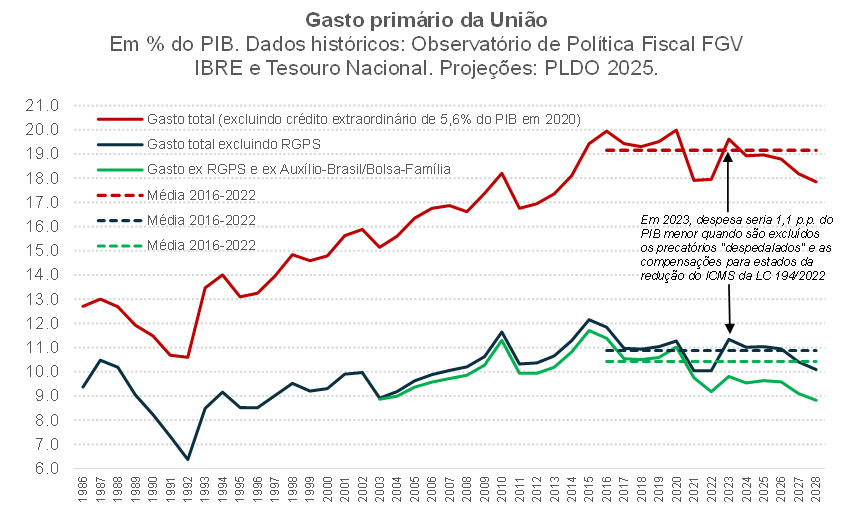
```

For the Federal government, public spending increased 50% between the redemocratization and 2010, remaining mostly constant since then &mdash; but almost the entire increase is due to a rise in retirement transfers [[Observatório de Política Fiscal do IBRE]](https://observatorio-politica-fiscal.ibre.fgv.br/politica-economica/outros/mudanca-das-metas-e-o-desafio-da-sustentabilidade-fiscal-brasileira)

---
class: middle

```{r, echo=FALSE, out.width = '100%'}
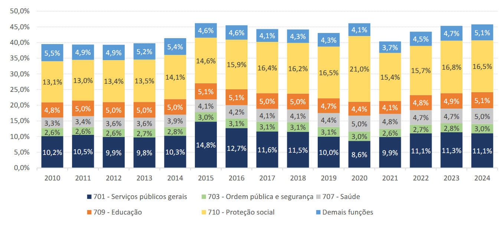
```

The largest share of public spending in Brazil is with social protection (16.5% of GDP in 2024), followed by "general public services" (mostly interest on public debt), then education and health (about 5% of GDP each) [[Boletim COFOG/2024]](https://thot-arquivos.tesouro.gov.br/publicacao/53401)

---
class: middle

```{r, echo=FALSE, out.width = '100%'}
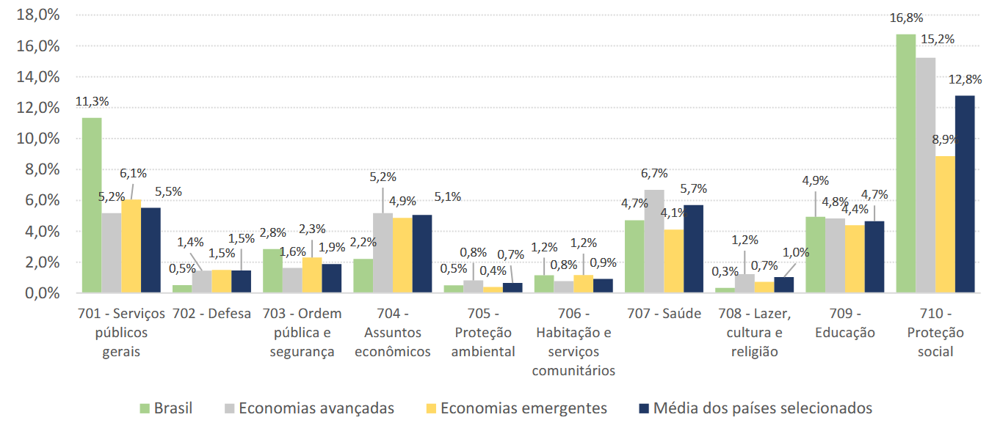
```

Brazil spent in 2023 in social protection in line with advanced economies (generally older populations), but much ahead of developing countries &mdash; in health and education Brazilian public spending is also comparable to world average (in percentage of GDP) [[Boletim COFOG/2024]](https://thot-arquivos.tesouro.gov.br/publicacao/53401)

---
class: middle

```{r, echo=FALSE, out.width = '100%'}
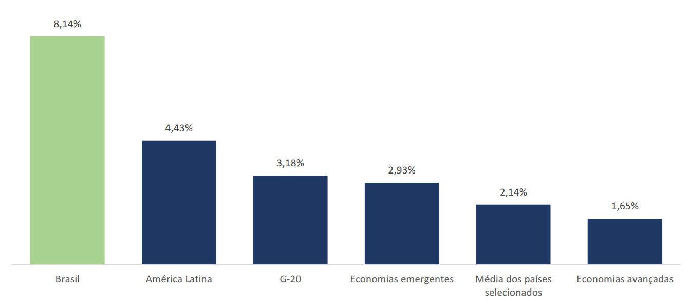
```

In 2023, Brazil spent 8% of GDP (!!) on interest payments, that is almost double the average of Latin America and 4 times the world average, and it is almost the same as total public expenditure on education and health combined [[Boletim COFOG/2024]](https://thot-arquivos.tesouro.gov.br/publicacao/53401)

---
class: middle

```{r, echo=FALSE, out.width = '100%'}
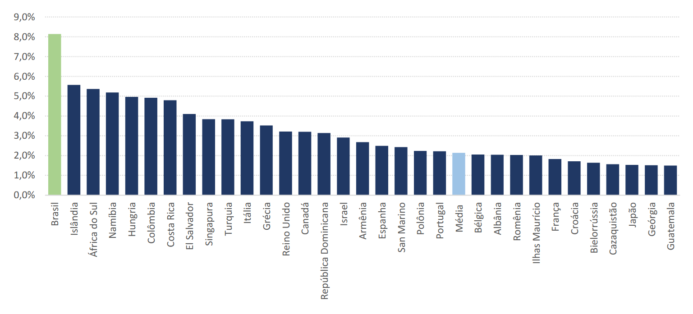
```

Brazil pays the largest interest payments in the world by a considerate margin &mdash; we speak constantly about a retirement reform (and almost never about the interest payments), but the entire retirement system costs only 1% of GDP more than the government's debt costs [[Boletim COFOG/2024]](https://thot-arquivos.tesouro.gov.br/publicacao/53401)

---
class: middle

```{r, echo=FALSE, out.width = '100%'}
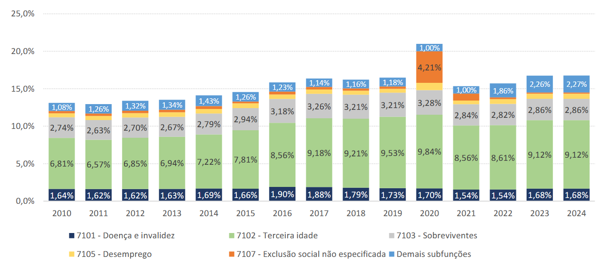
```

The lion's share of social potection spending is on retirement expenses, about 9% of GDP, followed by "survivor's pension" (2.8%) and disability payments (1.7%) &mdash; even with their recent growth, poverty relief programs like *Bolsa Família* respond to only about 1.6% of GDP in 2024 (not directly shown) [[Boletim COFOG/2024]](https://thot-arquivos.tesouro.gov.br/publicacao/53401)

---
class: middle

<iframe width="600" height="371" seamless frameborder="0" scrolling="no" src="https://docs.google.com/spreadsheets/d/e/2PACX-1vQWjA0CiuIqQYZEk7SaiQkI8nak6NkhiYOicXjb0jaV6VVDxAOsIjz7ELQgJz5FZqu4Bz6sDWPYOMzL/pubchart?oid=1665153157&amp;format=interactive"></iframe>

The states are responsible for public security (10% of the budget from São Paulo State Government), in addition to part of education (18%) and health (12%). Public servants' social security consume almost 1/5 of the state budget of 11,4% of São Paulo's GDP [[SFP/ESP]](https://www.fazenda.sp.gov.br/SigeoLei131/Paginas/FlexConsDespesa.aspx)

---
class: middle

<iframe width="600" height="371" seamless frameborder="0" scrolling="no" src="https://docs.google.com/spreadsheets/d/e/2PACX-1vQWjA0CiuIqQYZEk7SaiQkI8nak6NkhiYOicXjb0jaV6VVDxAOsIjz7ELQgJz5FZqu4Bz6sDWPYOMzL/pubchart?oid=1124154423&amp;format=interactive"></iframe>

Meanwhile, the prefecture spends 9% of the city's GDP (from 2018), and it is the one responsible for primary health services (21% of São Paulo budget), in addition to (mostly primary) education (20%), urban planning and transportation (18%) [[Prefeitura de SP]](https://www.prefeitura.sp.gov.br/cidade/secretarias/licenciamento/desenvolvimento_urbano/dados_estatisticos/info_cidade/financas_municipais/)

---
class: middle

```{r, echo=FALSE, out.width = '80%', fig.align="center"}
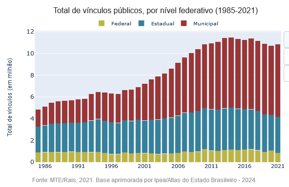
```

In the 2000s, there was a decentralization in public goods provision, with the number of municipal servants almost doubling in the period to 62% of public employment and around 6.5% of total Brazilian workforce (while the state and federal employment remained constant at 3% and 0.8% of workforce, respectively) [[Atlas do Estado Brasileiro/IPEA]](https://www.ipea.gov.br/atlasestado/)

---
class: middle

```{r, echo=FALSE, out.width = '80%', fig.align="center"}
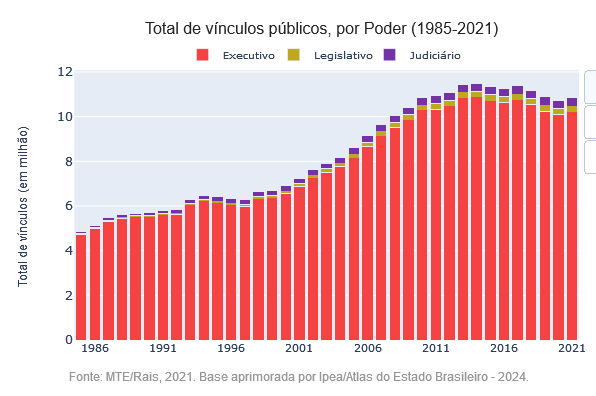
```

Almost all Brazilian public sector employees work in the Executive branch (94%), with the rest almost evenly distributed between Legislative and Judiciary [[Atlas do Estado Brasileiro/IPEA]](https://www.ipea.gov.br/atlasestado/)

---
class: middle

```{r, echo=FALSE, out.width = '100%', fig.align="center"}
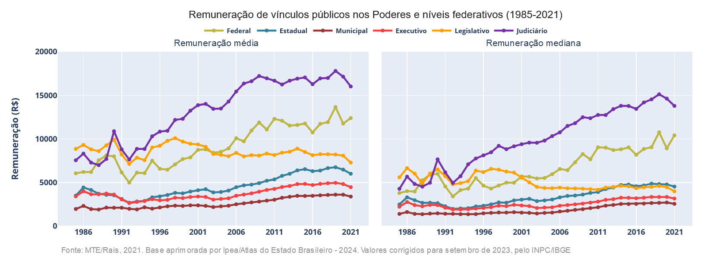
```

There is a lot of talk about the high salaries in Brazilian public service, and they do exist: but almost only in the federal government and, especially, in the Judiciary. In the prefectures, the *public-sector wage premium* is estimated to be even a little negative [[Atlas do Estado Brasileiro/IPEA]](https://www.ipea.gov.br/atlasestado/)

---
class: middle

```{r, echo=FALSE, out.width = '90%', fig.align="center"}
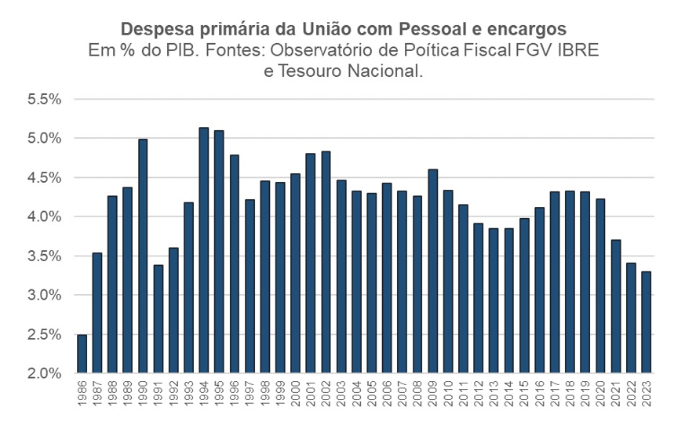
```

In fact nowadays 40% of Brazilian federal government expenses are with public workers' wages and benefits, the lowest level in the last two decades [[Observatório de Política Fiscal do IBRE]](https://observatorio-politica-fiscal.ibre.fgv.br/politica-economica/outros/mudanca-das-metas-e-o-desafio-da-sustentabilidade-fiscal-brasileira)


---
class: middle

```{r, echo=FALSE, out.width = '90%', fig.align="center"}
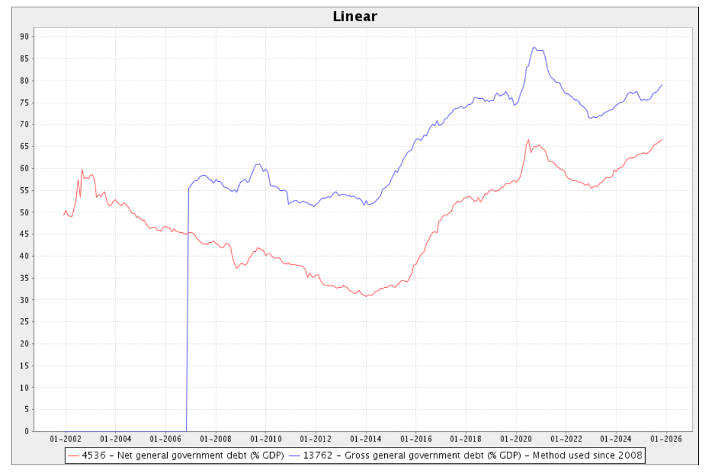
```

Since 2014, public debt has been steadily increasing, going from about 55% of GDP in 2014 to almost 90% in 2020 (with extraordinary expenses dueto covid) and 80% today [[BACEN]](https://www3.bcb.gov.br/sgspub/)

---
class: middle

```{r, echo=FALSE, out.width = '80%', fig.align="center"}
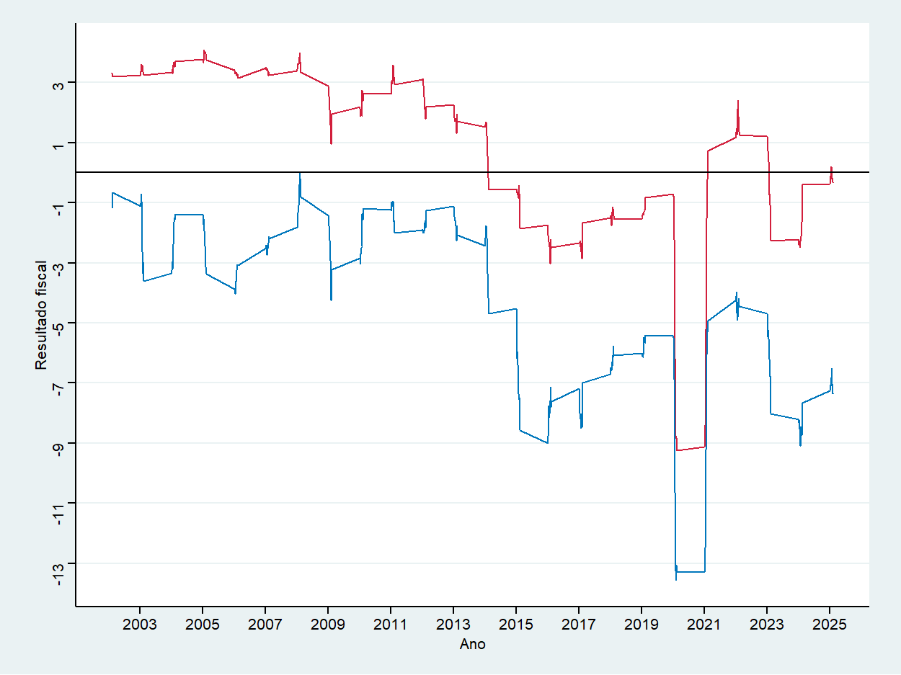
```

During the 2000s Brazil kept a constant primary budget surplus (in red) and had a high growth rate, which allowed the debt to increase in a slower rate than GDP growth, lowering public debt &mdash; since 2013, constant (albeit small) primary deficits and a large cost of public debt, as we saw led to significant nominal deficits (in blue), quickly increasing public debt  [[Ipeadata]](https://www.ipeadata.gov.br)


---
class: middle

```{r, echo=FALSE, out.width = '90%', fig.align="center"}
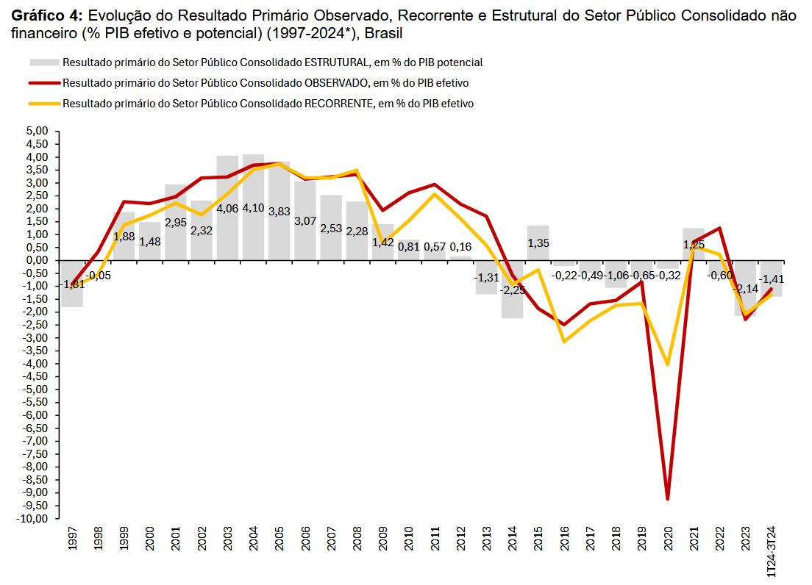
```

The fact that fiscal deficits depend a lot on the volatility of government revenues to business cycles and commodity prices led to the creation of **structural budget surplus** definitions, removing the effect of these circunstances [[Boletim RFE - SPE]](https://www.gov.br/fazenda/pt-br/central-de-conteudo/publicacoes/transparencia-fiscal/boletim-resultado-fiscal-estrutural/2024/boletim-rfe-2024-2023-_final_2024.pdf)


---
class: inverse, middle, center

# Acemoglu & Robinson (2013). "Economics versus Politics: Pitfalls of Policy Advice"

---
class: middle
## Third-best

We have seen that the allocation in the Second Welfare Theorem is called **first-best**. In the real world, we do not have *lump-sum transfers* (due to informational asymmetries), so we usually have to settle for **second-best**.

The political economy literature introduces a new complication: economic allocations can be constrained from the best possible not only by informational differences, but also by *political constraints*.

We call the allocations that maximize social welfare given the available instruments and political possibilities **third-best**

---
class: middle
## Good economics can be bad politics

`r Citep(myBib, "acemoglu")` argue that public policy proposals that ignore their political consequences can do more harm than good, even if they lead to economic efficiency gains

In the presence of political economy considerations, *cost-benefit analysis* is not enough! When developing public policies we must identify situations in which economics and politics come into conflict

Failure to take this into account is a large part of the reason for the failure of policy prescriptions for development in the second half of the 20th century

---
class: middle
## Intertemporal political dependence 

Think of a (“benevolent”) administrator making a public policy decision in two periods: if there is no connection between the periods, then he will simply choose at each moment the policy that maximizes instantaneous social welfare

But in general decisions in the first period will change the **correlation of forces** in the second period

So we must take into account that: (i) economic and political power are connected; and (ii) too much concentration of political power in one group can have deleterious effects

---
class: middle
## Political incentive compatibility

In this sense, we should avoid public policies that give more power to already dominant groups or weaken groups that counterbalance them.

Example: breaking union monopolies can increase efficiency by reducing market failures(*), but weakens unions that politically counterbalance the power of the richest.

Another danger is that removing market failures that generate economic rent for certain groups can change the **political incentive compatibility constraints** &mdash; the lack of income to distribute to support groups weakens the government and generates institutional instability.

---
class: middle
## Rent-seeking behavior

*Economic rents* generate incentives for political organization (often pejoratively called **rent-seeking behavior**)

On the negative side, rent-seeking causes companies and individuals to direct economic investment resources to *political lobbying*

But this political organization is not always negative for society: economists must take into account when formulating public policies how economic policies affect the incentives for political organization of different groups

---
class: middle
## Rent-seeking behavior

> Because elites know that violence will reduce their own rents, they have incentives not to fight. Furthermore, each elite understands that other elites face similar incentives. In this way, the political system of a natural state manipulates the economic system to produce rents that then secure political order.

> [T]he appropriate counterfactual from eliminating rents is not a competitive market economy... but a society in disorder and violence.

`r Citep(myBib, "north2013shadow")` apud `r Citep(myBib, "acemoglu")`

---
class: middle
## Labor unions

The (economic) purpose of unions is to create monopoly power in the supply of labor and thus generate *economic rents* for their members (potentially at the cost of higher unemployment).

Unions can also generate other distortions, such as impeding technological advances (e.g. ticket collectors or gas station attendants): for this reason, a common policy recommendation for a long time was to restrict union power.

More recently, their role as a counterbalance to employers' **monopsony power** and as a redistributor of income has been emphasized (*2nd FTWE fallacy*).

---
class: middle
## Labor unions

But unions not only bargain for higher wages, they are also politically active &mdash; counterbalancing (only partly!) the disproportionate political power of corporate **interest groups**

For example, unions have been extremely important historically (and still today) in the establishment and consolidation of Western democracies

As unions are forms of institutional organization of workers, they facilitate **collective action** and prevent free rider behavior in politics

---
class: middle
## Labor unions

> I think we can’t separate economic and political factors... The (...) struggle was over wages, but in struggling for wages, the working class won a political victory (Lula in Keck, 1992, apud `r Citep(myBib, "acemoglu")`)

In the US, for example, anti-union policies have halved the proportion of unionized workers since 1950: this is now widely believed to be part of the explanation for rising inequality in that country.

More arguably, it may be part of the explanation for the stratospheric rise in CEO pay and the financial deregulation that led to the 2008 crisis.

---
class: middle
## Natural resources

Political economy already predicts that the way in which natural resources are accessed matters: Botswana with deep-sea diamonds (GDP pc 15k PPP) vs Sierra Leone with river diamonds (GDP pc 1.7k PPP)

But economic choices matter too! River diamonds create a **tragedy of the commons**, as we have seen

One possible solution is to assign *exclusive property rights* (Sierra Leone), another possible solution is to let small miners organize themselves into cooperatives and the like (Australia)

---
class: middle
## Natural resources

Generally, economists favor the first option as more efficient(*)

But this ignores the political effects! Communes favor the organization of workers to maintain and increase their *economic income* &mdash; including politically, with the pursuit of **de jure political power** (e.g. suffrage)

While in the first case, the gigantic value of exclusive property rights over natural resources gives their owners incentives to use military force and rigid political control (*autocracy*) to maintain their monopoly

---
class: middle
## Inequality and politics

Political economy is another reason why the 2nd FTWE is a fallacy &mdash; changes in income distribution affect the correlation of forces in society, and change which allocations are politically feasible in the future.

In the US, deregulation of the financial sector at an initially (economically) reasonable degree dramatically increased the political power of the sector, which then politically influenced more drastic changes (**slippery slope**).

Between 1980 and 2005, profits in the financial sector grew 800%, and campaign donations rose to $260 million (2.6x more than the 2nd largest donor, the healthcare sector).

---
class: middle
## Russia privatization

The prevailing view in the 1990s was that privatizing Russian state-owned enterprises was not only good economically, but also politically (*good economics is good politics*)

> [A]t least in Russia, political influence over economic life was the fundamental cause of economic inefficiency, and the principal objective of economic reform was, therefore, to depoliticize economic life... Privatization fosters depoliticization because it robs politicians of control over firms. (Boycko et al, 1995, apud `r Citep(myBib, "acemoglu")`)

But this process created an oligarchic class, which also generated resistance to the reform process and the return of authoritarianism, ending in a *state-led crony capitalism*

---
class: middle
## Political compatibility constraints

Economically inefficient policies can be important for sustaining possible governing political coalitions &mdash; `r Citep(myBib, "acemoglu")` give the example of IMF reforms in Ghana: two weeks after they were accepted, the president suffered a military coup and they were reversed (*seesaw effect*)

More controversially, a similar argument can be made about state corruption in Brazil during the 2000s, which made a stable and democratic governing coalition possible

On another front, [Acemoglu et al (2008)](https://voxeu.org/article/central-bank-independence-failures-successes-and-seesaw-effect) argue that central bank independence only works for "intermediate" cases of institutions &mdash; when they are good, it is superfluous, when they are bad, there is resistance and it does not work

---
class:middle
# References
<small>
```{r refs, echo=FALSE, results="asis"}
PrintBibliography(myBib, start=1, end=5)
```
</small>

---
class:middle
# References
<small>
```{r refs2, echo=FALSE, results="asis"}
PrintBibliography(myBib, start=6, end=10)
```
</small>


---
class:middle
# References
<small>
```{r refs3, echo=FALSE, results="asis"}
PrintBibliography(myBib, start=11)
```
</small>


<!-- --- -->
<!-- class: middle -->
<!-- ## Private provision -->

<!-- Consider two families privately contributing to pave a street, a public good $F = f_1 + f_2$. The utility of each individual is $U_i = 2 \ln c_i + \ln F$, with budget constraint $c_i + f_i = 100$. Family $1$ resolves: -->

<!-- $$\max_{f_1} 2 \ln (100 - f_1) + \ln (f_1 + f_2)$$ -->

<!-- The first order condition $dU_1/df_1 = 0$ implies: $$\frac{-2}{100 - f_1} + \frac{1}{f_1 + f_2} = 0$$ -->

<!-- And then we have that the *response curve* is $f_1^* = (100 - 2f_2)/3$: the higher is $f_2$, lower is $f_1$! -->

<!-- --- -->
<!-- class: middle -->
<!-- ## Private provision -->

<!-- On the other hand, the socially optimal value is one that respects Samuelson condition: $MRS_{Fc}^1 + MRS_{Fc}^2 = MC_F$ -->

<!-- The marginal cost $dF/df_1 = 1$, it remains to calculate $MRS_{Fc}^1$ -->

<!-- $$MRS_{Fc}^1 = \frac{MU_F^1}{MU_c^1} = \frac{1/F}{2/c_1} = \frac{c_1}{2F}$$ -->
<!-- $$\Rightarrow MRS_{Fc}^1 + MRS_{Fc}^2 = \frac{c_1 + c_2}{2F} = \frac{200 - F}{2F}$$ -->

<!-- Equaling the two, we have $200 - F = 2F$, i.e., $F = 200/3$ is the optimal provision -->

<!-- --- -->
<!-- class: middle -->

<!-- ```{r, echo=FALSE, out.width = '80%'} -->
<!-- 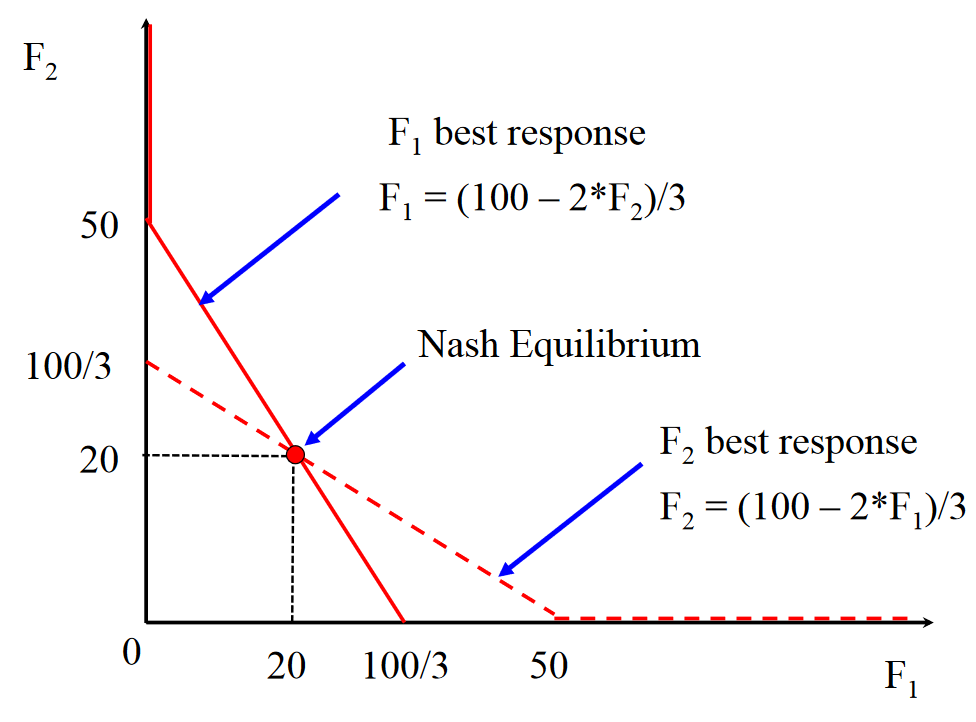 -->
<!-- ``` -->

<!-- In the Nash equilibrium of this game (fixed point of the best-response curves), the private contribution $2 \times 20$ is less than the socially optimal value (*Samuelson condition*) of $200/3$ -->


<!-- --- -->
<!-- class: middle -->

<!-- ```{r, echo=FALSE, out.width = '100%'} -->
<!-- 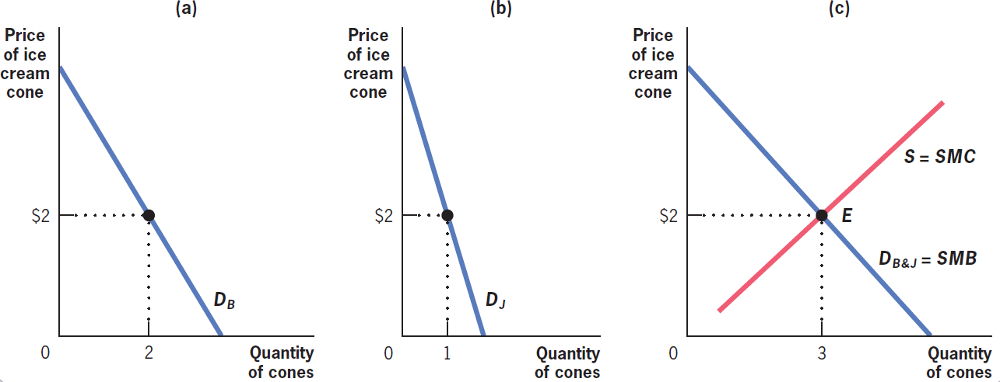 -->
<!-- ``` -->

<!-- In the private goods market, the demand curve is the *horizontal* sum of individual demands &mdash; the private social benefit of $3\text{rd} + \epsilon$ unit is `$`2 because *either* $B$, which already consumes 2, *or* $J$, which already consumes 1, will buy the good, and both give it a value of `$`2 at current consumption levels `r Citep(myBib, "gruber")` -->

<!-- --- -->
<!-- class: middle -->

<!-- ```{r, echo=FALSE, fig.show="hold", out.width = '60%'} -->
<!-- 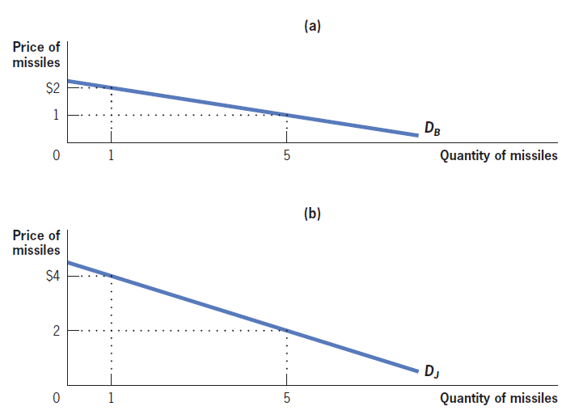 -->
<!-- 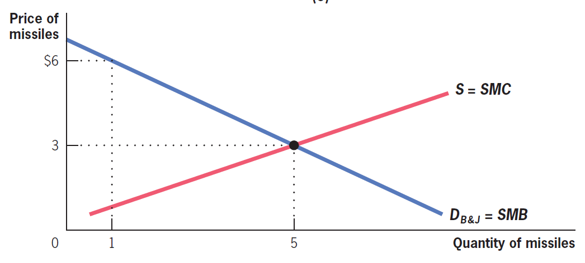 -->
<!-- ``` -->

<!-- However, SMB of 5 missiles is `$`3 because $B$ gives them a value of `$`2 *and* $J$ gives `$`1 value, and defense spendings are non-rivals (*vertical sum*) `r Citep(myBib, "gruber")` -->

<!-- --- -->
<!-- class: middle -->
<!-- ## Public goods -->

<!-- The optimal provision of a private good equates the substitution marginal rate of the good in relation to "money" (*horizontal sum* of demands) with the marginal cost of producing that good (supply curve) -->

<!-- Samuelson realized that the optimal provision of the public good equates the production marginal cost with the *sum of the marginal rate of substitution* between individuals (**vertical sum** of individual demands) -->

<!-- We call this result **Samuelson condition**, which comes from the public good being *non-rival* -->

<!-- --- -->
<!-- class: middle -->
<!-- ## Private provision -->

<!-- Assuming decision without strategic interaction, only the agent with the highest $MRS$ will contribute to the good and will do in its private optimum: **sub-provision of public good** -->

<!-- In the real world, agents expect that others will provide part of public goods, and this reduces their contribution (**free riding**): as it is less beneficial to contribute to the public good, the greater the contribution of other members, this generates a negative *response curve* sloping -->

<!-- The intersection of the response curves indicates the point at which the action of each agent is optimal given the actions of the other agents (**Nash equilibrium**) -->


<!-- --- -->
<!-- class: middle -->
<!-- ## Contribution to the public good -->

<!-- One way to empirically study the private provision of public goods is through **public goods games**  -->

<!-- Players have a number of tokens that (privately) decide how many to contribute to a common pot. All money in the common pot is multiplied by $\lambda > 1$ and redistributed to everyone equally -->

<!-- The efficient scenario then is for everyone to contribute all of their tokens, but the only equilibrium is zero contribution (**free riding**) &mdash; in the real world, however, generally 30%-70% of participants contribute (in one study: economics students contributed 20% of tokens, other students 49%) -->

<!-- --- -->
<!-- class: middle -->
<!-- ## Local public goods -->

<!-- What determines which expenditures should be included at the federal, state, or municipal level? (**optimal fiscal federalism**) -->

<!-- Tiebout (1956) proposed that an advantage of local provision is that it generates *competition* between localities: citizens can *vote with their feet*, moving to where the provision of public goods satisfies their preferences -->

<!-- Intuitively, the public sector would imitate the private sector, giving residents ("consumers") the opportunity to choose where to "buy" the public goods &mdash;  this reveals their real preferences (without *free riding*) over public goods, leading to an efficient result -->

<!-- --- -->
<!-- class: middle -->
<!-- ## Local public goods -->

<!-- In the real world, spatial mobility is limited, but the Tiebout model gives an intuition of a big difference between federal and local spending: people can more easily move to other cities than countries -->

<!-- The provision of public goods that are useful to the majority of local residents (*tax-benefit linkages*) should be decentralized, as opposed to benefits to specific groups, such as social assistance, that are usually federal -->

<!-- Expenditures that generate significant spatial externalities should be centralized, as they will be underprovided at the local level, and since they might have relevant economies of scale -->

