class: inverse, middle, center

```{r, load_refs, include=FALSE, cache=FALSE}
library(RefManageR)
BibOptions(check.entries = FALSE,
           bib.style = "alphabetic",
           cite.style = "alphabetic",
           style = "markdown",
           hyperlink = FALSE,
           dashed = FALSE)
myBib <- ReadBib("./esp_bib.bib", check = FALSE)
```

# Health
 
---
class: middle
## Health insurance

Health spending in Brazil was 9.7% of GDP (2021), with 4% public spending (SUS) and 5.7% private spending &mdash; while 25% of the population is covered by the private sector (ANS, 2024)) 

The health sector accounts for 10.5% of total Brazilian income and 8% of labor force participation, being one of the main sectors in the economy [[Conta-Satélite de Saúde]](https://biblioteca.ibge.gov.br/visualizacao/livros/liv102075_informativo.pdf)

The government can intervene by obliging (and generally subsidizing) the purchase of health insurance (Germany) or directly offer the service (NHS, SUS), either directly by the government or through dealers

---
class: middle

```{r, echo=FALSE, fig.align='center', out.width="100%"}
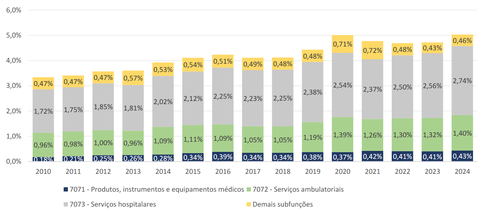
```

In 2024 the Brazilian government spent 5% of GDP on health, most of it in hospital services (2.74%), followed by primary care (1.4%) and medical equipments (0.4%) [[Boletim COFOG/2024]](https://thot-arquivos.tesouro.gov.br/publicacao/53401)

---
class: middle

```{r, echo=FALSE, fig.align='center', out.width="100%"}
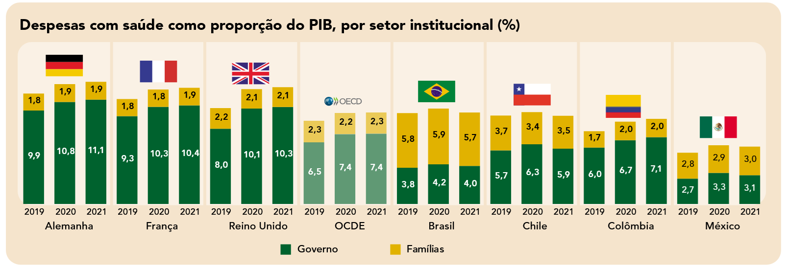
```

The level of health spending as a percentage of GDP in Brazil is about the OECD average, but the public sector participation is much lower &mdash; even in the US, $\approx 50\%$ of health expenses are public (Medicare and Medicaid): more than in Brazil! [[Conta-Satélite de Saúde]](https://biblioteca.ibge.gov.br/visualizacao/livros/liv102075_informativo.pdf)

---
class: middle

```{r, echo=FALSE, fig.align='center', out.width="45%"}
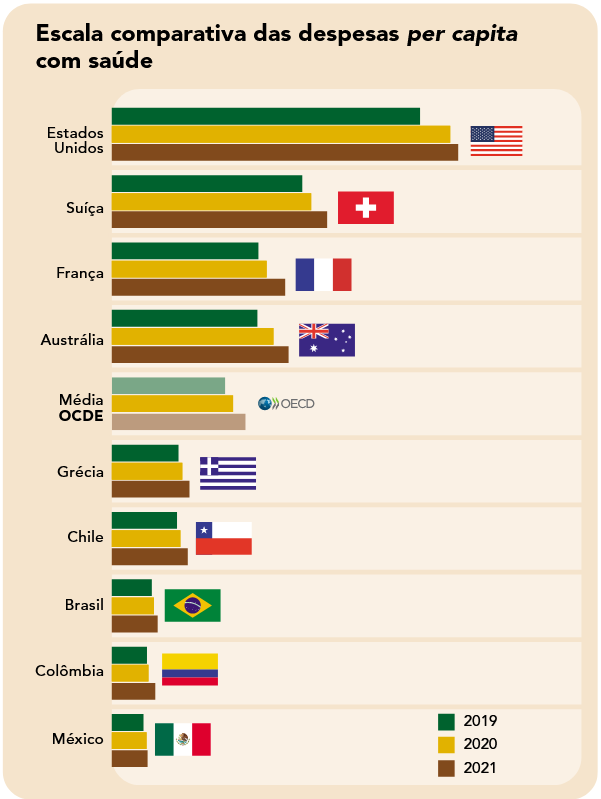
```

In 2021, Brazilian *per capita* spending on health accounted for R$2,387 for private spending and R$1,703 for public spending &mdash; about half of OECD average and 1/4th of USA (in US$ PPP) [[Conta-Satélite de Saúde]](https://biblioteca.ibge.gov.br/visualizacao/livros/liv102075_informativo.pdf)

---
class: middle

```{r, echo=FALSE, fig.align='center', out.width="70%"}
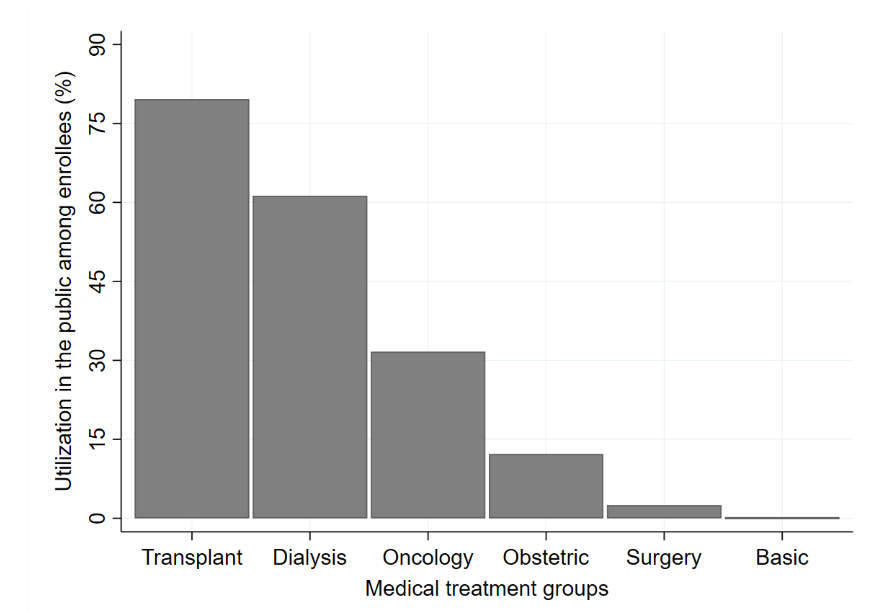
```

Even for those with private health insurance, in 2015, 80% of them had transplants, 60% dialysis and 30% treated cancer in publicly-provided SUS (the private plans reimburse the government at 150% of SUS price) `r Citep(myBib, "guidetti2024private")`


---
class: middle

```{r, echo=FALSE, out.width = '100%'}
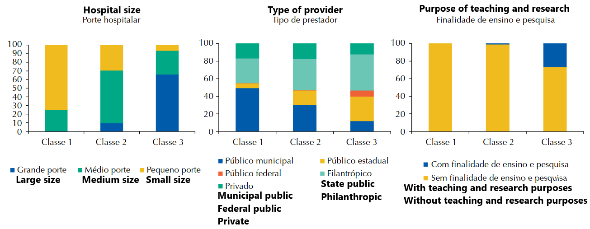
```

Around 20% of the hospitals that serve the SUS are private, and 30% are philanthropic: only half are public &mdash; among these, they are mainly municipal among the smaller hospitals (C1), and state and federal among the largest ones (and that provide more complex services), Class 3 in image `r Citep(myBib, "botega2020perfil")`

---
class: middle

```{r, echo=FALSE, out.width = '60%', fig.align='center'}
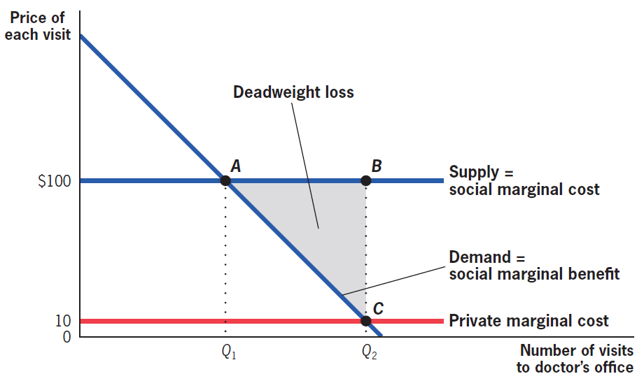
```

If a medical consultation costs $100, the individual consumes Q1, while if the *copayment* is only $10, he consumes Q2 (**moral hazard**) &mdash; but the normative effect is not obvious: without insurance, poor people (low willingness to pay) would consume fewer medical services than perhaps socially optimal `r Citep(myBib, "gruber")`


---
class: inverse, middle, center

# Education

---
class: middle
## Education

When we learn in microeconomics about government intervention, the usual justification is in solving market failures, most commonly providing **public goods** and resolving **externalities** (last two topics)

If until the beginning of the 20th century, it was true that government action was almost entirely for the provision of public goods (security, defense, infrastructure), today it is not anymore: only 5-10% of the current Brazilian government budget follows these justifications

One of the main expenditures of modern governments that is **not** a public good is education

---
class: middle

```{r, echo=FALSE, out.width = '80%', fig.align='center'}
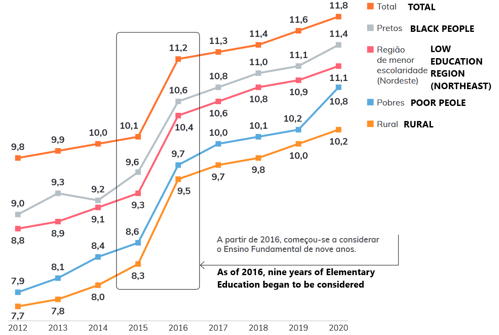
```

Years of schooling (18-29 years) have increased in Brazil, rising from 10 to 12 years of schooling in the last decade &mdash; but in a very uneven way, with blacks, Northeast people and the poor having much lower education (although the difference has been reducing) `r Citep(myBib, "pela2021anuario")`

---
class: middle

```{r, echo=FALSE, out.width = '90%'}
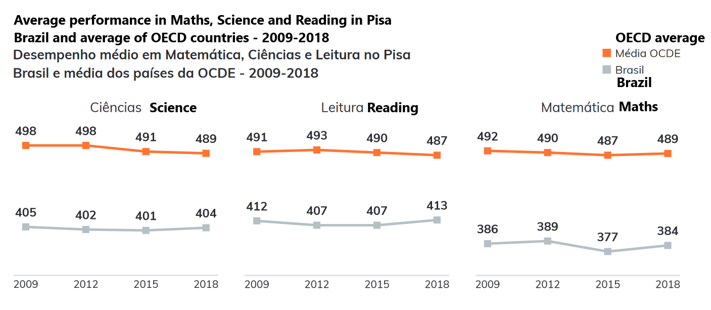
```

But Brazil still performs well below the OECD average in Pisa, with no clear convergence in this period &mdash; which suggests that this greater *amount* of study did not turn into a **quantifiable** improvement in the *quality* of learning `r Citep(myBib, "pela2021anuario")`

---
class: middle

```{r, echo=FALSE, out.width = '100%'}
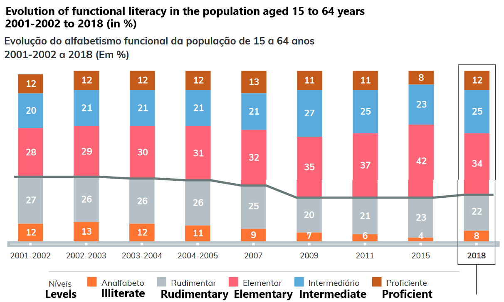
```

Brazil has almost eliminated formal illiteracy (4-8%), but functional illiteracy is still prevalent, reaching 30% of the population aged 15-64 years old &mdash; only 12% of Brazilians are considered proficient in literacy (able to write texts and interpret graphs and tables) `r Citep(myBib, "pela2021anuario")`

---
class: middle

```{r, echo=FALSE, out.width = '90%', fig.align='center'}
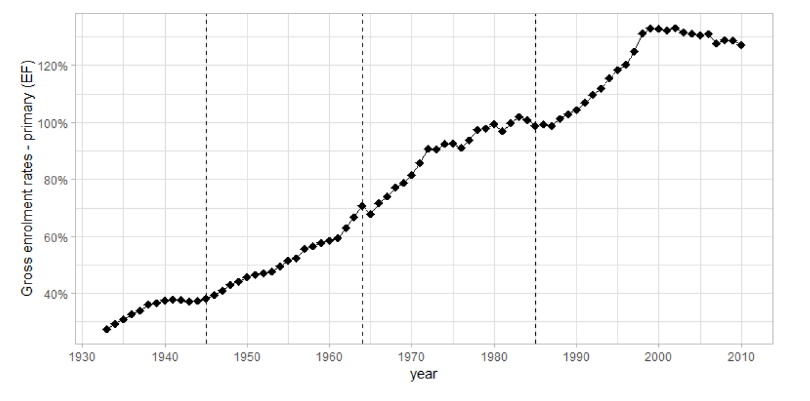
```

In Brazil, gross enrollment rates in primary education increased steadily, although very slowly, across the last 100 years, reaching universal enrollment only in the 80s &mdash; since then, gross enrollments are above 100%, representing basic education for older groups `r Citep(myBib, "kang2019political")`

---
class: middle
## Public education

Education is *excludable* and (mostly) *rival*: it is a **private good**! Even so, in most countries it is almost entirely supplied by the government

Education makes citizens more productive, which: (i) increases the productivity of colleagues; (ii) it increases the taxes they pay, a **fiscal externality** &mdash; many investments in education "pay for themselves"

*If* the worker does not receive all of their marginal product (for example, *monopsony power in the labor market*), education also generates *positive externalities*

---
class: middle
## Public education

Another *positive externality* generated by education is increasing *civic capital*. Educated people (plausibly) vote better, commit fewer crimes, have less dishonest attitudes, etc

Education involves present expenditures and future returns. People will be willing to make these investments if the NPV (certainty equivalent) is positive (*and if they act rationally*)

But if they do not have capital, they will only be able to invest with **complete markets**. In the real world, there are flaws in the credit market that can make unfeasible the education of the poorest

---
class: middle
## Public education

Education is a choice of parents for the benefit (mostly) of their children, and the family cannot always be trusted to make decisions in the best interests of their children: that is why in most countries education is **mandatory**

Since education is a normal good, rich families will always be more *willing to pay* for education than poorer families: private education acts as a force against **social mobility**

"Less economic" reason: education is a human right, a fundamental freedom or ability (Sen)


---
class: middle

```{r, echo=FALSE, out.width = '100%'}
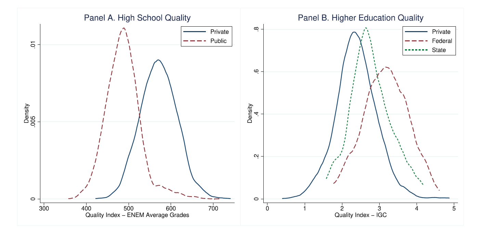
```

In Brazil, private schools are on average better than public schools for basic education, although there is significant overlap &mdash; for higher education, on the other hand, it is the opposite `r Citep(myBib, "mello2023affirmative")`

---
class: middle
## Interactions between the public and private market

Education is provided for free by the public sector and charged by the private sector &mdash; greater investment in the public sector generates **crowding out** of the private sector: in the limit, it could even make education worse

[Dinerstein & Smith (2021)](https://www.aeaweb.org/research/public-private-schools-funding-reform) estimate that in NYC $1,000 per student leads to a 6% drop in the number of private schools in the neighborhood &mdash; 1/5 of the increase in demand for public schools generates the closing of private schools, expelling students who did not want to change

One way to mitigate this problem is with the use of **educational vouchers**

---
class: middle

```{r, echo=FALSE, out.width = '90%', fig.align='center'}
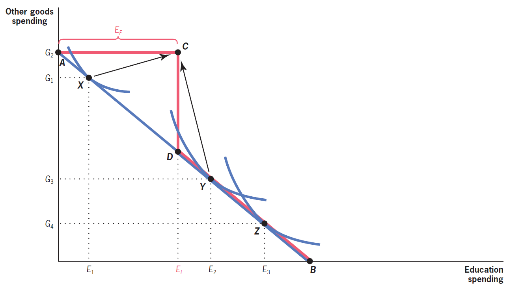
```

Entry of government supply in education: family $X$ (poor) spends almost nothing on education and increases his spending, family $Z$ (rich) does not change behavior &mdash; but the possibility of free public education makes the family $Y$ ("middle class") **reduce**  their educational spending `r Citep(myBib, "gruber")`

---
class: middle

```{r, echo=FALSE, out.width = '90%'}
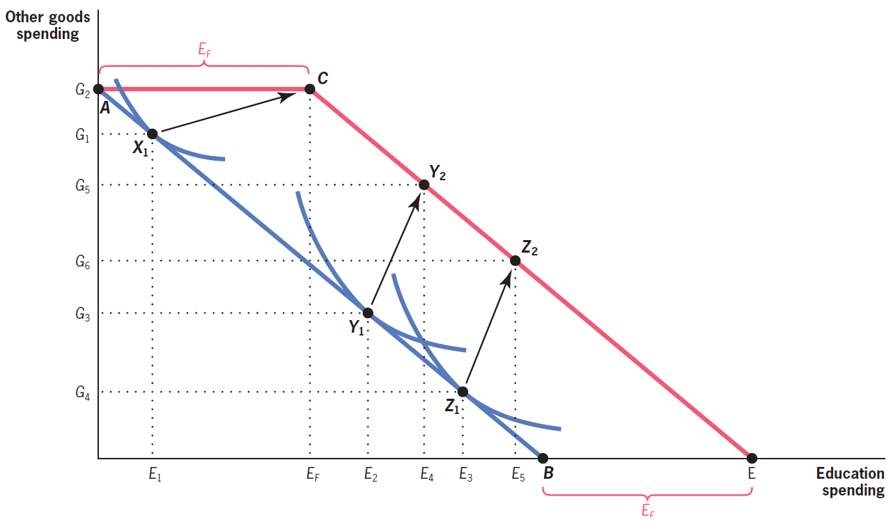
```

**Vouchers**, on the other hand, guarantee that all families (weakly) increase education consumption: poor families choose public (free) schools, middle and rich class remain in private schools, which improve the quality (and increase the price) `r Citep(myBib, "gruber")`

---
class: middle
## Vouchers

In a 2012 [panel of economists](https://www.igmchicago.org/surveys/school-vouchers/), 46% agreed that vouchers would make "most of people better" and only 6% disagreed &mdash; because vouchers increase the power of consumers' choice and generate **competition** in the education market

On the other hand, vouchers segregate students by income, skill and motivation, leaving students who stay in the public system with worse classmates and schools with less money

Vouchers also represent a subsidy for wealthy students and private schools, which is unfair (regressive) and ineffective (subsidy has little effect on Z's educational demand) &mdash; solution: vouchers for income?

---
class: middle
## Vouchers

Economies of scale in the production of education can make it more efficient for the state to be solely (or majoritily) responsible for education (**natural monopoly**) &mdash; also, families do not have a good capacity to judge the quality of education they receive

Vouchers have generated a huge and ongoing debate. A review of the empirical literature in 2017 says:
> Our assessment is that the evidence to date is **not sufficient** to warrant recommending that vouchers be adopted on a widespread basis; however, multiple positive findings support continued exploration. `r Citep(myBib, "epple2017school")`

---
class: middle

```{r, echo=FALSE, out.width = '90%'}
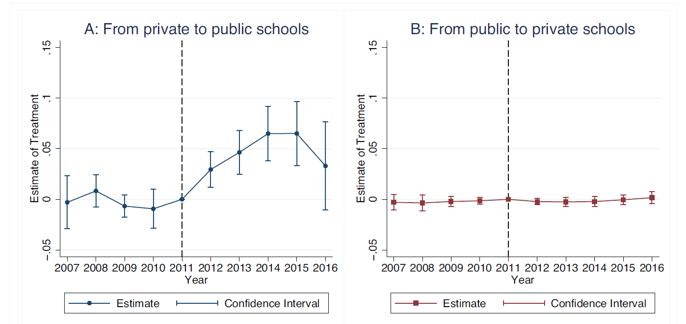
```

The introduction of public school quotas in Brazil led to a significant outflow of students from private schools to public schools, increasing this movement by 31% &mdash; these students coming from low socioeconomic background and low quality private schools `r Citep(myBib, "mello2023affirmative")`

---
class: middle
## How much to invest in education?

We have discussed so far how public money should be spent on education, but how do we decide *how much* to spend?

We can use the cost-benefit analysis that we saw in Topic 1 &mdash; calculating the costs is a direct application of that class, but what about the benefits?

The literature that discusses the benefits of educating yourself (and others) is the study of **returns to education**:  is it easy to see that people with higher education earn more, but do they earn more *because* of higher education?


---
class: middle

```{r, echo=FALSE, out.width = '90%', fig.align='center'}
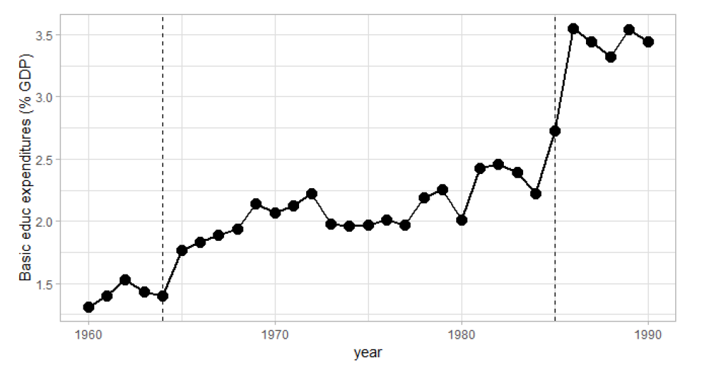
```

Education spending for basic education (primary + secondary level) as a share of GDP in Brazil remained very low during the entire dictatorship, increasing sharply and steadily after redemocratization `r Citep(myBib, "kang2019political")`


---
class: middle

```{r, echo=FALSE, out.width = '100%', fig.align='center'}
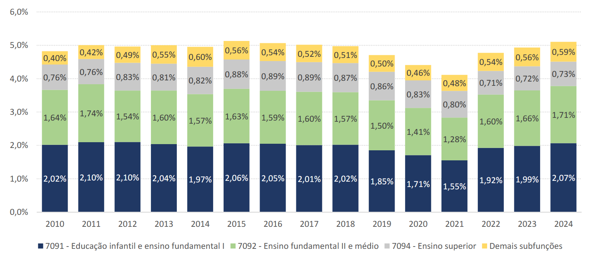
```

Nowadays the Brazilian government spends about 5% of GDP for education: 2% for kindergarten and primary school, 1.7% for middle school and high school and 0.7% of GDP for higher education [[Boletim COFOG/2024]](https://thot-arquivos.tesouro.gov.br/publicacao/53401)

---
class: middle

```{r, echo=FALSE, out.width = '90%'}
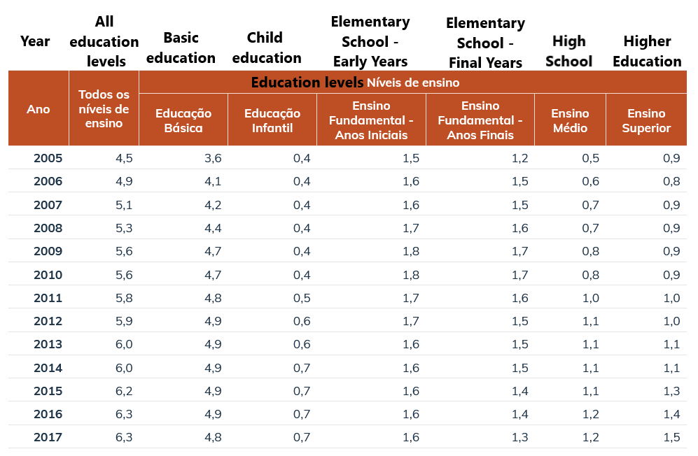
```

Public expenditure on education in Brazil as a percentage of GDP grew by 40% since 2005, with growth focused on early childhood education and especially high school (240%) &mdash; the country spends on higher education a proportion of GDP only lower than for the initial years of elementary school, although the number of students is many times smaller `r Citep(myBib, "pela2021anuario")`

---
class: middle

```{r, echo=FALSE, out.width = '90%'}
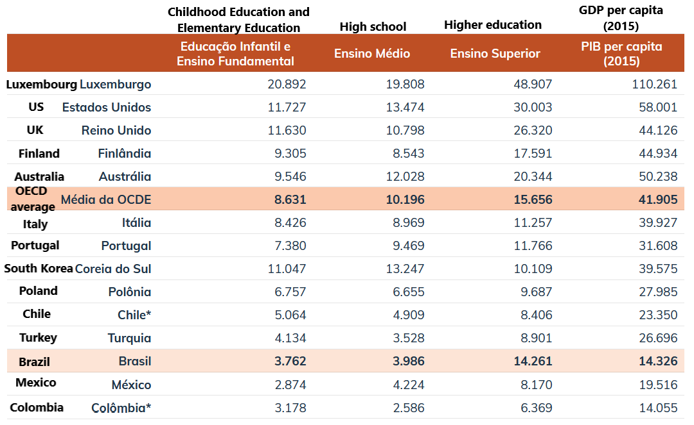
```

Nowadays, Brazil spends a considerable proportion of its GDP on education. Still, as a poor country, the expenditure per student in US$ PPP is more than $2\times$  lower than the OECD average &mdash; except for higher education, which is at the same level `r Citep(myBib, "pela2021anuario")`

---
class: middle
## The value of education

Two theories of the value of education: (i) it increases the productivity of individuals (**human capital**); (ii) it is a way of **signaling** their ability

As it is more costly for less intelligent people to learn calculus, firms require calculus in the interview even if it is not useful at work, to separate (**screening**) "high types" from "low types"

There are also general *equilibrium effects*: the salary of doctors will be higher the rarer they are in society

---
class: middle

```{r, echo=FALSE, out.width = '85%'}
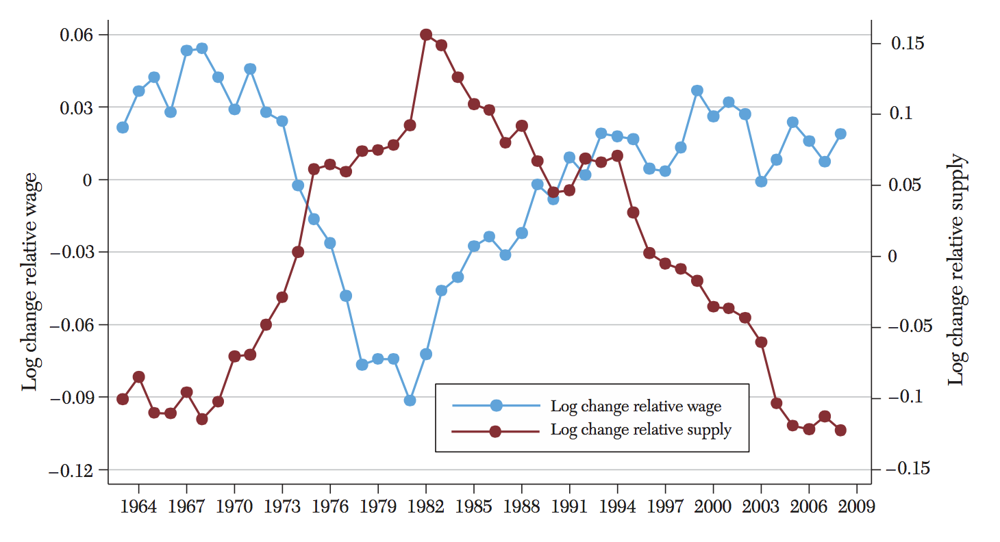
```

In the US, the increase in the supply of workers with higher education in relation to those with secondary education in the 70s and 80s generated a relative decrease in their salary, with the opposite trend occurring in the following decades: private gains of education depend on **general equilibrium** conditions (WID)


---
class: middle

```{r, echo=FALSE, out.width = '80%', fig.align='center'}
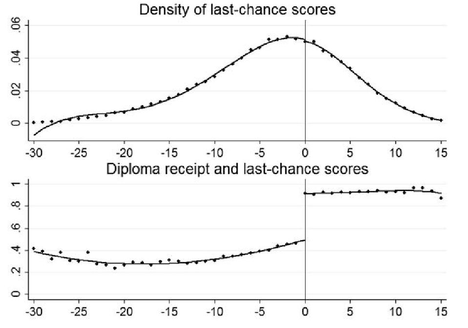
```

In the US, students must pass a test to graduate from high school. `r Citep(myBib, "clark2014signaling")` use it to test theories of *human capital* value vs *signaling* in education. Students who barely pass the test are much more likely to leave school with a diploma…

---
class: middle

```{r, echo=FALSE, out.width = '80%', fig.align='center'}
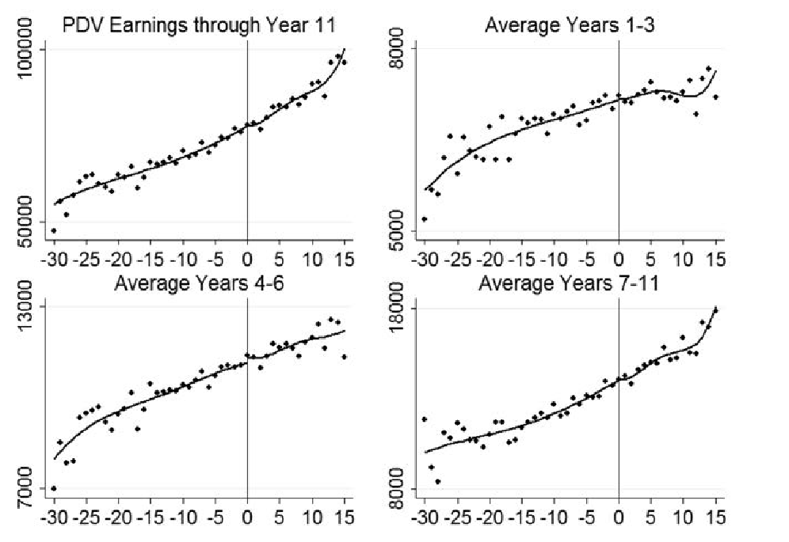
```

...but the diploma has no effect on future income, either in the short or long run, contrary to the signaling theory &mdash; the income from education seems to actually come from gains in acquired skills `r Citep(myBib, "clark2014signaling")`

---
class: middle

```{r, echo=FALSE, out.width = '80%', fig.align='center'}
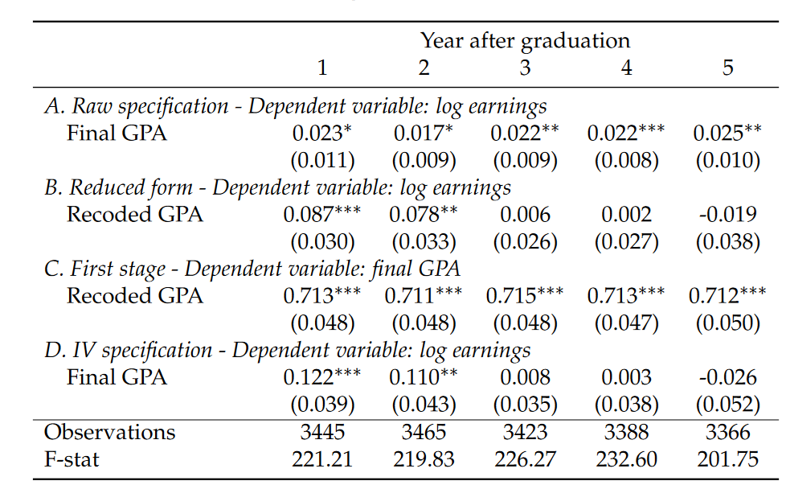
```

A reform that changed the algorithm for calculating GPAs in Sweden led to students with the same ability graduating with different GPAs &mdash; this higher grade on the diploma leads to higher incomes in years 1 and 2, but this effect fades with time, while the effect of the "true GPA" (knowledge) endures `r Citep(myBib, "hansen2024grades")` 

---
class: middle
## Higher Education

Basic education in almost all countries is provided almost entirely by the state &mdash; in Brazil, in SP around 80%, and in other states even more `r Citep(myBib, "pela2021anuario")`

The same applies to technical education, which now accounts for 20% of high school enrollment in Brazil

On the other hand, Higher Education is usually mainly private &mdash; in Brazil, in 2019, 82% of admissions to Higher Education were at private institutions, a higher percentage than even in the US `r Citep(myBib, "da2019notas")`

---
class: middle

```{r, echo=FALSE, out.width="70%", fig.align='center'}
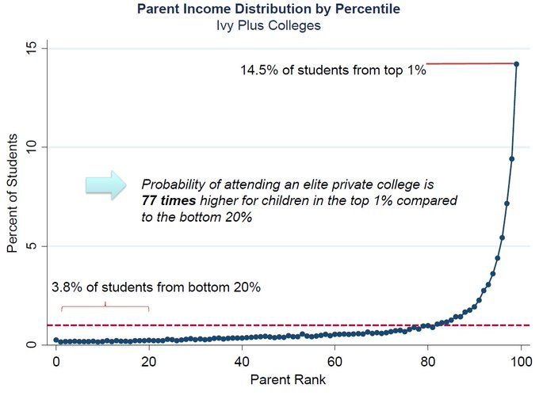
```

In United States, elite colleges are extremely concentrated in income: 15% of ivy league+ students' parents come from the top 1%, a 77x higher chance of attending elite schools than the bottom 20%, which account for only 3.8% of students

---
class: middle
## Private higher education

The externalities of HE are plausibly smaller, since the *private* return to higher education is high: the average salary of those who have completed higher education is more than twice the national average salary

Furthermore, HE does not increase *civic capital* as much as basic education (studying economics even plausibly decreases it). The family conflict argument is also less convincing, as college students are adults.

Even without externalities, it remains the problem of **credit market** and **social justice failures**: government intervention in higher education generally goes in the direction of addressing these problems

---
class: middle
## Government intervention in Brazil

In Brazil, the government establishes FIES, which **finances** private university courses at subsidized interest (zero for families up to 3 mw/person), offering around 200,000 contracts per year

As in the US, the default rate of the program is enormous: 52% in 2021 &mdash; education is a risky investment (although the expected present value is quite high) and students rarely have collateral

The government also **directly manages** 108 universities (63 federal, 40 state, and 5 municipal) and 143 colleges, accounting for 559,000 admissions per year

---
class: middle
## Government intervention in Brazil

PROUNI offers 140,000 **full scholarships** in private universities for students with income up to 1.5 mw/person (full) and 3 mw/person (50%) &mdash; note that the 1st threshold places the family in the richest 25% and the 2nd in the richest 10% of the country

In total, there are 3.6 million new entrants and 1.2 million graduate students in Brazilian higher education per year, such that the number of HE students represents 48.6% of the population aged 18-24

But only 23.8% of this aged 18-24 population is in universities, a percentage that has increased by 50% in the last 8 years &mdash; 50% in the richest quartile and 13.2% in the poorest quartile `r Citep(myBib, "pela2021anuario")`

---
class: middle

```{r, echo=FALSE, out.width="90%"}
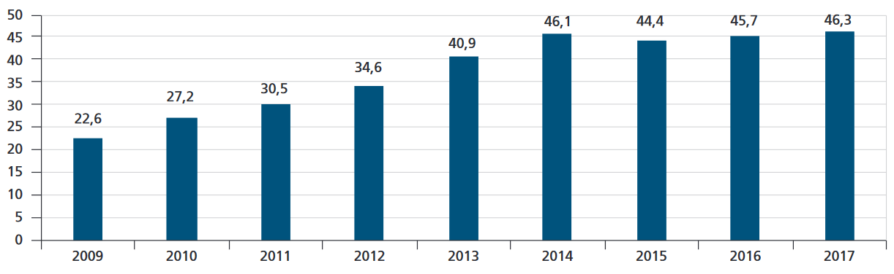
```

The proportion of private higher education enrollments with some type of scholarship or funding has doubled since 2009 to almost half of enrollments: even in private higher education, the government intervention is extensive (Radar IPEA/2018)

---
class: middle

```{r, echo=FALSE, out.width="90%"}
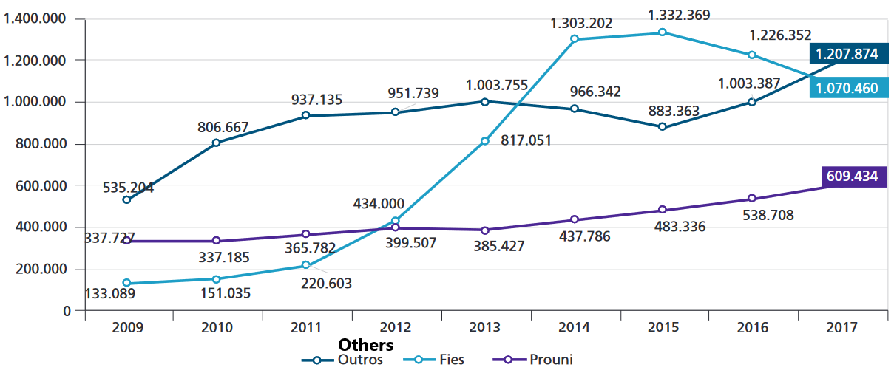
```

PROUNI doubled in 8 years, but most of the increase in the proportion of enrollments with scholarships or student loans came from FIES, which between 2011-2013 jumped 6x (Radar IPEA/2018)

---
class: middle
## Quotas

Racial quotas at universities were introduced in 2003 at UERJ &mdash; 20% for public schools, 20% for black and indigenous people, all with income limits

Quotas expanded across the country over the decade, reaching 129 HEIs, 51 of them had racial quotas by 2012

The judgment of the constitutionality of quotas by the STF (Supreme Federal Court) boosted the Lei das Cotas (Quota Law) in 2012, which solidified and expanded these quotas for all federal universities: 50% for public schools, 50% of which are low-income with racial quotas

---
class: middle

```{r, echo=FALSE, out.width="100%"}
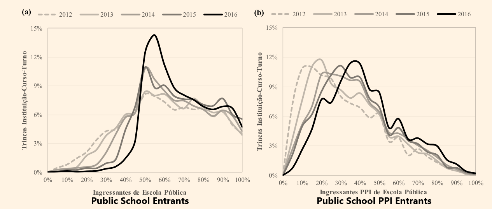
```

The proportion of public school students (a) and PPI (Black, Brown, and Indigenous) (b) in federal institutions of higher education &mdash; the effect of the implementation of the Lei das Cotas (Quota Law) between 2012 and 2016, is evident in eliminating the lower tail of distribution `r Citep(myBib, "senkevics2019perfil")`

---
class: middle

```{r, echo=FALSE, out.width="90%"}
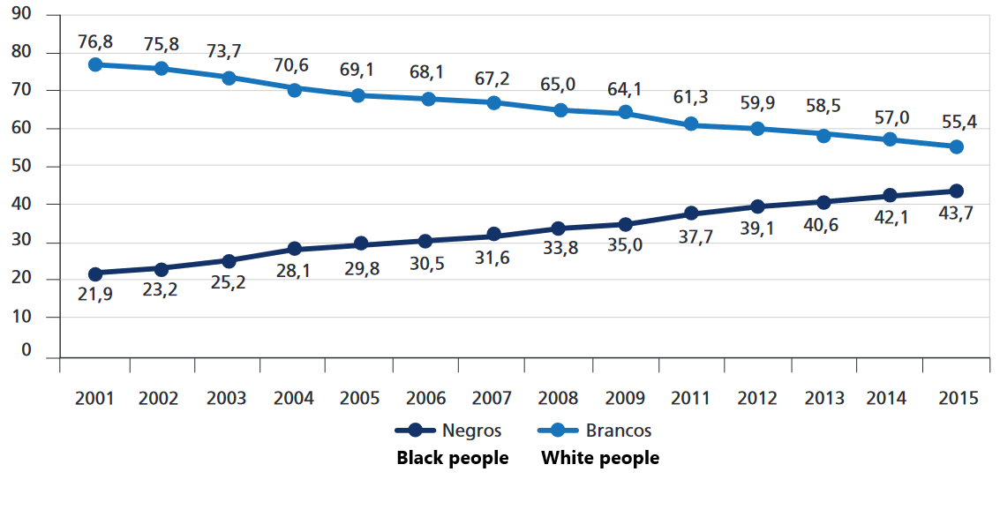
```

In 2001, 3/4 of undergraduates were white, while only 1 in 5 were black, a percentage that doubled in 14 years, and today 43% of college students are black or brown (while this group represents 56% of the population) &mdash; but it is unlikely that much of this trend is due to quotas (TD2569/IPEA)

---
class: middle

```{r, echo=FALSE, fig.show="hold", out.width="90%"}
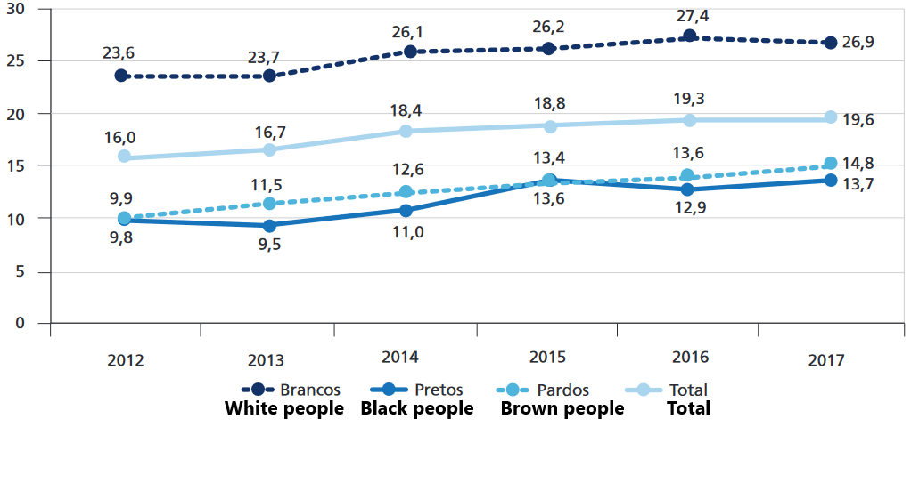
```

Although racial inequality has declined, for white students aged 18-24 attending higher education is still double as likely as for black students (TD2569/IPEA)

---
class: middle

```{r, echo=FALSE, out.width = '90%'}
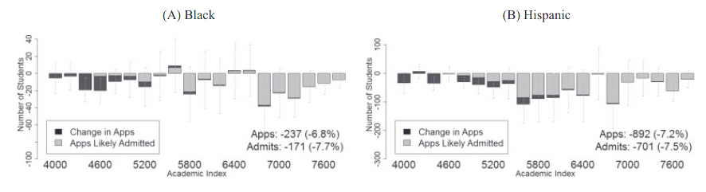
```

**Empirical evidence**: the ban on affirmative action at The University of California in 1998 decreased the number of black and Hispanic applicants, even among those who performed so well academically that they would almost certainly get into college `r Citep(myBib, "bleemer2022affirmative")`

---
class: middle

```{r, echo=FALSE, out.width = '90%'}
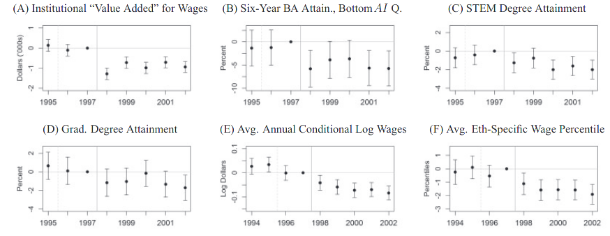
```

Individuals from affected minorities attended more community colleges and graduated less, having persistent loss of future income `r Citep(myBib, "bleemer2022affirmative")` &mdash; `r Citep(myBib, "ribeiro2016affirmative")` finds similar results for the effect of quotas at UERJ in the OAB exam (Ordem dos Advogados do Brasil - Order of Attorneys of Brazil)

---
class:middle
# References
<small>
```{r refs, echo=FALSE, results="asis"}
PrintBibliography(myBib, start=1, end=5)
```
</small>

---
class:middle
# References
<small>
```{r refs2, echo=FALSE, results="asis"}
PrintBibliography(myBib, start=6, end=10)
```
</small>

---
class:middle
# References
<small>
```{r refs3, echo=FALSE, results="asis"}
PrintBibliography(myBib, start=11)
```
</small>

<!-- --- -->
<!-- class: middle -->

<!-- ```{r, echo=FALSE, fig.show="hold", out.width="50%"} -->
<!-- 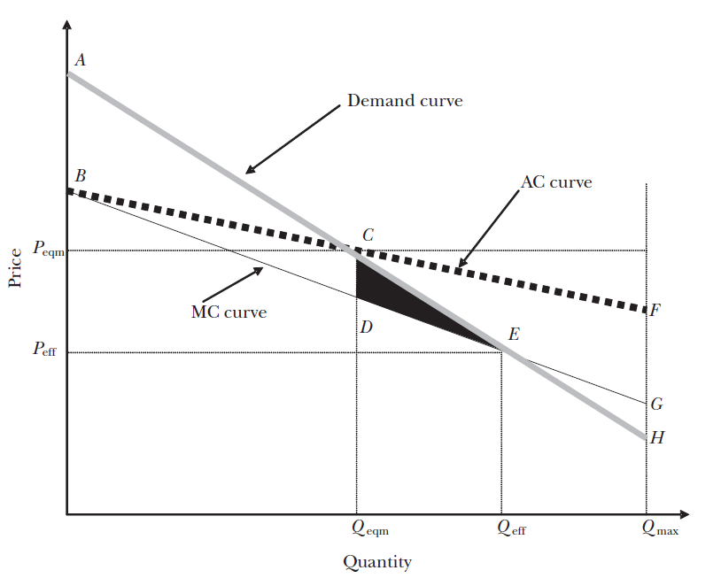 -->
<!-- 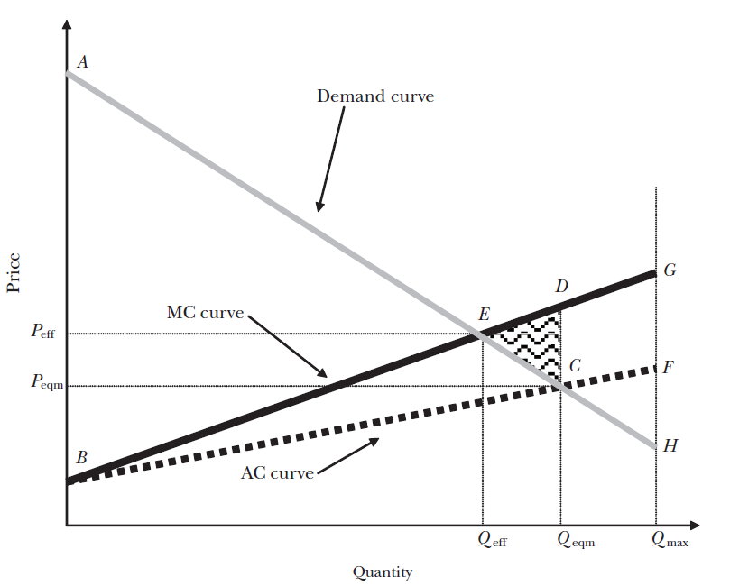 -->
<!-- ``` -->

<!-- Extensões ao "modelo de livro-texto": (a) com custo de administração provisão a todos já pode não ser eficiente; e (b) **seleção vantajosa** `r Citep(myBib, "einav")` -->

<!-- --- -->
<!-- class: middle -->
<!-- ## Risk and insurance -->

<!-- Consider an adverse event with probability $q$ which implies an economic cost $d$. The individual with wealth $W$ can hire a premium insurance $p$ that pays $b$  if the adverse event occurs -->

<!-- Then the expected utility of the individual is: $$\mathbb{E}U = (1 - q) u(W - p) + q u(W - p + b - d)$$ -->

<!-- The expected profit of the (risk neutral) insurer is: $\mathbb{E}\Pi = p - qb$ -->

<!-- If there is perfect competition with free entry, we have $\mathbb{E}\Pi = 0$, that is $p = qb \iff b = p/q$ (namely, the *actuarially fair premium*) -->


<!-- --- -->
<!-- class: middle -->
<!-- ## Risk and insurance -->

<!-- Under the actuarially fair premium, the agent's problem becomes $$ \max_p \mathbb{E}U = (1 - q) u\left(W - p\right) + q u\left(W - p + \frac{p}{q} - d\right)$$ -->

<!-- With FOC $d\mathbb{E}U/dp = 0$, i.e., $$- (1 - q) u^{\prime}\left(W - p\right) + q\left[ \frac{1}{q} - 1\right] u^{\prime} \left(W - p + \frac{p}{q} - d \right) = 0$$ -->

<!-- That is, the consumer **smooths his consumption** between the states of nature, fully protecting himself from risk: $u^{\prime}\left(W - p\right) = u^{\prime} \left(W - p + p/q - d \right)$, which is only possible if $p/q = d$ -->