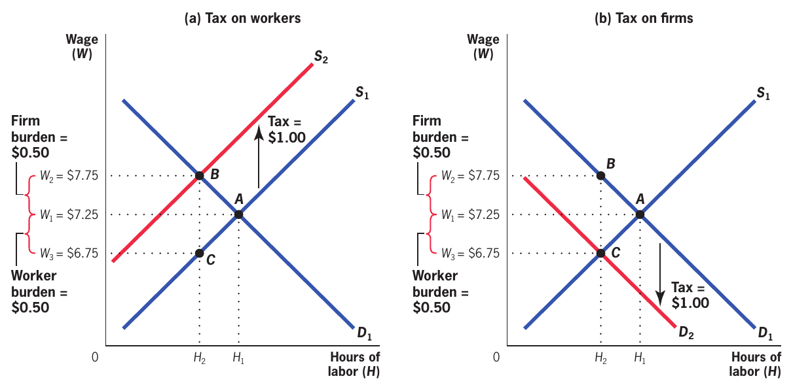
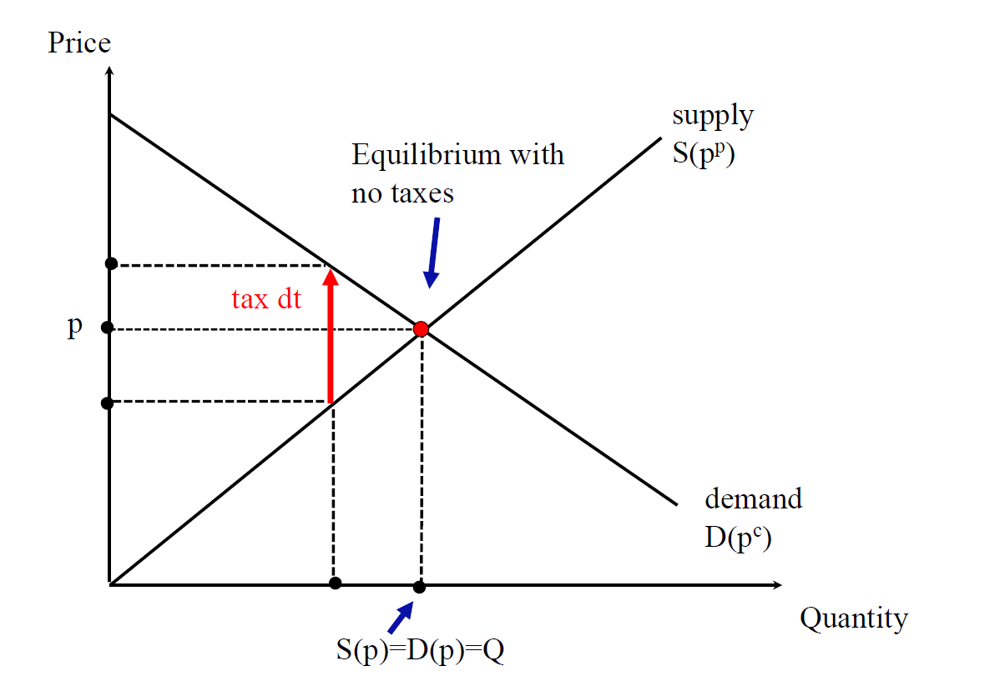
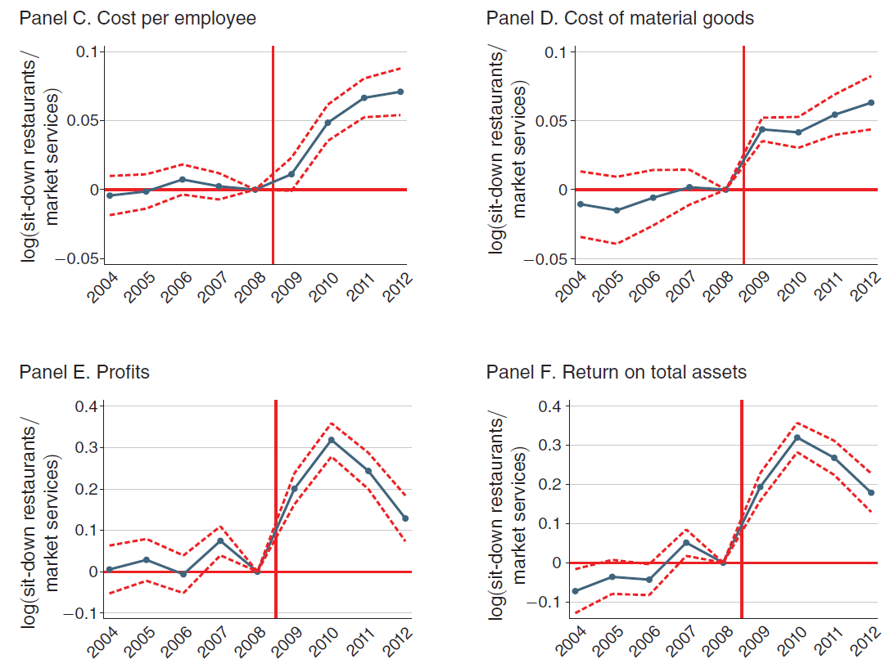
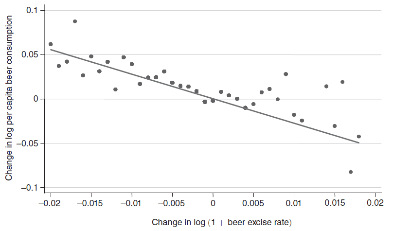
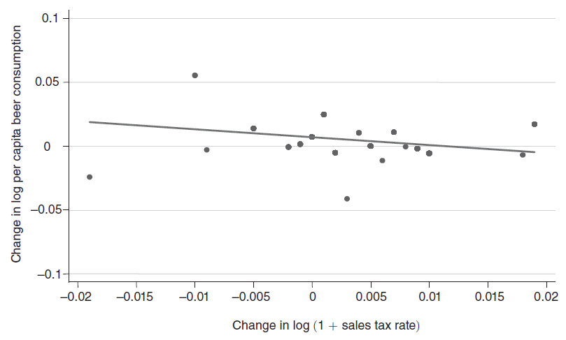
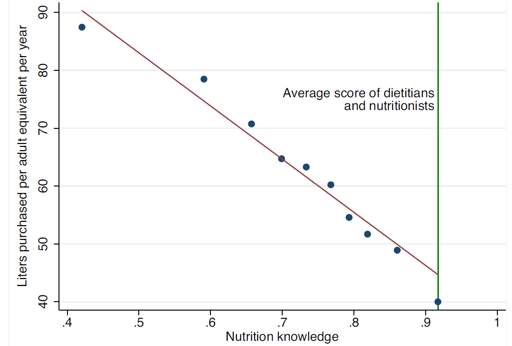
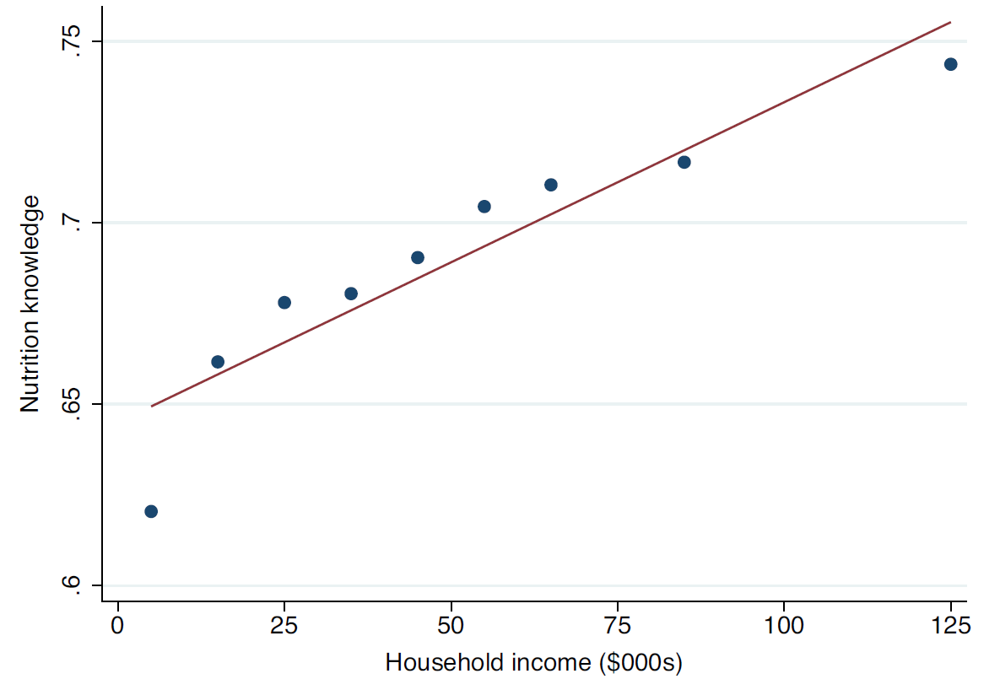
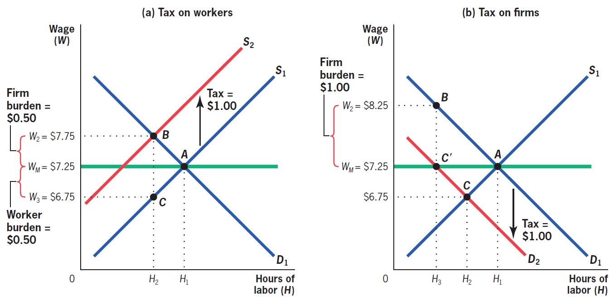

class: inverse, middle, center

```{r, load_refs, include=FALSE, cache=FALSE}
library(RefManageR)
BibOptions(check.entries = FALSE,
           bib.style = "alphabetic",
           cite.style = "alphabetic",
           style = "markdown",
           hyperlink = FALSE,
           dashed = FALSE)
myBib <- ReadBib("./esp_bib.bib", check = FALSE)
```

# Tax incidence

---
class: middle
## Equity implications of taxation

To understand whether a tax increases or reduces inequality, we have to understand who *ultimately* pays for it &mdash; this is the study of **tax incidence**

Of course, the law determines who formally pays the tax, but the market adjusts pre-tax and post-tax prices according to the *behavioral reaction* of consumers and producers

Therefore, even if a payroll tax is paid by the company, if it reduces the demand wage in response, then who is actually paying for the tax is the worker

---
class: middle

```{r, echo=FALSE, out.width = '50%', fig.align='center'}
knitr::include_graphics("figs/trad_iptu.png")
```

We can joke that the author of this meme clearly did not study economics, but the question is important: the tax on property is for taxing wealth, but is it the wealthy person the one who **actually** pays the property tax?

---
class: middle
## Incidence

The first rule of incidence is that *under the micro assumptions*, **statutory incidence** does not matter for the **economic incidence** of taxes

If who disburses money is the consumer, the firm, or the worker, it should not matter how the market price adjusts to the tax, since it does not affect economic incentives &mdash; and these depend only on net and gross prices

But `r Citep(myBib, "saez2012earnings")` show that in Greece, changes in the payroll tax affect only those who actually pay for it (that is, the economic incidence equals the statutory incidence) &mdash; there is another example further on in which this rule fails

---
class: middle
## Incidence

Important, but sometimes overlooked, is that **tax shifting takes place through the market** &mdash; it is not (in competitive markets) an intentional decision by agents to shift the tax elsewhere, but the effects of market changes in the supply and demand curves

If the price (net of the tax) does not change with the tax introduction, then the real incidence is equal to the formal incidence

When we analyze not only consumers and producers of a specific good, but also other *substitute and complementary goods* and *factors of production*, we do a **general equilibrium incidence analysis**

---
class: middle
## Partial equilibrium incidence

Even so, we will focus on the *partial equilibrium incidence*, because it is more intuitive and it generally provides us a good approximation

Consider an initial tax situation $t = 0$, and add a fixed (infinitesimal) tax to be paid by the consumer $dt$ &mdash; if before the equilibrium condition was $S(p) = D(p)$, now we add a **tax wedge** to the market

The market is still in equilibrium! But in the equilibrium with taxes, supply $S$ equals demand $D$ *with different prices*: the condition now becomes: $$S(p^p) = D(p^c) = D(p^p + dt)$$ 

---
class: middle

```{r, echo=FALSE, out.width = '90%', fig.align='center'}

```

A tax that burdens the consumer (in the labor market, the firm, panel b) shifts the demand curve down, as now the good is 1$ "less desirable" &mdash; if it burdens the supplier (in labor market, the worker, panel a), the tax shifts the supply curve up, since now the marginal cost is $1 higher

---
class: middle

```{r, echo=FALSE, out.width = '70%', fig.align = 'center'}
knitr::include_graphics("figs/eae0310-9-1.png")
```

Partial equilibrium incidence &mdash; without tax, $p^p = p^c = p$ (Saez) 

---
class: middle

```{r, echo=FALSE, out.width = '85%', fig.align = 'center'}

```

On the other hand, the tax creates a **tax wedge**: now $p^c = p^p + dt > p^p$  (Saez) 

---
class: middle

```{r, echo=FALSE, out.width = '85%', fig.align = 'center'}
knitr::include_graphics("figs/eae0310-9-3.png")
```

The reduction in consumption makes firms operate in regions with lower MC, and eventually the price of the producer drops in response (Saez) 

---
class: middle
## Partial equilibrium incidence

The market equilibrium condition is $S(p^p) = D(p^p + dt)$. Differentiating both sides in relation to $t$:

$$S^{\prime}(p^p)\frac{dp^p}{dt} = D^{\prime}(p^p + dt)\left(1 + \frac{dp^p}{dt}\right)$$

$$\Rightarrow \frac{dp^p}{dt} \left[ S^{\prime}(p^p) - D^{\prime}(p^p + dt)  \right] = D^{\prime}(p^p + dt)$$
$$\therefore \ \frac{dp^p}{dt} = \frac{D^{\prime}(p^p + dt)}{S^{\prime}(p^p) - D^{\prime}(p^p + dt)}$$
---
class: middle
## Partial equilibrium incidence

Elasticities are very useful in public sector economics because they are usually *sufficient statistics* for the behavior of producers and consumers (in competitive markets)

Defining $p^c = p^p + dt$, remember that $\epsilon_S = \frac{p^p}{S(p^p)} S^{\prime}(p^p)$ and: $$\epsilon_D = \frac{p^c}{D(p^c)} D^{\prime}(p^c) = \frac{p^p + dt}{D(p^p + dt)} D^{\prime}(p^p + dt)$$

As $dt$ is small, we can multiply the top and bottom numbers by $p/Q$: 
$$\frac{dp^p}{dt} = \frac{D^{\prime}(p^p + dt) p/D(p)}{S^{\prime}(p^p)p/S(p) - D^{\prime}(p^p + dt)p/D(p)} = \frac{\epsilon_D}{\epsilon_S - \epsilon_D}$$

---
class: middle
## Partial equilibrium incidence

Note that given $\frac{dp^p}{dt} = \frac{\epsilon_D}{\epsilon_S - \epsilon_D}$ and $p^c = p^p + dt$, we have: $$-1 \leq \frac{dp^p}{dt} \leq 0 \text{ and  } \frac{dp^c}{dt} = \frac{d(p^p + dt)}{dt} = 1 + \frac{dp^p}{dt} \in [0, 1]$$

Consumers bear the full incidence of the tax when $dp^p/dt = 0$, and therefore $dp^c/dt = 1$, which happens if $\epsilon_D = 0$ or $\epsilon_S = \infty$

Producers bear all the incidence of the tax when $dp^p/dt = -1$,  that is, if $\epsilon_D = - \infty$ or $\epsilon_S = 0$

General rule: **the more inelastic side of the market bears most of the taxes**

---
class: middle
## Pass-through

The change in the price to the consumer caused by the tax is called tax **pass-through** rate: $$\rho \equiv dp^c/dt = 1 + dp^p/dt$$

It is believed that in the long run most industries operate at constant marginal costs (due to constant returns to scale): an (almost) infinitely elastic supply curve

It implies a **pass-through** rate of $\approx 1$: consumption taxes would be borne almost entirely by consumers &mdash; empirical evidence is consistent with pass-throughs between 0.8-1.0 for most taxes on consumer goods

---
class: middle

```{r, echo=FALSE, fig.show="hold", out.width="50%"}
knitr::include_graphics("figs/eae0310-9-4.png")
knitr::include_graphics("figs/eae0310-9-4b.png")
```

When demand is infinitely inelastic, the pass-through rate $dp^c/dt$ is 1 (**full shifting**). When it is infinitely elastic, the incidence is all on the producer `r Citep(myBib, "gruber")` 

---
class: middle

```{r, echo=FALSE, out.width = '85%'}
knitr::include_graphics("figs/eae0310-9-5.png")
```

And the opposite occurs with the supply curve: the more elastic, the greater the pass-through `r Citep(myBib, "gruber")` 

---
class: middle
## Incidence on competitive markets 

*In competitive markets* we can approximate incidence by ignoring the **excess burden** (it is in *second order*) when calculating the welfare cost for consumers and producers

Although important (and the topic of next week), the excess burden is relatively small: Harberger (1959) estimated the deadweight loss of corporate taxation at ~8% of revenue; estimates for indirect taxes are similar (3-5%)

Thus, the loss of consumer surplus becomes $\rho dt \cdot Q$ (which $\rho$ is the **pass-through**) and the loss from the producer $(1 - \rho)dt \cdot Q$ &mdash; both add up to (approximately) the government revenue $R(dt) = Qdt$

---
class: middle
## Monopoly incidence

When there is some prior imperfection, monopoly power, or initial tax, **the deadweight loss is no longer negligible**: so the loss of consumer and producer surplus **adds up** to more than the government revenue

In fact, the incidence on the consumer continues to be $\rho$, because it is the increase in the price that he pays, $dp^c/dt$ &mdash; but now the incidence on the producer is $1$: the monopolist loses an amount equal to *all* government revenue `r Citep(myBib, "weyl2013pass")`  

Perhaps, it seems counterintuitive that the greater the market power, the more the incidence is on the producer &mdash;  but note that *the greater the surplus, the more room there is for the tax to fall on this side of the market*

---
class: middle
## Monopoly incidence

Another important characteristic about incidence in non-competitive markets is that *the pass-through can be greater than one*

In monopoly, see that $MR = p + \Delta p \cdot Q = p \left(1 + \frac{\Delta p}{p}Q \right)$, we have:

$$MR = p \left( 1 + \frac{1}{\epsilon_D}\right) = MC \Rightarrow p = \frac{MC + dt}{\left( 1 + \frac{1}{\epsilon_D}\right)}$$
The tax can be understood as an increase in marginal cost, which is strengthened by the monopoly **mark-up**: if $\epsilon_D = -2$, for example, $p$ increases by $2dt$

---
class: middle
## General equilibrium incidence

If the partial equilibrium analysis gives us a good intuition for tax incidence, it can be misleading if we do not consider the *general equilibrium effects* of taxation

A tax on beer sales affects the prices not only of beer, but also of substitute alcoholic drinks and input materials, as well as also burdens the capital and labor employed in the sector
 
Imagine a municipal tax on restaurants: if the demand is infinitely elastic, restaurants pay all the tax &mdash; but restaurants cannot pay taxes, *only people pay taxes!*

---
class: middle
## General equilibrium incidence

When we say that "restaurants bear the tax", in reality, we mean that *the factors of production* employed in production by restaurants bear the taxes

If the labor supply for restaurants is infinitely elastic and short-term capital infinitely inelastic (since invested capital is not convertible), then the incidence is all on restaurant owners

If we have several goods, the incidence will also depend on how *intensive* each factor is used in the production of the taxed goods (in relation to others)

---
class: middle

```{r, echo=FALSE, out.width = '50%', fig.align='center'}
knitr::include_graphics("figs/eae0310-9-7.png")
```

`r Citep(myBib, "benzarti2019really")` analyzes the effect of a VAT cut in France of 14 p.p., finding a **pass-through** rate of 9,7%, which is the opposite of what we would expect given the argument that the incidence of consumer taxes is almost entirely on the consumer &mdash; there is evidence of *asymmetric incidence* of tax increases and decreases, at least in the short/medium term

---
class: middle

```{r, echo=FALSE, out.width = '85%'}

```

They find an incidence of 19% on wages, 60% on profit, 13% on the cost of raw materials, and only 8% was reverted to a reduction in consumer prices `r Citep(myBib, "benzarti2019really")` 

---
class: middle

```{r, echo=FALSE, out.width = '90%'}
knitr::include_graphics("figs/eae0310-4-2.png")
```

In the real world, economic incidence often *depends* on statutory incidence, due to **bounded rationality**: in the US, taxes generally "appear" only in the cash register &mdash; in an experiment, `r Citep(myBib, "chetty2009salience")` found that compared to appearing on the price tag, the tax "in the cash register" only has 35% **salience**

---
class: middle

```{r, echo=FALSE, fig.show="hold", out.width="45%"}


```

In the same way, at state level, increases in the *excise tax*, which appears on the price tag, are related to drops in beer consumption, but increases in *sales tax*, which does not appear (only in the cash register) much less `r Citep(myBib, "chetty2009salience")`

---
class: inverse, middle, center

# Externalities and internalities

---
class: middle
## Externalities

*In the perfectly competitive market*, the interests of the producer and society are completely synchronized (*invisible hand*)

> It is not from the benevolence of the butcher, the brewer, or the baker, that we expect our dinner, but from their regard to their own interest... (Smith)

The individual marginal cost of production (MC) is the **marginal social cost** and the marginal benefit of the firm (the given price) is the **marginal social benefit**

---
class: middle
## Externalities

This is what is behind the 1st FTWE: each agent maximizing his social problem does the same as what a *benevolent dictator* would do, because his individual incentives are the same as the social ones

A *market failure* is any kind of "wedge" between individual and social cost or benefit &mdash; which invalidates the 1st FTWE 

For example, when the production process of a firm reduces the welfare of others (pollution) and does not compensate them for it, it is generating **negative externalities** in production

---
class: middle

```{r, echo=FALSE, out.width = '60%'}
knitr::include_graphics("figs/eae0310-2-1.png")
```

Negative externalities make the marginal private cost be less than the marginal social cost, leading to overproduction and deadweight loss &mdash;  the market equilibrium is not **Pareto efficient** `r Citep(myBib, "gruber")`

---
class: middle
## Tobacco smoking

Cigarettes kill more than 8 million people a year worldwide, which 1,2 million of them are passive smokers (WTO)

In Brazil, there are 161,000 preventable deaths per year: 37,000 COPD, 33,000 heart disease, 24,000 lung cancer, 25,000 other cancers, 12,000 pneumonia and 10,000 stroke `r Citep(myBib, "INC")` &mdash; but this is not an externality!

In reality, if a smoker dies early and ceases to receive retirement pension, then this is a *positive* fiscal externality to the rest of the country (Brazil has a state pension for survivors, which counterbalances this effect)

---
class: middle

```{r, echo=FALSE, out.width = '75%', fig.align="center"}
knitr::include_graphics("figs/trad_eae0310-2-4.png")
```

In 1989, almost half of men and more than 1/4 of women in Brazil smoked &mdash; since then, that number has halved, driven by cultural changes, but also by various public policies focused on the issue `r Citep(myBib, "INC")`

---
class: middle
## Quantifying externalities

It is estimated that tobacco smoking costs R$ 70  billion in medical treatments and generates losses of R$ 42 billion in potential years of life lost &mdash; *is that an externality*?

In 2018, Brazil consumed 106 billion (!!) of cigarettes (IBOPE), so even if only 50% of the cost mentioned above is an externality, this gives R$ 10 of externalities per pack (with 20)

Although in Brazil, almost 80% of the cigarette price is tax, which includes ICMS, IPI and, a fixed tax $\approx$ 5 reais per packet of tax, it seems that the taxation is still lower than necessary to correct externalities

---
class: middle
## Quantifying externalities

That was a back-of-the-envelope calculation &mdash; more careful estimates exist for the US: `r Citep(myBib, "gruber2001tobacco")` estimates that in the US the externality is 52¢, half the tax there (see also `r Citep(myBib, "chaloupka2000economics")`)

`r Citep(myBib, "manning1989taxes")` makes a discussion on how to calculate these externalities: 27¢ *positive* externality from premature deaths: 3¢ from nursing homes and 24¢ from retirement pension &mdash; negative externalities: medical costs 26¢, sick leave 3¢, group health insurance 5¢, fires 2¢

As externalities occur in the future, we need to take into account the discount rate (above, 5%)

---
class: middle
## Quantifying externalities

If the health care costs paid by the smoker and even their death might not generate externalities (but perhaps *internalities*), for **passive smokers** (ETS) they most likely do

The most affected by ETS is the family: we price the externality at 19¢ for spouse mortality, 19¢ for fetus death, 3¢ for infant mortality, family members killed in fire 9¢, using an estimate of the *value of statistical life*

But if the smoker takes into account the utility of the family in his decision to smoke (questionable), then the externality is *internalized*, and it should not be taken into account in public policy

---
class: middle

```{r, echo=FALSE, out.width = '100%'}
knitr::include_graphics("figs/eae0310-2-5.png")
```

---
class: middle
## Taxing cigarette

One problem is that smoking is very concentrated among the poorest &mdash; cigarette taxation is very **regressive**

Another problem is **tax evasion**: contraband accounts for 57% of cigarettes consumed in the country (IBOPE)

So, as much as demand for cigarettes is inelastic (it is estimated that around $-0.4$), the elasticity of demand for legal cigarettes can be quite high &mdash; making taxation ineffective and causing high deadweight loss

---
class: middle
## Internalities

As we have seen, when consumers are totally *rational* and know the effects of smoking, 161,000 preventable deaths per year is not an economic argument for state intervention

And if it is an addiction? For an optimizing agent, this is not a problem: he chose to start smoking in an **intertemporal optimization** knowing that cigarettes are addictive (*rational addiction*)

In the past, any state attempt to prevent "bad decisions" was considered (pejoratively) a kind of paternalism &mdash; nowadays, it is more popular the view that there is a role for the state to correct decision errors (**internalities**)

---
class: middle
## Internalities

In the US, of all adults who smoke, 75% start smoking before age 19 &mdash; an age plausibly most vulnerable to marketing and social pressures

A survey asked teenage smokers if they would be smoking in 5 years and then checked back 5 years later: from those who said they would have quit by then, 74% were still smoking &mdash; evidence against the *rational addiction* hypothesis

8 out of 10 smokers want to quit, and the average smoker tries to quit once every 8 months  &mdash; **self-control problem**

---
class: middle
## Internalities

**Hyperbolic Discount:** People prefer $100 today to $200 in 2 years, but they do *not* prefer $100 in 6 years to $200 in 8 years: but for a rational agent these are the same decision problem!

Another evidence is the demand for **commitment instruments** &mdash; for example, compulsory savings or annual gym membership

If smokers make mistakes when young and would like to quit but cannot, then smoking also generates **negative internality**

---
class: middle
## Internalities

Internalities work just like externalities: the government can help by taxing the good so that the *presumed*  marginal cost of smoking equals the *actual* marginal cost

Internalities can be gigantic! If smoking costs a person in average 6 years of life, and if the value given to an extra year of life is 200k dollars,  then the cost is `$`35 per pack

So even if the smoker underestimates his personal cost of smoking by only 10%, that is 3.5x the tax charged today!

---
class: middle

<!-- <iframe src="https://ourworldindata.org/grapher/share-of-tobacco-retail-price-that-is-tax" loading="lazy" style="width: 100%; height: 600px; border: 0px none;"></iframe> -->

```{r, echo=FALSE, out.width = '80%'}
knitr::include_graphics("figs/eae0310-2-19.png")
```

Due to corrective taxation, taxes form an important part of the price of cigarettes in almost all over the world &mdash; in several countries, such as Brazil, it is more than half of the final price, and in most parts of Europe it is more than 3/4

---
class: middle

<!-- <iframe src="https://ourworldindata.org/grapher/share-of-tobacco-retail-price-that-is-tax" loading="lazy" style="width: 100%; height: 600px; border: 0px none;"></iframe> -->

```{r, echo=FALSE, out.width = '80%'}
knitr::include_graphics("figs/eae0310-2-20.png")
```

The view that *internalities* encourage cigarette consumption has led most countries (such as Brazil) to go beyond the price mechanism to discourage consumption, with policies such as banning tobacco advertising

---
class: middle
## Alcohol

More than 600 traffic fatalities per year with suspected drunkenness in São Paulo State alone, 42% of the total (G1) &mdash; another externality is violence: alcohol consumption is behind 18% of domestic violence cases (WHO)

`r Citep(myBib, "manning1989taxes")` estimates externalities for the US at `$`1.2 per ounce (30ml) of pure alcohol &mdash; but theory says we should always **specifically tax the activity that generates externalities**

Alcohol taxation (inefficiently) reduces a lot of consumption among those who do not drive drunk or are violent, but only giving fines for drunk driving is hardly able to sufficiently dissuade this practice

---
class: middle
## Empirical evidence (alcohol)

In general, we would like to compare the health (*potentially* internality) and undesirable behavior (externality) of alcohol drinkers with non-drinkers &mdash; problem: they are different in several dimensions

Raising minimum age to 21 in some US states (**quasi-experiment**) in the 80s: 18 year olds before the reform consumed 6-17% more alcohol between 18-21 *and* when older (**habit formation**)

Studies have also found a 17% increase in driving deaths among young people and a higher probability of teenage mothers giving birth to children with poorer health outcomes (lower weight or premature)

---
class: middle

```{r, echo=FALSE, out.width = '90%'}
knitr::include_graphics("figs/eae0310-2-6.png")
```

Young people a few weeks before their 21st birthday (minimum legal drinking age) in the US drink 30% fewer days and have a 9% lower death rate than young people a few weeks later (academic performance also drops): legal prohibitions are effective in reducing externalities/internalities `r Citep(myBib, "gruber")`


---
class: inverse, middle, center

# Allcott, Lockwood, and Taubinsky (2019). “Should We Tax Sugar-Sweetened Beverages? An Overview of Theory and Evidence”

---
class: middle
## Sin taxes

**Sin taxes** are taxes with the (main) objective not to collect resources but to discourage undesirable behaviors for the individual and for society, such as smoking or drinking alcohol

A sin tax currently under great discussion is the taxation of sugar-sweetened beverages (SSB). In recent years, 39 countries around the world have implemented these taxes

Problem: as SSBs are more often consumed by poor people, this taxation is regressive (**incidence**)


---
class: middle
## Health damage from soda

> "A tax on soda and juice drinks would disproportionately increase taxes on low-income families in Philadelphia." Bernie Sanders, 2016 em `r Citep(myBib, "allcott2019regressive")`

Important issue: Americans consume on average 6.9% of their total energy consumption from SSBs (154 kcal/day)

They also account for 23% of the average American's sugar consumption

Around half of Americans consume at least one beverage with added sugar per day &mdash; in Brazil, it is 60 liters per year on average

---
class: middle

```{r, echo=FALSE, out.width = '75%'}
knitr::include_graphics("figs/eae0310-9-10.png")
```

Consumption of SSBs drops significantly with increasing income: both due to *heterogeneity of preferences* and greater knowledge of the harm caused by SSBs `r Citep(myBib, "allcott2019regressive")`

---
class: middle
## Health damage from soda

SSBs are harmful to health through three (main) channels: obesity, diabetes, and cardiovascular disease

An extra dose of SSBs per day is associated with a half kg increase in weight every 4 years, a 13% higher risk of developing type 2 diabetes and a 17% higher risk of coronary heart disease

SSBs are associated with costs of R$ 2,9 billion/year in SUS and studies estimate that a rate of ¢1/oz would save 17-23 billion dollars in ten years in the US with reduced medical costs

---
class: middle
## Economic reasons for taxing SSBs

SSBs are associated with **fiscal externalities**: not all the cost of bad health is on the individual due to health insurance or public health provision (Medicare in United States, SUS in Brazil)

There are also *positive* fiscal externalities: a (tragic) example is how obesity makes people die younger, reducing social security costs

As in this case externalities and internalities are **heterogeneous**, we have to analyze whether they occur more strongly in individuals who are more or less elastic in price 

---
class: middle
## Internalities

But the main reason for taxing SSBs is actually to approach **internalities**

Note that the aforementioned harms to health are *NOT* a reason to tax SSBs &mdash; taxation is not about maximizing people's health (otherwise, we would prohibit a lot of things!), but for solving *rational flaws*

Generally, the two most evoked failures are **informational failures** and **intertemporal inconsistent** and self-control failures

---
class: middle

```{r, echo=FALSE, out.width = '75%'}

```

Evidence of *information failures*: "grade" on a questionnaire about nutrition is inversely correlated with consumption of SSBs `r Citep(myBib, "allcott2019regressive")`

---
class: middle

```{r, echo=FALSE, out.width = '75%'}
knitr::include_graphics("figs/eae0310-9-12.png")
```

And they find the same correlation for a measure of *self-control failures* `r Citep(myBib, "allcott2019regressive")`

---
class: middle
## Internalities

Internalities (opposed to externalities) *impact the consumer himself*: if we give more value to poor people's welfare, we must take into account in which proportion the internalities fall on them

In fact, since internalities are indeed greater among the poorest, *correcting internalities is progressive*; therefore, it is not *a priori* obvious that taxing SSBs is worse for the poorest

It will depend on the **elasticity of demand**: if demand is very inelastic, the loss of purchasing power is high and the reduction of internalities is low, so taxing SSBs is bad for the poor &mdash; if demand is elastic, then *vice versa*

---
class: middle

```{r, echo=FALSE, out.width = '75%'}

```

Correcting internalities is *progressive*: nutritional information and self-control [graph omitted] are highly correlated with family income `r Citep(myBib, "allcott2019regressive")`

---
class: middle
## Incidence

It is also important to analyze the incidence of the tax: for example, if the **pass-through** is zero, then it is impossible to correct ex-/internalities by taxing SSBs

In general, how the pass-through affects the optimal tax depends on whether society gives more value on the welfare of producers or consumers of SSBs

In practice, the pass-through on non-durable consumer goods is quite high, and (in this application) incidence considerations do not affect the result a lot

---
class: middle
## Empirical estimates

To estimate the optimal tax, they need empirical estimates of relevant statistics

They estimate the demand price elasticity for SSBs as -1,4: very elastic! It means that taxing SSBs is a very effective way to change consumer behavior

Researchers estimate the healthcare cost for SSBs at ¢1/oz, and the US Dept of Health estimates that 85-88% of these costs are paid by others (externalities): ¢0,8-0,9/oz of externalities

---
class: middle
## Empirical estimates

Internalities are more difficult to estimate empirically &mdash; `r Citep(myBib, "allcott2019regressive")` compare with consumption by nutritionists and estimate that people would buy 31-37% fewer SSBs if they had good information about health costs

This corresponds to ¢0,91-2,14/oz of internalities

But this internality is correlated with income! In a survey of the harms of SSBs, misinformation is 30% higher in families with incomes of $10,000/year than 100,000/year dollars

Given a reasonable weight in the social welfare function, internalities being concentrated in the poorest increase the optimal tax by 20%

---
class: middle
## Putting it all together

Adding everything together, `r Citep(myBib, "allcott2019regressive")` calculate the optimal rate for SSBs as ¢1.5/oz (R$0,75 for a 300ml soda drink)

This is ¢0.8/oz of fiscal externality, ¢1/oz of internalities $\times$ 120% because of the progressiveness of internality, reduced by ¢0.5/oz because of the regressiveness of the tax

If the policy maker is philosophically opposed to taxing internalities (they consider it a bad case of *paternalism*), there is still room for *sin taxes*, but they should be much lower: about ¢0.4/oz (R$0,25 per can)

---
class: middle
## Principles of "sin taxation"

`r Citep(myBib, "allcott")` suggest 7 principles of *sin taxes*:

1. The objective of a sin tax is not to "maximize health", but to correct internalities and externalities
2. Focus the policy where there are stronger int-/externalities &mdash; for example, if children have less self-control and consumption in childhood forms a habit, banning soda drinks in schools (e.g.) is particularly effectful
3. It is better to tax grams of sugar than ml of drink (**targeting principle**)

---
class: middle
## Principles of "sin taxation"

4\. Governments should tas diet drinks and juices only if they also cause non-internalized health damages

5\. Regressivity matters, but we also need to consider the *progressiveness of the internality correction*

6\. The tax must be as less geographically local as possible, to avoid **leakage**, which reduces the corrective effect

7\. Sin taxes (at least in the US) seem like a good idea; that is, they increase social welfare, given reasonable social preferences &mdash; such as those that rationalize the government as it is now

`r Citep(myBib, "allcott")` estimate that in the US welfare gains from taxing SSBs are $2,4-6,8 billion dollars per year

---
class:middle
# References
<small>
```{r refs, echo=FALSE, results="asis"}
PrintBibliography(myBib, start=1, end=5)
```
</small>


---
class:middle
# References
<small>
```{r refs2, echo=FALSE, results="asis"}
PrintBibliography(myBib, start=6)
```
</small>

<!-- --- -->
<!-- class: middle -->

<!-- ```{r, echo=FALSE, out.width = '75%'} -->
<!--  -->
<!-- ``` -->

<!-- Com salário mínimo, a incidência legal do imposto pode importar &mdash;  `r Citep(myBib, "gruber")`  -->
