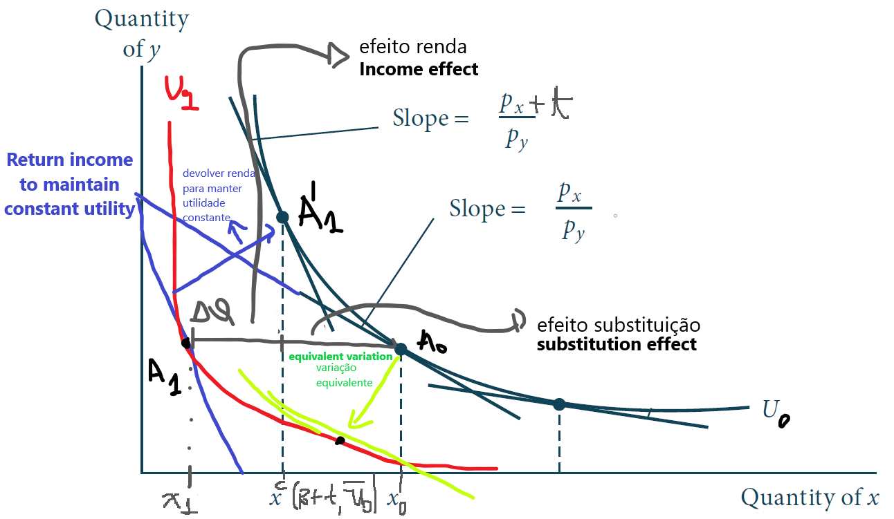
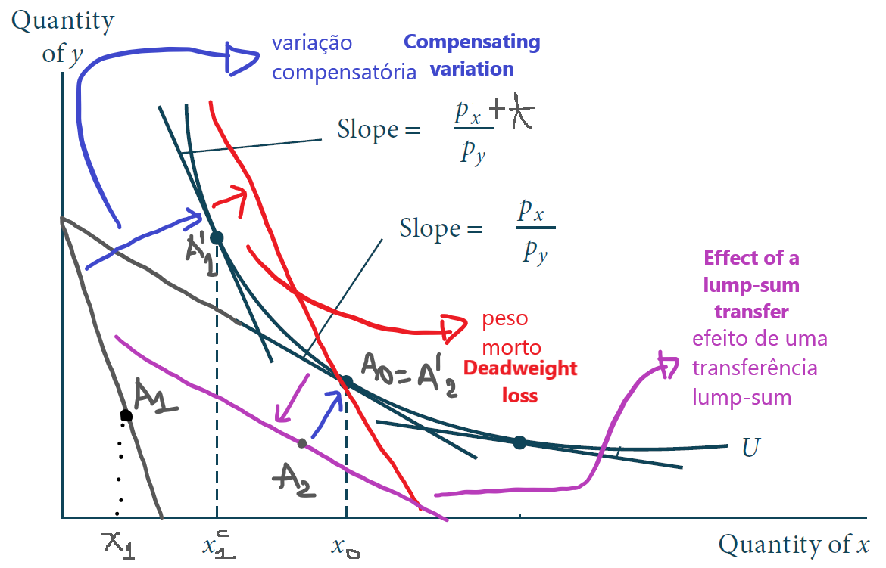
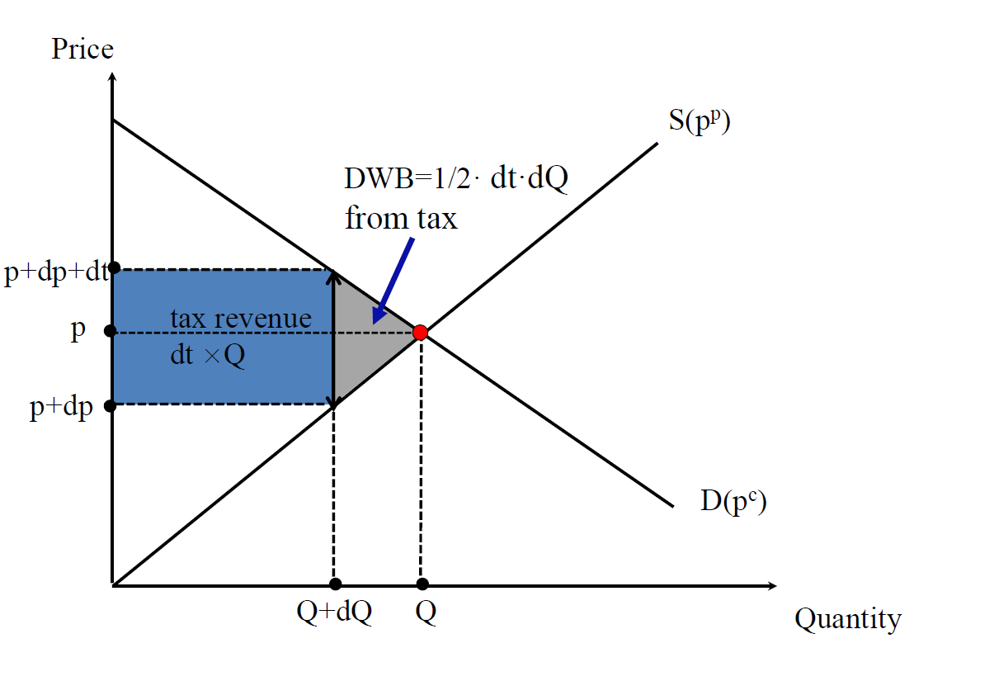
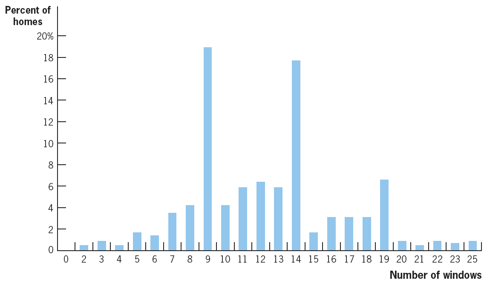

class: inverse, middle, center

```{r, load_refs, include=FALSE, cache=FALSE}
library(RefManageR)
BibOptions(check.entries = FALSE,
           bib.style = "alphabetic",
           cite.style = "alphabetic",
           style = "markdown",
           hyperlink = FALSE,
           dashed = FALSE)
myBib <- ReadBib("./esp_bib.bib", check = FALSE)
```

# Efficiency costs of taxation 

---
class: middle
## Preface: consumer theory

$u(c_x, c_y)$ as the utility below and assume that $p_y = 1$: then, the budget constraint is $Y = p_x c_x + c_y$ and therefore $c_y = Y - p_x c_x$ 

$$u(c_x, c_y) = \ln c_x + \ln c_y$$ 

This gives us the FOC: $$\frac{1}{c_x} = \frac{p_x}{Y - p_x c_x} \Rightarrow Y - p_x c_x = p_x c_x \Rightarrow x(p_x, Y) \equiv c_x = \frac{Y}{2p_x}$$

$$\therefore V(p_x, Y) = \ln \left( \frac{Y}{2p_x} \right) + \ln \left( \frac{Y}{2} \right)$$ 


---
class: middle
## Preface: consumer theory

In the previous slide, $x(p_x, Y)$ is the **Marshallian demand** (from Alfred Marshall, in 1890) of good $x$ and $V(p_x, Y)$ is the **indirect utility function**

$$V(p_x, Y) = \ln \left( \frac{Y}{2p_x} \right) + \ln \left( \frac{Y}{2} \right) \equiv \bar{u}$$

$$\therefore \exp \left\{ \bar{u} \right\} = \left( \frac{Y}{2p_x} \right) \cdot \left( \frac{Y}{2} \right) \Rightarrow Y \equiv e(p_x, \bar{u}) = 2\sqrt{p_x e^{\bar{u}}}$$

This is the **expenditure function** $e(p_x, \bar{u})$, which allows us to maintain the utility $\bar{u}$ constant


---
class: middle
## Preface: consumer theory

In this case, Marshallian demand is negatively sloped, but it does not always need to be the case: if the good is inferior, then the **income effect** $x(p_x, Y) \cdot \partial x(p_x, Y) / \partial Y < 0$ can offset the **substitution effect**, generating positively sloping demand (this is Slutsky equation, from 1915)

Note that **Roy's identity** is valid in this example (phew!): $$x(p_x, Y) = - \partial_{p_x} V(p_x, Y) / \partial_Y V(p_x, Y)$$

$$\frac{\partial V(p_x, Y)}{\partial p_x} = -\frac{2}{2 p_x} \text{ and } \frac{\partial V(p_x, Y)}{\partial Y} = \frac{2}{Y}$$
$$\therefore x(p_x, Y) = - \frac{\partial_{p_x} V(p_x, Y)}{\partial_Y V(p_x, Y)} = \frac{Y}{2 p_x}$$

---
class: middle
## Preface: consumer theory

**Shephard's Lemma** (1953) says that the **compensated demand** (or Hicksian, by John Hicks in 1939) for a good is the derivative of the expenditure function in relation to the price of that good &mdash; hence,

$$x^c(p_x, \bar{u}) = \frac{\partial e(p_x, \bar{u})}{\partial p_x} = \sqrt{\frac{e^{\bar{u}}}{p_x}}$$

Compensated demand is called like this because it represents the consumption of the good $x$ given variations in the good's price that are *compensated* in a way to keep the consumer's utility constant in $\bar{u}$: what matters are only the relative prices (**substitution effect**), since the income effect is offset in utility


Note that here it is valid, and will **always** be true, that compensated demand is *negatively sloped*: $\partial x^c(p_x, \bar{u}) / \partial p_x < 0$

---
class: middle
## Efficiency costs taxation 

We discussed the redistributive effect of taxation: the **incidence** of indirect taxation, which is caused by changes *in the price* of products

*Efficiency cost* of taxation is measured by the **excess burden** (aka deadweight loss), and it is related to changes *in the quantity* traded

Excess burden comes from the fact that taxes change *relative prices* faced by economic agents, changing their behavior &mdash; for example, by making consumption more expensive in relation to leisure (non-taxable), it discourages work

---
class: middle
## Equivalent variation

Being $e \left( p_0, V(p_0 + t, Y) \right)$ the **expenditure function**, which measures the necessary income to reach with initial prices $p_0$ the same utility $\bar{u}_1 = V(p_0 + t, Y)$ that the individual with income $Y$ has after introduction of a tax $t >0$ (utility that is lower, since purchasing power has fallen)

So, the **equivalent variation** is how large a loss of income would have to be to have the same effect on the agent's utility as the introduction of the tax:

$$EV = e \left( p_0, V(p_0 + t, Y) \right) - Y \leq 0$$

An EV of $-100$ means that introducing the consumption tax on a given good has the same effect for the consumer as taking R$ 100 from his income

---
class: middle
## Lump-sum taxation and deadweight loss

It is natural that if someone gives R$ 1 to the government, he will have a welfare loss of (at least) R$ 1 &mdash; but it will actually be larger than that, because transferring income between economic agents is costly (*leaky bucket*)

This difference is *excess burden*: the loss of income equivalent to the loss of welfare (in monetary measure) generated by the tax that is **in excess of the revenue collected**:

$$EB = |EV| - R(t) = Y - e \left( p_0, V(p_0 + t, Y) \right) - t x(p_0 + t, Y)$$ 

*Lump-sum taxation* does not generate deadweight loss &mdash; this is clear from the definition of equivalent variance: $$e \left(p_0, V(p_0, Y - T)\right) = Y - T \text{ and therefore, } EV = T = R(t)$$

---
class: middle

```{r, echo=FALSE, out.width = '100%', fig.align = 'center'}

```

---
class: middle

```{r, echo=FALSE, out.width = '100%', fig.align = 'center'}

```

---
class: middle
## Excess burden is always positive

Excess burden measured by the equivalent (or compensating) variation will always be well-defined and positive, since the *Law of Demand* always holds for **compensated demand**

This is a direct application of **Shephard's Lemma**: the equivalent variation $EV = e \left( p_0, V(p_1, Y) \right) - Y$ is the integral of compensated demand $x^{c}(p, \bar{u}_1)$ $$EV = \int_{p_0}^{p_0 + t} x^{c}(p, \bar{u}_1)dp$$ 

While government revenue is $t x(p_1, Y) = tx^c(p_1, V(p_1, Y))$, that is, $tx^c(p_1, \bar{u}_1)$ 

---
class: middle

```{r, echo=FALSE, out.width = '100%', fig.align = 'center'}
knitr::include_graphics("figs/eae0310-10-6.png")
```


---
class: middle
## Excess burden and equivalent variation

The deadweight loss arises from a **decrease in quantity**: agents respond by "running away" from the tax, but this has a cost in terms of welfare that does not generate revenue (unlike with a lump-sum transfer)

The definition of excess burden as equivalent variation is useful because it has a clear interpretation: it is how much *excess* loss of income (beyond the government revenue) that would be *equivalent* to the implemented tax

Therefore, a excess burden of 10% means that for each R$ 1 collected, consumers and producers would be willing to pay R$ 1.10 instead if the prices were not distorted (a lump-sum transfer)

---
class: middle
## Substitution effect and income effect

It is important to always bear in mind that **what generates welfare loss is the substitution effect**:  income effect does not generate deadweight loss

In fact, lump-sum transfers also generate income effect, but with no change in relative prices. The equivalent variation is just the transfer of resources (private sector welfare loss is equal to the revenue)

The deadweight loss comes from **the change of relative prices**: universal transfers do not change the relative price (e.g. between consumption and leisure), and do not generate a **tax wedge**

---
class: middle
## Behavioral effects

In the end, economic inefficiency comes from the fact that there are relevant economic objects that the government cannot observe and tax: it is an **informational failure**

If the government could observe all the individuals' idiosyncrasies, it could condition taxation on immutable variables ("ability") and redistribute perfectly without generating behavioral changes

In the consumer market, when consumer and producer prices are not equal (**tax wedge**), there are *mutually beneficial exchanges* (and in the competitive market, therefore, socially beneficial) that are not carried out

---
class: middle

```{r, echo=FALSE, out.width = '75%', fig.align = 'center'}
knitr::include_graphics("figs/eae0310-9-1.png")
```

A market in undistorted equilibrium &mdash; all the *mutually beneficial exchanges* are carried out (Saez) 

---
class: middle

```{r, echo=FALSE, out.width = '85%'}
knitr::include_graphics("figs/eae0310-9-3.png")
```

With the tax, there are consumers willing to pay more for the good than its current marginal cost of production, and yet the exchange is not carried out: the quantity traded is reduced by $dQ$ (Saez) 

---
class: middle

```{r, echo=FALSE, out.width = '85%'}

```

The reduction in quantity traded creates the **Harberger triangle**: a surplus loss area that exceeds government revenue (Saez) 

---
class: middle
## Harberger triangle

The **Harberger triangle** is (literally) a triangle, and under the conditions of the supply and demand graph (partial equilibrium, no income effect) we can calculate its area by elementary geometry

$$\text{EB} = \frac{1}{2} dQ \times dt = \frac{1}{2} S^{\prime}(p) dp \times dt$$
Which we use that $Q = S(p)$, and therefore, $dQ = S^{\prime}(p)dp$. Multiplying and dividing by $pQdt$ and recalling last class that $\frac{dp}{dt} = \frac{\epsilon_D}{\epsilon_S - \epsilon_D}$:

$$\text{EB} = \frac{1}{2} \frac{S^{\prime}(p) p}{Q} \frac{Q}{p} \frac{dp}{dt} \times (dt)^2 = \frac{1}{2}\frac{\epsilon_S \epsilon_D}{\epsilon_S - \epsilon_D} \frac{Q}{p} \times (dt)^2$$

---
class: middle

```{r, echo=FALSE, out.width = '65%'}
knitr::include_graphics("figs/eae0310-10-2.png")
```

Harberger triangle in this example has an area of $\frac{1}{2} 10 \times 0,50 = 2,5$ billion `r Citep(myBib, "gruber")`

---
class: middle
## The deadweight loss formula

$$\text{EB} = \frac{1}{2}\frac{\epsilon_S \epsilon_D}{\epsilon_S - \epsilon_D} \frac{Q}{p} \times (dt)^2$$
Deadweight loss increases with the absolute value of elasticities $\epsilon_S > 0$ and $- \epsilon_D > 0$ : *it is more efficient to tax inelastic goods*


Deadweight loss increases *quadratically* in tax (*of second-order*) &mdash; the deadweight loss per BRL collected increases with taxation:

1. It is better to tax many goods little than fewer goods more;
2. It is better to finance extraordinary expenses (wars, pandemics) with debt, paid by taxes over a long period of time

---
class: middle

```{r, echo=FALSE, out.width = '85%'}
knitr::include_graphics("figs/eae0310-10-3.png")
```

The more elastic the demand and supply, the greater is the deadweight loss  `r Citep(myBib, "gruber")`

---
class: middle
## Deadweight loss

As previously mentioned, deadweight loss is of second-order *when there are no distortions in economy* (triangle)

When there are distortions, such as market power, or other taxes (such as initial tax $t \neq 0$), the deadweight loss becomes a trapezoid &mdash; it is no longer negligible in calculating incidence and other effects

Calculation of welfare effect of deadweight loss taxation dates back to Dupuit in 1844, but the first to empirically estimate its size was Harberger (1954): he estimated the deadweight loss as $~3\%$ of revenue, a very reasonable value given what we know today (see `r Citep(myBib, "hines1999three")`)

---
class: middle

```{r, echo=FALSE, out.width = '50%'}
knitr::include_graphics("figs/eae0310-10-4.png")
```

When we increase the rate of an existing tax, the deadweight loss is of *first-order* (trapezoid), and no longer of *second-order* (triangle) &mdash; this is due to pre-existing distortions, and it is also valid for any other market inefficiency, such as monopoly power `r Citep(myBib, "gruber")`

---
class: middle
## Window tax

`r Citep(myBib, "oates")` studies the case of the window tax instituted by King William III in the UK (1696)

As it is difficult to assess the value of properties (and it was much more in the past), King William decided to use as *proxy* of wealth the number of windows in the properties (an indicator of *ability to pay*): this would make sense (**tagging**) *if* the number of windows were not changeable &mdash; but it is

It was also unfair from the point of view of **horizontal equity**: a house in the country much cheaper than one in the city would certainly have way more windows

---
class: middle
## Window tax

> "In order to reduce the window tax, every window... was built up, and all source of ventilation was thus removed. The smell in this house was overpowering, and offensive to an unbearable extent. There is no evidence that the fever was imported into this house, but it was propagated from it to other parts of town, and 52 inhabitants were killed" Carlisle, 1781, apud `r Citep(myBib, "oates")`

Even worse, taxation had **notches**: points at which the average tax rate rises discontinuously, generating even greater distortions: there was no tax up to 9 windows, 6 pounds per window *in total windows* up to 14 windows, etc

---
class: middle

```{r, echo=FALSE, out.width = '85%'}

```

*Notches* in the tax rate generate anomalous masses just below the change &mdash; here in 9, 14 and 19 windows `r Citep(myBib, "gruber")`

---
class: middle
## Window tax

`r Citep(myBib, "oates")`  find that the deadweight loss generated by taxation on *households located "in the notch"*  was a terrible 62% of revenue: for every £1 collected by the government, they paid £1.62 lump-sum equivalent in lost utility

That is, they would be willing to pay £1,62 lump-sum transfer per £1 collected to end this tax &mdash; in general, the deadweight loss was 13,4% of collections: still 3-4x higher than other types of tax

Even with all this, the tax was only withdrawn in 1851, almost 160 years after its establishment, which demonstrates that very inefficient taxes can last for a long time for political reasons

---
class: inverse, middle, center

# Consumption taxation

---
class: middle
## Productive efficiency

The **production efficiency theorem** `r Citep(myBib, "diamond1971optimal")` says that without externalities and market power, taxes should never distort the firm's productive choice

This implies that there is no distortion of relative input prices, only the final good &mdash; the intuition is that any tax on production distorts production **and** consumption, so it must be worse than distorting only consumption

In general, this is a strong argument *against taxing intermediate goods*, and the main reason why tax systems tend to tax only the *final sale of goods* (but tax factors of production)

---
class: middle
## Value added tax

Consumption taxation (indirect taxes) can be levied on sales by collecting a tax $t$ (proportional or fixed) on the sale of the *final good*

But in recent decades, **value added tax (VAT)** has become much more common: each producer pays a tax on their sales revenue, but **deducts** the taxes paid *upstream*

That is why it is a **value added** tax, its basis is the revenue minus the cost of supplies (the value added) &mdash; with perfect *compliance* and no exemptions, VAT is equivalent to a tax on sales

---
class: middle

```{r, echo=FALSE, out.width = '100%'}
knitr::include_graphics("figs/eae0310-8-1.png")
```

Operation of a tax on sales and a VAT of 20% `r Citep(myBib, "gerard2018value")` 

---
class: middle
## Value added tax

Its advantage comes from making tax evasion difficult: each producer in the production chain deducts the tax paid *upstream*, which provides an incentive for **third-party reporting**

VAT can be a powerful tool to combat tax evasion in *business-to-business* (B2B) transactions, because the *downstream* company earns money by reporting the transaction to the government

But this does not work for the transactions with consumers &mdash; it was to try to avoid this "hole" in VAT that the government of São Paulo introduced the Nota Fiscal Paulista (NFP)

---
class: middle

```{r, echo=FALSE, out.width = '75%'}
knitr::include_graphics("figs/eae0310-10-11.png")
knitr::include_graphics("figs/eae0310-10-10.png")
```

`r Citep(myBib, "naritomi2019consumers")` studied the effect of introducing the Nota Fiscal Paulista program in 2008, comparing the before and after behavior of retail stores (treatment) vs wholesale (control)

---
class: middle

```{r, echo=FALSE, out.width = '45%', fig.show="hold"}
knitr::include_graphics("figs/eae0310-10-12.png")
knitr::include_graphics("figs/eae0310-10-12b.png")
```

Part of the effect comes from consumer complaints &mdash; after a complaint, firms report 7% more sales to the government (Panel A)

Nota Fiscal Paulista led to a 9.3% increase in ICMS (Imposto sobre Circulação de Mercadorias e Serviços) tax revenue in São Paulo, compared to other states (Panel B)  `r Citep(myBib, "naritomi2019consumers")` 

---
class: middle
## Optimal consumption tax

So far, although we have been analyzing welfare effects, the study of incidence and deadweight loss of taxes has still been in the realm of *positive economics*

But our ultimate interest is in advising policymakers on how to design better taxation systems, which is part of the *normative analysis*

This is the field of study of **optimal taxation**: what are the characteristics of a tax system that maximize the social welfare, given informational constraints (i.e., the *second-best*)

---
class: middle
## Optimal consumption rate

The study of optimal consumer taxation began with Frank Ramsey, who made several relevant discoveries in mathematics, philosophy and economics before his tragic death at the age of 26

In 1926, Pigou proposed the problem to him: how can we collect a certain amount of tax revenue $\bar{R}$ causing the minimum distortion in the economy?

The result became known as **Ramsey rule** (or *inverse elasticity rule*): we should tax each good inversely proportional to its elasticity of demand

---
class: middle
## Ramsey rule

Ramsey's problem is to minimize the deadweight loss sum of different markets given a minimum government revenue:

$$\min_{(t_k)_{k=1}^K} \sum_{k=1}^K EB_k \text{ subject to } \sum_{k=1}^K R_k = \bar{R}$$

We also saw in this class that $\text{EB}_k = \frac{1}{2}\frac{\epsilon_S^k \epsilon_D^k}{\epsilon_S^k - \epsilon_D^k} \frac{Q_k}{p_k} (t_k)^2$. Therefore: $$\min_{(t_k)_{k=1}^K} \sum_{k=1}^K \frac{1}{2}\frac{\epsilon_S^k \epsilon_D^k}{\epsilon_S^k - \epsilon_D^k} \frac{Q_k}{p_k} (t_k)^2 + \lambda \cdot \left( \bar{R} - \sum_{k=1}^K Q_k t_k \right)$$

---
class: middle
## Ramsey rule

The FOC for good $k$ is:

$$[t_k]: \frac{\epsilon_S^k \epsilon_D^k}{\epsilon_S^k - \epsilon_D^k} \frac{Q_k}{p_k} t_k = \lambda Q_k  \therefore \frac{t_k}{p_k} = \lambda \left( \frac{1}{|\epsilon_D|} + \frac{1}{|\epsilon_S|} \right)$$

Here $\lambda$ is the **marginal value of public funds** &mdash; as taxation is distortive, if money with the government has no greater social value than in the hands of private individuals, the optimal tax is zero

Other than that, as the *deadweight loss increases in elasticities*, the government should tax more inelastic markets

---
class: middle
## Problems with Ramsey rule

**Ramsey rule** has become well known in economics, but it implicitly makes two important assumptions:

1. What matters is **only efficiency**: minimizing deadweight loss, and not maximizing *social welfare*
2. We can analyze markets separately, ignoring how they affect each other (a good can have inelastic demand but high cross elasticity with other goods)

Unfortunately, these two assumptions make the result not very applicable in the real world, and most tax systems do not go in that direction today

---
class: middle
## Indirect tax and inequality

The **inverse elasticity rule** has cruel distributional implications: if there are two goods, rice and caviar, as the demand for rice is more inelastic, the inverse elasticity rule implies taxing more the rice, and less the caviar

It does minimize deadweight loss, as there is little reduction in quantity traded, but it generates a huge loss of consumer surplus for the poor, decreasing social welfare (given social preferences for **equity**)

If we care about redistribution and there are restrictions in progressivity of income taxation, we should redistribute through indirect taxation: **taxing less goods consumed by the poorest**, such as food


---
class: middle

```{r, echo=FALSE, out.width = '95%'}
knitr::include_graphics("figs/eae0310-10-8.png")
```

**Engel** (proportional) **curves** of consumption of informal goods for Rwanda (a) and Mexico (b) &mdash; as they are not taxed (by definition) and their consumption decreases in income (*necessary goods*), it makes indirect taxation in developing countries more progressive `r Citep(myBib, "bachas2022informality")`

---
class: middle

```{r, echo=FALSE, out.width = '65%'}
knitr::include_graphics("figs/eae0310-10-9.png")
```

In a simulation with uniform taxation of 10%, having informal trade not taxed (red) makes the tax more progressive than exempting food (green), and almost supplants the gains of this policy when together (orange) `r Citep(myBib, "bachas2022informality")` 

---
class: middle
## Indirect taxation and inequality

We have seen that there is a reason to want to redistribute income through consumption tax, taxing less goods consumed by the poorest (and vice versa)

The **targeting principle** `r Citep(myBib, "atkinson1976design")`  says that if we can tax income directly, we should use this (*targeted*) instrument to reduce income inequality, not consumption (or savings) taxation

In the *budget constraint* of consumers a *proportional* income tax is equivalent to a *uniform* tax on consumption (making $1 - \tau_Y = (1 + \tau_C)^{-1}$)

$$p_x c_x + p_y c_y = (1-\tau_Y)Y \iff (1+\tau_C)p_x c_x + (1+\tau_C)p_y c_y = Y$$

---
class: middle
## Indirect tax and inequality

But this is only valid if **ability** is the only source of inequality &mdash; if there are other relevant dimensions of heterogeneity (e.g., initial wealth or intertemporal discount rate), the targeting principle is no longer applicable

In any case, the intuition remains that indirect taxation is a very obtuse form of income redistribution compared to income tax and social assistance (tax and transfers)

In the UK, it is estimated that removing VAT exemption and increasing *means-tested* transfers by 15% would make the poorest better-off and save £11bn/year from the budget `r Citep(myBib, "mirrlees2010dimensions", after=", ch. 4")`

---
class: middle
## Indirect taxation and labor supply

Another problem with **Ramsey rule** is that it assumes that we can look at each market separately, which we know is not true: there are important *general equilibrium* effects (cross elasticities)

The most important of these effects is the relationship with work: as leisure cannot be taxed, people work too little

**Taxing less (or even subsidizing) complementary goods to work** (education, daycare, public transport, etc) can reduce this distortion &mdash; analogously, it makes sense to tax more substitute goods to work, such as video games


---
class: middle
## Uniform taxation

If we consider the **targeting principle** and assume that there are no goods related to demand for leisure (very strong!), then the ideal is a uniform rate (perhaps zero) on consumption (and redistribution through income tax)

Homogeneous taxation also makes sense for political economy reasons, as it avoids lobbying by reducing rates in particular sectors (**third-best policy**) and simplifies the tax framework 

It also **expands the tax base**: even though equivalent, income taxation allows **withholding** and consumption tax better affects self-employed workers &mdash; and a single rate does not allow manipulation of categories 

---
class:middle
# References
<small>
```{r refs, echo=FALSE, results="asis"}
PrintBibliography(myBib, start=1, end=5)
```
</small>

---
class:middle
# References
<small>
```{r refs2, echo=FALSE, results="asis"}
PrintBibliography(myBib, start=6)
```
</small>
