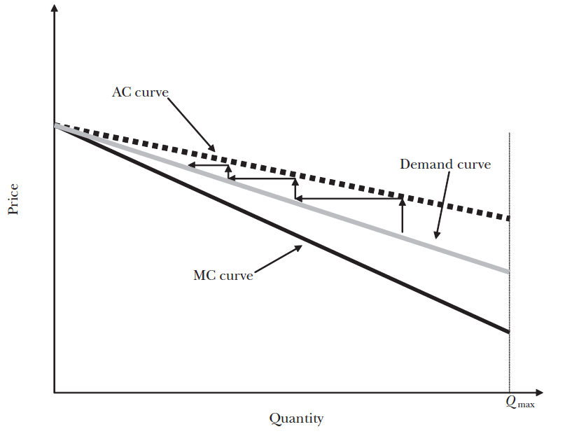

class: inverse, middle, center

```{r, load_refs, include=FALSE, cache=FALSE}
library(RefManageR)
BibOptions(check.entries = FALSE,
           bib.style = "alphabetic",
           cite.style = "alphabetic",
           style = "markdown",
           hyperlink = FALSE,
           dashed = FALSE)
myBib <- ReadBib("./esp_bib.bib", check = FALSE)
```

# Social security

---
class: middle
## Social security

So far we have discussed two market failures that (plausibly) require state intervention: public goods and externalities. A third one is **insurance restrictions**

Note that even though incomplete insurance markets receive less attention in standard microeconomics, they represent most of the state's expenses! 

In Brazil, the federal government spends ~12% of GDP (1/3 of the budget) on social security &mdash; another ~4% of GDP is public spending on public health services, which is another form of public insurance

---
class: middle
## Social Security

Nowadays, almost all governments offer various forms of social insurance &mdash; in Brazil, the *Instituto Nacional do Seguro Social* (INSS) offers:

1. Retirement benefits
2. Unemployment insurance
3. Sick pay, workers’ compensation, and reclusion aid
4. Benefit for people with disabilities (BPC)
5. Maternity leave
6. Pension for death

In addition to these, SUS (Unified Health System) is a form of public provision of *health insurance*

---
class: middle
## Risk and insurance

Social insurance programs usually also have a *redistributive effect*, but this is not their main objective &mdash; it is to insure *risk averse* citizens against income shocks and allow them to **smooth their consumption**

As the *marginal utility of income* is decreasing, maximizing the expected life utility is equivalent to equalizing the marginal utility in different "luck" realizations (**states of nature**)

For example, I would always like to transfer income from *possible worlds* where I did not crash my car to possible worlds where I did crash &mdash; that is exactly what car insurance does

---
class: middle
## Risk and insurance

An **actuarially fair insurance premium** is a insurance plan whose premium (price) is exactly equal to the insurer’s expected payout &mdash; the risk neutral insurer simply absorbs all risk from the risk averse consumer

As consumers are risk averse and the insurer is not, transferring the agent’s risk to the firm results in an efficiency gain &mdash; there is a trade surplus

The actuarially fair premium keeps all trade surplus for the consumer &mdash; in the opposite scenario, the insurer charges all the **risk premium**, which is the difference between the expected payout and the *certainty equivalent*

---
class: middle

```{r, echo=FALSE, out.width = '50%'}
knitr::include_graphics("figs/eae0310-6-2.png")

```

The utility of a risk averse agent in a lottery is lower than with full insurance, so he is willing to pay up to the **certainty equivalent** to avoid this risk (Nicholson & Snyder, 2016; Bowles & Halliday, 2022)

---
class: middle
## Information asymmetry in the insurance market

But the most relevant question here for us is not why people buy insurance, but why the State should need to provide it

And the answer to this is not in risk aversion, but in **informational asymmetry**: consumers in an insurance market almost always have more information about their risks than the insurer

There are two types of relevant informational asymmetry in the insurance market (any market really): **unobservable characteristics** (adverse selection) and **unobservable actions** (moral hazard) &mdash; let us start with the first one

---
class: middle

```{r, echo=FALSE, out.width = '90%'}
knitr::include_graphics("figs/eae0310-6-3.png")
```

Imagine two *types* of agents: careful ones (0.5% chance of crashing their car) and careless ones (5%), with 100 individuals each. If the insurer manages to separate the types, the result is efficient. But if there is asymmetric information, **adverse selection** occurs, both when the firm tries a *pooling* (everyone buys less) or a *separating* policy (the good type is excluded) `r Citep(myBib, "gruber")`

---
class: middle
## Information asymmetry in the insurance market

At the limit, **adverse selection** can exclude more and more low risk individuals, leaving a pool with increasingly higher risk until it *unravels the entire market* 

As we have seen, if consumers are risk averse, they are willing to pay above the actuarially fair rate &mdash; if their risk aversion is high enough for lower risk agents to remain in the market, there may be a **pooling equilibrium**

Insurers can also try (and they certainly do try) to **screen** consumers for risk: offering a premium-coverage menu with an option that is cheap but covers little damage, and thus is only worthwhile for agents with lower risk, and another with high coverage but expensive (a **separating equilibrium**)

---
class: middle
## Information asymmetry in the insurance market

But notice that this separating equilibrium *is still inefficient!* Low-risk consumers receive little coverage when the optimum would be to be full insurance

**Adverse selection** occurs because with a single price, lower risk individuals decide to exit the market: a "simple" way to solve the problem is to force them to buy insurance

Note that in the last case in the table, if everyone buys it, the firm would have zero profit, and the market would be efficient (in this case lower risk consumers would be subsidizing the higher risk individuals' insurance)

---
class: middle
## Selection in insurance markets

We can analyze the insurance market with adverse selection through a supply and demand graph with perfectly competitive firms competing for price on a single insurance contract `r Citep(myBib, "einav")`

In the simplest case, individuals are homogeneous in risk aversion, and therefore their *willingness to pay* for insurance is increasing in risk

Hence, the difference between the model with selection and the traditional one is that the supply and demand curves are *not* independent objects: the **type** of risk of the agent determines both its demand and its cost

---
class: middle

```{r, echo=FALSE, out.width = '70%', fig.align='center'}
knitr::include_graphics("figs/eae0310-6-12.png")
```

Competitive supply and demand model *with adverse selection*: negative sloping demand excludes consumers with low willingness to pay from the market, which (in markets with adverse selection) is inefficient because the marginal cost curve is below the demand curve `r Citep(myBib, "einav")`

---
class: middle
## Selection in insurance markets

The inefficiency of the market with selection comes from the fact that the MC curve is **below** the AC curve: the marginal consumer always has a lower cost than the inframarginal ones

But they also have a lower willingness to pay: producing at an efficient level would generate harm to operators &mdash; **low-risk** individuals are driven out of the market, even though they value insurance more than its individual cost: this is **adverse selection**

---
class: middle

```{r, echo=FALSE, fig.show="hold", out.width="50%"}
knitr::include_graphics("figs/eae0310-6-13.png")

```

Extreme cases of adverse selection: in (a) the result is efficient, as companies make profit operating in the entire market; in (b) **the market unravels itself** &mdash; at each potential price, the average cost of consumers *willing to hold on to that price* is higher than the given price `r Citep(myBib, "einav")`

---
class: middle
## Public insurance

The main reason for **public insurance** is to solve the adverse selection problem &mdash; the canonical solution then is to force everyone to buy insurance 

Another reason is the existence of *financial externalities*: if I do not have car insurance and crash into someone, I may not have the money to cover their damage (that is why DPVAT – Seguro Obrigatório para Proteção de Vítimas de Acidentes de Trânsito – exits)

A third reason for public insurance is that governments may not be able to *credibly commit* to not intervene in the bad state of nature in case the agent does not buy insurance (**Samaritan's dilemma**)

---
class: middle
## Self-insurance

Frequently, consumers of highest risk are also the neediest (or sometimes they are most at risk *because* they are needy), and the efficient market solution would involve them paying much more

There are many ways in which families can *smooth consumption* without formal insurance: they can use their savings, increase their partners' work, or borrow from banks or family members &mdash; one risk is that public insurance would be **crowding out** their self-insurance

In practice, families often act in a *myopic way*, giving too much value to the present: governments can act to correct *internalities*

---
class: middle

```{r, echo=FALSE, fig.show="hold", out.width="50%"}

knitr::include_graphics("figs/eae0310-6-4b.png")
```

Difference in unemployment duration by level of unemployment insurance &mdash; poorest quartile (a) vs richest quartile (d): less unemployment insurance makes the poorest find jobs faster but does not have the same effect on the richest, which plausibly already manage to smooth consumption with prior savings `r Citep(myBib, "chetty2008moral")`

---
class: middle

```{r, echo=FALSE, out.width = '90%'}

```

Evidence of myopic behavior and lack of consumption smoothing: in Brazil, *laid-off* workers (as opposed to *fired* for just cause, in panel b) receive the FGTS and *increase* their consumption, even losing *permanent income* (**cash in hand** effect) `r Citep(myBib, "gerard2021job")`

---
class: middle
## Moral hazard

Another important concept of asymmetric information that is important for the insurance market is the effect that being insured has on unobservable consumer risk taking (hidden actions, or **moral hazard**)

`r Citep(myBib, "carvalho2018unintended")` estimate that in Brazil 11-13% of layoffs are influenced by the existence of unemployment insurance

As we have seen, without moral hazard, optimal insurance would be full &mdash; in reality, the **optimal level of insurance** equates the *benefit* of consumption smoothing with the *harm* of generating moral hazard

---
class: middle
## Optimal unemployment insurance with moral hazard

Let's consider the case of unemployment insurance: we want to smooth the consumption of those who receive a negative employment shock, but if the **replacement rate** is 100%, nobody would look for work

Consider an individual who chooses a probability $p$ to be unemployed (search intensity), that has consumption $c_e = w - t$ when employed (where $w$ is the salary and $t$ is the tax) and $c_u = b$ when unemployed, with $b$ as benefit

So his utility is $\mathbb{E}U(p) = (1 - p)u(w - t) + pu(b) - \psi (p)$

Government has a **balanced budget**: $(1 - \bar{p}) t = \bar{p} b$, or $t = b \bar{p}/(1-\bar{p})$, where $\bar{p}$ is the average population probability of employment
 
---
class: middle
## Optimal unemployment insurance with moral hazard

The policy that maximizes welfare then solves: $$\max_b \mathbb{E}U(p) = (1 - p)u\left( w - b\frac{\bar{p}}{1 - \bar{p}} \right) + pu(b) - \psi (p)$$

Without moral hazard, we have the same result as before, *full insurance*: $$pu^{\prime}(c_u) - (1 - p)\frac{p}{1 - p}u^{\prime}(c_e) = 0 \Rightarrow c_u = c_e$$ 
But moral hazard implies that $dp/db \neq 0$! The higher the wage replacement rate, the more likely individuals are to be unemployed
 
---
class: middle
## Optimal unemployment insurance with moral hazard


By the **envelope theorem**, we should ignore $dp/db$, but there is a **fiscal externality**: the higher the unemployment insurance, the higher the taxation we will need to finance it, both *mechanically*, but also due to the *behavioral effect*

$$\max_b \mathbb{E}U(p; \bar{p}) = (1 - p)u\left( w - b\frac{\bar{p}(b)}{1 - \bar{p}(b)} \right) + pu(b) - \psi (p)$$
The result equates the benefit of smoothing with the harm of moral hazard &mdash; full insurance is no longer optimal: $$\frac{u^{\prime}(c_u) - u^{\prime}(c_e)}{u^{\prime}(c_e)} = \frac{1}{1 - p}\epsilon_{p,b} \text{ which }\epsilon_{p,b} = \frac{b}{\bar{p}}\frac{d\bar{p}}{db}$$ 

---
class: middle
## Retirement

Social security collects payroll taxes from workers to transfer to the elderly &mdash; these people, not being able to work, would have no source of income, and their savings during the **life cycle** could run out ("risk of living too long" )

What is the reason for government intervention in this market? In principle, the financial market can sell *annuities* (insurance for living too long)

But again, we have an **adverse selection** problem: only those who are in good health and expect to live a long time would buy an annuity as opposed to a (presumably better paying) normal savings account

---
class: middle

```{r, echo=FALSE, out.width = '50%', fig.align="center"}
knitr::include_graphics("figs/adrelino.jpg")
```

---
class: middle
## Retirement

As we have seen, in these situations the government can do better than the market, because the government can *force* people to buy insurance, solving the adverse selection problem (similarly to how it deals with public goods)

But in practice, the main reason for retirement is probably to solve *internalities*: the fact is that people in general do not save as much as they would need to have a decent life in old age

In this sense, however, public retirement can only do so much &mdash; research in Italy and the UK estimate that every $1 of social security reduces private savings (**crowding out**) by 30-40¢

---
class: middle

```{r, echo=FALSE, out.width = '100%'}
knitr::include_graphics("figs/eae0310-6-6.png")
```

Increased social security is associated with a significant reduction in poverty among the elderly in the US `r Citep(myBib, "gruber")` &mdash; in Brazil, only 2.7% of the elderly are below the poverty line, against the national average of 11.5% (and 20.3% for kids less than 4 years old) (CPS/FGV)

---
class: middle
## Social security reform

Every decade, the problem of the sustainability of Brazilian retirement system and reforms to decrease social security payments come back to the public debate. [The last one was in 2019](https://www.gov.br/inss/pt-br/assuntos/noticias/confira-as-principais-mudancas-da-nova-previdencia):

1.  The reform, among other things, increased the minimum age (65/62) and now retirement requires both minimum age and contribution time (20/15)
2. The payment is now based on average wages (previously the highest 80%): 60% + 2% per year above the minimum contribution time
3. The INSS tax is now progressive: 7.5% for minimum wage earners, up to 14% (but only up to the RGPS ceiling) in the private sector, and up to 22% for the RPPS (public employees)

---
class: middle
## Social security reform

Much is said about the "social security deficit", but this is not well defined: in contrast to private pension plans, which are financed by a fund saved by the beneficiaries themselves during their lives, public social security works *without a constituted fund* (a **pay-as-you-go pension plan**)

Thus, there is no real *economic* difference between the INSS contribution and general government financing (taxes)

There are three real problems in the system: *progressivity*, *sustainability* and *disincentives to work*

---
class: middle
## Progressivity

To estimate *incidence* of retirement expenses, we need to calculate **social security wealth** (SSW): the present value of *expected* benefits divided by the present value of payments

Retirement has **intergenerational incidence** effects: the first generations are the big winners (since they receive them but did not pay), and the last ones (if any) are the big losers &mdash; as is the case with all restrictive reforms in the benefit

Women also have higher SSW: they pay the same but retire earlier (and thus they receive benefits for longer)

---
class: middle

```{r, echo=FALSE, out.width = '90%'}

```

In Brazil, social security is not progressive: in general, benefits are even more concentrated than the (already extremely unequal) distribution of income &mdash; this lack of progressivity comes mainly (but not only) from the RPPS `r Citep(myBib, "silveira2020impactos")`


---
class: middle

```{r, echo=FALSE, out.width = '80%', fig.align='center'}

```

**Sustainability**: Brazil transfers to the elderly the same in *proportion of GDP* as countries with a much higher proportion of elderly in the population `r Citep(myBib, "ipea2020politicas")`

---
class: middle

```{r, echo=FALSE, out.width = '70%', fig.align='center'}

```

Transfers to the elderly become unsustainable as the age pyramid changes, which increases the share of recipients in relation to payers ([IBGE](https://educa.ibge.gov.br/professores/educa-atividades/20818-producao-textual-o-envelhecimento-da-populacao.html))

---
class: middle

```{r, echo=FALSE, fig.show="hold", out.width="50%"}
knitr::include_graphics("figs/eae0310-6-17a.png")
knitr::include_graphics("figs/eae0310-6-17b.png")
```

In France, in (a), almost 70% of the elderly retire exactly at the minimum age, showing that social security distorts behavior (**disincentive to work**). Similarly, a reduction in the minimum age in Germany in 1973, panel (b), lowered the average retirement age in the country `r Citep(myBib, "gruber")`

---
class: middle

```{r, echo=FALSE, out.width = '50%', fig.align='center'}
knitr::include_graphics("figs/eae0310-6-16.png")
```

In the US, before the introduction of early retirement (EEA) in 1962, the majority of workers retired at full age (*bunching*) &mdash; but this mass was being transferred, throughout the 70s and 80s, to the minimum age `r Citep(myBib, "gruber")`

---
class: middle

```{r, echo=FALSE, out.width = '100%'}
knitr::include_graphics("figs/eae0310-6-9.png")
```

Social security generates an **implicit taxation**  on the work of the elderly &mdash; when comparing countries, those with higher implicit taxation have a lower proportion of elderly working `r Citep(myBib, "gruber")`

---
class: middle
## Unemployment insurance

*Formal workers* dismissed (involuntarily) without just cause who worked 12 months in the last 18 (1st request), 9/12 (2nd), or in the last 6 months (3rd+) receive unemployment insurance in Brazil

The value is 80% (up to $2,041, 50% thereafter) of the average wage of the last 3 months of work (**replacement rate**), with a maximum of $2,313 (2024), and the worker is paid for 3 (up to 1 year), 4 (up to 2) or 5 months (more than 2)

The unemployment benefit can never be below the minimum wage in Brazil ($1,412 in 2024), however, so for these workers (almost 40% of Brazilian formal employees) the replacement rate is a full 100% of their working salary

---
class: middle

```{r, echo=FALSE, out.width = '90%'}
knitr::include_graphics("figs/eae0310-6-18.png")
```

The duration of unemployment insurance in Brazil (at most 5 months) is much shorter than most developed countries (but not USA), but the replacement rate (50-80% up to the ceiling) is comparable `r Citep(myBib, "gruber")`

---
class: middle
## Unemployment insurance

As discussed, the optimal level of unemployment insurance is the one that equates (at the margin) *consumption smoothing* (benefit) with *moral hazard* (harm)

Meyer (1989) compared increases in unemployment insurance across US states and found that a 10% benefit raise increases unemployment duration by 8% &mdash; but what is the normative effect of this? Longer duration can be efficient if it generates a **better job match quality**

Note that families can also smooth consumption without smoothing utility if they have to generate income in a more costly way (e.g., night jobs or degrading activities)

---
class: middle

```{r, echo=FALSE, fig.show="hold", out.width="50%"}


```

In Brazil, a longer duration of unemployment insurance makes people unemployed for a longer time, panel (a), but it does not seem to have an effect on wage 3 years later, in panel (b) `r Citep(myBib, "gerard2021informal")` 
 
---
class: middle
## Health insurance

Health spending in Brazil was 9.7% of GDP (2021), with 4% public spending (SUS) and 5.7% private spending &mdash; while 25% of the population is covered by the private sector (ANS, 2024)) 

The health sector accounts for 10.5% of total Brazilian income and 8% of labor force participation, being one of the main sectors in the economy [[Conta-Satélite de Saúde]](https://biblioteca.ibge.gov.br/visualizacao/livros/liv102075_informativo.pdf)

The government can intervene by obliging (and generally subsidizing) the purchase of health insurance (Germany) or directly offer the service (NHS, SUS), either directly by the government or through dealers

---
class: middle

```{r, echo=FALSE, fig.align='center', out.width="100%"}

```

The level of health spending as a percentage of GDP in Brazil is about the OECD average, but the public sector participation is much lower &mdash; even in the US, $\approx 50\%$ of health expenses are public (Medicare and Medicaid): more than in Brazil! [[Conta-Satélite de Saúde]](https://biblioteca.ibge.gov.br/visualizacao/livros/liv102075_informativo.pdf)

---
class: middle

```{r, echo=FALSE, fig.align='center', out.width="45%"}

```

In 2021, Brazilian *per capita* spending on health accounted for R$2,387 for private spending and R$1,703 for public spending &mdash; about half of OECD average and 1/4th of USA (in US$ PPP) [[Conta-Satélite de Saúde]](https://biblioteca.ibge.gov.br/visualizacao/livros/liv102075_informativo.pdf)

---
class: middle

```{r, echo=FALSE, fig.align='center', out.width="70%"}

```

Even for those with private health insurance, in 2015, 80% of them had transplants, 60% dialysis and 30% treated cancer in publicly-provided SUS (the private plans reimburse the government at 150% of SUS price) `r Citep(myBib, "guidetti2024private")`


---
class: middle

```{r, echo=FALSE, out.width = '100%'}

```

Around 20% of the hospitals that serve the SUS are private, and 30% are philanthropic: only half are public &mdash; among these, they are mainly municipal among the smaller hospitals (C1), and state and federal among the largest ones (and that provide more complex services), Class 3 in image `r Citep(myBib, "botega2020perfil")`

---
class: middle

```{r, echo=FALSE, out.width = '60%', fig.align='center'}

```

If a medical consultation costs $100, the individual consumes Q1, while if the *copayment* is only $10, he consumes Q2 (**moral hazard**) &mdash; but the normative effect is not obvious: without insurance, poor people (low willingness to pay) would consume fewer medical services than perhaps socially optimal `r Citep(myBib, "gruber")`

---
class:middle
# References
<small>
```{r refs, echo=FALSE, results="asis"}
PrintBibliography(myBib, start=1, end=5)
```
</small>

---
class:middle
# References
<small>
```{r refs2, echo=FALSE, results="asis"}
PrintBibliography(myBib, start=6)
```
</small>


<!-- --- -->
<!-- class: middle -->

<!-- ```{r, echo=FALSE, fig.show="hold", out.width="50%"} -->
<!-- knitr::include_graphics("figs/eae0310-6-14.png") -->
<!-- knitr::include_graphics("figs/eae0310-6-14b.png") -->
<!-- ``` -->

<!-- Extensões ao "modelo de livro-texto": (a) com custo de administração provisão a todos já pode não ser eficiente; e (b) **seleção vantajosa** `r Citep(myBib, "einav")` -->

<!-- --- -->
<!-- class: middle -->
<!-- ## Risk and insurance -->

<!-- Consider an adverse event with probability $q$ which implies an economic cost $d$. The individual with wealth $W$ can hire a premium insurance $p$ that pays $b$  if the adverse event occurs -->

<!-- Then the expected utility of the individual is: $$\mathbb{E}U = (1 - q) u(W - p) + q u(W - p + b - d)$$ -->

<!-- The expected profit of the (risk neutral) insurer is: $\mathbb{E}\Pi = p - qb$ -->

<!-- If there is perfect competition with free entry, we have $\mathbb{E}\Pi = 0$, that is $p = qb \iff b = p/q$ (namely, the *actuarially fair premium*) -->


<!-- --- -->
<!-- class: middle -->
<!-- ## Risk and insurance -->

<!-- Under the actuarially fair premium, the agent's problem becomes $$ \max_p \mathbb{E}U = (1 - q) u\left(W - p\right) + q u\left(W - p + \frac{p}{q} - d\right)$$ -->

<!-- With FOC $d\mathbb{E}U/dp = 0$, i.e., $$- (1 - q) u^{\prime}\left(W - p\right) + q\left[ \frac{1}{q} - 1\right] u^{\prime} \left(W - p + \frac{p}{q} - d \right) = 0$$ -->

<!-- That is, the consumer **smooths his consumption** between the states of nature, fully protecting himself from risk: $u^{\prime}\left(W - p\right) = u^{\prime} \left(W - p + p/q - d \right)$, which is only possible if $p/q = d$ -->