class: inverse, middle, center

```{r, load_refs, include=FALSE, cache=FALSE}
library(RefManageR)
BibOptions(check.entries = FALSE,
           bib.style = "alphabetic",
           cite.style = "alphabetic",
           style = "markdown",
           hyperlink = FALSE,
           dashed = FALSE)
myBib <- ReadBib("./esp_bib.bib", check = FALSE)
```

# Introduction to taxation

---
class: middle
## Introduction to taxation

Studying the **theory of taxation** is important because in order to transfer resources to alleviate poverty and reduce inequality, as well as gather revenue to provide education and health, the government must collect taxes

The main issue is that we can always transfer money from individuals to the government to spend as preferred (or redistribute), but we lose part of the income in the process (**metaphor of the leaky bucket**)

In addition to financing government spending, taxation is a constituent part of *income redistribution* &mdash; we return to a fundamental problem of public sector economics: the **trade-off between efficiency and equity**

---
class: middle
## Types of taxes

From an economic point of view, **all taxation is a tax on people**: any corporate or sales tax falls upon people who own or work in those producers (or their suppliers), as well as on the consumers of those goods

The two canonical forms of taxation are **direct taxes** (taxation of income) and **indirect taxes** (consumption taxes)

Income tax is divided on income by different factors of production: taxation of capital income or labor income (wages) &mdash; the last one is also taxed by payroll taxes

---
class: middle
## Types of taxes

Taxation of capital income can take many forms:

1. **Taxation of profits and dividends** is part of personal income tax
2. **Corporate income tax** is another way of taxing profit (namely, it is a tax that incides on the capitalist) — which can be useful to combat tax evasion/avoidance
3. **Capital gains taxation** taxes the growth of asset price, and is generally employed to combat tax avoidance through share buybacks
4. **Wealth taxation** is also (almost) equivalent to a tax on the profit from that wealth &mdash; here there is also property and inheritance tax

---
class: middle

```{r, echo=FALSE, out.width = '55%', fig.align='center'}
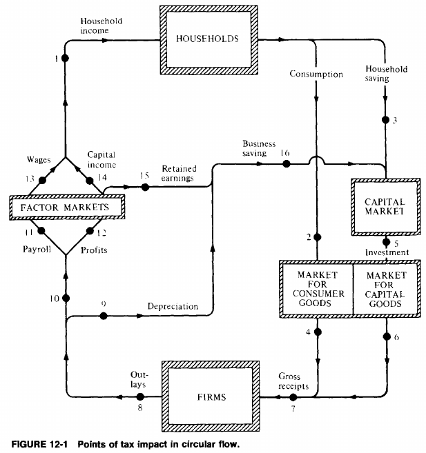
```

The government can (and does) collect resources at many points in the circular flow of income `r Citep(myBib, "musgrave")`

---
class: middle
## Tax rates

The **marginal tax rate** is the proportion of taxes paid on additional (marginal) R$ of *taxable income* (in progressive tax systems, it is the maximum tax rate that the individual reaches)

Taxable income minus *deductions* constitutes the basis of tax calculation, on which the rates fall &mdash; as each new rate only falls on *additional* income, the *average tax rate* (effective rate) will generally be much lower than the marginal tax rate

If the *average* tax rate increases with income, we say that the tax system is **progressive**, if it is equal, we say that it is **proportional**, and if it decreases, we call the tax system **regressive**

---
class: middle

```{r, echo=FALSE, out.width = '75%', fig.align="center"}
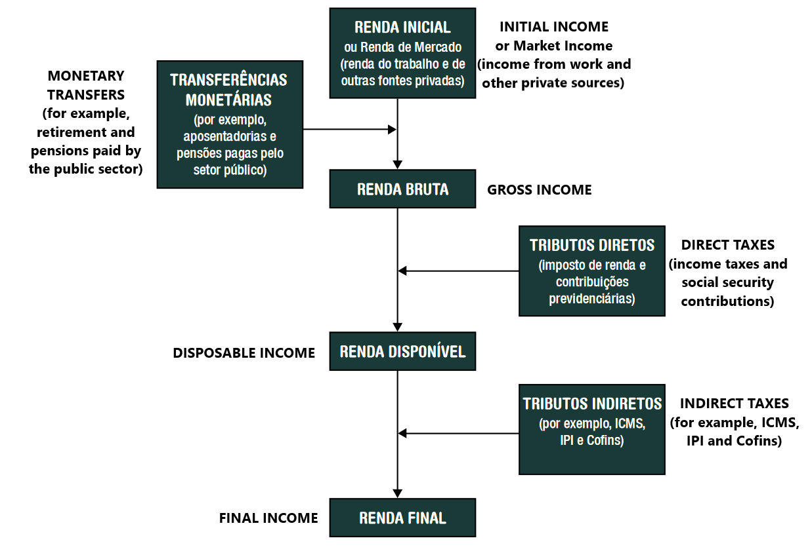
```

Income definitions [[SEAE/2017]](https://www.gov.br/fazenda/pt-br/centrais-de-conteudos/publicacoes/boletim-de-avaliacao-de-politicas-publicas/arquivos/2017/efeito_redistributivo_12_2017.pdf) 

---
class: middle

```{r, echo=FALSE, out.width = '85%'}
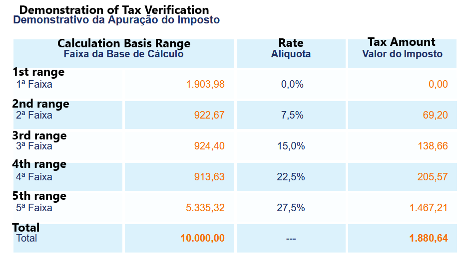
```

In Brazil's personal income tax (*Imposto de Renda da Pessoa Física*), the *effective rate* on a taxable income of R$10.000 is (only) 18,81%, even though that income places a taxpayer on the 27.5% bracket [[RFB]](http://www26.receita.fazenda.gov.br/irpfsimulaliq/private/pages/simuladoraliquota.jsf)


---
class: middle
## Principles of taxation 

Adam Smith defended that taxation should obey 4 principles: (i) justice/equity, (ii) clarity and certainty in the form and payment amount, without arbitrariness, (iii) maximum convenience to the payer, and (iv) efficiency

> I. The subjects of every state ought to contribute towards the support of the government, as nearly as possible, <mark>in proportion to their respective abilities</mark>; that is, <mark>in proportion to the revenue which they respectively enjoy under the protection of the state</mark>. (Smith, 1996, vol. 2, p. 282) 

This ambiguous phrasing generated two traditions: the *ability-to-pay* and the *benefits principle* `r Citep(myBib, "musgrave")` &mdash; Smith himself seemed to agree more with the first, which became dominant

---
class: middle
## Benefit principle

The **benefit principle** says that taxation is equitable if it taxes individuals in proportion to their *benefits received*: hence, tax justice depends not only on revenue but also on expenditure

According to this principle, it is better to charge the financing of public goods (for example, parks) by fees for the use of the site than by taxes in general &mdash; it is the same idea that justifies contributions directed to certain expenses, such as the contribution to social security charged on the payroll

But the benefit principle fails to explain taxation with redistributive reasons

---
class: middle
## Ability-to-pay principle

On the other hand, **ability-to-pay principle** considers that the government should collect an exogenous amount and search for the fairest way to do so

The principle then requires that people with equal ability-to-pay pay the same and people with greater ability-to-pay pay more: it generates the concepts of **horizontal equity** and **vertical equity**

Of course, in this case, we need to define what "ability-to-pay" is: ideally, it would be some measure of *potential* income or consumption of taxpayers, which takes into account their utility in general, including leisure &mdash; but in the real world, that is unfeasible

---
class: middle
## Vertical and horizontal equity

**Horizontal equity** claims that equal individuals in relevant dimensions should be treated equally by the tax system

The difficulty is in defining *what are the relevant dimensions*: skin color, hair color, height, gender, marital status, income &mdash; for some of these society considers fair to differentiate public policies, while for others not `r Citep(myBib, "mankiw2010optimal")`

On the other hand, **vertical equity** deals with the fair treatment of *unequal* individuals: individuals with higher income should pay more taxes because they have a greater ability-to-pay, but how much more?

---
class: middle
## Equal sacrifice

This generated the idea of **equal sacrifice**: we should tax individuals of different incomes so that they have the same loss of utility (same "sacrifice")

But the equality of sacrifice can be *absolute*, *proportional* or *marginal*: we have already seen that the last one, the **Principle of Equimarginal Sacrifice** was brought forward by Edgeworth, and *with non-distortionary taxes and transfers* it generates complete equality

It has the interesting advantage of minimizing society's total sacrifice, or what is equivalent, maximizing the sum of utilities: its relationship with utilitarianism has made it become the dominant paradigm

---
class: middle

```{r, echo=FALSE, out.width = '75%', fig.align='center'}
knitr::include_graphics("figs/trad_eae0310-8-5.png")
```

The Brazilian tax system (excl. corporate taxation) is not very progressive, ranging from 20% of gross income for the poorest quintile (almost entirely indirect taxes) to 26% for the richest quintile, with the difference being personal income tax (IRPF) [[SEAE/2017]](https://www.gov.br/fazenda/pt-br/centrais-de-conteudos/publicacoes/boletim-de-avaliacao-de-politicas-publicas/arquivos/2017/efeito_redistributivo_12_2017.pdf)  


---
class: middle

```{r, echo=FALSE, out.width = '85%', fig.align='center'}
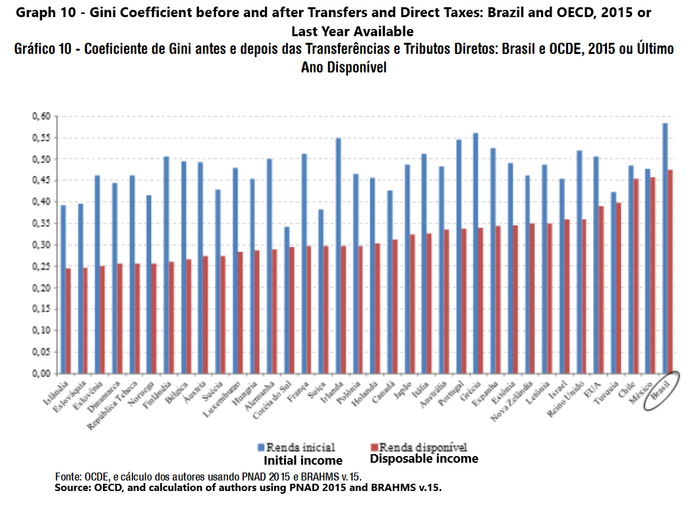
```

Brazil has the highest inequality among OECD countries, both before and after taxes and transfers: these reduce the Gini index by 0.1, half of the reduction observed in France, for example [[SEAE/2017]](https://www.gov.br/fazenda/pt-br/centrais-de-conteudos/publicacoes/boletim-de-avaliacao-de-politicas-publicas/arquivos/2017/efeito_redistributivo_12_2017.pdf)  


---
class: middle

```{r, echo=FALSE, out.width = '85%'}
knitr::include_graphics("figs/trad_eae0310-8-20.png")
```

In Brazil, taxes are only slightly progressive: while 80% of IRPF is paid by the richest 10%, and 97% by the richest 30%, social security contributions and property taxes are proportional, reducing the progressivity `r Citep(myBib, "silveira2020impactos")`

---
class: middle
## Definition of taxable income

Going from a normative theory about tax payments (ability-to-pay or social welfare) to a factual tax system generate several practical difficulties

If someone's house burns down and the person works and buys more to rebuild it, has his ability-to-pay increased? Has his utility increased?

An attempt to approach this is to use *deductions* for what does not fit the **Haig-Simons definition of income**: the ability-to-pay equals *potential annual consumption*, the actual consumption plus increase in wealth 

---
class: middle
## Deductions

A usual deviation of the Haig-Simons definition is the deductibility of some consumption expenditures that the government wants to stimulate, such as education, health, or donations, as they **crowd-out** government expenditures

If these deductions are worthwhile, it depends on calculating the **inframarginal effect** (the effect on people who would already donate or use private education even without the subsidy)...

... and compare with the **marginal effect**: people who do not use public education (or would donate less) without the subsidy, and change their behavior because of the public policy

---
class: middle
## Tax expenditures

Deviations from Haig-Simons definition are called **tax expenditures**: loss of government revenue due to special exclusions, exemptions, reductions, or yet, preferential tax rate, credit, or postponement of debt

Deductions on personal income tax in Brazil for education and private health expenses are tax expenditures, as well as the special tax regime of *SIMPLES* and the *Zona Franca de Manaus*

Federal tax expenditures represented 4.3% of GDP in 2023 or 21.8% of federal tax revenue [[DGT/PLOA 2023]](https://www.gov.br/receitafederal/pt-br/centrais-de-conteudo/publicacoes/relatorios/renuncia/gastos-tributarios-ploa/dgt-2023.pdf) &mdash; we discuss more about this type of expenditure in [this article](https://www.pedroforquesato.com/files/gastos-tributarios.png).

---
class: middle

```{r, echo=FALSE, out.width = '120%'}
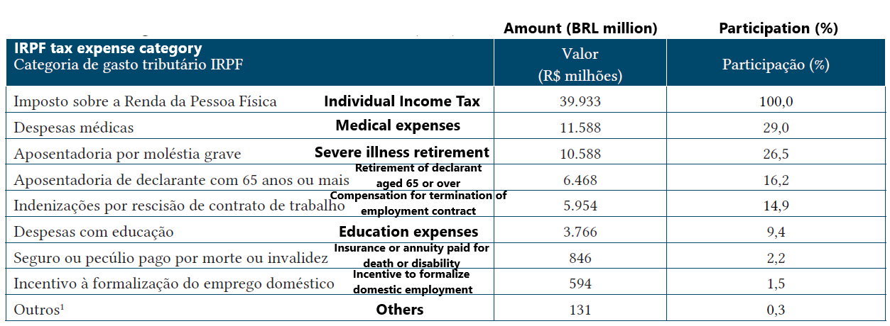
```

IRPF tax expenditures by category, 2016. In that year, personal income tax expenditures represented 10% of the Ministry of Health budget `r Citep(myBib, "silveira2019beneficios")` 

---
class: middle

```{r, echo=FALSE, out.width = '100%'}
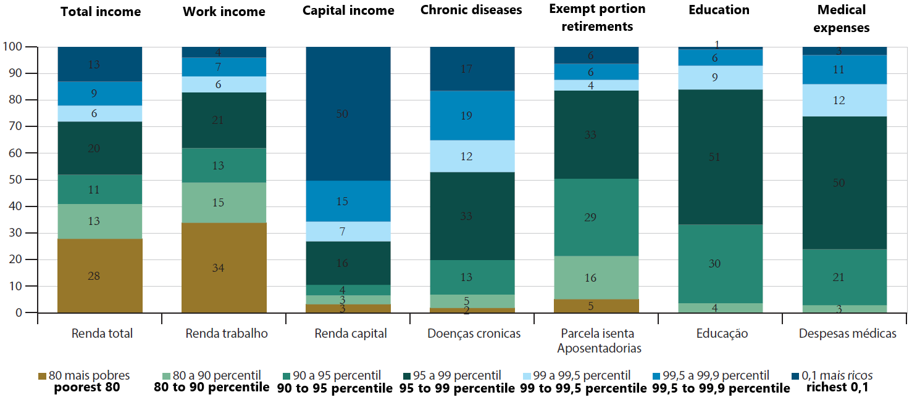
```

Distribution by income group of national income (by type) and tax expenditures on IRPF, 2008. Capital income (exempted on IRPF) is extremely concentrated, as the main deductions &mdash; but education deductions and medical expenses favor especially the richest 10-1% `r Citep(myBib, "silveira2019beneficios")` 

---
class: middle

```{r, echo=FALSE, out.width = '90%'}
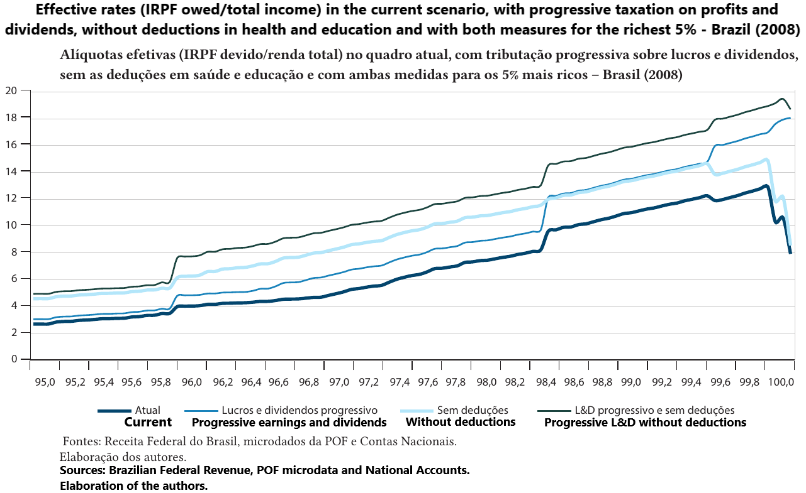
```

The exemption on profits and dividends makes the IRPF regressive among the richest 0.3% of the country `r Citep(myBib, "silveira2019beneficios")` 

---
class: middle

```{r, echo=FALSE, out.width = '100%'}
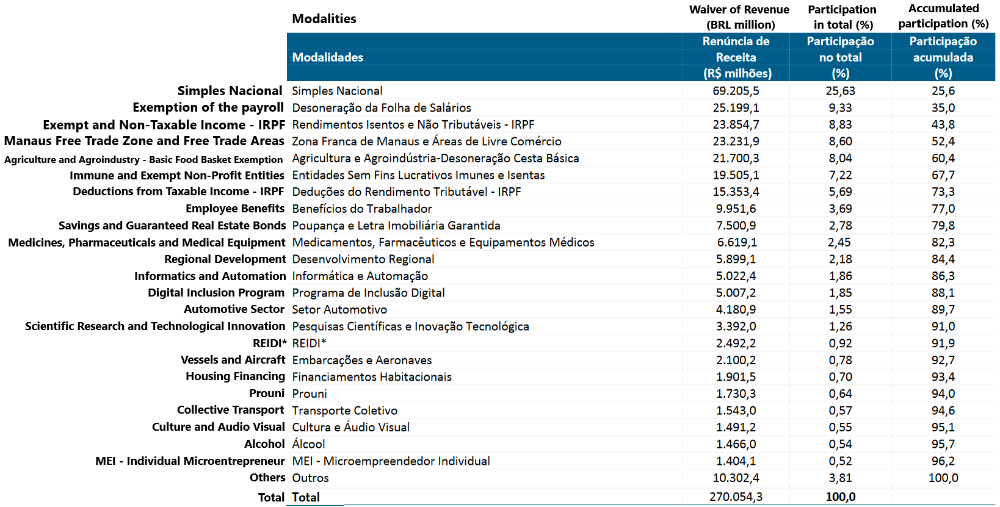
```

Tax expenditures by modality (RAF16, IFI 2018) 

---
class: middle
## Taxation in Brazil

In Brazil, the federal government is responsible for:

1. *Factor income taxes*: (*Imposto de Renda de Pessoa Física*) IRPF/IRRF, (*Imposto de Renda de Pessoa Jurídica*) IRPJ, (*Contribuição Social sobre o Lucro Líquido*) CSLL, representing 8.66% of GDP 
2. Some *taxes on consumption*: IPI, Cofins, IOF, etc, which represent 4.62% of GDP (all disappearing in place of *Contribuição sobre Bens e Serviços*, CBS, of 8.8%, and a special tax *Imposto Seletivo*, IS, on *sin goods*)
3. *Payroll taxes*: contributions to social security (RGPS and RPPS), FGTS, *Salário Educação*, *Sistema S*, etc, adding up to 8.09% of GDP

Custom duties in Brazil collect relatively little: only 0.54% of GDP

---
class: middle
## Taxation in Brazil

State revenue is almost entirely value added taxes (ICMS, 6.76% of GDP, with the tax reform will become *Imposto sobre Bens e Serviços*, IBS, of 17.7%), but also has a tax on inheritance (ITCMD, 0.12% of GDP) and on automobiles (IPVA, 0.73%)

Municipal governments collect few taxes (and small municipalities almost nothing), with the main taxes being on property (IPTU, ITBI), with 0.8% of GDP, and the services tax ISS (1.3%, also to become part of the state tax IBS)

The gross tax burden, at around 33% of GDP, is lower than the 34% OECD average, but higher than the majority of other developing countries and Latin America (21.6%)

---
class: middle

```{r, echo=FALSE, out.width = '100%'}
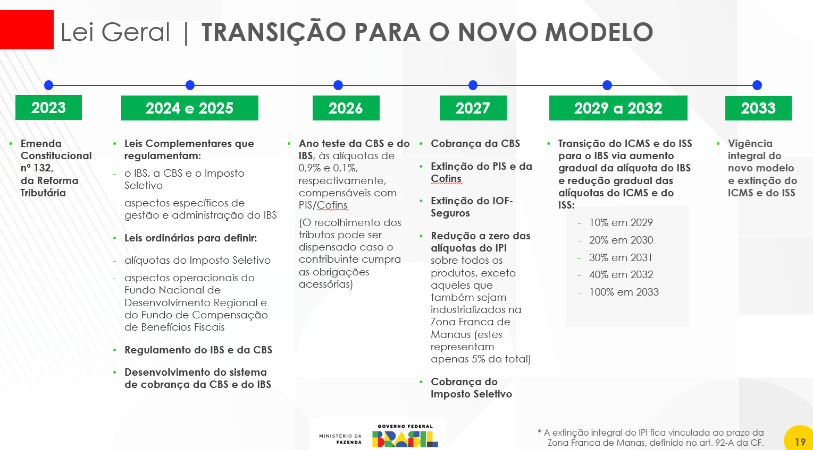
```

The tax reform approved in 2023 will be implemented slowly, starting in 2026 and ending in 2033 [[Ministério da Fazenda]](https://www.gov.br/fazenda/pt-br/acesso-a-informacao/acoes-e-programas/reforma-tributaria/regulamentacao-da-reforma-tributaria/lei-geral-do-ibs-da-cbs-e-do-imposto-seletivo/apresentacoes) 

---
class: middle

```{r, echo=FALSE, out.width = '80%'}
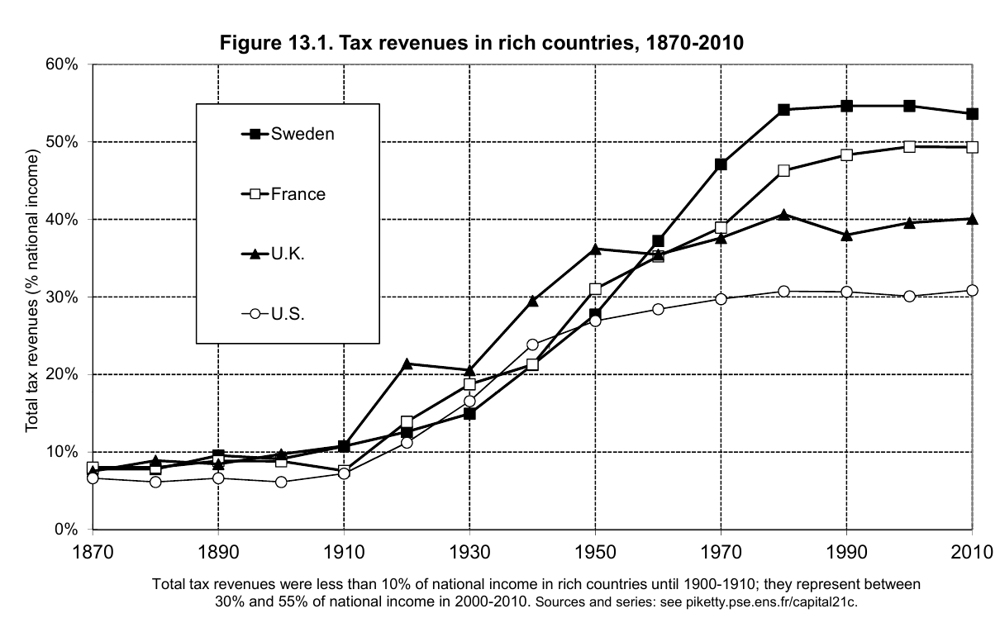
```

Until the 1st World War, the fiscal capacity of (today) developed countries was low, collecting less than 10% of GDP. Mostly due to the war effort, it rose to $\approx 30\%$ in Post-WWII, and since then diverged between European countries and the US, rising to more than half of GDP in Scandinavian countries `r Citep(myBib, "piketty2018capital")`

---
class: middle

```{r, echo=FALSE, out.width = '90%'}
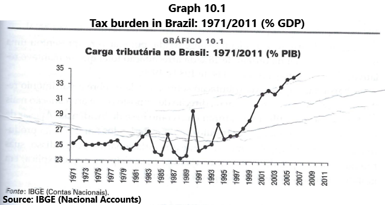
```

The tax burden as a proportion of GDP remained relatively constant during the dictatorship, rising after the 1988 Constitution &mdash; but the most significant growth was in the 2000s, converging with the OECD average `r Citep(myBib, "giambiagi2017financcas")`

---
class: middle

```{r, echo=FALSE, out.width = '100%'}
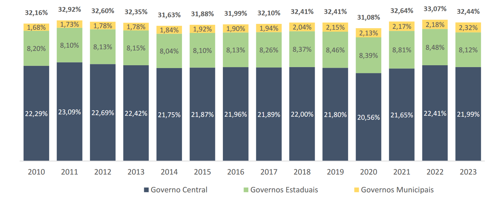
```

Since then, the tax burden has remained constant in proportion to GDP. From 33% collected by the Brazilian government, 2/3 are collected by the federal government, a quarter by the states, and less than 10% by the municipalities [[Boletim CTB 2023]](https://sisweb.tesouro.gov.br/apex/f?p=2501:9::::9:P9_ID_PUBLICACAO:46589) 

---
class: middle

```{r, echo=FALSE, out.width = '100%'}
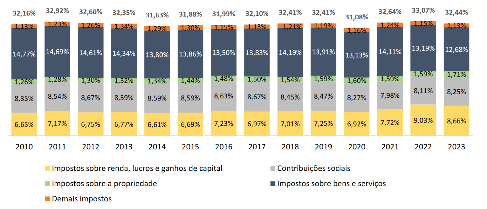
```

In Brazil, the largest source of government revenue is indirect taxes (43%), followed by social contributions (26%), income taxation, profit and capital gains taxes (22%), and property taxes (5%) [[Boletim CTB 2023]](https://sisweb.tesouro.gov.br/apex/f?p=2501:9::::9:P9_ID_PUBLICACAO:46589) 

---
class: middle

```{r, echo=FALSE, out.width = '90%'}
knitr::include_graphics("figs/eae0310-8-2.png")
```

Countries around the world differ a lot in how they collect their taxes, but in general they tax more income and profits (33% OECD average vs 22% here) and less consumption (33% OECD vs 43% here) than in Brazil `r Citep(myBib, "gruber")` 

---
class: inverse, middle, center

# Kleven, Henrik (2014). “How Can Scandinavians Tax so Much?”

---
class: middle
## How can Scandinavians tax so much?

A naive economist visiting Scandinavian countries would be shocked: although they redistribute a lot of income through distortive taxation, they are still among the richest countries in the world

The **trade-off efficiency and equity** should imply that countries with high distortive income redistribution (*Okun's leaky bucket*) would be very inefficient and thus poorer &mdash; but in the case of Scandinavia, it does not seem to happen 

Kleven asks in this paper the question: *why*?

---
class: middle
## Participation tax rate

`r Citep(myBib, "kleven")` presents two measures that represent how much more distortive taxation is in Scandinavian countries 

The **participation tax rate** is the ratio of the increase of net income when an individual starts to work in relation to his wage:

$$1 - \frac{\text{Disposable income from work
} - \text{Inactive disposable income}}{\text{Initial income from work}}$$

---
class: middle
## Participation tax rate

This increase may be lower due to labor income taxation and the loss of assistance programs received when unemployed &mdash; at the limit, the *participation tax rate* can be higher than 100% if starting to work *reduces* the individual’s disposable income

If the salary in Denmark is €1000 and the participation rate is 80%, then starting to work only increases individuals' income by €200 &mdash; for example, if social assistance is €500 and the average tax rate is 30%

The participation tax rate measures the disincentives for the inactive population to enter the labor market (**extensive margin**)

---
class: middle
## Marginal rate at the top

Another statistic that informs about the distortionary impact of the tax system is the **marginal tax rate at the top**: how much of an extra $1 of income do the richest have to pay in taxes

If $T(y)$ are the top marginal tax rate paid as a function of the individual's income, then the marginal tax is $\lim_{y\rightarrow \infty} T^{\prime}(y)$

But in the real world, tax systems are generally *piecewise-linear*, therefore, the marginal tax at the top will be just the maximum income tax rate plus other taxes 

---
class: middle

```{r, echo=FALSE, out.width = '90%'}
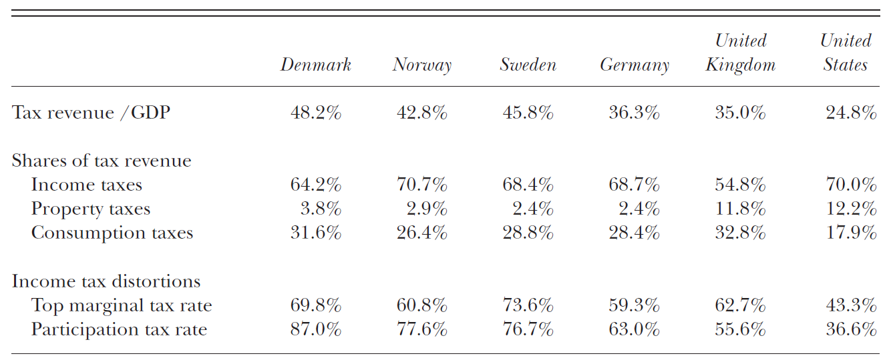
```

The participation rate in Scandinavian countries is around 80%, as opposed to 36% in the US, but the workforce participation rate in the Scandinavian countries is higher than in the US `r Citep(myBib, "kleven")`

---
class: middle
## How can Scandinavians tax so much?

There are three characteristics of the Scandinavian tax system that allow this, and countries should emulate them if they want to increase redistribution

1. A good information system and third-party reporting guarantee low **tax evasion** (it is also important the low proportion of self-employed workers)
2. A broad collection base that prevents **tax avoidance**; and
3. Subsidy or public provision of complementary goods to work, such as preschool and transportation

---
class: middle
## Information by third parties and tax evasion

*Taxation depends on information*: as individuals have no incentive to reveal how much tax they should pay, the tax system needs information about transactions for **tax enforcement**

This information is most effectively acquired by **third-party reporting** &mdash; when the system is constructed so that each agent reveals the taxable transactions of other agents in the economy

Firms report how much they pay in wages, credit card companies report user spendings, producers paying VAT on their suppliers' revenue, etc., and the government can cross-reference this information to avoid *tax evasion*

---
class: middle

```{r, echo=FALSE, out.width = '75%'}
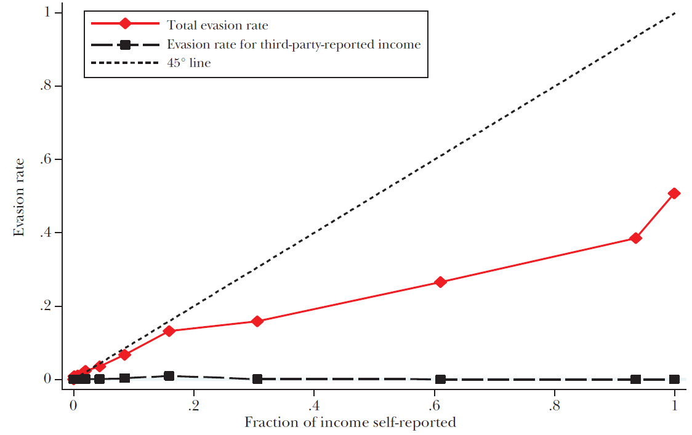
```

In Denmark, the greater the proportion of self-reported income (for example, small enterprises), the greater is the tax evasion &mdash; but this relation is only valid when there is no *third-party reporting* `r Citep(myBib, "kleven")`

---
class: middle
## Types of employment and tax evasion

Because of employers' information and **withholding**, formal employment has almost no evasion &mdash; in the US, only 1% of this income evades taxes

In contrast, the *self-employed worker* has very little third-party reporting, and tax evasion is easy

Informal employment evades taxes by definition, but it also facilitates tax evasion by the firm &mdash; here is also "partially informal" work, in which the firm only formally reports part of the worker's wage

---
class: middle

```{r, echo=FALSE, out.width = '75%', fig.align='center'}
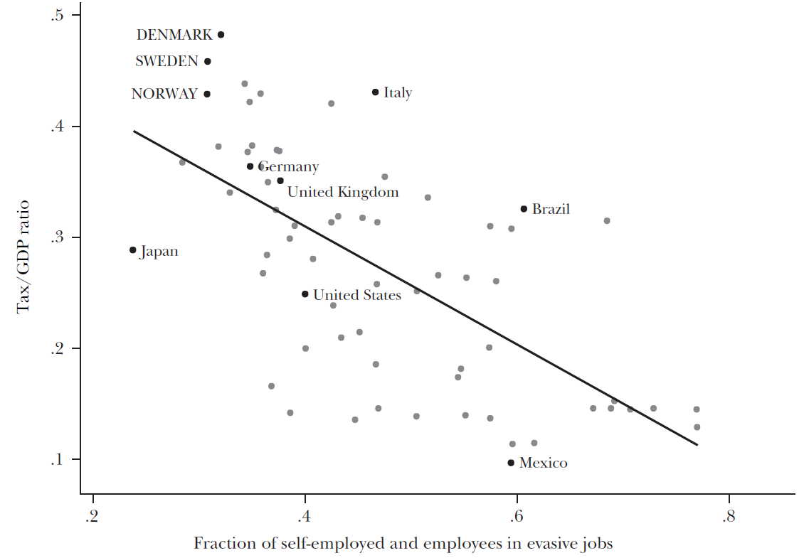
```

Countries with a smaller fraction of self-employed workers and working on easy to evade jobs on average have a higher tax burden &mdash; this is a reasonable argument why Brazil should have a lower tax burden than OECD countries `r Citep(myBib, "kleven")`

---
class: middle
## Basis of collection and tax avoidance

A way to reduce tax avoidance, reducing the efficiency cost of taxation, is to *increase the tax base*, that is, to tax similarly similar types of income

There are several ways to metamorphose the type of income: from salary to profit, through "pejotização", from dividends to capital gains, IRPF deductions, etc

The more consistent the taxation of these many types of income, the smaller is the possibility to avoid taxes by changing from one type of earnings to another

---
class: middle
## Basis of collection and tax avoidance

This larger tax base implies a lower **elasticity of taxable income**,  which is an important statistic for calculating the efficiency costs of taxation (more about this in the next classes)

In fact, the increase in this base has caused a drop of this elasticity in Denmark from (estimated) 0.21-0.28 in 1987 to 0.05-0.15 today, far below what is believed to be the value to the US (0.4-0.5)

Another reason is the low proportion of self-employed workers again, that the empirical evidence points to having a much higher taxable income elasticity

---
class: middle
## Work subsidies

The major source of inefficiency from taxation is that people ** work less** than they would without distortions

In this way, the subsidy for **complementary goods to work** can reduce this inefficiency and allow greater income redistribution

Particularly, kindergartens, preschools, public asylums and subsidized transport encourage people to work even with a high *participation tax rate*

---
class: middle

```{r, echo=FALSE, out.width = '65%'}
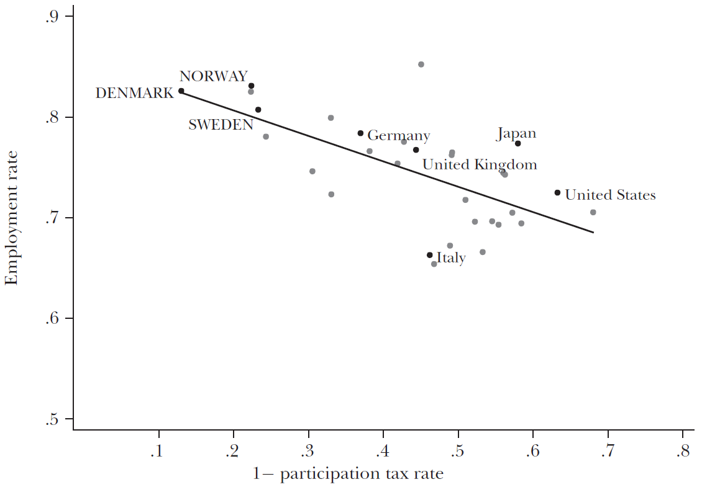
```

Higher participation rates (smaller shares that remain with the worker in the graph) are not clearly reflected in lower participation in the labor market: actually, in *cross-country* correlations, we see exactly the opposite `r Citep(myBib, "kleven")` 

---
class: middle
## Socio-cultural influences

Another reason Scandinavian countries collect more taxes is because people are *willing* to pay more taxes

Intrinsic (morals, culture) or social (social norms, trust) motivations make them not want to evade taxes even if they have the chance to: economists call this **tax morale**

It is hard to say whether sociocultural characteristics affect tax payments or choice of state size &mdash; countries with greater *social cohesion* and *civic capital* tend to choose greater redistribution


---
class: middle

```{r, echo=FALSE, out.width = '90%'}
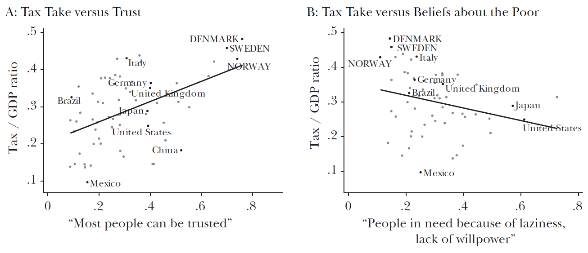
```

Countries where people trust others more, panel (a), and which do not consider that poverty comes from laziness or lack of willpower, panel (b), have a higher tax burden on average `r Citep(myBib, "kleven")` 

---
class:middle
# References
<small>
```{r refs, echo=FALSE, results="asis"}
PrintBibliography(myBib, start=1, end=5)
```
</small>

---
class:middle
# References
<small>
```{r refs2, echo=FALSE, results="asis"}
PrintBibliography(myBib, start=6)
```
</small>


<!-- --- -->
<!-- class: middle -->

<!-- ```{r, echo=FALSE, out.width = '100%'} -->
<!-- 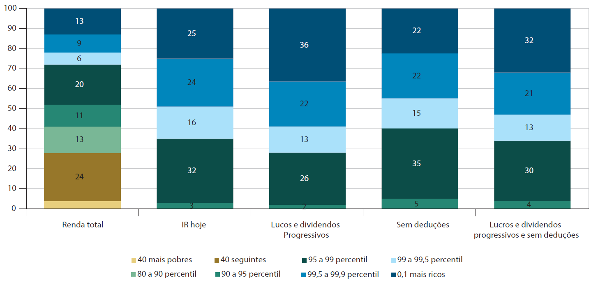 -->
<!-- ``` -->

<!-- Progressividade do IR sem e com reduções nos gastos tributários, 2008 `r Citep(myBib, "silveira2019beneficios")`  -->

