class: inverse, middle, center

```{r, load_refs, include=FALSE, cache=FALSE}
library(RefManageR)
BibOptions(check.entries = FALSE,
           bib.style = "alphabetic",
           cite.style = "alphabetic",
           style = "markdown",
           hyperlink = FALSE,
           dashed = FALSE)
myBib <- ReadBib("./esp_bib.bib", check = FALSE)
```

# Taxation on savings

---
class: middle

```{r, echo=FALSE, out.width = '50%', fig.align='center'}

```

@4TaxFairness

---
class: middle
## Inequality of capital income

The main way of reducing socioeconomic inequalities is the progressive taxation system of labor income and transfers, since labor income accounts for around three-quarters of the national product

But the richest 1%, and especially the richest 0.1%, are only slightly affected by taxation on labor income, since most of their income comes from capital (or at least it is easily transformed into capital income)

As we have seen, through the **targeting principle**, if the only heterogeneity is *skill*, we should only tax labor &mdash; but if savings or rate of return is unequal, so taxing capital becomes important

---
class: middle

```{r, echo=FALSE, out.width = '70%', fig.align="center"}
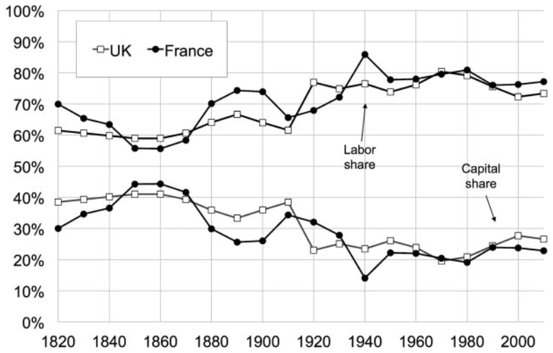
```

In 1850, during the Industrial Revolution, capital's share of national income was nearly 50%, but it has dropped since then, and today it accounts for only 25-30% of GDP, the complement being the labor share `r Citep(myBib, "piketty2014capital")`

---
class: middle

```{r, echo=FALSE, out.width = '80%', fig.align='center'}
knitr::include_graphics("figs/eae0310-12-5.png")
```

Brazilian wealth is extremely unequal distributed (even in international comparison): the richest 10% have around 3/4 of Brazilian wealth, and the richest 1% have half &mdash; as it is common internationally, the poorest 50% have effectively zero (net) wealth [(WID)](https://wid.world/country/brazil/)

---
class: middle

```{r, echo=FALSE, out.width = '85%', fig.align='center'}
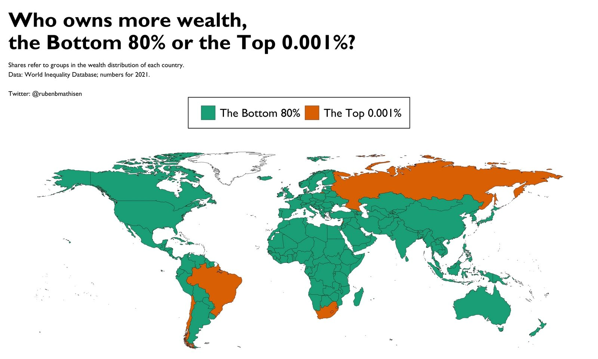
```

Brazil is among only 6 countries in the world where the poorest 80% have less wealth than the richest 0.001% (1/100,000), in other words, 2,000 people (the size of the FEA's student body) have more wealth than 170 million Brazilians together [(WID and @rubenbmathisen)](https://twitter.com/rubenbmathisen/status/1508148771225485316)

---
class: middle

```{r, echo=FALSE, out.width = '70%', fig.align='center'}
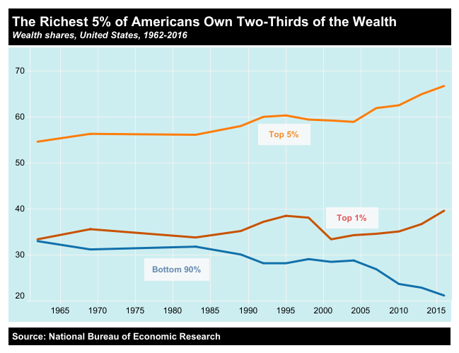
```

In the US, wealth inequality is only slightly better: the richest 5% have 2/3 of the wealth, and the richest 1% have 40% [(Inequality.org)](https://inequality.org/facts/wealth-inequality/)

---
class: middle

```{r, echo=FALSE, out.width = '80%'}
knitr::include_graphics("figs/eae0310-12-7.png")
```

In the US, the wealth of the 90% grew until the 80s with incentives for homeownership, but it has dropped (proportionally) since then due to income and savings inequality, besides tax reductions &mdash; and this movement was mirrored by the doubling the share of wealth owned by the richest 0.1%, which today have 20% of that country's wealth `r Citep(myBib, "piketty2018distributional")`

---
class: middle

```{r, echo=FALSE, out.width = '75%'}
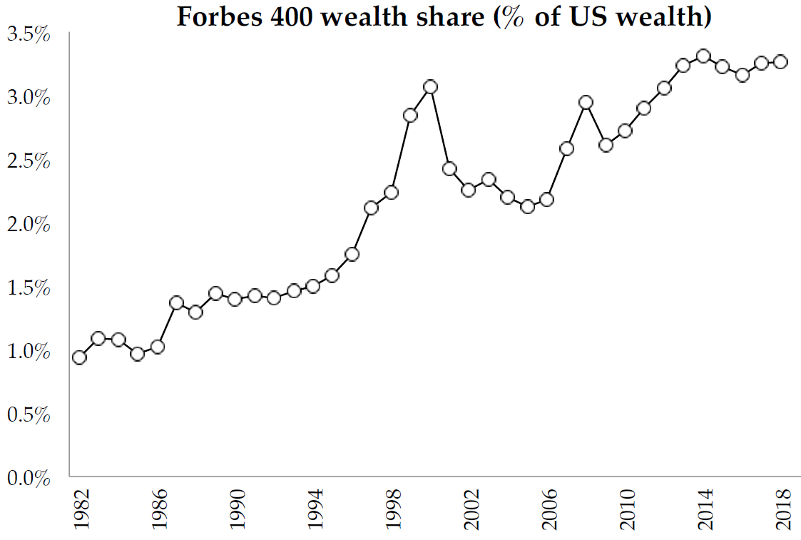
```

Another way to look at wealth inequality is the Forbes 400 richest list: since 1982, their wealth has tripled, surpassing 3% of the total American wealth &mdash; 3% of total wealth for the (nearly) 1-in-a-million richest (Saez)


---
class: middle

```{r, echo=FALSE, out.width = '50%'}
knitr::include_graphics("figs/eae0310-13-10.png")
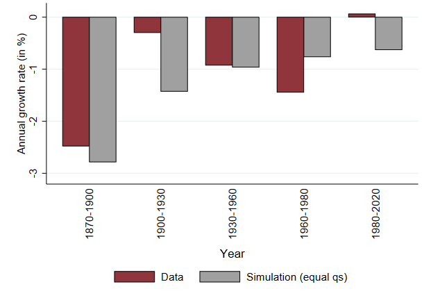
```

**Racial inequality of wealth**: in the US, in 1860, during Emancipation, the wealth of white people was 56x higher than of black people: there was a marked improvement in the following decades, slowing down in the 20th century &mdash; but since the 2000s, this inequality has *increased*, going back to the level of the Civil Rights Movement in the 60s (5-7x higher) `r Citep(myBib, "derenoncourt2022wealth")`

---
class: middle

```{r, echo=FALSE, out.width = '70%', fig.align='center'}
knitr::include_graphics("figs/eae0310-12-1.png")
```

While only 10% of income for 90% of the bottom comes from capital, 60% of income of the richest 1% and 70% of the top 0.1% comes from this factor of production (or at least it is reported as it): taxing labor has limited redistribution capacity in these groups `r Citep(myBib, "piketty2018distributional")`

---
class: middle
## Dynamics of wealth

If the wealth in $t$ is $W_t$ and the rate of return $r_t$, then the capital return is $r_t W_{t-1}$ and: $$W_t = (1 + r_t) W_{t-1} + S_t + I_t$$

The wealth in $t$ will be the wealth in $t-1$ plus capital income, the saving $S_t$ and eventual inheritance $I_t$: people have unequal wealth because of:

1. Different ages (**life-cycle wealth inequality**)
2. Differences in the amount saved in the past $S_t$, potentially by different labor income $Y_t$, since $S_t = Y_t - C_t$
3. Differences in inheritances received $I_t$ (**inherited wealth inequality**)
4. Different rates of return $r_t$

---
class: middle
## Forms of capital taxation

There are many ways to tax capital:

(i) **Corporate income tax:** in Brazil, there is a 15% IRPJ on real profit (25% above 240K/year) and a 9% Social Contribution on Net Income (CSLL) (20% for financial institutions) (*)

(ii) **Personal income tax on capital:** in Brazil, dividends are *exempt*, and capital gains taxed at 15% (up to 5MM, rising progressively to 22,5% above 30MM), but deductible from IRPJ and CSLL


(*) But it is not quite like this. In Brazil, there is the Simples (progressive rates starting from 4-6% of revenue, up to 4.8MM/year) and also presumed profit (revenue up to 78MM/year)

---
class: middle
## Forms of capital taxation

(iii) **Inheritance taxation:** in the US, there is a 40% tax on inheritances above $11MM, in Brazil, it is state tax with a maximum rate of 8%

(iv) **Property tax:** There is the IPVA, state tax at a rate (SP) of 4% of the car (2% others) and IPTU, which is a municipal tax that in São Paulo varies from 0 to 1.6% of the property value (progressive rate on imputed housing value)

(v) **Wealth tax:** levied on people's total net worth; it exists in only a few countries (not in Brazil)

These next 3 weeks we will focus entirely on the capital taxation: this week we will study (ii), the following week (iii)-(v), and on the last week, topic (i)


---
class: middle
## Life-cycle model

Individuals live 2 periods, supply $l$ work hours in the first one and do not work in the second one (retirement). They consume $c_1$ in the first and $c_2$ in the second: $$U(c_1, c_2, l) = u(c_1, l) + \beta u(c_2)$$

Then the saving (always in period 1) is $s = wl - c_1$, and consumption at the second period, $t=2$, will be $c_2 = (1 + r)s$, where $rs$ is the capital income

This generates an **intertemporal budget constraint**: $$c_1 + \frac{c_2}{1 + r} = wl$$

---
class: middle
## Life-cycle model

Substituting into the utility function, the individuals solve: $$\max_{l, c_2} u \left( wl - \frac{c_2}{1 + r}, l \right) + \beta u(c_2)$$

The first-order conditions for labor supply and saving, resp. are:

$$[l]: w\frac{\partial u}{\partial c_1} + \frac{\partial u}{\partial l} = 0$$
$$[c_2]: - \frac{1}{1 + r} \frac{\partial u}{\partial c_1} + \beta \frac{\partial u}{\partial c_2} = 0 \Rightarrow \frac{\partial u}{\partial c_1} = \beta (1 + r) \frac{\partial u}{\partial c_2}$$

---
class: middle
## Life-cycle hypothesis

If $\beta = 1/(1 + r)$ (which will occur in equilibrium in complete and frictionless markets), then individuals *smooth consumption perfectly* throughout the life-cycle (this result is known as the **life-cycle hypothesis**)

The life-cycle hypothesis is: (i) disproved in the data; and (ii) very important in macro, because it is a necessary condition for important theories, such as the *Ricardian equivalence*

In the real world, where the richest 1% have 50% of the wealth, it is hard to believe that billionaires are saving and investing to smooth consumption &mdash; but it probably roughly accounts for the 90% in the "bottom"


---
class: middle

```{r, echo=FALSE, out.width = '90%', fig.align='center'}
knitr::include_graphics("figs/eae0310-12-20.png")
```

Consumption smoothing with a concave income profile during life implies a **life-cycle** of wealth accumulation: positive savings during working age and then negative savings during retirement until wealth riches zero at death

---
class: middle

```{r, echo=FALSE, fig.show="hold", out.width="50%"}
knitr::include_graphics("figs/eae0310-12-14.png")
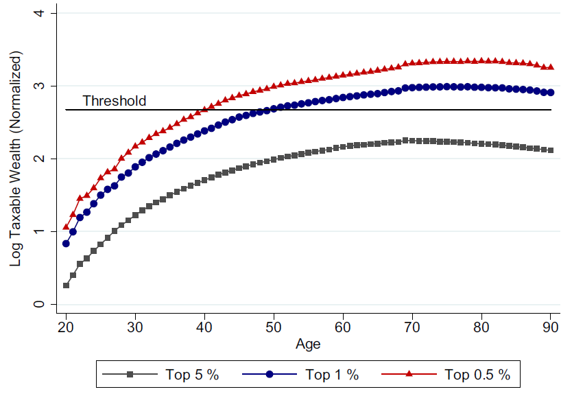
```

In Denmark, we observe a wealth profile more or less compatible with the **life-cycle hypothesis** in the overall positive wealth population (a), with wealth rising in active years and falling in retirement (but less than it should) &mdash; but the same movement does not occur among the richest, whose wealth grows until the end of life (b) `r Citep(myBib, "jakobsen2020wealth")` 

---
class: middle

```{r, echo=FALSE, out.width = '80%'}
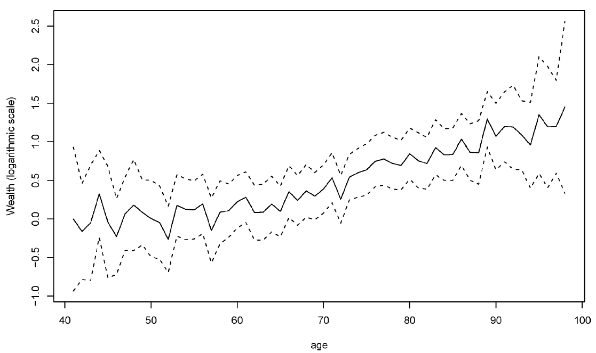
```

In the US, the wealth of the richest also grows continuously until death, contrary to the life-cycle hypothesis, which would imply a drop in wealth in retirement (**consumption smoothing**) &mdash; this behavior is more consistent with wealth in utility function `r Citep(myBib, "kopczuk2007bequest")`

---
class: middle
## Equivalence between consumption and income taxation

Now, consider a consumption tax $\tau_C$. The budget constraint becomes $(1 + \tau_C) \left( c_1 + \frac{c_2}{1 + r} \right) = wl$

Instead, if we apply a tax on (labor) income $\tau_L$, the BC is now $c_1 + \frac{c_2}{1 + r} = (1 - \tau_L)wl$

If $(1 + \tau_C) = 1/(1 - \tau_L)$, the taxes are equivalent: we have already seen that this equivalence holds statically &mdash; this is a simplified example of (linear) taxes equivalence on income and on consumption **and inheritances** throughout the life-cycle (in steady-state)

---
class: middle
## Taxation in the life-cycle model

$$\max_{l, c_2} u \left( (1 - \tau_L)wl - \frac{c_2}{1 + r}, l \right) + \beta u(c_2)$$

$$[l]: (1 - \tau_L)w\frac{\partial u}{\partial c_1} = - \frac{\partial u}{\partial l}$$
$$[c_2]: \frac{\partial u}{\partial c_1} = \beta (1 + r) \frac{\partial u}{\partial c_2}$$
Consider an **income tax**: the labor income decreases as there is an *income effect*; furthermore, the relative price of labor and leisure changes (*substitution effect*) &mdash; but there is no distortion of *intertemporal consumption choice* (only income effect)

---
class: middle
## Taxation in the life-cycle model

With a capital tax $\tau_K$, $c_2 = (1 + r(1 - \tau_K))s$ and the BC becomes: $c_1 + \frac{c_2}{1 + r(1 - \tau_K)} = wl$

$$\max_{l, c_2} u \left( wl - \frac{c_2}{1 + r(1 - \tau_K)}, l \right) + \beta u(c_2)$$

$$[l]: w\frac{\partial u}{\partial c_1} = - \frac{\partial u}{\partial l}$$
$$[c_2]: \frac{\partial u}{\partial c_1} = \beta (1 + r(1 - \tau_K)) \frac{\partial u}{\partial c_2}$$
Here it is the opposite, the relative price of labor and leisure does *not* change, but of intertemporal consumption does

---
class: middle
## Taxation in the life-cycle model

As in taxation on labor, **taxation on capital** (savings) involves income and substitution effects:

1. *Substitution effect:* the tax makes consumption in period 2 more expensive in relation to consumption in period 1: savings decrease
2. *Income effect:* the tax makes individuals poorer, who consume less in $t=1$ *and* in $t=2$, but as $s = wl - c_1$, lower $c_1$ implies that savings increase

Therefore, the effect *on savings* is theoretically **ambiguous**! In fact, if utility is log in consumption, both effects cancel each other out and the impact of the tax on saving will be exactly zero

---
class: middle

```{r, echo=FALSE, out.width = '74%'}
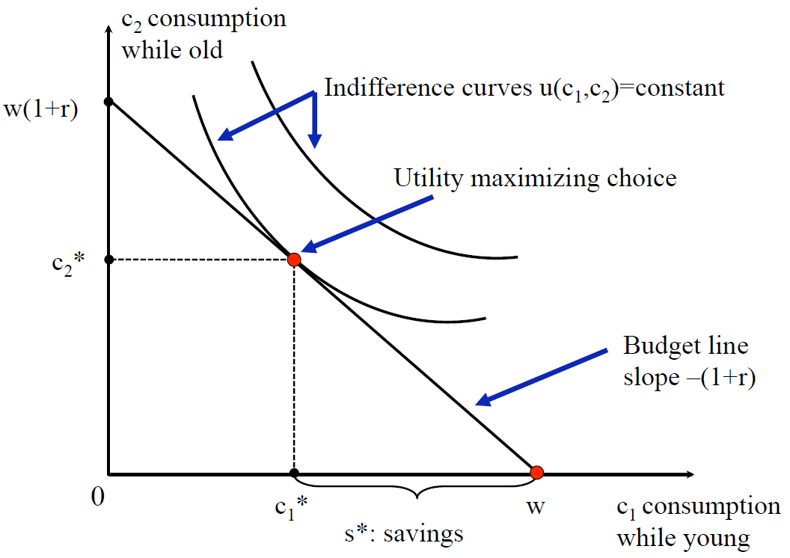
```

Agents choose between consumption in periods 1 and 2, with a budget constraint slope  $- (1 + r)$, abscissa at zero $w$ (assuming $l=1$), and $w - c_1 = s$ is the amount saved (Saez)

---
class: middle

```{r, echo=FALSE, out.width = '76%'}
knitr::include_graphics("figs/eae0310-12-10b.png")
```

A tax on return on capital makes consumption in period 2 more expensive: **rotates** BC to the slope $- (1 + r(1 - \tau_K))$ (Saez)

---
class: middle

```{r, echo=FALSE, out.width = '80%'}
knitr::include_graphics("figs/eae0310-12-10c.png")
```

The **substitution effect**, maintaining utility constant, increases $c_1$, decreases $s$ and $c_2$, as the **income effect** decreases $c_2$ and $c_1$, but (because of this) increases $s$ &mdash; here, the income effect is stronger, and capital taxation increases savings (Saez)

---
class: middle
## Effect of taxation on savings

As with labor taxation, the theoretical answer is ambiguous: the effect of capital taxation on savings is an *empirical question*!

Unfortunately, contrary to the previous class, the evidence in this case is much less reliable: there is no unanimity among economists whether such taxation decreases, does not affect, *or even increases* savings

Estimating *behavioral effect* on savings is much more difficult than on labor supply: there is the difficulty of identifying the composition effect of savings, besides dynamic effects and less observability

---
class: middle
## Optimal tax in life-cycle model

Imagine that the government can progressively tax income with a tax $T(z)$ and tax capital at a rate $\tau_K$, and the only reason for wealth inequality is differences in saving from income inequality (**reason 2**)

So, through the **targeting principle**, capital taxation should be zero: the government can achieve its redistribution objectives purely by taxing labor income

In this case, taxing capital would distort the saving decision unnecessarily, since redistributing income would also solve wealth inequality

---
class: middle
## Optimal tax in life-cycle model

But inequality in capital income also comes from differences in inheritance, patience and rates of return: taxation of labor income is not enough to redistribute wealth, and there is room for taxation of capital

It is often difficult to distinguish labor income from capital income (e.g., owner of the firm who is also CEO, "pejotização" &mdash; taxing capital is important to increase the tax base and reduce tax avoidance/evasion

Rates of return vary a lot between individuals and over time, and they are correlated with income: rising from the 10th to the 90th percentile of net worth increases the rate of return on investments by 10p.p. `r Citep(myBib, "fagereng2020heterogeneity")`

---
class: middle

```{r, echo=FALSE, out.width = '70%'}
knitr::include_graphics("figs/eae0310-12-15.png")
```

Something that is not taken into account in the models we have seen, but which is an important stylized fact is that richer people have not only more wealth, but a higher rate of return on wealth as well, which tends to increase wealth inequality over time `r Citep(myBib, "fagereng2020heterogeneity")`

---
class: middle
## Other savings theories

With incomplete markets, people need to save money not only to smooth consumption over time, but also in different states of nature (**precautionary savings model**)

Sometimes individuals would like to save more, but have **self-control** difficulties: experiments show that *nudges* or *commitment mechanisms* can increase savings

It is common for individuals to have at the same time low net savings with a low rate of return (e.g. private pension or housing) and debt with a high interest rate

---
class: middle

```{r, echo=FALSE, out.width = '95%'}
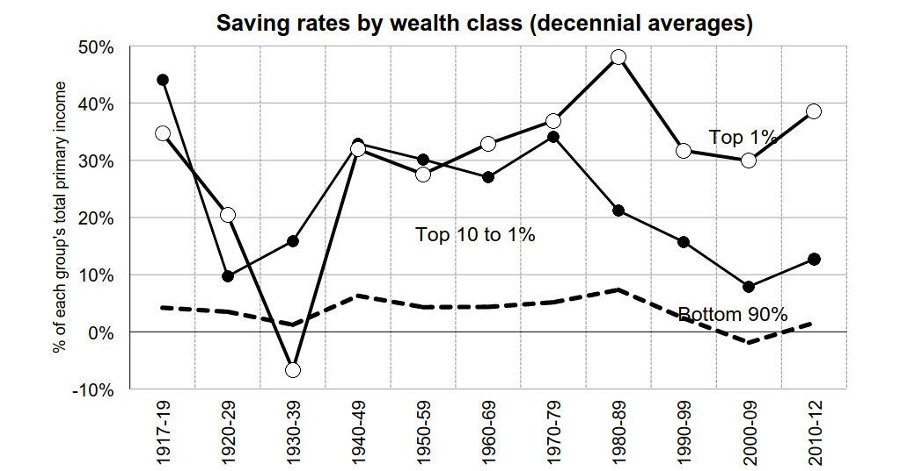
```

Since the 1970s, the ultra rich has a higher savings rate than the rich, and a much higher rate than middle class and the poor, which in USA save almost nothing `r Citep(myBib, "saez2016wealth")` 

---
class: middle

```{r, echo=FALSE, fig.show="hold", out.width="50%"}
knitr::include_graphics("figs/eae0310-12-16.png")
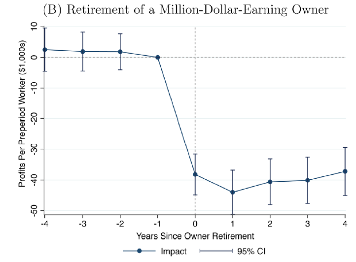
```

`r Citep(myBib, "smith2019capitalists")` argue that part of the capital income actually *comes from work of managing firms* by the entrepreneur, even for medium-sized companies &mdash; this would be shown by the fact that they lose a good part of their market value when the owner dies or retires

---
class: middle

```{r, echo=FALSE, out.width = '50%', fig.align='center'}
knitr::include_graphics("figs/eae0310-12-17.png")
```

If we calculate (from the previous analysis) that 75% of the income of this type of business is labor factor, the proportion of the 0,1% that receives most of the income per wage increases from 23% to more than half, and for the 1% to 80% `r Citep(myBib, "smith2019capitalists")`

---
class: middle

```{r, echo=FALSE, fig.show="hold", out.width="50%"}
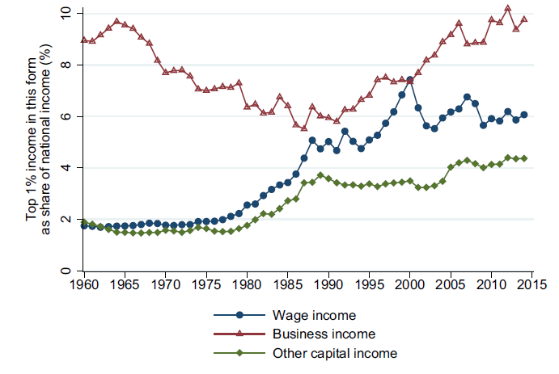
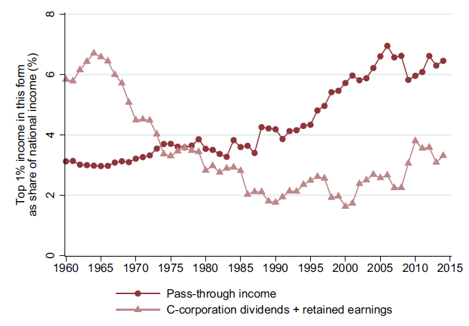
```

As we saw in the last class, the share of the richest 1% income in the US has more than doubled since the 80s, reaching 20% &mdash; it was due to the tripling of salaries and the growth of corporate income, a good part of it is also potentially labor compensation `r Citep(myBib, "smith2019capitalists")`

---
class: middle
## Tax incentives for savings

The low savings rate in Brazil (15% in 2020) and low retirement savings lead governments to institute many savings subsidy programs

In Brazil, companies can deduct contributions for employees' private pension from IRPJ and CSLL &mdash; there is also the "regressive table", with lower rates for longer savings maturities (up to 10%)

Another tax incentive is **deferred payment** on the IRPF: paying the same tax rate only at the end of maturity has a lower tax cost than in each period, because the individual is left with the interest on the tax due

---
class: middle
## Tax incentives for savings

The problem is that even if increasing savings is worth the subsidy, as we have seen the theory is ambiguous on the effects of these tax incentives about actually increase savings: they might even *decrease* it

In the real world, most subsidies have a ceiling: in this case, for savers above the ceiling, the effect is not ambiguous: it *always* decreases savings (!)

It happens because above the ceiling there is no longer a substitution effect (which tends to increase savings), but there is still an income effect (which tends to decrease)

---
class: middle

```{r, echo=FALSE, fig.show="hold", out.width="50%"}
knitr::include_graphics("figs/eae0310-12-11.png")
knitr::include_graphics("figs/eae0310-12-11b.png")
```

A saving subsidy of up to $2,000 rotates the BC out to that point, generating a substitution effect (steeper slope) and an income effect (the budget increases): for those earning less than $2,000 in A, the effect is ambiguous (B or C) in (a), but in (b) those who save more than $2,000 always reduce their savings (there is only an income effect) `r Citep(myBib, "gruber")` 

---
class: middle
## Empirical evidence

Evidence of inattention (**bounded rationality**): changing an optional retirement plan from *opt-in* (default out) to *opt-out* (default in) increased *take-up* from 50% to 90% of a firm's hires `r Citep(myBib, "madrian2001power")`

Especially high effect for people with poor education: from 13% to 80%!

`r Citep(myBib, "chetty2014active")` find that in Denmark 85% of agents are "passive savers", who do not respond to incentives (but respond to *nudges*!)

While for the other 15% subsidies have large behavioral effects, but are only savings composition (*crowding out*) &mdash; for every $1 of subsidy, total savings increase by only ¢1 

---
class: middle

```{r, echo=FALSE, out.width = '80%'}
knitr::include_graphics("figs/eae0310-12-12.png")
```

In 1999, Denmark cut subsidies to private pensions for the rich (blue), but not for the middle class (red): the contribution to this type of pension fell considerably in treatment compared to control &mdash; but only replacement for other types of savings `r Citep(myBib, "gruber")` apud `r Citep(myBib, "chetty2014active")`

---
class:middle
# References
<small>
```{r refs, echo=FALSE, results="asis"}
PrintBibliography(myBib, start=1, end=5)
```
</small>

---
class:middle
# References
<small>
```{r refs2, echo=FALSE, results="asis"}
PrintBibliography(myBib, start=6)
```
</small>


<!-- --- -->
<!-- class: middle -->
<!-- ## Relação entre taxação de renda e consumo -->

<!-- Como vimos, ao longo da vida, taxação de renda é equivalente à taxação de consumo + taxação de heranças &mdash; a proposta (por conservadores) de trocar taxação de renda por consumo é chamada de **fundamental tax reform** -->

<!-- Essa mudança geraria uma taxação "uma vez só" na riqueza, já que ela compraria menos no futuro (assim como inflação não esperada); também é taxação dupla da geração que sofre a mudança -->

<!-- O problema principal entretanto é outro: taxação de consumo não é progressiva, e na verdade é regressiva, já que ricos consomem proporção menor da renda -->
