class: inverse, middle, center

```{r, load_refs, include=FALSE, cache=FALSE}
library(RefManageR)
BibOptions(check.entries = FALSE,
           bib.style = "alphabetic",
           cite.style = "alphabetic",
           style = "markdown",
           hyperlink = FALSE,
           dashed = FALSE)
myBib <- ReadBib("./esp_bib.bib", check = FALSE)
```


# Consumption taxes

---
class: middle
## Productive efficiency

The **production efficiency theorem** `r Citep(myBib, "diamond1971optimal")` says that without externalities and market power, taxes should never distort the firm's productive choice

This implies that there is no distortion of relative input prices, only the final good &mdash; the intuition is that any tax on production distorts production **and** consumption, so it must be worse than distorting only consumption

In general, this is a strong argument *against taxing intermediate goods*, and the main reason why tax systems tend to tax only the *final sale of goods* (but tax factors of production)

---
class: middle
## Value added tax

Consumption taxation (indirect taxes) can be levied on sales by collecting a tax $t$ (proportional or fixed) on the sale of the *final good*

But in recent decades, **value added tax (VAT)** has become much more common: each producer pays a tax on their sales revenue, but **deducts** the taxes paid *upstream*

That is why it is a **value added** tax, its basis is the revenue minus the cost of supplies (the value added) &mdash; with perfect *compliance* and no exemptions, VAT is equivalent to a tax on sales

---
class: middle

```{r, echo=FALSE, out.width = '100%'}
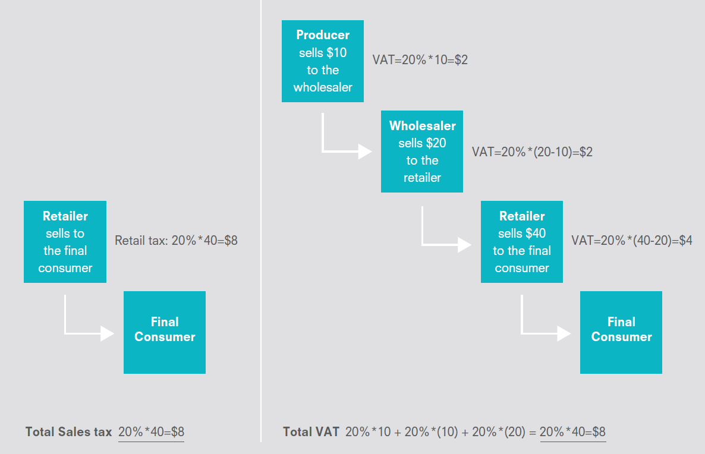
```

Operation of a tax on sales and a VAT of 20% `r Citep(myBib, "gerard2018value")` 

---
class: middle
## Value added tax

Its advantage comes from making tax evasion difficult: each producer in the production chain deducts the tax paid *upstream*, which provides an incentive for **third-party reporting**

VAT can be a powerful tool to combat tax evasion in *business-to-business* (B2B) transactions, because the *downstream* company earns money by reporting the transaction to the government

But this does not work for the transactions with consumers &mdash; it was to try to avoid this "hole" in VAT that the government of São Paulo introduced the Nota Fiscal Paulista (NFP)

---
class: middle

```{r, echo=FALSE, out.width = '75%', fig.align='center'}
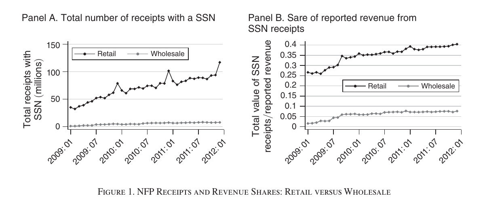
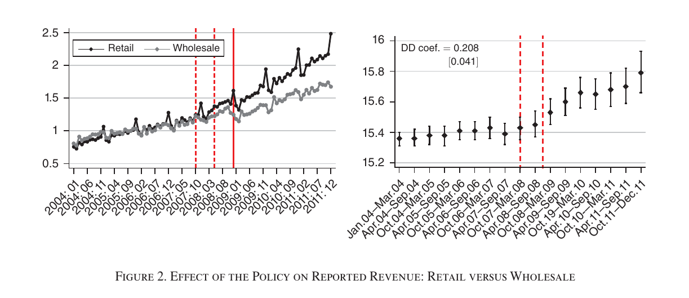
```

`r Citep(myBib, "naritomi2019consumers")` studied the effect of introducing the Nota Fiscal Paulista program in 2008, comparing the before and after behavior of retail stores (treatment) vs wholesale (control)

---
class: middle

```{r, echo=FALSE, out.width = '50%', fig.show="hold"}
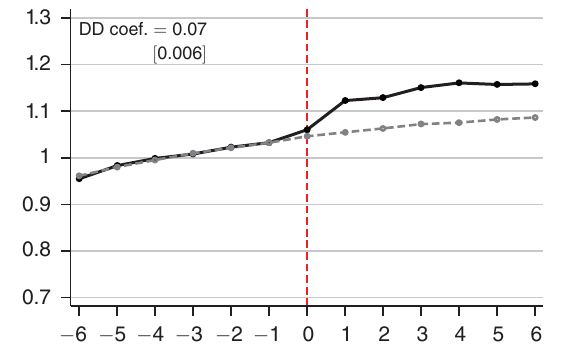
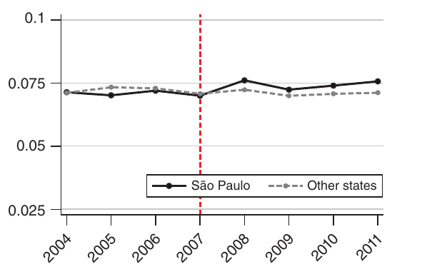
```

Part of the effect comes from consumer complaints: after a complaint, firms report 7% more sales to the government (left) &mdash; Nota Fiscal Paulista led to a 9.3% increase in ICMS (Imposto sobre Circulação de Mercadorias e Serviços) tax revenue in São Paulo, compared to other states (right) `r Citep(myBib, "naritomi2019consumers")` 

---
class: middle
## Optimal consumption tax

So far, although we have been analyzing welfare effects, the study of incidence and deadweight loss of taxes has still been in the realm of *positive economics*

But our ultimate interest is in advising policymakers on how to design better taxation systems, which is part of the *normative analysis*

This is the field of study of **optimal taxation**: what are the characteristics of a tax system that maximize the social welfare, given informational constraints (i.e., the *second-best*)

---
class: middle
## Optimal consumption tax

The study of optimal consumer taxation began with Frank Ramsey, who made several relevant discoveries in mathematics, philosophy and economics before his tragic death at the age of 26

In 1926, Pigou proposed the problem to him: how can we collect a certain amount of tax revenue $\bar{R}$ causing the minimum distortion in the economy?

The result became known as **Ramsey rule** (or *inverse elasticity rule*): we should tax each good inversely proportional to its elasticity of demand

---
class: middle
## Ramsey rule

Ramsey's problem is to minimize the deadweight loss sum of different markets given a minimum government revenue:

$$\min_{(t_k)_{k=1}^K} \sum_{k=1}^K EB_k \text{ subject to } \sum_{k=1}^K R_k = \bar{R}$$

We also saw in this class that $\text{EB}_k = \frac{1}{2}\frac{\epsilon_S^k \epsilon_D^k}{\epsilon_S^k - \epsilon_D^k} \frac{Q_k}{p_k} (t_k)^2$. Therefore: $$\min_{(t_k)_{k=1}^K} \sum_{k=1}^K \frac{1}{2}\frac{\epsilon_S^k \epsilon_D^k}{\epsilon_S^k - \epsilon_D^k} \frac{Q_k}{p_k} (t_k)^2 + \lambda \cdot \left( \bar{R} - \sum_{k=1}^K Q_k t_k \right)$$

---
class: middle
## Ramsey rule

The FOC for good $k$ is:

$$[t_k]: \frac{\epsilon_S^k \epsilon_D^k}{\epsilon_S^k - \epsilon_D^k} \frac{Q_k}{p_k} t_k = \lambda Q_k  \therefore \frac{t_k}{p_k} = \lambda \left( \frac{1}{|\epsilon_D|} + \frac{1}{|\epsilon_S|} \right)$$

Here $\lambda$ is the **marginal value of public funds** &mdash; as taxation is distortive, if money with the government has no greater social value than in the hands of private individuals, the optimal tax is zero

Other than that, as the *deadweight loss increases in elasticities*, the government should tax more inelastic markets

---
class: middle
## Problems with Ramsey rule

**Ramsey rule** has become well known in economics, but it implicitly makes two important assumptions:

1. What matters is **only efficiency**: minimizing deadweight loss, and not maximizing *social welfare*
2. We can analyze markets separately, ignoring how they affect each other (a good can have inelastic demand but high cross elasticity with other goods)

Unfortunately, these two assumptions make the result not very applicable in the real world, and most tax systems do not go in that direction today

---
class: middle
## Indirect taxes and inequality

The **inverse elasticity rule** has cruel distributional implications: if there are two goods, rice and caviar, as the demand for rice is more inelastic, the inverse elasticity rule implies taxing more the rice, and less the caviar

It does minimize deadweight loss, as there is little reduction in quantity traded, but it generates a huge loss of consumer surplus for the poor, decreasing social welfare (given social preferences for **equity**)

If we care about redistribution and there are restrictions in progressivity of income taxation, we should redistribute through indirect taxation: **taxing less goods consumed by the poorest**, such as food


---
class: middle

```{r, echo=FALSE, out.width = '95%'}
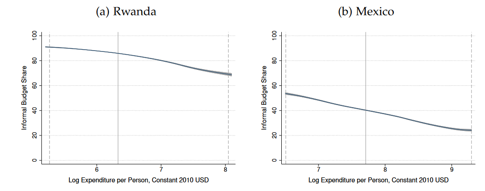
```

**Engel** (proportional) **curves** of consumption of informal goods for Rwanda (a) and Mexico (b) &mdash; as they are not taxed (by definition) and their consumption decreases in income (*necessary goods*), it makes indirect taxation in developing countries more progressive `r Citep(myBib, "bachas2022informality")`

---
class: middle

```{r, echo=FALSE, out.width = '65%'}
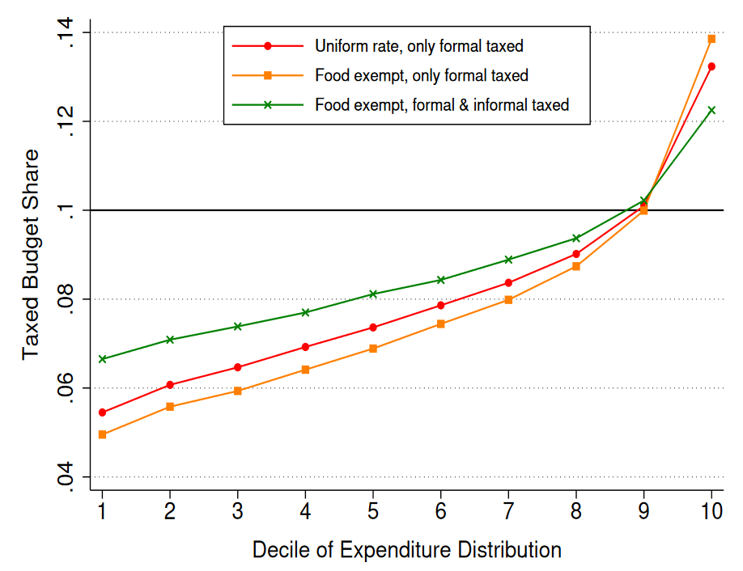
```

In a simulation with uniform taxation of 10%, having informal trade not taxed (red) makes the tax more progressive than exempting food (green), and almost supplants the gains of this policy when together (orange) `r Citep(myBib, "bachas2022informality")` 

---
class: middle
## Indirect taxes and inequality

We have seen that there is a reason to want to redistribute income through consumption tax, taxing less goods consumed by the poorest (and vice versa)

The **targeting principle** `r Citep(myBib, "atkinson1976design")`  says that if we can tax income directly, we should use this (*targeted*) instrument to reduce income inequality, not consumption (or savings) taxation

In the *budget constraint* of consumers a *proportional* income tax is equivalent to a *uniform* tax on consumption (making $1 - \tau_Y = (1 + \tau_C)^{-1}$)

$$p_x c_x + p_y c_y = (1-\tau_Y)Y \iff (1+\tau_C)p_x c_x + (1+\tau_C)p_y c_y = Y$$

---
class: middle
## Indirect taxes and inequality

But this is only valid if **ability** is the only source of inequality &mdash; if there are other relevant dimensions of heterogeneity (e.g., initial wealth or intertemporal discount rate), the targeting principle is no longer applicable

In any case, the intuition remains that indirect taxation is a very obtuse form of income redistribution compared to income tax and social assistance (tax and transfers)

In the UK, it is estimated that removing VAT exemption and increasing *means-tested* transfers by 15% would make the poorest better-off and save £11bn/year from the budget `r Citep(myBib, "mirrlees2010dimensions", after=", ch. 4")`

---
class: middle
## Indirect taxes and labor supply

Another problem with **Ramsey rule** is that it assumes that we can look at each market separately, which we know is not true: there are important *general equilibrium* effects (cross elasticities)

The most important of these effects is the relationship with work: as leisure cannot be taxed, people work too little

**Taxing less (or even subsidizing) complementary goods to work** (education, daycare, public transport, etc) can reduce this distortion &mdash; analogously, it makes sense to tax more substitute goods to work, such as video games


---
class: middle
## Uniform taxation

If we consider the **targeting principle** and assume that there are no goods related to demand for leisure (very strong!), then the ideal is a uniform rate (perhaps zero) on consumption (and redistribution through income tax)

Homogeneous taxation also makes sense for political economy reasons, as it avoids lobbying by reducing rates in particular sectors (**third-best policy**) and simplifies the tax framework 

It also **expands the tax base**: even though equivalent, income taxation allows **withholding** and consumption tax better affects self-employed workers &mdash; and a single rate does not allow manipulation of categories 

---
class: inverse, middle, center

# Externalities and internalities in consumption
 
---
class: middle
## Tobacco smoking

Cigarettes kill more than 8 million people a year worldwide, which 1.2 million of them are passive smokers (WTO)

In Brazil, there are 161,000 preventable deaths per year: 37,000 COPD, 33,000 heart disease, 24,000 lung cancer, 25,000 other cancers, 12,000 pneumonia and 10,000 stroke `r Citep(myBib, "INC")` &mdash; but this is not an externality!

In reality, if a smoker dies early and ceases to receive pension, then this is a *positive* externality (Brazil has a state pension for death, which counterbalances this effect)

---
class: middle

```{r, echo=FALSE, out.width = '75%', fig.align="center"}
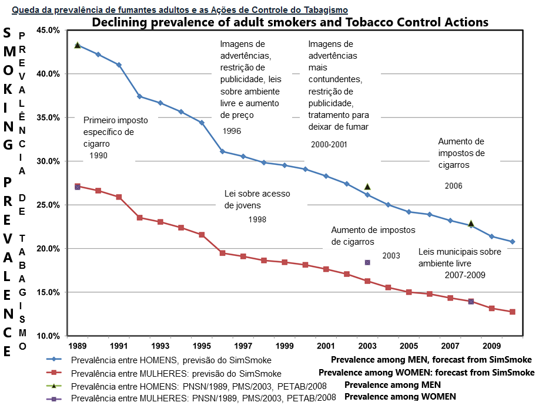
```

In 1989, almost half of men and more than 1/4 of women in Brazil smoked &mdash; since then, that number has halved, driven by cultural changes, but also by various public policies focused on the issue `r Citep(myBib, "INC")`

---
class: middle
## Quantifying externalities

It is estimated that tobacco smoking costs R$ 70  billion in medical treatments and generates losses of R$ 42 billion in potential years of life lost &mdash; *is that an externality*?

In 2018, Brazil consumed 106 billion (!!) of cigarettes (IBOPE), so even if only 50% of the cost mentioned above is an externality, this gives R$ 10 of externalities per pack (with 20)

Although in Brazil, almost 80% of the cigarette price is tax, which includes ICMS, IPI and, a fixed tax $\approx$ 5 reais per packet of tax, it seems that the taxation is still lower than necessary to correct externalities

---
class: middle
## Quantifying externalities

That was a back-of-the-envelope calculation &mdash; more careful estimates exist for the US: `r Citep(myBib, "gruber2001tobacco")` estimates that in the US the externality is 52¢, half the tax there (see also `r Citep(myBib, "chaloupka2000economics")`)

`r Citep(myBib, "manning1989taxes")` makes a discussion on how to calculate these externalities: 27¢ *positive* externality from premature deaths: 3¢ from nursing homes and 24¢ from retirement pension &mdash; negative externalities: medical costs 26¢, sick leave 3¢, group health insurance 5¢, fires 2¢

As externalities occur in the future, we need to take into account the discount rate (above, 5%)

---
class: middle
## Quantifying externalities

If the health care costs paid by the smoker and even their death might not generate externalities (but perhaps *internalities*), for **passive smokers** (ETS) they most likely do

The most affected by ETS is the family: we price the externality at 19¢ for spouse mortality, 19¢ for fetus death, 3¢ for infant mortality, family members killed in fire 9¢, using an estimate of the *value of statistical life*

But if the smoker takes into account the utility of the family in his decision to smoke (questionable), then the externality is *internalized*, and it should not be taken into account in public policy

---
class: middle

```{r, echo=FALSE, out.width = '100%', fig.align='center'}
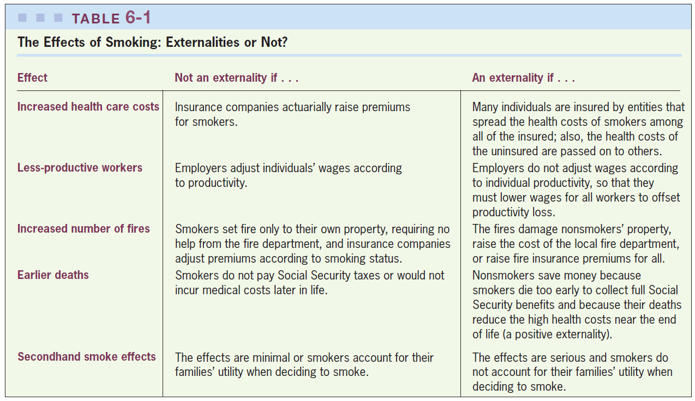
```

---
class: middle
## Taxing cigarette

One problem is that smoking is very concentrated among the poorest &mdash; cigarette taxation is very **regressive**

Another problem is **tax evasion**: contraband accounts for 57% of cigarettes consumed in the country (IBOPE)

So, as much as demand for cigarettes is inelastic (it is estimated that around $-0.4$), the elasticity of demand for legal cigarettes can be quite high &mdash; making taxation ineffective and causing high deadweight loss

---
class: middle
## Internalities

As we have seen, when consumers are totally *rational* and know the effects of smoking, 161,000 preventable deaths per year is not an economic argument for state intervention

And if it is an addiction? For an optimizing agent, this is not a problem: he chose to start smoking in an **intertemporal optimization** knowing that cigarettes are addictive (*rational addiction*)

In the past, any state attempt to prevent "bad decisions" was considered (pejoratively) a kind of paternalism &mdash; nowadays, it is more popular the view that there is a role for the state to correct decision errors (**internalities**)

---
class: middle
## Internalities

In the US, of all adults who smoke, 75% start smoking before age 19 &mdash; an age plausibly most vulnerable to marketing and social pressures

A survey asked teenage smokers if they would be smoking in 5 years and then checked back 5 years later: from those who said they would have quit by then, 74% were still smoking &mdash; evidence against the *rational addiction* hypothesis

8 out of 10 smokers want to quit, and the average smoker tries to quit once every 8 months (**self-control problem**) &mdash; if smokers make mistakes when young and would like to quit but cannot, then smoking also generates a *negative internality*

---
class: middle
## Internalities

**Hyperbolic Discount:** People prefer $100 today to $200 in 2 years, but they do *not* prefer $100 in 6 years to $200 in 8 years: but for a rational agent these are the same decision problem!

Another evidence is the demand for **commitment instruments**, for example, compulsory savings or annual gym membership

`r Citep(myBib, "FRIEDSON2023104877")` find that a dollar rise in cigarette taxation at ages 14-17 lowers by 8% the chance of that person smoking as an adult and by 4% their mortality rate (**habit formation**)

---
class: middle
## Internalities

Internalities work just like externalities: the government can help by taxing the good so that the *presumed*  marginal cost of smoking equals the *actual* marginal cost

Internalities can be gigantic! If smoking costs a person in average 6 years of life, and if the value given to an extra year of life is 200k dollars,  then the cost is `$`35 per pack

So even if the smoker underestimates his personal cost of smoking by only 10%, that is 3.5x the tax charged today!

---
class: middle

<!-- <iframe src="https://ourworldindata.org/grapher/share-of-tobacco-retail-price-that-is-tax" loading="lazy" style="width: 100%; height: 600px; border: 0px none;"></iframe> -->

```{r, echo=FALSE, out.width = '80%', fig.align='center'}
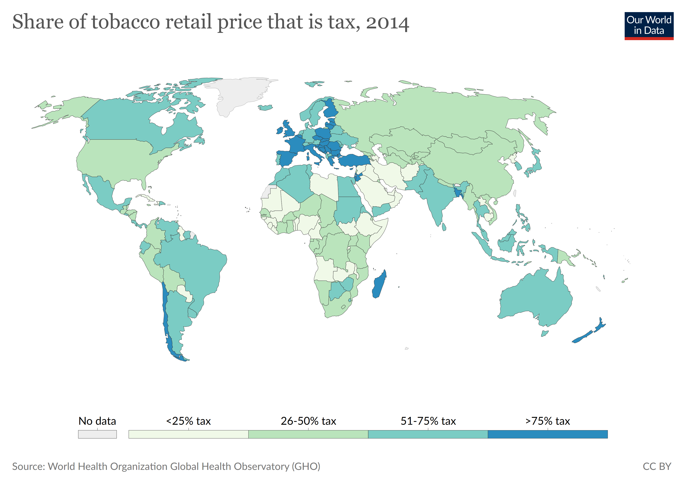
```

Due to corrective taxation, taxes form an important part of the price of cigarettes in almost all over the world &mdash; in several countries, such as Brazil, it is more than half of the final price, and in most parts of Europe it is more than 3/4

---
class: middle

<!-- <iframe src="https://ourworldindata.org/grapher/share-of-tobacco-retail-price-that-is-tax" loading="lazy" style="width: 100%; height: 600px; border: 0px none;"></iframe> -->

```{r, echo=FALSE, out.width = '80%', fig.align='center'}
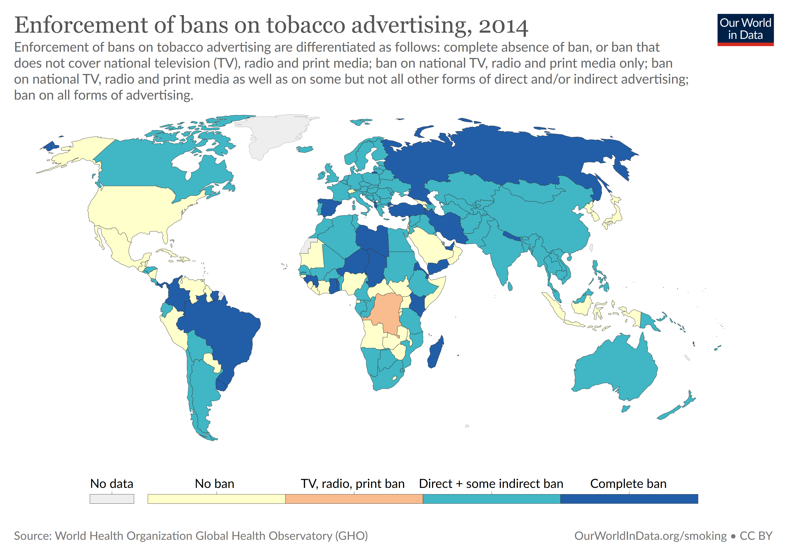
```

The view that *internalities* encourage cigarette consumption has led most countries (such as Brazil) to go beyond the price mechanism to discourage consumption, with policies such as banning tobacco advertising

---
class: middle
## Alcohol

More than 600 traffic fatalities per year with suspected drunkenness in São Paulo State alone, 42% of the total (G1) &mdash; another externality is violence: alcohol consumption is behind 18% of domestic violence cases (WHO)

`r Citep(myBib, "manning1989taxes")` estimates externalities for the US at `$`1.2 per ounce (30ml) of pure alcohol &mdash; but theory says we should always **specifically tax the activity that generates externalities**

Alcohol taxation (inefficiently) reduces a lot of consumption among those who do not drive drunk or are violent, but only giving fines for drunk driving is hardly able to sufficiently dissuade this practice

---
class: middle
## Empirical evidence (alcohol)

In general, we would like to compare the health (*potentially* internality) and undesirable behavior (externality) of alcohol drinkers with non-drinkers &mdash; problem: they are different in several dimensions

Raising minimum age to 21 in some US states (**quasi-experiment**) in the 80s: 18 year olds before the reform consumed 6-17% more alcohol between 18-21 *and* when older (**habit formation**)

Studies have also found a 17% increase in driving deaths among young people and a higher probability of teenage mothers giving birth to children with poorer health outcomes (lower weight or premature)

---
class: middle

```{r, echo=FALSE, out.width = '90%'}
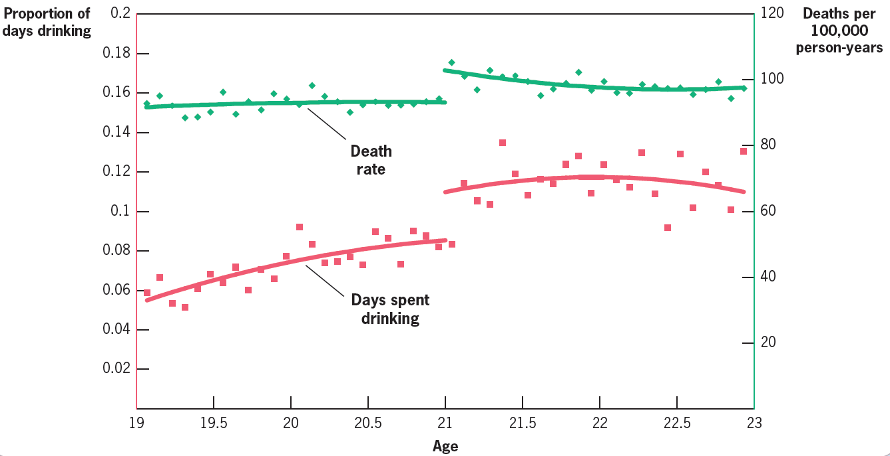
```

Young people a few weeks before their 21st birthday (minimum legal drinking age) in the US drink 30% fewer days and have a 9% lower death rate than young people a few weeks later (academic performance also drops): legal prohibitions are effective in reducing externalities/internalities `r Citep(myBib, "gruber")`


---
class:middle
# References
<small>
```{r refs, echo=FALSE, results="asis"}
PrintBibliography(myBib, start=1, end=5)
```
</small>


---
class:middle
# References
<small>
```{r refs2, echo=FALSE, results="asis"}
PrintBibliography(myBib, start=6, end=10)
```
</small>


---
class:middle
# References
<small>
```{r refs3, echo=FALSE, results="asis"}
PrintBibliography(myBib, start=11)
```
</small>

<!-- --- -->
<!-- class: middle -->

<!-- ```{r, echo=FALSE, out.width = '75%'} -->
<!-- 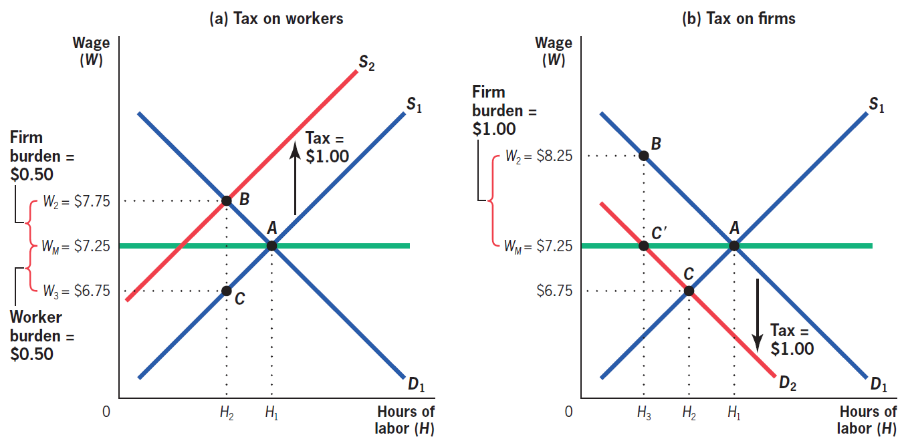 -->
<!-- ``` -->

<!-- Com salário mínimo, a incidência legal do imposto pode importar &mdash;  `r Citep(myBib, "gruber")`  -->

<!-- --- -->
<!-- class: middle -->
<!-- ## Monopoly incidence -->

<!-- When there is some prior imperfection, monopoly power, or initial tax, **the deadweight loss is no longer negligible**: so the loss of consumer and producer surplus **adds up** to more than the government revenue -->

<!-- In fact, the incidence on the consumer continues to be $\rho$, because it is the increase in the price that he pays, $dp^c/dt$ &mdash; but now the incidence on the producer is $1$: the monopolist loses an amount equal to *all* government revenue `r Citep(myBib, "weyl2013pass")`   -->

<!-- Perhaps, it seems counterintuitive that the greater the market power, the more the incidence is on the producer &mdash;  but note that *the greater the surplus, the more room there is for the tax to fall on this side of the market* -->

<!-- --- -->
<!-- class: middle -->
<!-- ## Monopoly incidence -->

<!-- Another important characteristic about incidence in non-competitive markets is that *the pass-through can be greater than one* -->

<!-- In monopoly, see that $MR = p + \Delta p \cdot Q = p \left(1 + \frac{\Delta p}{p}Q \right)$, we have: -->

<!-- $$MR = p \left( 1 + \frac{1}{\epsilon_D}\right) = MC \Rightarrow p = \frac{MC + dt}{\left( 1 + \frac{1}{\epsilon_D}\right)}$$ -->
<!-- The tax can be understood as an increase in marginal cost, which is strengthened by the monopoly **mark-up**: if $\epsilon_D = -2$, for example, $p$ increases by $2dt$ -->


<!-- --- -->
<!-- class: inverse, middle, center -->

<!-- # Allcott, Lockwood, and Taubinsky (2019). “Should We Tax Sugar-Sweetened Beverages? An Overview of Theory and Evidence” -->

<!-- --- -->
<!-- class: middle -->
<!-- ## Sin taxes -->

<!-- **Sin taxes** are taxes with the (main) objective not to collect resources but to discourage undesirable behaviors for the individual and for society, such as smoking or drinking alcohol -->

<!-- A sin tax currently under great discussion is the taxation of sugar-sweetened beverages (SSB). In recent years, 39 countries around the world have implemented these taxes -->

<!-- Problem: as SSBs are more often consumed by poor people, this taxation is regressive (**incidence**) -->


<!-- --- -->
<!-- class: middle -->
<!-- ## Health damage from soda -->

<!-- > "A tax on soda and juice drinks would disproportionately increase taxes on low-income families in Philadelphia." Bernie Sanders, 2016 em `r Citep(myBib, "allcott2019regressive")` -->

<!-- Important issue: Americans consume on average 6.9% of their total energy consumption from SSBs (154 kcal/day) -->

<!-- They also account for 23% of the average American's sugar consumption -->

<!-- Around half of Americans consume at least one beverage with added sugar per day &mdash; in Brazil, it is 60 liters per year on average -->

<!-- --- -->
<!-- class: middle -->

<!-- ```{r, echo=FALSE, out.width = '75%'} -->
<!-- 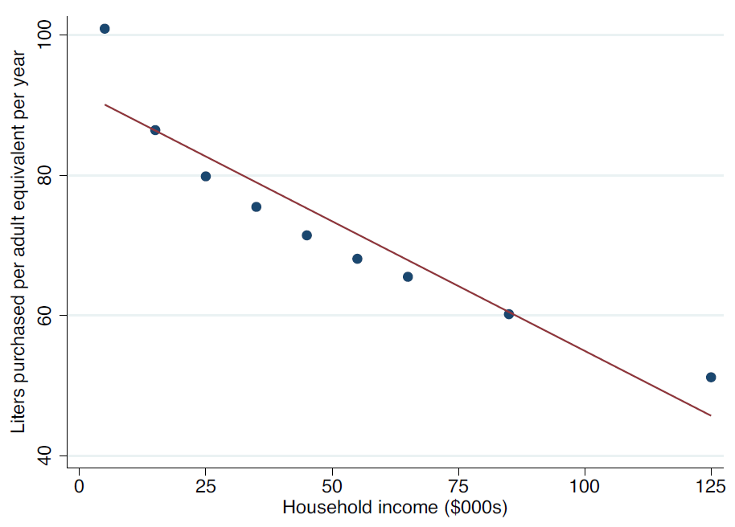 -->
<!-- ``` -->

<!-- Consumption of SSBs drops significantly with increasing income: both due to *heterogeneity of preferences* and greater knowledge of the harm caused by SSBs `r Citep(myBib, "allcott2019regressive")` -->

<!-- --- -->
<!-- class: middle -->
<!-- ## Health damage from soda -->

<!-- SSBs are harmful to health through three (main) channels: obesity, diabetes, and cardiovascular disease -->

<!-- An extra dose of SSBs per day is associated with a half kg increase in weight every 4 years, a 13% higher risk of developing type 2 diabetes and a 17% higher risk of coronary heart disease -->

<!-- SSBs are associated with costs of R$ 2,9 billion/year in SUS and studies estimate that a rate of ¢1/oz would save 17-23 billion dollars in ten years in the US with reduced medical costs -->

<!-- --- -->
<!-- class: middle -->
<!-- ## Economic reasons for taxing SSBs -->

<!-- SSBs are associated with **fiscal externalities**: not all the cost of bad health is on the individual due to health insurance or public health provision (Medicare in United States, SUS in Brazil) -->

<!-- There are also *positive* fiscal externalities: a (tragic) example is how obesity makes people die younger, reducing social security costs -->

<!-- As in this case externalities and internalities are **heterogeneous**, we have to analyze whether they occur more strongly in individuals who are more or less elastic in price  -->

<!-- --- -->
<!-- class: middle -->
<!-- ## Internalities -->

<!-- But the main reason for taxing SSBs is actually to approach **internalities** -->

<!-- Note that the aforementioned harms to health are *NOT* a reason to tax SSBs &mdash; taxation is not about maximizing people's health (otherwise, we would prohibit a lot of things!), but for solving *rational flaws* -->

<!-- Generally, the two most evoked failures are **informational failures** and **intertemporal inconsistent** and self-control failures -->

<!-- --- -->
<!-- class: middle -->

<!-- ```{r, echo=FALSE, out.width = '75%'} -->
<!-- 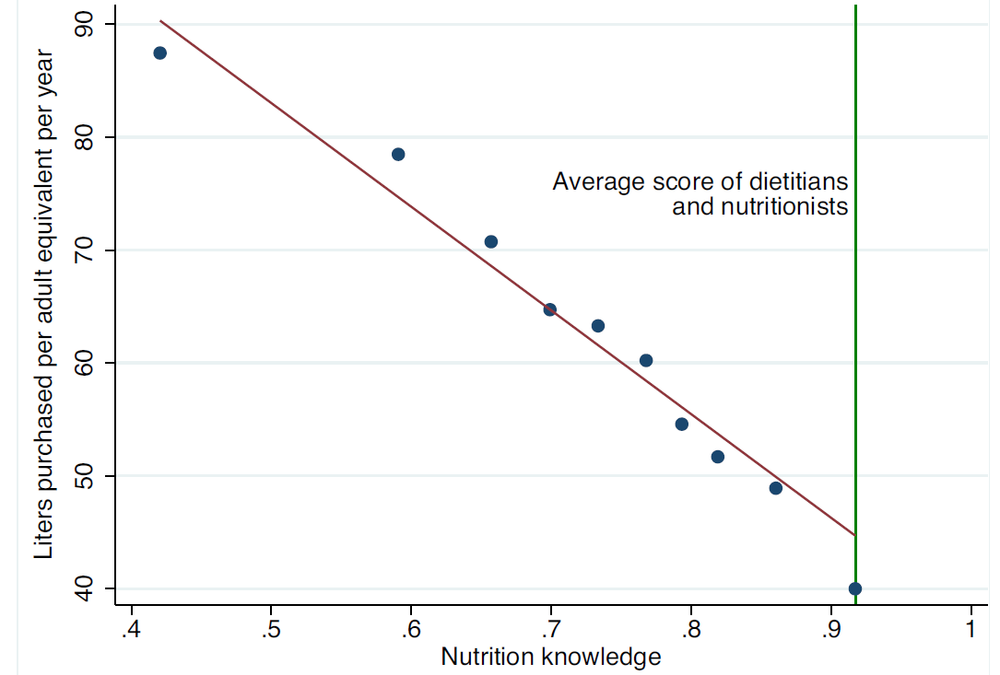 -->
<!-- ``` -->

<!-- Evidence of *information failures*: "grade" on a questionnaire about nutrition is inversely correlated with consumption of SSBs `r Citep(myBib, "allcott2019regressive")` -->

<!-- --- -->
<!-- class: middle -->

<!-- ```{r, echo=FALSE, out.width = '75%'} -->
<!-- 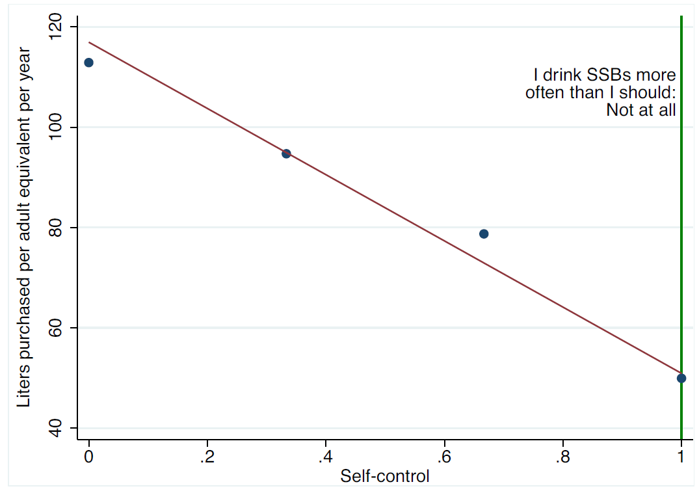 -->
<!-- ``` -->

<!-- And they find the same correlation for a measure of *self-control failures* `r Citep(myBib, "allcott2019regressive")` -->

<!-- --- -->
<!-- class: middle -->
<!-- ## Internalities -->

<!-- Internalities (opposed to externalities) *impact the consumer himself*: if we give more value to poor people's welfare, we must take into account in which proportion the internalities fall on them -->

<!-- In fact, since internalities are indeed greater among the poorest, *correcting internalities is progressive*; therefore, it is not *a priori* obvious that taxing SSBs is worse for the poorest -->

<!-- It will depend on the **elasticity of demand**: if demand is very inelastic, the loss of purchasing power is high and the reduction of internalities is low, so taxing SSBs is bad for the poor &mdash; if demand is elastic, then *vice versa* -->

<!-- --- -->
<!-- class: middle -->

<!-- ```{r, echo=FALSE, out.width = '75%'} -->
<!-- 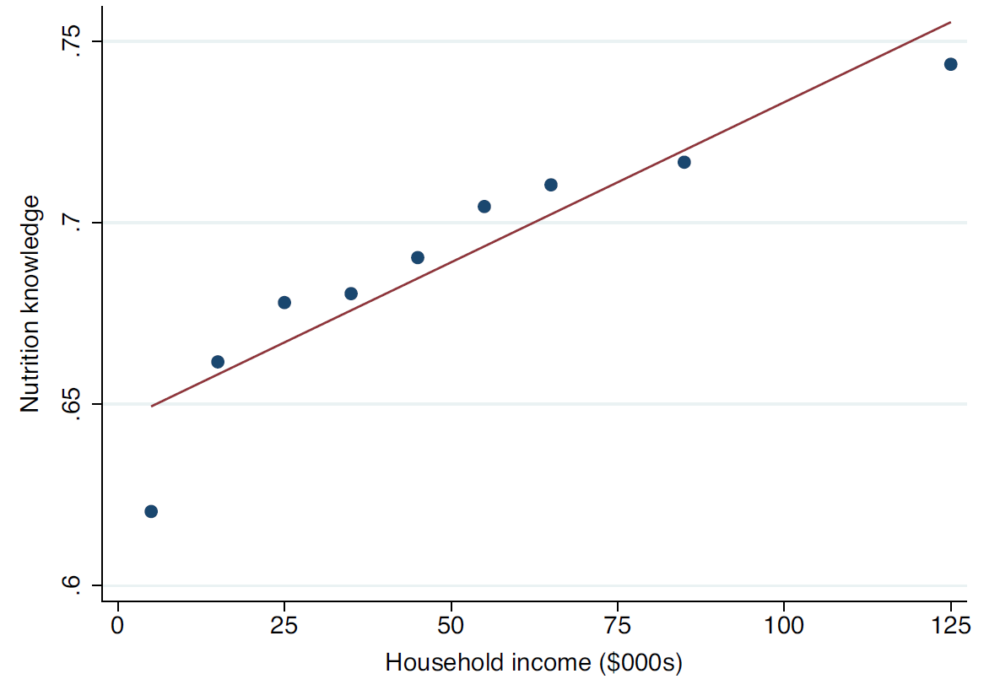 -->
<!-- ``` -->

<!-- Correcting internalities is *progressive*: nutritional information and self-control [graph omitted] are highly correlated with family income `r Citep(myBib, "allcott2019regressive")` -->

<!-- --- -->
<!-- class: middle -->
<!-- ## Incidence -->

<!-- It is also important to analyze the incidence of the tax: for example, if the **pass-through** is zero, then it is impossible to correct ex-/internalities by taxing SSBs -->

<!-- In general, how the pass-through affects the optimal tax depends on whether society gives more value on the welfare of producers or consumers of SSBs -->

<!-- In practice, the pass-through on non-durable consumer goods is quite high, and (in this application) incidence considerations do not affect the result a lot -->

<!-- --- -->
<!-- class: middle -->
<!-- ## Empirical estimates -->

<!-- To estimate the optimal tax, they need empirical estimates of relevant statistics -->

<!-- They estimate the demand price elasticity for SSBs as -1,4: very elastic! It means that taxing SSBs is a very effective way to change consumer behavior -->

<!-- Researchers estimate the healthcare cost for SSBs at ¢1/oz, and the US Dept of Health estimates that 85-88% of these costs are paid by others (externalities): ¢0,8-0,9/oz of externalities -->

<!-- --- -->
<!-- class: middle -->
<!-- ## Empirical estimates -->

<!-- Internalities are more difficult to estimate empirically &mdash; `r Citep(myBib, "allcott2019regressive")` compare with consumption by nutritionists and estimate that people would buy 31-37% fewer SSBs if they had good information about health costs, which corresponds to ¢0,91-2,14/oz of internalities -->

<!-- But this internality is correlated with income! In a survey of the harms of SSBs, misinformation is 30% higher in families with incomes of $10,000/year than 100,000/year dollars -->

<!-- Given a reasonable weight in the social welfare function, internalities being concentrated in the poorest increase the optimal tax by 20% -->

<!-- --- -->
<!-- class: middle -->
<!-- ## Putting it all together -->

<!-- Adding everything together, `r Citep(myBib, "allcott2019regressive")` calculate the optimal rate for SSBs as ¢1.5/oz (R$0,75 for a 300ml soda drink) -->

<!-- This is ¢0.8/oz of fiscal externality, ¢1/oz of internalities $\times$ 120% because of the progressiveness of internality, reduced by ¢0.5/oz because of the regressiveness of the tax -->

<!-- If the policy maker is philosophically opposed to taxing internalities (they consider it a bad case of *paternalism*), there is still room for *sin taxes*, but they should be much lower: about ¢0.4/oz (R$0,25 per can) -->

<!-- --- -->
<!-- class: middle -->
<!-- ## Principles of "sin taxation" -->

<!-- `r Citep(myBib, "allcott")` suggest 7 principles of *sin taxes*: -->

<!-- 1. The objective of a sin tax is not to "maximize health", but to correct internalities and externalities -->
<!-- 2. Focus the policy where there are stronger int-/externalities &mdash; for example, if children have less self-control and consumption in childhood forms a habit, banning soda drinks in schools (e.g.) is particularly effectful -->
<!-- 3. It is better to tax grams of sugar than ml of drink (**targeting principle**) -->

<!-- --- -->
<!-- class: middle -->
<!-- ## Principles of "sin taxation" -->

<!-- 4\. Governments should tas diet drinks and juices only if they also cause non-internalized health damages -->

<!-- 5\. Regressivity matters, but we also need to consider the *progressiveness of the internality correction* -->

<!-- 6\. The tax must be as less geographically local as possible, to avoid **leakage**, which reduces the corrective effect -->

<!-- 7\. Sin taxes (at least in the US) seem like a good idea; that is, they increase social welfare, given reasonable social preferences &mdash; such as those that rationalize the government as it is now -->

<!-- `r Citep(myBib, "allcott")` estimate that in the US welfare gains from taxing SSBs are $2,4-6,8 billion dollars per year -->
