class: inverse, middle, center

```{r, load_refs, include=FALSE, cache=FALSE}
library(RefManageR)
BibOptions(check.entries = FALSE,
           bib.style = "alphabetic",
           cite.style = "alphabetic",
           style = "markdown",
           hyperlink = FALSE,
           dashed = FALSE)
myBib <- ReadBib("./esp_bib.bib", check = FALSE)
```

# Tax incidence

---
class: middle
## Equity implications of taxation

To understand whether a tax increases or reduces inequality, we have to understand who *ultimately* pays for it &mdash; this is the study of **tax incidence**

Of course, the law determines who formally pays the tax, but the market adjusts pre-tax and post-tax prices according to the *behavioral reaction* of consumers and producers

Therefore, even if a payroll tax is paid by the company, if it reduces the demand wage in response, then who is actually paying for the tax is the worker

---
class: middle
## Incidence

The first rule of incidence is that *under the micro assumptions*, **statutory incidence** does not matter for the **economic incidence** of taxes

If who disburses money is the consumer, the firm, or the worker, it should not matter how the market price adjusts to the tax, since it does not affect economic incentives &mdash; and these depend only on net and gross prices

But `r Citep(myBib, "saez2012earnings")` show that in Greece, changes in the payroll tax affect only those who actually pay for it (that is, the economic incidence equals the statutory incidence) &mdash; there is another example further on in which this rule fails

---
class: middle
## Incidence

Important, but sometimes overlooked, is that **tax shifting takes place through the market** &mdash; it is not (in competitive markets) an intentional decision by agents to shift the tax elsewhere, but the effects of market changes in the supply and demand curves

If the price (net of the tax) does not change with the tax introduction, then the real incidence is equal to the formal incidence

When we analyze not only consumers and producers of a specific good, but also other *substitute and complementary goods* and *factors of production*, we do a **general equilibrium incidence analysis**

---
class: middle
## Partial equilibrium incidence

Even so, we will focus on the *partial equilibrium incidence*, because it is more intuitive and it generally provides us a good approximation

Consider an initial tax situation $t = 0$, and add a fixed (infinitesimal) tax to be paid by the consumer $dt$ &mdash; if before the equilibrium condition was $S(p) = D(p)$, now we add a **tax wedge** to the market

The market is still in equilibrium! But in the equilibrium with taxes, supply $S$ equals demand $D$ *with different prices*: the condition now becomes: $$S(p^p) = D(p^c) = D(p^p + dt)$$ 

---
class: middle

```{r, echo=FALSE, out.width = '90%', fig.align='center'}
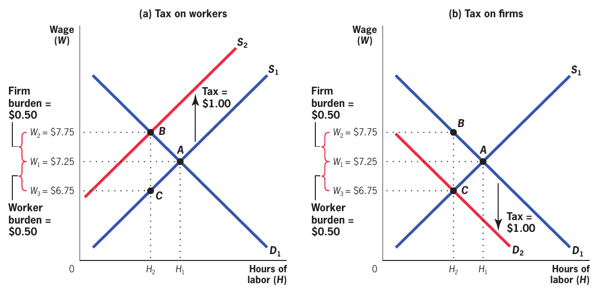
```

A tax that burdens the consumer (in the labor market, the firm, panel b) shifts the demand curve down, as now the good is 1$ "less desirable" &mdash; if it burdens the supplier (in labor market, the worker, panel a), the tax shifts the supply curve up, since now the marginal cost is $1 higher

---
class: middle

```{r, echo=FALSE, out.width = '70%', fig.align = 'center'}
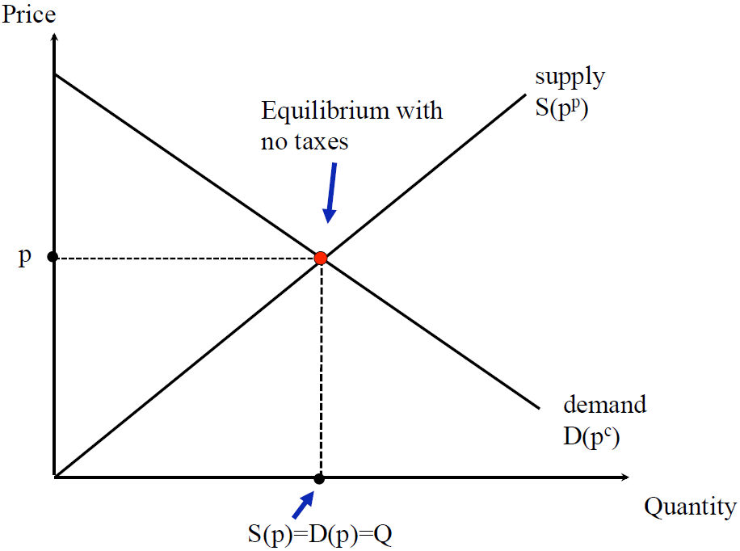
```

Partial equilibrium incidence &mdash; without tax, $p^p = p^c = p$ (Saez) 

---
class: middle

```{r, echo=FALSE, out.width = '85%', fig.align = 'center'}
knitr::include_graphics("figs/eae0310-9-2.png")
```

On the other hand, the tax creates a **tax wedge**: now $p^c = p^p + dt > p^p$  (Saez) 

---
class: middle

```{r, echo=FALSE, out.width = '85%', fig.align = 'center'}
knitr::include_graphics("figs/eae0310-9-3.png")
```

The reduction in consumption makes firms operate in regions with lower MC, and eventually the price of the producer drops in response (Saez) 

---
class: middle
## Partial equilibrium incidence

The market equilibrium condition is $S(p^p) = D(p^p + dt)$. Differentiating both sides in relation to $t$:

$$S^{\prime}(p^p)\frac{dp^p}{dt} = D^{\prime}(p^p + dt)\left(1 + \frac{dp^p}{dt}\right)$$

$$\Rightarrow \frac{dp^p}{dt} \left[ S^{\prime}(p^p) - D^{\prime}(p^p + dt)  \right] = D^{\prime}(p^p + dt)$$
$$\therefore \ \frac{dp^p}{dt} = \frac{D^{\prime}(p^p + dt)}{S^{\prime}(p^p) - D^{\prime}(p^p + dt)}$$
---
class: middle
## Partial equilibrium incidence

Elasticities are very useful in public sector economics because they are usually *sufficient statistics* for the behavior of producers and consumers (in competitive markets)

Defining $p^c = p^p + dt$, remember that $\epsilon_S = \frac{p^p}{S(p^p)} S^{\prime}(p^p)$ and: $$\epsilon_D = \frac{p^c}{D(p^c)} D^{\prime}(p^c) = \frac{p^p + dt}{D(p^p + dt)} D^{\prime}(p^p + dt)$$

As $dt$ is small, we can multiply the top and bottom numbers by $p/Q$: 
$$\frac{dp^p}{dt} = \frac{D^{\prime}(p^p + dt) p/D(p)}{S^{\prime}(p^p)p/S(p) - D^{\prime}(p^p + dt)p/D(p)} = \frac{\epsilon_D}{\epsilon_S - \epsilon_D}$$

---
class: middle
## Partial equilibrium incidence

Note that given $\frac{dp^p}{dt} = \frac{\epsilon_D}{\epsilon_S - \epsilon_D}$ and $p^c = p^p + dt$, we have: $$-1 \leq \frac{dp^p}{dt} \leq 0 \text{ and  } \frac{dp^c}{dt} = \frac{d(p^p + dt)}{dt} = 1 + \frac{dp^p}{dt} \in [0, 1]$$

Consumers bear the full incidence of the tax when $dp^p/dt = 0$, and therefore $dp^c/dt = 1$, which happens if $\epsilon_D = 0$ or $\epsilon_S = \infty$

Producers bear all the incidence of the tax when $dp^p/dt = -1$,  that is, if $\epsilon_D = - \infty$ or $\epsilon_S = 0$

General rule: **the more inelastic side of the market bears most of the taxes**

---
class: middle
## Pass-through

The change in the price to the consumer caused by the tax is called tax **pass-through** rate: $$\rho \equiv dp^c/dt = 1 + dp^p/dt$$

It is believed that in the long run most industries operate at constant marginal costs (due to constant returns to scale): an (almost) infinitely elastic supply curve

It implies a **pass-through** rate of $\approx 1$: consumption taxes would be borne almost entirely by consumers &mdash; empirical evidence is consistent with pass-throughs between 0.8-1.0 for most taxes on consumer goods

---
class: middle

```{r, echo=FALSE, fig.show="hold", out.width="50%"}
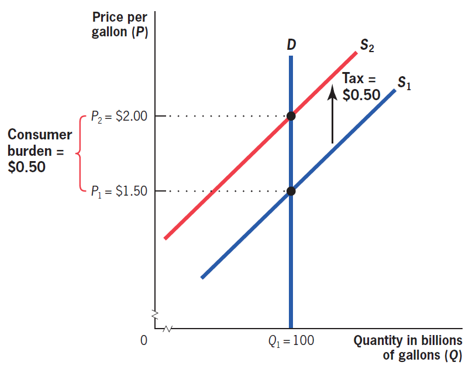
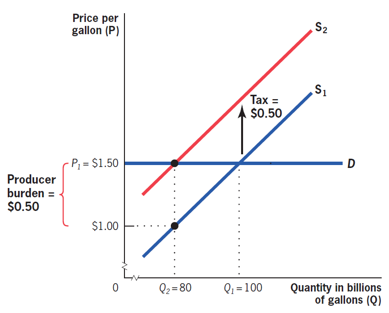
```

When demand is infinitely inelastic, the pass-through rate $dp^c/dt$ is 1 (**full shifting**). When it is infinitely elastic, the incidence is all on the producer `r Citep(myBib, "gruber")` 

---
class: middle

```{r, echo=FALSE, out.width = '85%'}
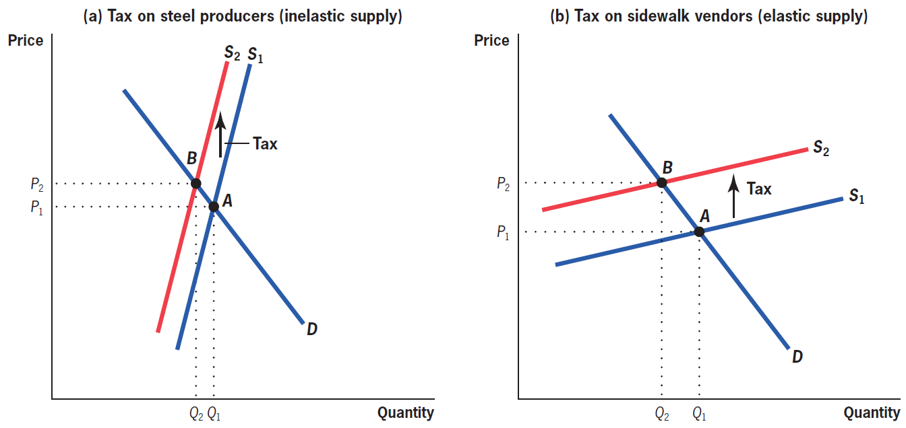
```

And the opposite occurs with the supply curve: the more elastic, the greater the pass-through `r Citep(myBib, "gruber")` 

---
class: middle
## Incidence on competitive markets 

*In competitive markets* we can approximate incidence by ignoring the **excess burden** (it is in *second order*) when calculating the welfare cost for consumers and producers

Although important (and the topic of next week), the excess burden is relatively small: Harberger (1959) estimated the deadweight loss of corporate taxation at ~8% of revenue; estimates for indirect taxes are similar (3-5%)

Thus, the loss of consumer surplus becomes $\rho dt \cdot Q$ (which $\rho$ is the **pass-through**) and the loss from the producer $(1 - \rho)dt \cdot Q$ &mdash; both add up to (approximately) the government revenue $R(dt) = Qdt$

---
class: middle
## General equilibrium incidence

If the partial equilibrium analysis gives us a good intuition for tax incidence, it can be misleading if we do not consider the *general equilibrium effects* of taxation

A tax on beer sales affects the prices not only of beer, but also of substitute alcoholic drinks and input materials, as well as also burdens the capital and labor employed in the sector
 
Imagine a municipal tax on restaurants: if the demand is infinitely elastic, restaurants pay all the tax &mdash; but restaurants cannot pay taxes, *only people pay taxes!*

---
class: middle
## General equilibrium incidence

When we say that "restaurants bear the tax", in reality, we mean that *the factors of production* employed in production by restaurants bear the taxes

If the labor supply for restaurants is infinitely elastic and short-term capital infinitely inelastic (since invested capital is not convertible), then the incidence is all on restaurant owners

If we have several goods, the incidence will also depend on how *intensive* each factor is used in the production of the taxed goods (in relation to others)

---
class: middle

```{r, echo=FALSE, out.width = '50%', fig.align='center'}
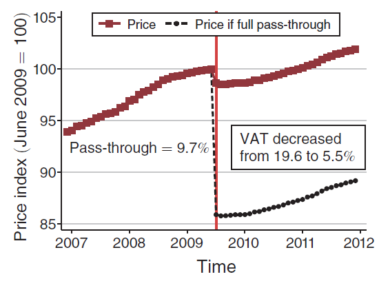
```

`r Citep(myBib, "benzarti2019really")` analyzes the effect of a VAT cut in France of 14 p.p., finding a **pass-through** rate of 9,7%, which is the opposite of what we would expect given the argument that the incidence of consumer taxes is almost entirely on the consumer &mdash; there is evidence of *asymmetric incidence* of tax increases and decreases, at least in the short/medium term

---
class: middle

```{r, echo=FALSE, out.width = '85%'}
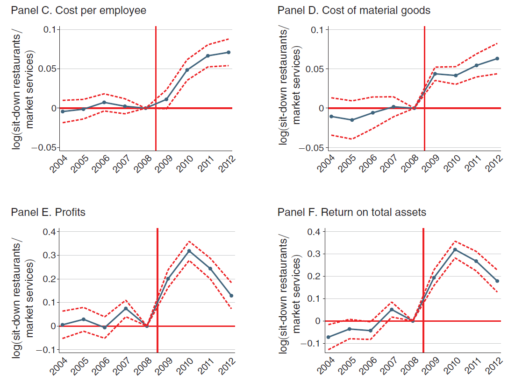
```

They find an incidence of 19% on wages, 60% on profit, 13% on the cost of raw materials, and only 8% was reverted to a reduction in consumer prices `r Citep(myBib, "benzarti2019really")` 

---
class: middle

```{r, echo=FALSE, out.width = '90%'}
knitr::include_graphics("figs/eae0310-4-2.png")
```

In the real world, economic incidence often *depends* on statutory incidence, due to **bounded rationality**: in the US, taxes generally "appear" only in the cash register &mdash; in an experiment, `r Citep(myBib, "chetty2009salience")` found that compared to appearing on the price tag, the tax "in the cash register" only has 35% **salience**

---
class: middle

```{r, echo=FALSE, fig.show="hold", out.width="45%"}
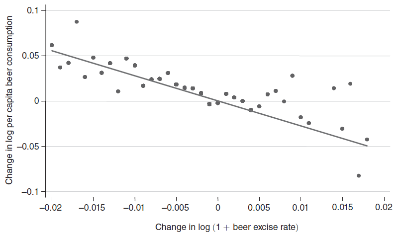
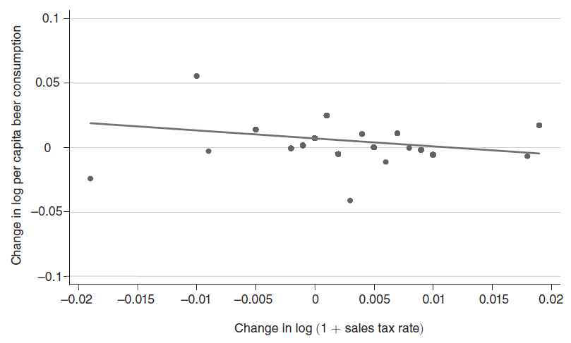
```

In the same way, at state level, increases in the *excise tax*, which appears on the price tag, are related to drops in beer consumption, but increases in *sales tax*, which does not appear (only in the cash register) much less `r Citep(myBib, "chetty2009salience")`

---
class: inverse, middle, center

# Efficiency costs of taxation 

---
class: middle
## Efficiency costs taxation 

So far we have discussed the redistributive effect of taxation: the **incidence** of indirect taxation, which is caused by changes *in the price* of products

The *efficiency cost* of taxation, on the other hand, is measured by the **excess burden** (aka deadweight loss), and it is related to changes *in the quantity* traded

Excess burden comes from the fact that taxes change *relative prices* faced by the economic agents, changing their behavior &mdash; for example, by making consumption more expensive in relation to leisure (non-taxable), it discourages work

---
class: middle
## Equivalent variation

We measure excess burden using the **equivalent variation**, a *money-metric* representation of welfare: how large a loss of income would have to be to have the same effect on the agent's utility as the introduction of the tax

An EV of $-100$ means that introducing the consumption tax on a given good has the same effect for that consumer as taking R$100 from his income (in a lump-sum manner)

It is natural that if someone gives R$1 to the government, they will have a welfare loss of (at least) R$1 &mdash; but it will actually be larger than that, because transferring income between economic agents is costly (*leaky bucket*)

---
class: middle
## Lump-sum taxation and deadweight loss

This difference between the EV and government revenue is the excess burden: the loss of income equivalent to the loss of welfare (in monetary measure) generated by the tax that is *in excess of the revenue collected*

In this sense, *lump-sum taxation* does not generate deadweight loss, since the EV of removing R$100 reais in a person's income is exactly R$100, by the definition of equivalent variation

While consumption taxes change **relative prices**, and agents respond by "running away" from the tax &mdash; but this has a cost in terms of welfare that does not generate revenue (unlike with a lump-sum transfer)

---
class: middle
## Excess burden and equivalent variation

The deadweight loss arises from a **decrease in quantity**: the loss of trade surplus for trades that still happen equals the government revenue, but some trades that stop happening lower surplus without generating any revenue

The definition of excess burden as equivalent variation is useful because it has a clear interpretation: it is how much *excess* loss of income (beyond the government revenue) that would be *equivalent* to the implemented tax

Therefore, a excess burden of 10% means that for each R$ 1 collected, consumers and producers would be willing to pay R$ 1.10 instead if the prices were not distorted (a lump-sum transfer)

---
class: middle
## Substitution effect and income effect

It is important to always bear in mind that **what generates welfare loss is the substitution effect**:  income effect does not generate deadweight loss

In fact, lump-sum transfers also generate income effect, but with no change in relative prices. The equivalent variation is just the transfer of resources (private sector welfare loss is equal to the revenue)

The deadweight loss comes from **the change of relative prices**: universal transfers do not change the relative price (e.g. between consumption and leisure), and do not generate a **tax wedge**

---
class: middle
## Behavioral effects

In the end, economic inefficiency comes from the fact that there are relevant economic objects that the government cannot observe and tax: it is an **informational failure**

If the government could observe all the individuals' idiosyncrasies, it could condition taxation on immutable variables ("ability") and redistribute perfectly without generating behavioral changes

In the consumer market, when consumer and producer prices are not equal (**tax wedge**), there are *mutually beneficial exchanges* (and in the competitive market, therefore, socially beneficial) that are not carried out

---
class: middle

```{r, echo=FALSE, out.width = '75%', fig.align = 'center'}

```

A market in undistorted equilibrium &mdash; all the *mutually beneficial exchanges* are carried out (Saez) 

---
class: middle

```{r, echo=FALSE, out.width = '85%'}
knitr::include_graphics("figs/eae0310-9-3.png")
```

With the tax, there are consumers willing to pay more for the good than its current marginal cost of production, and yet the exchange is not carried out: the quantity traded is reduced by $dQ$ (Saez) 

---
class: middle

```{r, echo=FALSE, out.width = '85%'}
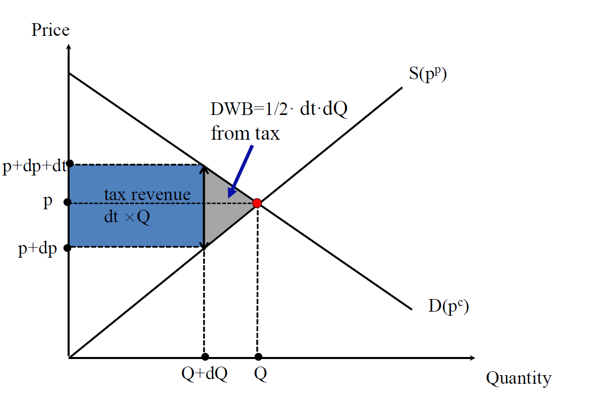
```

The reduction in quantity traded creates the **Harberger triangle**: a surplus loss area that exceeds government revenue (Saez) 

---
class: middle
## Harberger triangle

The **Harberger triangle** is (literally) a triangle, and under the conditions of the supply and demand graph (partial equilibrium, no income effect) we can calculate its area by elementary geometry

$$\text{EB} = \frac{1}{2} dQ \times dt = \frac{1}{2} S^{\prime}(p) dp \times dt$$
Which we use that $Q = S(p)$, and therefore, $dQ = S^{\prime}(p)dp$. Multiplying and dividing by $pQdt$ and recalling last class that $\frac{dp}{dt} = \frac{\epsilon_D}{\epsilon_S - \epsilon_D}$:

$$\text{EB} = \frac{1}{2} \frac{S^{\prime}(p) p}{Q} \frac{Q}{p} \frac{dp}{dt} \times (dt)^2 = \frac{1}{2}\frac{\epsilon_S \epsilon_D}{\epsilon_S - \epsilon_D} \frac{Q}{p} \times (dt)^2$$

---
class: middle

```{r, echo=FALSE, out.width = '65%'}
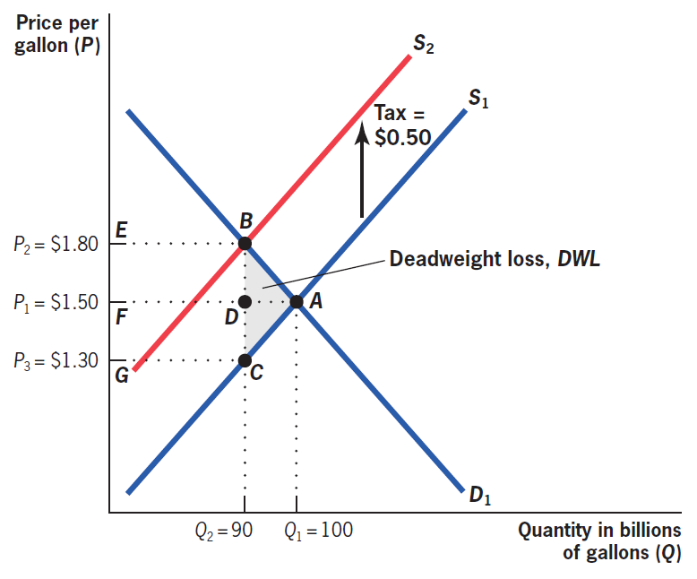
```

Harberger triangle in this example has an area of $\frac{1}{2} 10 \times 0,50 = 2,5$ billion `r Citep(myBib, "gruber")`

---
class: middle
## The deadweight loss formula

$$\text{EB} = \frac{1}{2}\frac{\epsilon_S \epsilon_D}{\epsilon_S - \epsilon_D} \frac{Q}{p} \times (dt)^2$$
Deadweight loss increases with the absolute value of elasticities $\epsilon_S > 0$ and $- \epsilon_D > 0$ : *it is more efficient to tax inelastic goods*


Deadweight loss increases *quadratically* in tax (*of second-order*) &mdash; the deadweight loss per BRL collected increases with taxation:

1. It is better to tax many goods little than fewer goods more;
2. It is better to finance extraordinary expenses (wars, pandemics) with debt, paid by taxes over a long period of time

---
class: middle

```{r, echo=FALSE, out.width = '85%'}
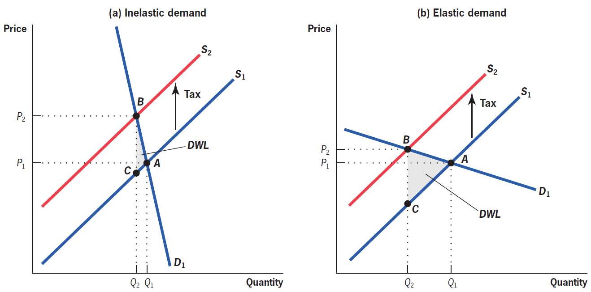
```

The more elastic the demand and supply, the greater is the deadweight loss  `r Citep(myBib, "gruber")`

---
class: middle
## Deadweight loss

As previously mentioned, deadweight loss is of second-order *when there are no distortions in economy* (triangle)

When there are distortions, such as market power, or other taxes (such as initial tax $t \neq 0$), the deadweight loss becomes a trapezoid &mdash; it is no longer negligible in calculating incidence and other effects

Calculation of welfare effect of deadweight loss taxation dates back to Dupuit in 1844, but the first to empirically estimate its size was Harberger (1954): he estimated the deadweight loss as $~3\%$ of revenue, a very reasonable value given what we know today (see `r Citep(myBib, "hines1999three")`)

---
class: middle

```{r, echo=FALSE, out.width = '50%'}
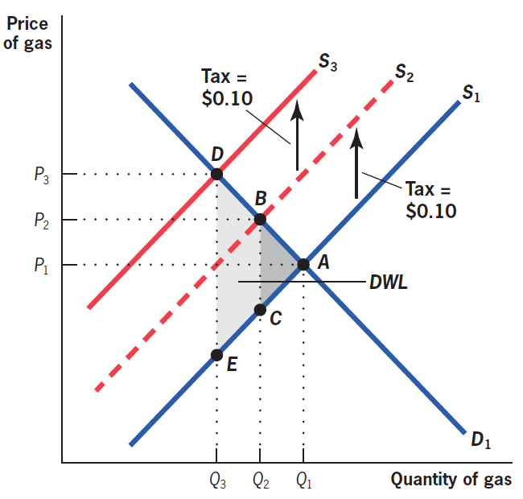
```

When we increase the rate of an existing tax, the deadweight loss is of *first-order* (trapezoid), and no longer of *second-order* (triangle) &mdash; this is due to pre-existing distortions, and it is also valid for any other market inefficiency, such as monopoly power `r Citep(myBib, "gruber")`

---
class: middle
## Window tax

`r Citep(myBib, "oates")` studies the case of the window tax instituted by King William III in the UK (1696)

As it is difficult to assess the value of properties (and it was much more in the past), King William decided to use as *proxy* of wealth the number of windows in the properties (an indicator of *ability to pay*): this would make sense (**tagging**) *if* the number of windows were not changeable &mdash; but it is

It was also unfair from the point of view of **horizontal equity**: a house in the country much cheaper than one in the city would certainly have way more windows

---
class: middle
## Window tax

> "In order to reduce the window tax, every window... was built up, and all source of ventilation was thus removed. The smell in this house was overpowering, and offensive to an unbearable extent. There is no evidence that the fever was imported into this house, but it was propagated from it to other parts of town, and 52 inhabitants were killed" Carlisle, 1781, apud `r Citep(myBib, "oates")`

Even worse, taxation had **notches**: points at which the average tax rate rises discontinuously, generating even greater distortions: there was no tax up to 9 windows, 6 pounds per window *in total windows* up to 14 windows, etc

---
class: middle

```{r, echo=FALSE, out.width = '85%'}
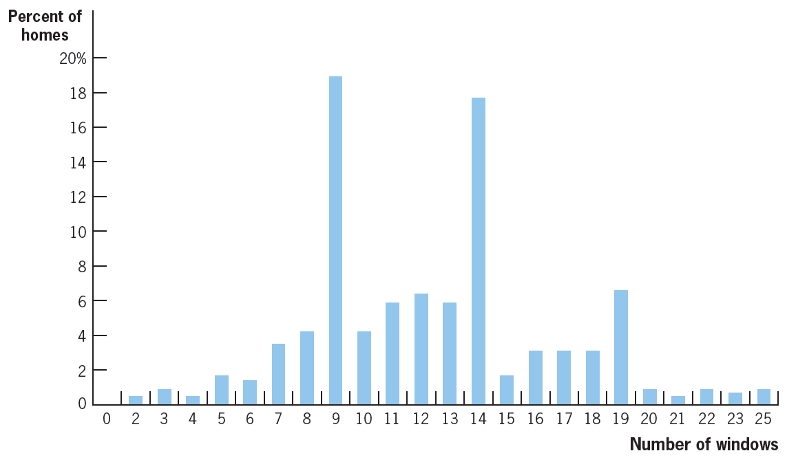
```

*Notches* in the tax rate generate anomalous masses just below the change &mdash; here in 9, 14 and 19 windows `r Citep(myBib, "gruber")`

---
class: middle
## Window tax

`r Citep(myBib, "oates")`  find that the deadweight loss generated by taxation on *households located "in the notch"*  was a terrible 62% of revenue: for every £1 collected by the government, they paid £1.62 lump-sum equivalent in lost utility

That is, they would be willing to pay £1,62 lump-sum transfer per £1 collected to end this tax &mdash; in general, the deadweight loss was 13,4% of collections: still 3-4x higher than other types of tax

Even with all this, the tax was only withdrawn in 1851, almost 160 years after its establishment, which demonstrates that very inefficient taxes can last for a long time for political reasons

---
class: inverse, middle, center

# Consumption taxation

---
class: middle
## Productive efficiency

The **production efficiency theorem** `r Citep(myBib, "diamond1971optimal")` says that without externalities and market power, taxes should never distort the firm's productive choice

This implies that there is no distortion of relative input prices, only the final good &mdash; the intuition is that any tax on production distorts production **and** consumption, so it must be worse than distorting only consumption

In general, this is a strong argument *against taxing intermediate goods*, and the main reason why tax systems tend to tax only the *final sale of goods* (but tax factors of production)

---
class: middle
## Value added tax

Consumption taxation (indirect taxes) can be levied on sales by collecting a tax $t$ (proportional or fixed) on the sale of the *final good*

But in recent decades, **value added tax (VAT)** has become much more common: each producer pays a tax on their sales revenue, but **deducts** the taxes paid *upstream*

That is why it is a **value added** tax, its basis is the revenue minus the cost of supplies (the value added) &mdash; with perfect *compliance* and no exemptions, VAT is equivalent to a tax on sales

---
class: middle

```{r, echo=FALSE, out.width = '100%'}
knitr::include_graphics("figs/eae0310-8-1.png")
```

Operation of a tax on sales and a VAT of 20% `r Citep(myBib, "gerard2018value")` 

---
class: middle
## Value added tax

Its advantage comes from making tax evasion difficult: each producer in the production chain deducts the tax paid *upstream*, which provides an incentive for **third-party reporting**

VAT can be a powerful tool to combat tax evasion in *business-to-business* (B2B) transactions, because the *downstream* company earns money by reporting the transaction to the government

But this does not work for the transactions with consumers &mdash; it was to try to avoid this "hole" in VAT that the government of São Paulo introduced the Nota Fiscal Paulista (NFP)

---
class: middle

```{r, echo=FALSE, out.width = '75%', fig.align='center'}
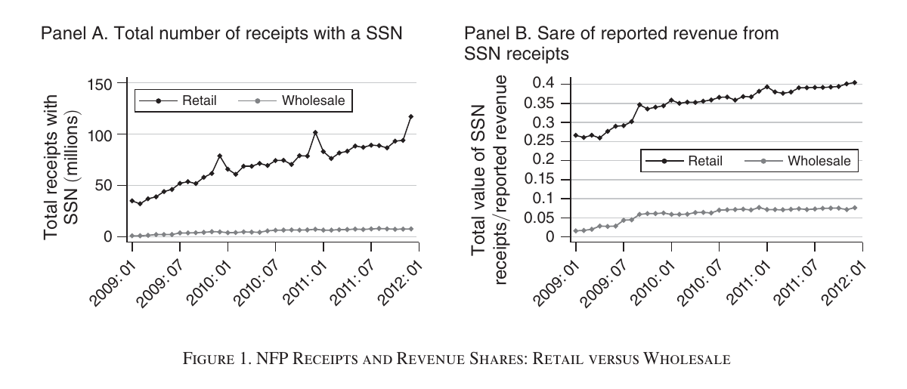
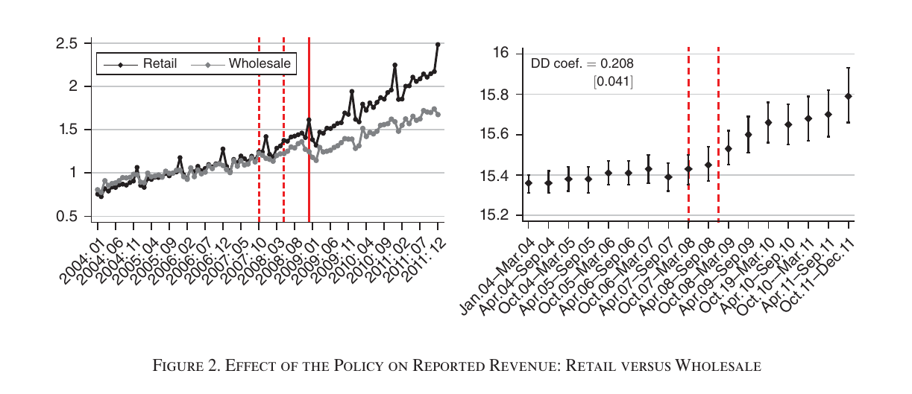
```

`r Citep(myBib, "naritomi2019consumers")` studied the effect of introducing the Nota Fiscal Paulista program in 2008, comparing the before and after behavior of retail stores (treatment) vs wholesale (control)

---
class: middle

```{r, echo=FALSE, out.width = '50%', fig.show="hold"}
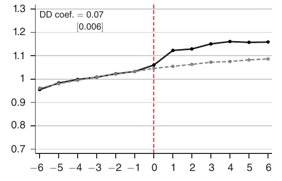
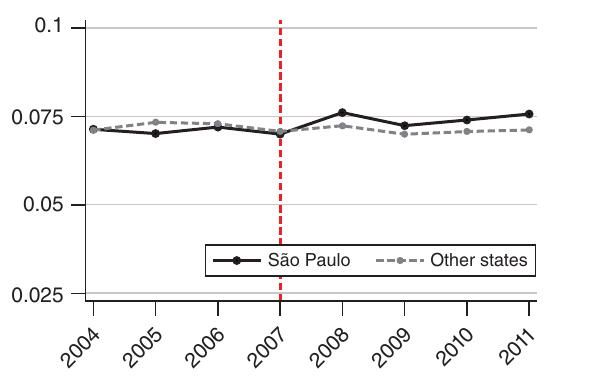
```

Part of the effect comes from consumer complaints: after a complaint, firms report 7% more sales to the government (left) &mdash; Nota Fiscal Paulista led to a 9.3% increase in ICMS (Imposto sobre Circulação de Mercadorias e Serviços) tax revenue in São Paulo, compared to other states (right) `r Citep(myBib, "naritomi2019consumers")` 

---
class: middle
## Optimal consumption tax

So far, although we have been analyzing welfare effects, the study of incidence and deadweight loss of taxes has still been in the realm of *positive economics*

But our ultimate interest is in advising policymakers on how to design better taxation systems, which is part of the *normative analysis*

This is the field of study of **optimal taxation**: what are the characteristics of a tax system that maximize the social welfare, given informational constraints (i.e., the *second-best*)

---
class: middle
## Optimal consumption tax rate

The study of optimal consumer taxation began with Frank Ramsey, who made several relevant discoveries in mathematics, philosophy and economics before his tragic death at the age of 26

In 1926, Pigou proposed the problem to him: how can we collect a certain amount of tax revenue $\bar{R}$ causing the minimum distortion in the economy?

The result became known as **Ramsey rule** (or *inverse elasticity rule*): we should tax each good inversely proportional to its elasticity of demand

---
class: middle
## Ramsey rule

Ramsey's problem is to minimize the deadweight loss sum of different markets given a minimum government revenue:

$$\min_{(t_k)_{k=1}^K} \sum_{k=1}^K EB_k \text{ subject to } \sum_{k=1}^K R_k = \bar{R}$$

We also saw in this class that $\text{EB}_k = \frac{1}{2}\frac{\epsilon_S^k \epsilon_D^k}{\epsilon_S^k - \epsilon_D^k} \frac{Q_k}{p_k} (t_k)^2$. Therefore: $$\min_{(t_k)_{k=1}^K} \sum_{k=1}^K \frac{1}{2}\frac{\epsilon_S^k \epsilon_D^k}{\epsilon_S^k - \epsilon_D^k} \frac{Q_k}{p_k} (t_k)^2 + \lambda \cdot \left( \bar{R} - \sum_{k=1}^K Q_k t_k \right)$$

---
class: middle
## Ramsey rule

The FOC for good $k$ is:

$$[t_k]: \frac{\epsilon_S^k \epsilon_D^k}{\epsilon_S^k - \epsilon_D^k} \frac{Q_k}{p_k} t_k = \lambda Q_k  \therefore \frac{t_k}{p_k} = \lambda \left( \frac{1}{|\epsilon_D|} + \frac{1}{|\epsilon_S|} \right)$$

Here $\lambda$ is the **marginal value of public funds** &mdash; as taxation is distortive, if money with the government has no greater social value than in the hands of private individuals, the optimal tax is zero

Other than that, as the *deadweight loss increases in elasticities*, the government should tax more inelastic markets

---
class: middle
## Problems with Ramsey rule

**Ramsey rule** has become well known in economics, but it implicitly makes two important assumptions:

1. What matters is **only efficiency**: minimizing deadweight loss, and not maximizing *social welfare*
2. We can analyze markets separately, ignoring how they affect each other (a good can have inelastic demand but high cross elasticity with other goods)

Unfortunately, these two assumptions make the result not very applicable in the real world, and most tax systems do not go in that direction today

---
class: middle
## Indirect taxes and inequality

The **inverse elasticity rule** has cruel distributional implications: if there are two goods, rice and caviar, as the demand for rice is more inelastic, the inverse elasticity rule implies taxing more the rice, and less the caviar

It does minimize deadweight loss, as there is little reduction in quantity traded, but it generates a huge loss of consumer surplus for the poor, decreasing social welfare (given social preferences for **equity**)

If we care about redistribution and there are restrictions in progressivity of income taxation, we should redistribute through indirect taxation: **taxing less goods consumed by the poorest**, such as food


---
class: middle

```{r, echo=FALSE, out.width = '95%'}
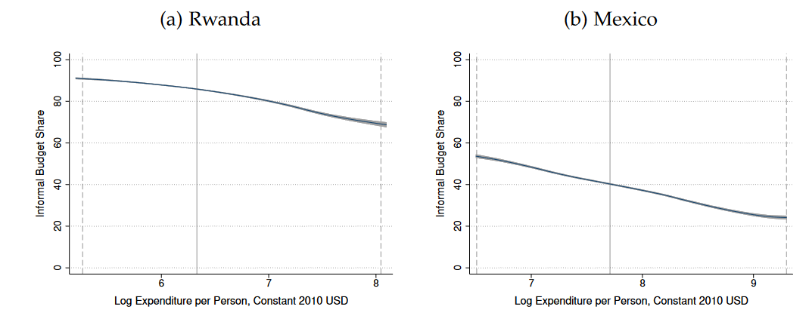
```

**Engel** (proportional) **curves** of consumption of informal goods for Rwanda (a) and Mexico (b) &mdash; as they are not taxed (by definition) and their consumption decreases in income (*necessary goods*), it makes indirect taxation in developing countries more progressive `r Citep(myBib, "bachas2022informality")`

---
class: middle

```{r, echo=FALSE, out.width = '65%'}
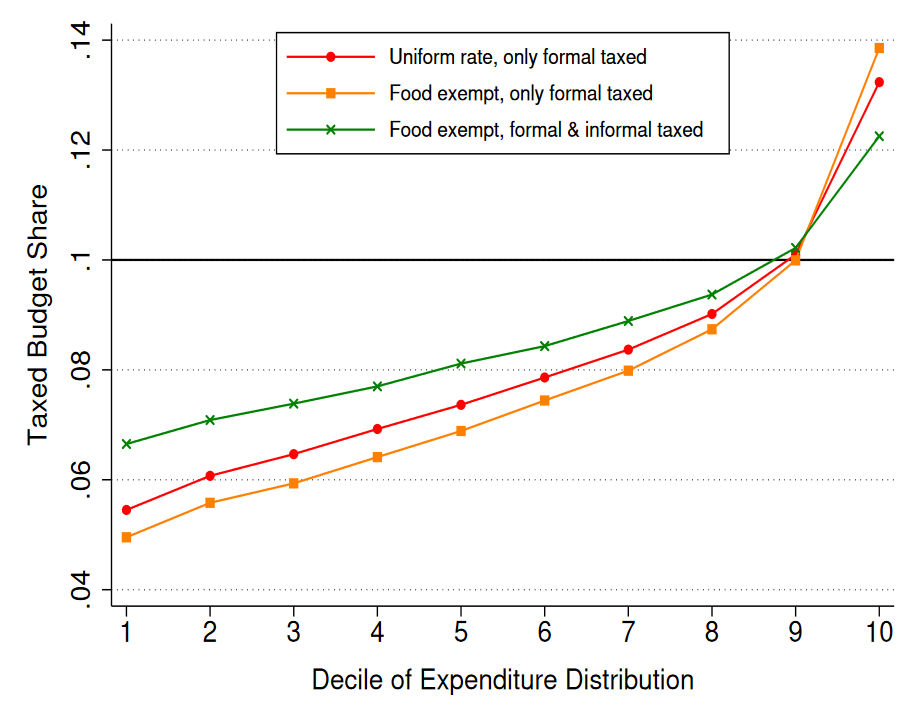
```

In a simulation with uniform taxation of 10%, having informal trade not taxed (red) makes the tax more progressive than exempting food (green), and almost supplants the gains of this policy when together (orange) `r Citep(myBib, "bachas2022informality")` 

---
class: middle
## Indirect taxes and inequality

We have seen that there is a reason to want to redistribute income through consumption tax, taxing less goods consumed by the poorest (and vice versa)

The **targeting principle** `r Citep(myBib, "atkinson1976design")`  says that if we can tax income directly, we should use this (*targeted*) instrument to reduce income inequality, not consumption (or savings) taxation

In the *budget constraint* of consumers a *proportional* income tax is equivalent to a *uniform* tax on consumption (making $1 - \tau_Y = (1 + \tau_C)^{-1}$)

$$p_x c_x + p_y c_y = (1-\tau_Y)Y \iff (1+\tau_C)p_x c_x + (1+\tau_C)p_y c_y = Y$$

---
class: middle
## Indirect taxes and inequality

But this is only valid if **ability** is the only source of inequality &mdash; if there are other relevant dimensions of heterogeneity (e.g., initial wealth or intertemporal discount rate), the targeting principle is no longer applicable

In any case, the intuition remains that indirect taxation is a very obtuse form of income redistribution compared to income tax and social assistance (tax and transfers)

In the UK, it is estimated that removing VAT exemption and increasing *means-tested* transfers by 15% would make the poorest better-off and save £11bn/year from the budget `r Citep(myBib, "mirrlees2010dimensions", after=", ch. 4")`

---
class: middle
## Indirect taxes and labor supply

Another problem with **Ramsey rule** is that it assumes that we can look at each market separately, which we know is not true: there are important *general equilibrium* effects (cross elasticities)

The most important of these effects is the relationship with work: as leisure cannot be taxed, people work too little

**Taxing less (or even subsidizing) complementary goods to work** (education, daycare, public transport, etc) can reduce this distortion &mdash; analogously, it makes sense to tax more substitute goods to work, such as video games


---
class: middle
## Uniform taxation

If we consider the **targeting principle** and assume that there are no goods related to demand for leisure (very strong!), then the ideal is a uniform rate (perhaps zero) on consumption (and redistribution through income tax)

Homogeneous taxation also makes sense for political economy reasons, as it avoids lobbying by reducing rates in particular sectors (**third-best policy**) and simplifies the tax framework 

It also **expands the tax base**: even though equivalent, income taxation allows **withholding** and consumption tax better affects self-employed workers &mdash; and a single rate does not allow manipulation of categories 


---
class:middle
# References
<small>
```{r refs, echo=FALSE, results="asis"}
PrintBibliography(myBib, start=1, end=5)
```
</small>


---
class:middle
# References
<small>
```{r refs2, echo=FALSE, results="asis"}
PrintBibliography(myBib, start=6, end=10)
```
</small>


---
class:middle
# References
<small>
```{r refs3, echo=FALSE, results="asis"}
PrintBibliography(myBib, start=11)
```
</small>

<!-- --- -->
<!-- class: middle -->

<!-- ```{r, echo=FALSE, out.width = '75%'} -->
<!-- 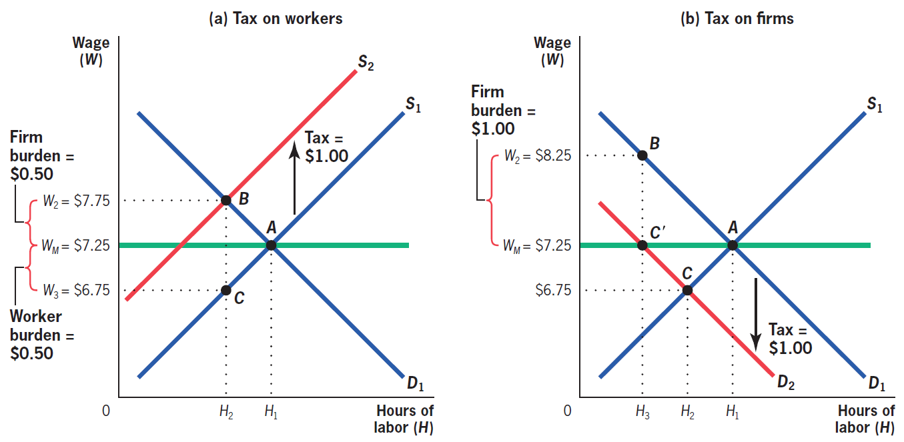 -->
<!-- ``` -->

<!-- Com salário mínimo, a incidência legal do imposto pode importar &mdash;  `r Citep(myBib, "gruber")`  -->

<!-- --- -->
<!-- class: middle -->
<!-- ## Monopoly incidence -->

<!-- When there is some prior imperfection, monopoly power, or initial tax, **the deadweight loss is no longer negligible**: so the loss of consumer and producer surplus **adds up** to more than the government revenue -->

<!-- In fact, the incidence on the consumer continues to be $\rho$, because it is the increase in the price that he pays, $dp^c/dt$ &mdash; but now the incidence on the producer is $1$: the monopolist loses an amount equal to *all* government revenue `r Citep(myBib, "weyl2013pass")`   -->

<!-- Perhaps, it seems counterintuitive that the greater the market power, the more the incidence is on the producer &mdash;  but note that *the greater the surplus, the more room there is for the tax to fall on this side of the market* -->

<!-- --- -->
<!-- class: middle -->
<!-- ## Monopoly incidence -->

<!-- Another important characteristic about incidence in non-competitive markets is that *the pass-through can be greater than one* -->

<!-- In monopoly, see that $MR = p + \Delta p \cdot Q = p \left(1 + \frac{\Delta p}{p}Q \right)$, we have: -->

<!-- $$MR = p \left( 1 + \frac{1}{\epsilon_D}\right) = MC \Rightarrow p = \frac{MC + dt}{\left( 1 + \frac{1}{\epsilon_D}\right)}$$ -->
<!-- The tax can be understood as an increase in marginal cost, which is strengthened by the monopoly **mark-up**: if $\epsilon_D = -2$, for example, $p$ increases by $2dt$ -->


<!-- --- -->
<!-- class: inverse, middle, center -->

<!-- # Allcott, Lockwood, and Taubinsky (2019). “Should We Tax Sugar-Sweetened Beverages? An Overview of Theory and Evidence” -->

<!-- --- -->
<!-- class: middle -->
<!-- ## Sin taxes -->

<!-- **Sin taxes** are taxes with the (main) objective not to collect resources but to discourage undesirable behaviors for the individual and for society, such as smoking or drinking alcohol -->

<!-- A sin tax currently under great discussion is the taxation of sugar-sweetened beverages (SSB). In recent years, 39 countries around the world have implemented these taxes -->

<!-- Problem: as SSBs are more often consumed by poor people, this taxation is regressive (**incidence**) -->


<!-- --- -->
<!-- class: middle -->
<!-- ## Health damage from soda -->

<!-- > "A tax on soda and juice drinks would disproportionately increase taxes on low-income families in Philadelphia." Bernie Sanders, 2016 em `r Citep(myBib, "allcott2019regressive")` -->

<!-- Important issue: Americans consume on average 6.9% of their total energy consumption from SSBs (154 kcal/day) -->

<!-- They also account for 23% of the average American's sugar consumption -->

<!-- Around half of Americans consume at least one beverage with added sugar per day &mdash; in Brazil, it is 60 liters per year on average -->

<!-- --- -->
<!-- class: middle -->

<!-- ```{r, echo=FALSE, out.width = '75%'} -->
<!-- 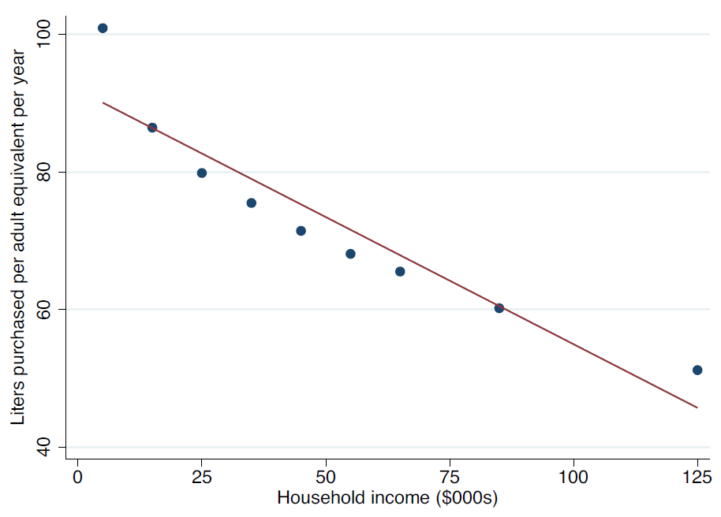 -->
<!-- ``` -->

<!-- Consumption of SSBs drops significantly with increasing income: both due to *heterogeneity of preferences* and greater knowledge of the harm caused by SSBs `r Citep(myBib, "allcott2019regressive")` -->

<!-- --- -->
<!-- class: middle -->
<!-- ## Health damage from soda -->

<!-- SSBs are harmful to health through three (main) channels: obesity, diabetes, and cardiovascular disease -->

<!-- An extra dose of SSBs per day is associated with a half kg increase in weight every 4 years, a 13% higher risk of developing type 2 diabetes and a 17% higher risk of coronary heart disease -->

<!-- SSBs are associated with costs of R$ 2,9 billion/year in SUS and studies estimate that a rate of ¢1/oz would save 17-23 billion dollars in ten years in the US with reduced medical costs -->

<!-- --- -->
<!-- class: middle -->
<!-- ## Economic reasons for taxing SSBs -->

<!-- SSBs are associated with **fiscal externalities**: not all the cost of bad health is on the individual due to health insurance or public health provision (Medicare in United States, SUS in Brazil) -->

<!-- There are also *positive* fiscal externalities: a (tragic) example is how obesity makes people die younger, reducing social security costs -->

<!-- As in this case externalities and internalities are **heterogeneous**, we have to analyze whether they occur more strongly in individuals who are more or less elastic in price  -->

<!-- --- -->
<!-- class: middle -->
<!-- ## Internalities -->

<!-- But the main reason for taxing SSBs is actually to approach **internalities** -->

<!-- Note that the aforementioned harms to health are *NOT* a reason to tax SSBs &mdash; taxation is not about maximizing people's health (otherwise, we would prohibit a lot of things!), but for solving *rational flaws* -->

<!-- Generally, the two most evoked failures are **informational failures** and **intertemporal inconsistent** and self-control failures -->

<!-- --- -->
<!-- class: middle -->

<!-- ```{r, echo=FALSE, out.width = '75%'} -->
<!-- 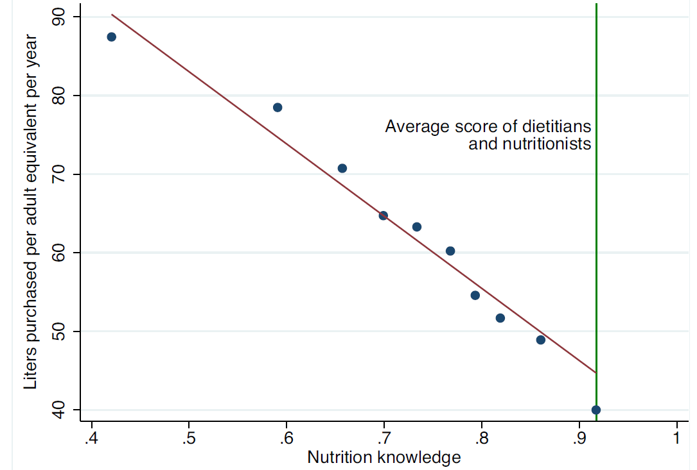 -->
<!-- ``` -->

<!-- Evidence of *information failures*: "grade" on a questionnaire about nutrition is inversely correlated with consumption of SSBs `r Citep(myBib, "allcott2019regressive")` -->

<!-- --- -->
<!-- class: middle -->

<!-- ```{r, echo=FALSE, out.width = '75%'} -->
<!-- 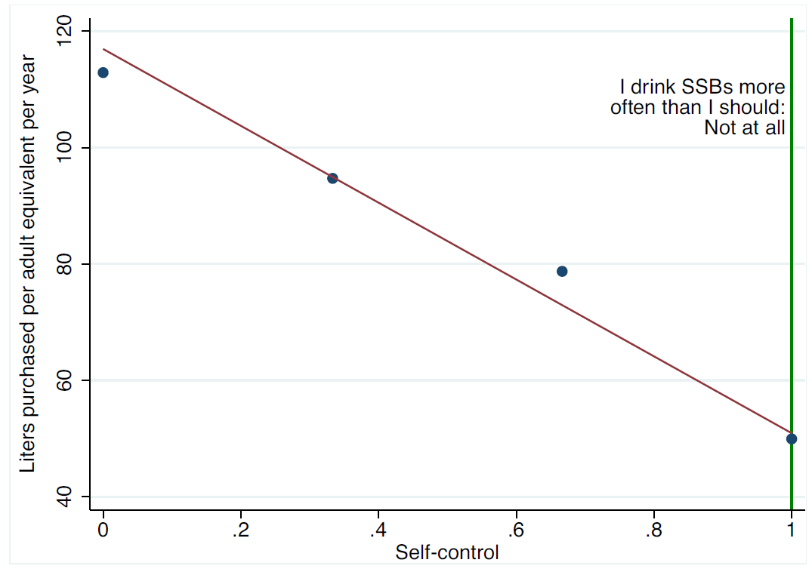 -->
<!-- ``` -->

<!-- And they find the same correlation for a measure of *self-control failures* `r Citep(myBib, "allcott2019regressive")` -->

<!-- --- -->
<!-- class: middle -->
<!-- ## Internalities -->

<!-- Internalities (opposed to externalities) *impact the consumer himself*: if we give more value to poor people's welfare, we must take into account in which proportion the internalities fall on them -->

<!-- In fact, since internalities are indeed greater among the poorest, *correcting internalities is progressive*; therefore, it is not *a priori* obvious that taxing SSBs is worse for the poorest -->

<!-- It will depend on the **elasticity of demand**: if demand is very inelastic, the loss of purchasing power is high and the reduction of internalities is low, so taxing SSBs is bad for the poor &mdash; if demand is elastic, then *vice versa* -->

<!-- --- -->
<!-- class: middle -->

<!-- ```{r, echo=FALSE, out.width = '75%'} -->
<!-- 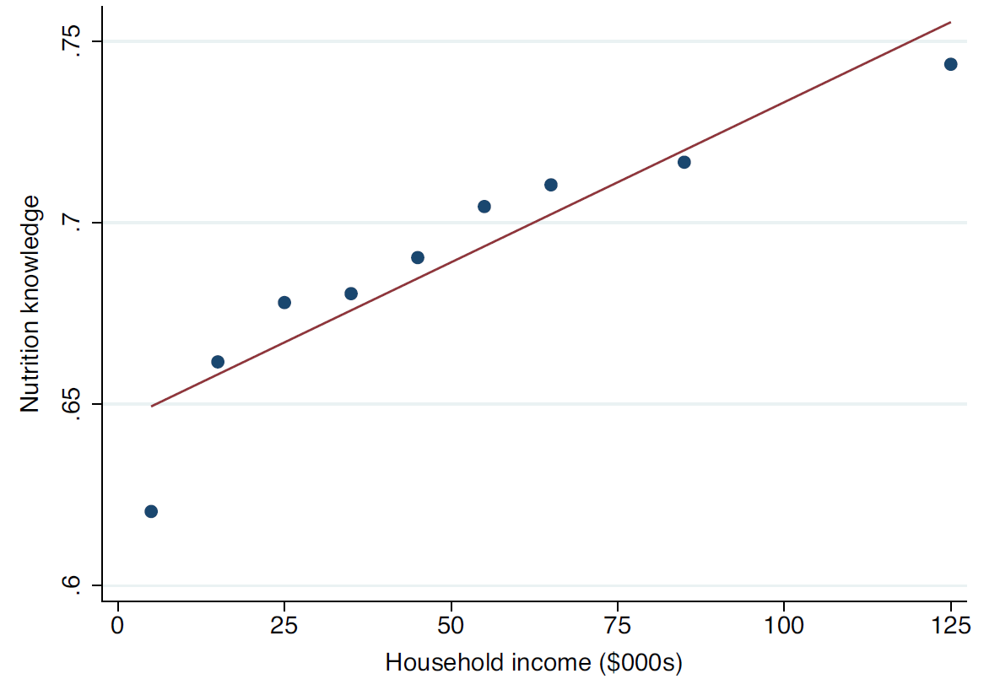 -->
<!-- ``` -->

<!-- Correcting internalities is *progressive*: nutritional information and self-control [graph omitted] are highly correlated with family income `r Citep(myBib, "allcott2019regressive")` -->

<!-- --- -->
<!-- class: middle -->
<!-- ## Incidence -->

<!-- It is also important to analyze the incidence of the tax: for example, if the **pass-through** is zero, then it is impossible to correct ex-/internalities by taxing SSBs -->

<!-- In general, how the pass-through affects the optimal tax depends on whether society gives more value on the welfare of producers or consumers of SSBs -->

<!-- In practice, the pass-through on non-durable consumer goods is quite high, and (in this application) incidence considerations do not affect the result a lot -->

<!-- --- -->
<!-- class: middle -->
<!-- ## Empirical estimates -->

<!-- To estimate the optimal tax, they need empirical estimates of relevant statistics -->

<!-- They estimate the demand price elasticity for SSBs as -1,4: very elastic! It means that taxing SSBs is a very effective way to change consumer behavior -->

<!-- Researchers estimate the healthcare cost for SSBs at ¢1/oz, and the US Dept of Health estimates that 85-88% of these costs are paid by others (externalities): ¢0,8-0,9/oz of externalities -->

<!-- --- -->
<!-- class: middle -->
<!-- ## Empirical estimates -->

<!-- Internalities are more difficult to estimate empirically &mdash; `r Citep(myBib, "allcott2019regressive")` compare with consumption by nutritionists and estimate that people would buy 31-37% fewer SSBs if they had good information about health costs, which corresponds to ¢0,91-2,14/oz of internalities -->

<!-- But this internality is correlated with income! In a survey of the harms of SSBs, misinformation is 30% higher in families with incomes of $10,000/year than 100,000/year dollars -->

<!-- Given a reasonable weight in the social welfare function, internalities being concentrated in the poorest increase the optimal tax by 20% -->

<!-- --- -->
<!-- class: middle -->
<!-- ## Putting it all together -->

<!-- Adding everything together, `r Citep(myBib, "allcott2019regressive")` calculate the optimal rate for SSBs as ¢1.5/oz (R$0,75 for a 300ml soda drink) -->

<!-- This is ¢0.8/oz of fiscal externality, ¢1/oz of internalities $\times$ 120% because of the progressiveness of internality, reduced by ¢0.5/oz because of the regressiveness of the tax -->

<!-- If the policy maker is philosophically opposed to taxing internalities (they consider it a bad case of *paternalism*), there is still room for *sin taxes*, but they should be much lower: about ¢0.4/oz (R$0,25 per can) -->

<!-- --- -->
<!-- class: middle -->
<!-- ## Principles of "sin taxation" -->

<!-- `r Citep(myBib, "allcott")` suggest 7 principles of *sin taxes*: -->

<!-- 1. The objective of a sin tax is not to "maximize health", but to correct internalities and externalities -->
<!-- 2. Focus the policy where there are stronger int-/externalities &mdash; for example, if children have less self-control and consumption in childhood forms a habit, banning soda drinks in schools (e.g.) is particularly effectful -->
<!-- 3. It is better to tax grams of sugar than ml of drink (**targeting principle**) -->

<!-- --- -->
<!-- class: middle -->
<!-- ## Principles of "sin taxation" -->

<!-- 4\. Governments should tas diet drinks and juices only if they also cause non-internalized health damages -->

<!-- 5\. Regressivity matters, but we also need to consider the *progressiveness of the internality correction* -->

<!-- 6\. The tax must be as less geographically local as possible, to avoid **leakage**, which reduces the corrective effect -->

<!-- 7\. Sin taxes (at least in the US) seem like a good idea; that is, they increase social welfare, given reasonable social preferences &mdash; such as those that rationalize the government as it is now -->

<!-- `r Citep(myBib, "allcott")` estimate that in the US welfare gains from taxing SSBs are $2,4-6,8 billion dollars per year -->
