class: inverse, middle, center

```{r, load_refs, include=FALSE, cache=FALSE}
library(RefManageR)
BibOptions(check.entries = FALSE,
           bib.style = "alphabetic",
           cite.style = "alphabetic",
           style = "markdown",
           hyperlink = FALSE,
           dashed = FALSE)
myBib <- ReadBib("./esp_bib.bib", check = FALSE)
```

# Wealth taxation


---
class: middle
## Reasons for taxing capital

In defining the taxation on capital, there is an important distinction between **life-cycle wealth**, which individuals can affect and is potentially “deserved”, and **inherited wealth**, which is the opposite

Piketty in his book argued that when the rate of return on capital is greater than the economic growth (i.e., $r > g$), the share of inherited wealth increases and also wealth inequality

In the *Belle Époque*, inherited wealth was the majority of wealth (~70%), this proportion has dropped in post-war but is rising again &mdash; yet most of the debate focuses on the choice of savings

---
class: middle

```{r, echo=FALSE, out.width = '80%', fig.align="center"}
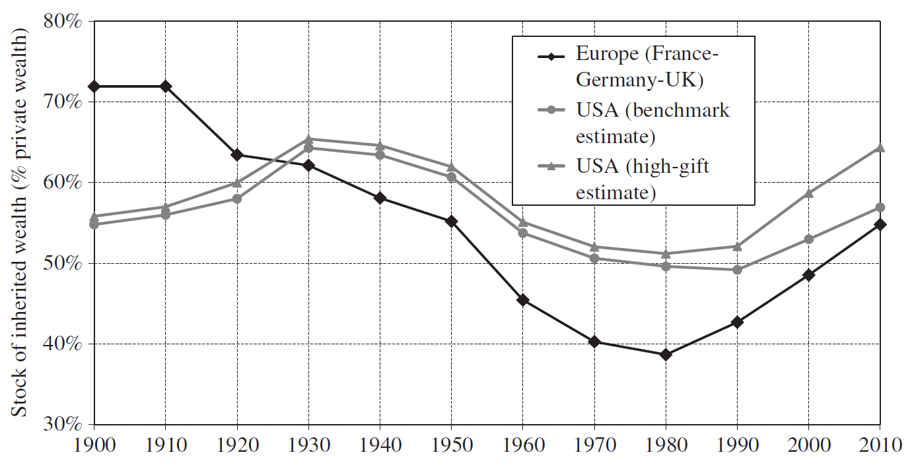
```

Contrary to the political marketing of the "self-made man", most of the world's wealth is still inherited today, in the US even more than in Europe!, and this proportion has grown since the 1980s (in another facet of the *Great Gatsby curve*) `r Citep(myBib, "alvaredo2017share")`

---
class: middle
## Political economy justification

Wealth taxation goes beyond the reduction of economic inequalities, it also involves the reduction of **political inequality** (and this would potentially justify taxation even beyond the maximum of the Laffer curve)

The richest 1% can buy media companies, make sizable campaign contributions, lobby; which (among other things) generates public dissatisfaction and political instability

Wealth inequality incentivizes a rigid control of political power by the elite in order to avoid confiscation of their wealth: the elite *has more to lose* &mdash; which generates institutional weakening and democratic rupture

---
class: middle
## Taxation on wealth

There are three types of capital taxes that are levied on the capital **stock** rather than on (capital) income **flow**: taxation on inheritance, property, and on wealth (net worth)

Another form of capital income taxation that has some similarities to taxation of capital stock (wealth) is taxation of capital gain

The capital stock of an economy measures all capital goods, machines, housing, and land that generate income stream to their shareholders

---
class: middle

```{r, echo=FALSE, out.width = '75%'}
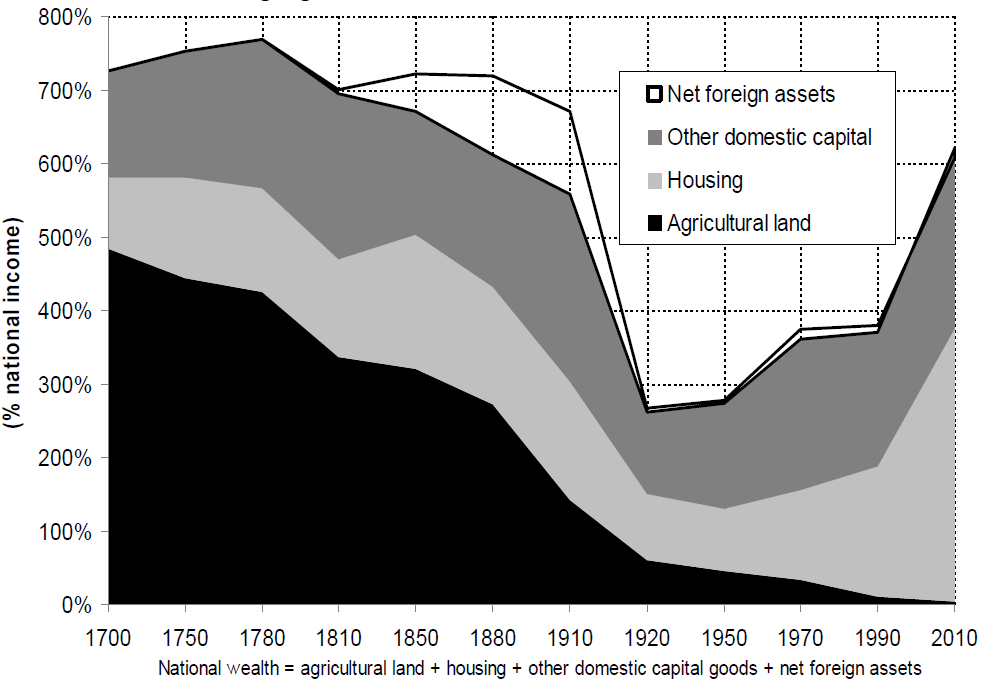
```

Capital stock in the developed economies is about 600% of GDP, with most of it being (urban) housing, which replaced the historical importance of rural properties (France) `r Citep(myBib, "piketty2014capital")`

---
class: middle

```{r, echo=FALSE, out.width = '70%'}
knitr::include_graphics("figs/eae0310-12-4.png")
```

On the other hand, in Brazil it is estimated that the amount of capital (wealth) is around 400% of GDP [(WID)](https://wid.world/country/brazil/)


---
class: middle

```{r, echo=FALSE, out.width = '80%', fig.align="center"}
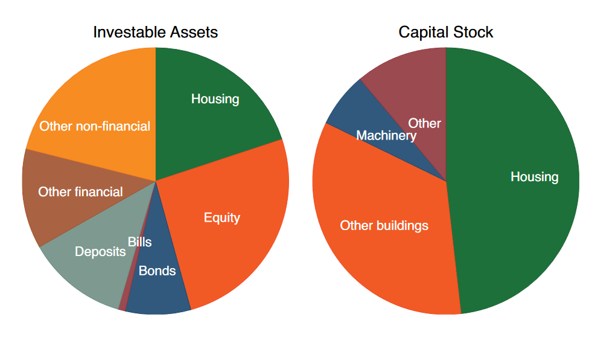
```

Composition of total investable assets and capital stock in 5 main economies (2015) &mdash; other financial is mostly corporate bonds; other non-financial are other buildings, agricultural land, machinery and equipment, and intangible capital; other capital is mostly agricultural land and intangible capital `r Citep(myBib, "jorda2019rate")`


---
class: middle

```{r, echo=FALSE, out.width = '80%', fig.align="center"}
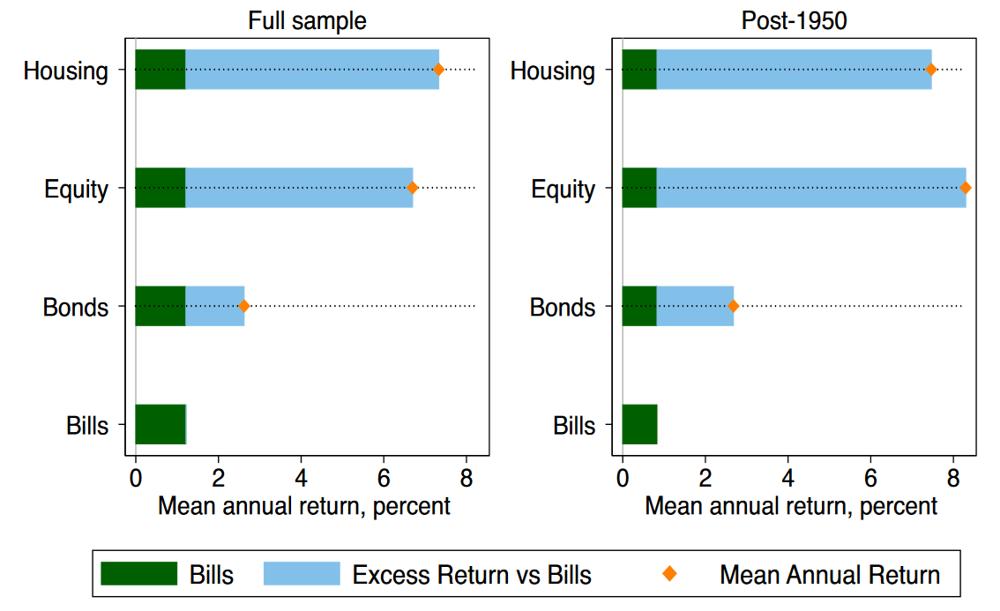
```

Historical rate of return per asset class: bills are short-time government debt, bonds are long-time government debt &mdash; much higher returns are given by equity and housing investments `r Citep(myBib, "jorda2019rate")`


---
class: middle

```{r, echo=FALSE, out.width = '50%', fig.show="hold"}
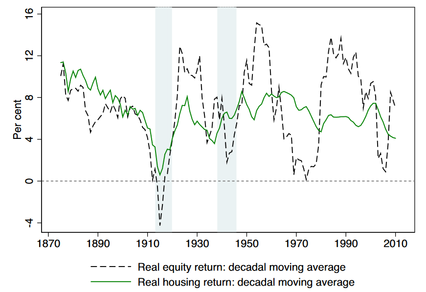
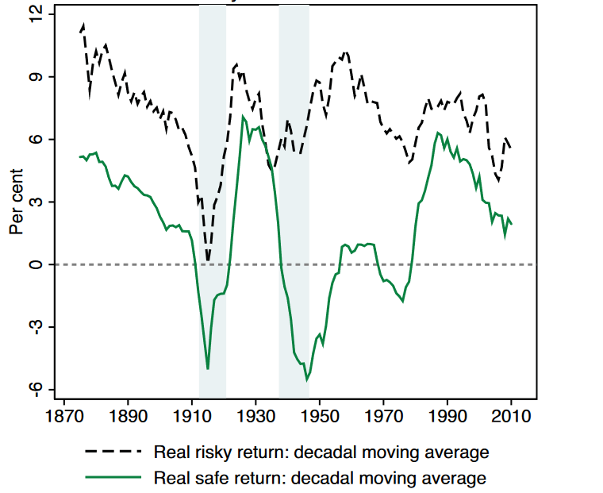
```

Even though the average return is similar between them, over time equity return has varied much more than housing, while the risk premium (risky return minus safe) has remained stable for the last 30 years &mdash; interestingly, the safe return rate varies (over time) much more than the risky `r Citep(myBib, "jorda2019rate")`


---
class: middle

```{r, echo=FALSE, out.width = '95%', fig.align="center"}
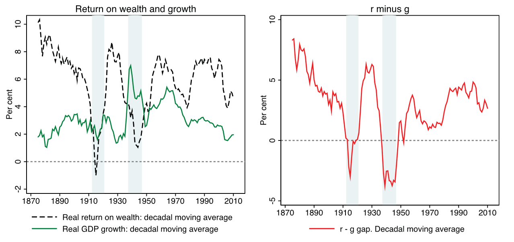
```

Piketty famously stated that if $r > g$, then the natural tendency of the economy is an increase in inequality, since the income of the top 10% (and especially 1%) grows at approximately the rate of $r$, while the income of the "bottom" 90% grows roughly according to $g$ &mdash; if so, that is bad news, because for the last 150 years except for world wars it was always true that $r >> g$ `r Citep(myBib, "jorda2019rate")`

---
class: middle
## Taxes and risk-taking

Another important facet of the effect of taxes on economic behavior is how wealth and capital taxation can affect **risk-taking**

In general, it is assumed that it is better to increase risk-taking, since it is important for growth: innovation, entrepreneurship, education are all risky activities that we would plausibly like to encourage

But in some cases, it can be the opposite: variable payment for executives can generate "short-termism" and *rent-seeking* &mdash; also, excessive risk-taking and in the financial sector can generate risky bets, instability and financial crises

---
class: middle
## Wealth taxation and risk-taking

Consider a market with a risk-free asset with a (fixed) net return $r$ and a risky asset with a (random) return of $x$, such that $\min{x} < r < \mathbb{E}x$ 

The agent then chooses the proportion in the risky asset $a$ such that it solves: $$\max_{a} \mathbb{E} \left\{ u \left( (1 - \tau_W)W \left[ 1 + (ax + (1 - a)r) \right]  \right)  \right\}$$

which $\tau_W$ is the tax on wealth &mdash; naming wealth at the end of the investment period as $W_{1}$, we have that the FOC is: $$\mathbb{E} \left\{ u^{\prime}(W_1) (1 - \tau_W) W (x - r) \right\} = 0 = \mathbb{E} \left\{ u^{\prime}(W_1)(x - r) \right\}$$

---
class: middle
## Wealth taxation and risk-taking

In other words, the tax $\tau_W$ drops out of the FOC: it does not distort the relative value of investments, there is only an income effect, because it reduces $W_1$, since: $$W_1 = (1 - \tau_W)W \left[ 1 + (ax + (1 - a)r) \right]$$

The direction of the effect of a wealth tax on risk-taking depends on the shape of the utility function: if it has decreasing **absolute** risk aversion (empirically supported), then agents becoming poorer decrease the *amount* of risky assets

But it is only true that the **share** $a$ of risky assets falls with wealth taxation if we have decreasing **relative** risk aversion, which is empirically debatable &mdash; most models assume a constant RRA: in that case, $\tau_W$ does not affect $a$!

---
class: middle
## Taxation of risky assets and risk-taking

Now, consider a tax directly on the return of the risky asset: $$\max_{a} \mathbb{E} \left\{ u \left( W \left[ 1 + (ax(1 - \tau_A) + (1 - a)r) \right]  \right)  \right\}$$

As early as 1944, Domar and Musgrave realized that under some hypotheses, as long as there is **full loss offset**, taxation of risky assets $\tau_A$ *increases* risk-taking

Suppose that the asset $x$ costs `$`100 and pays `$`120 in the positive scenario and `$`80 in the negative scenario (50% of chance each) and that $r$ is money with no inflation &mdash; so a 50% tax on the return on assets *with loss offset* will make the asset pay `$`110 in the positive scenario and `$`90 in the negative scenario

---
class: middle
## Taxation of risky assets and risk-taking

It is as if the government joined the company as a shareholder (**risk-sharing**), and investors can reconstruct the initial portfolio by doubling $a$ (increasing risk-taking)

In the real world, however, loss offset is almost never complete, since it opens up space for tax avoidance/evasion, and it possibly involves the state paying the individual, which is politically difficult &mdash; and if taxation is *progressive*, then individuals can have higher rates on a profit than on a loss

Without full loss compensation, the taxation effect on risk-taking is ambiguous, since it lowers the expected value of the asset

---
class: middle
## Capital gains

An important form of capital income does not come as monetary income, but as a rise in the value of assets (real estate, stocks, currencies) that someone owns: this income is called **capital gains**

Capital gains generate two problems for tax systems:

1. If they are taxed at a lower rate than dividends, firms can turn dividends into capital gains by **share buybacks** (or simply investments)
2. As capital gains are generally collected on *realization* (sale), while dividends are taxed *on accrual* (annually), there is an *implicit tax benefit* for capital gains

---
class: middle
## Taxation on capital gains

Problem 2 is difficult (but not impossible!) to eliminate, because many illiquid assets do not have well defined market prices outside the moment of disposal of assets (but public stocks and similar investments have)

Another problem is that the owner of the asset may not have cash available to pay the tax without selling the asset (imagine a retired person with a R$ 1MM property that has doubled its value, and a 20% tax on capital gains)

In the US (and in Brazil for properties bought until 1996), capital gains are exempt in case of death, so a good part of the gains of the richest 0.1% will never be taxed (by income taxes)

---
class: middle
## Taxation on capital gains 

On the other hand, since capital gains are evaluated *nominally*, there is overtaxation because of inflation (but this is not particular to this type of capital taxation)

Capital gains taxation is a tax on risky assets (mainly corporate capital), which could in principle hinder risky actions beneficial to society, such as entrepreneurship

But as we saw, this effect is *theoretically ambiguous*, and there is little empirical evidence that indicates a relevant impact in this sense

---
class: middle
## Capital gains and inequality

Taxation of capital gains is very **progressive**: in the US, while capital gains comprise less than 10% of income of people that earn less than $500k a year, it is half the income of those with earnings higher than 10MM (the richest 0.1%)

In 2010, the 400 richest families in the US paid 16% of all capital gains tax collected by the US government `r Citep(myBib, "gruber")`

Another reason for this tax is to expand the tax base: in addition to point 1. already mentioned, the tax benefit for capital gains encourages the payment of executives with company shares and not salaries, distorting incentives &mdash; an example is *[carried interest](https://www.taxpolicycenter.org/briefing-book/what-carried-interest-and-how-it-taxed)* in the financial market

---
class: middle

```{r, echo=FALSE, out.width = '80%'}
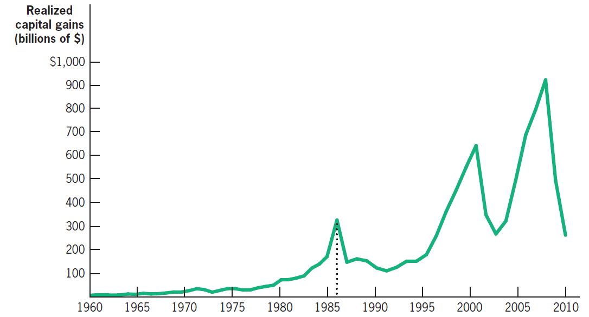
```

Realization of capital gains jumped in 1986, as anticipation of a tax increase in 1987 &mdash; but soon after, it returned to its original level, indicating that this high behavioral effect is only in the short-term `r Citep(myBib, "gruber")`

---
class: middle
## Tax on inheritance

Inheritance tax in SP is 4% (with some exemptions) &mdash; in the US, there is an *estate tax* of 40% with an exemption up to ~11MM, and although it is only levied on the richest 0.1%, it collects 0.6% of the government revenue

Taxing inheritances brings a normative dilemma: on the one hand, inequality in inheritance generates economic inequality without "merit" by individuals &mdash; on the other hand, it "feels" unfair to tax parents who worked hard (and paid income tax on that income) again when they die

Usually, those who are in favor of the tax emphasize the recipient's point of view, while those who are against emphasize the donor's ("death tax")

---
class: middle
## Behavioral effects

There are several dimensions of potential behavioral effects of inheritance taxation:

1. Reduces *parents'* work by decreasing the marginal utility of money (by substitution effect and income effect)
2. Reduces capital accumulation by parents (increases consumption) and decreases the tax base of this tax
3. Increases the work of *sons and daughters* due to income effect

Kopczuk (2013) estimates that the elasticity of reported inheritances in relation to the tax-free rate of 0,1-0,2 (relatively low) &mdash; it is important to understand *why* people leave inheritances

---
class: middle
## Theory of accidental inheritance

The **theory of accidental inheritance** is the idea that people die rich because of "love of wealth" or precautionary reasons due to the uncertainty of the date of death: in this case, there is no behavioral effect on the parents (1 and 2), only on the children (3, positive) &mdash; inheritance taxation should be as high as possible

In surveys, people do not indicate leaving inheritances as the main reason for accumulating wealth; it is also a (plausibly) necessary reason to observe childless multimillionaires

Kindermann et al (2020) estimate that in Germany, each €1 collected with inheritance taxation raises ¢9 *more* due to more labor supply of the heirs (income effect)

---
class: middle
## Theory of altruistic inheritance

In the case of the **theory of altruistic inheritance**, then we have effects 1-3, and the theory is ambiguous: but some inheritance taxation is usually desirable

We saw by the *targeting principle* that if the only source of heterogeneity is income, then we should tax only income for redistribution, but inheritances generate another source of heterogeneity, therefore, we need two instruments: income taxation and inheritance taxation

Note that even if monetary inheritances were entirely taxed, this would not imply **equality of opportunity**, as there are other forms of intergenerational transfer of income: education, connection networks, etc

---
class: middle

```{r, echo=FALSE, out.width = '80%'}
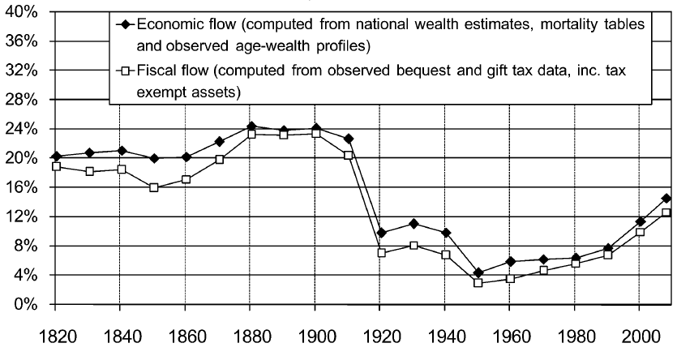
```

The annual flow of inheritances as a proportion of GDP in France was 20% during the Industrial Revolution, it reached 1/4 in the *Belle Époque*, collapsed to 8% in WWI and 4% in the post-war period, but it has been rising again `r Citep(myBib, "piketty2011long")`

---
class: middle
## Tax on property

The only reason for taxing property (real estate, cars, etc) is that it is simpler to apply than taxes on other forms of patrimony, but its effects depend on its **incidence**

One view is the *benefits tax view*, the **Tiebout model**: the (local) tax on housing is used to pay local public goods, so it is just a price paid for city amenities &mdash; it does not redistribute income

The idea is that in Tiebout's model, people "vote with their feet", and therefore, cities have to keep the local tax equal to the benefit of living there

---
class: middle
## Empirical evidence

In the US from 1980 to 2006, the elasticity of gains realization in relation to taxation was between -0,5 and -0,3, denying the argument that tax cuts would "pay for themselves": the tax that maximizes revenue is between 38-47% `r Citep(myBib, "agersnap2021tax")`

The elasticities of taxable wealth in relation to inheritance taxation seems even lower empirically: 0,27 and 0,1 in `r Citep(myBib, "goupille2018behavioral")` and `r Citep(myBib, "glogowsky2021behavioral")`, respectively

`r Citep(myBib, "kopczuk2007bequest")` compare the inheritance left by "sudden" deaths in people with long terminal illness, and find reported wealth 10-18% lower for long-term illnesses (months or years) and 5-10% for short-term illnesses (days or weeks) 

---
class: middle
## Wealth in tax havens

**Tax havens** are countries that combine bank confidentiality with low (or no) profits taxation

`r Citep(myBib, "alstadsaeter2019tax")` compared data leaks from the "Panama Papers" and "Swiss Leaks" with Scandinavian administrative data and estimate that the richest 0,01% *evade* ~25% of taxes due (!) with offshore accounts (against ~5% of the population in general)

They estimate that 1,6% of total Scandinavian wealth and 3,3% of the world's is hidden in tax havens &mdash; and this wealth is extremely concentrated: while the richest 0,01% have 5% of total wealth, there is half of the wealth in tax havens

---
class: middle

```{r, echo=FALSE, fig.show="hold", out.width = '50%'}
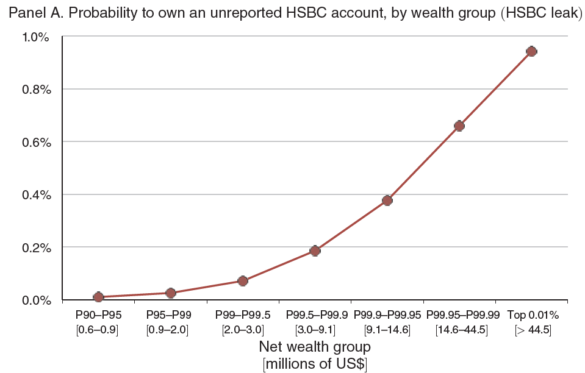
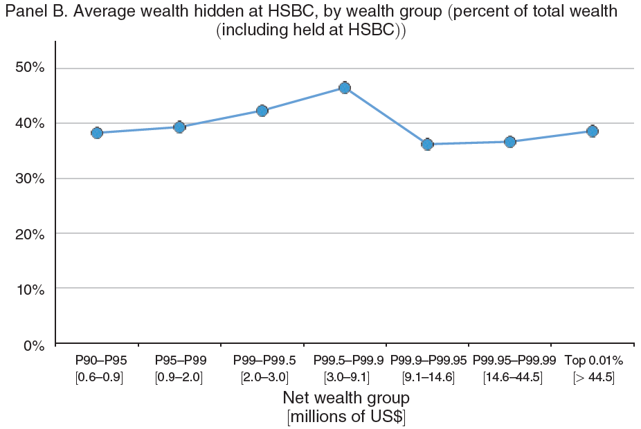
```

While the 99% (up to $2MM net worth) have almost zero probability of having an unreported HSBC account, this probability rises to almost 1% for the richest 0,01% (> $40MM) &mdash; but conditional on account existence, all of them evade around 40% of taxes from their total wealth `r Citep(myBib, "alstadsaeter2019tax")`

---
class: middle

```{r, echo=FALSE, fig.show="hold", out.width = '50%'}
knitr::include_graphics("figs/eae0310-13-8.png")
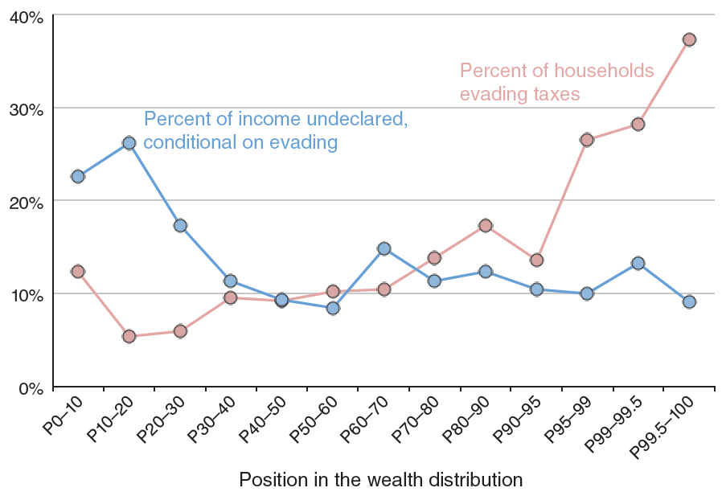
```

It generates a gigantic tax evasion wealth inequality: while the richest 0,01% have 5% of Danish wealth, they represent half of the wealth in tax havens &mdash; moreover, conditional on income tax evasion, households evade all around 10%, but the proportion evading gives a jump in the richest 5% and 0,5% `r Citep(myBib, "alstadsaeter2019tax")`


---
class: middle
## Privatization and wealth inequality

**Tax havens** are countries that combine bank confidentiality with low (or no) profits taxation


---
class: middle

```{r, echo=FALSE, out.width = '65%', fig.align="center"}
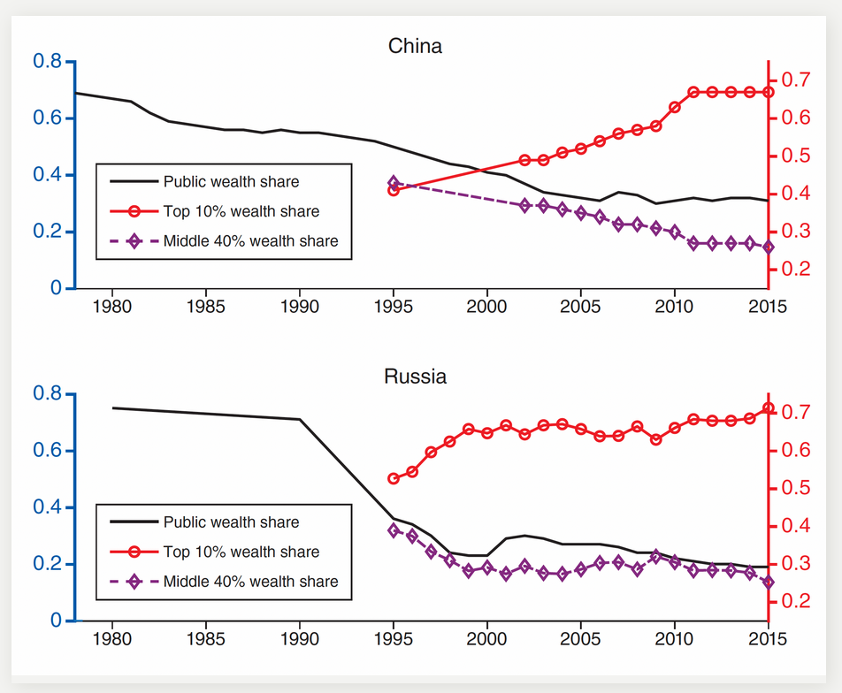
```

In China and Russia, the sharp decrease in public wealth share during the 90s was associated with a large increase in the top 10% wealth share and a decease in the middle 40% wealth share. `r Citep(myBib, "novokmet2018communism")` 

---
class: inverse, middle, center

# Scheuer & Slemrod (2021). "Taxing Our Wealth"


---
class: middle

```{r, echo=FALSE, out.width = '70%'}
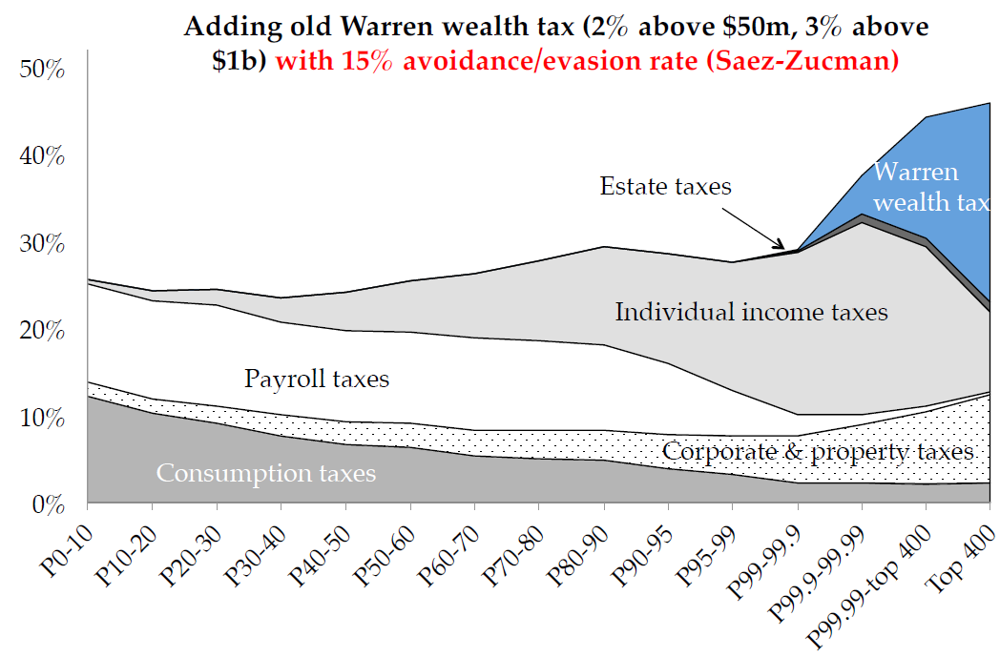
```

The motivation for **wealth taxation** is that other forms of taxation, even capital and inheritance, have limited reach on the richest 0,01%, making the regressive system at the *extreme* top of the distribution &mdash; something that supporters of such a tax say it would solve (Saez)

---
class: middle
## Tax on wealth

The wealth tax (in Brazil, *imposto sobre grandes fortunas*) is a tax on **net worth**: the value of assets minus liabilities owned by each household

A tax on capital **stock** is (economically) equivalent to a tax on **flow**!  If the normal rate of profit is $5\%$, then a capital tax of $1\%$ is equivalent to a tax on profits of $20\%$

The lower the normal profit rate, the greater is the effect of a tax on capital: if instead of $5\%$ is $2\%$, so the tax of $1\%$ becomes a rate of $50\%$ on the profit

---
class: middle

```{r, echo=FALSE, out.width = '70%', fig.align='center'}
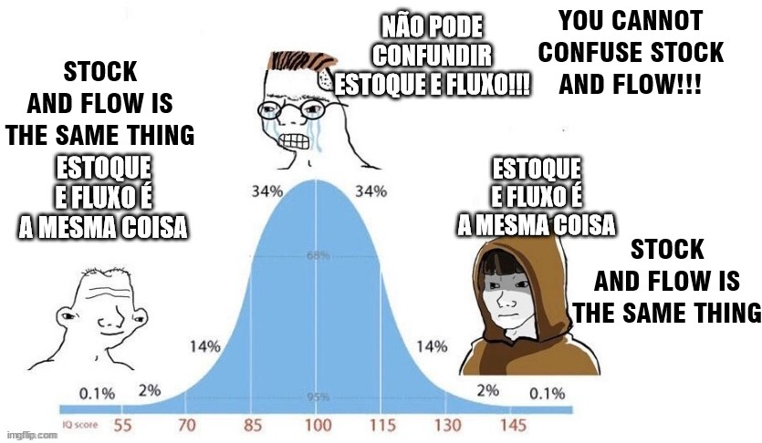
```

---
class: middle
## Tax on wealth


There is an important difference: wealth tax is a tax on **the normal profit rate** &mdash; *abnormal profits are not taxed*

And vice versa: if I invest all my wealth in bonds that pay 0% p.a. (US bonds until recently), I will not pay any capital income tax, but I still pay the same in wealth tax

This has both positive consequences, by not taxing inframarginal profits from innovation and higher productivity, and negative consequences, by not taxing economic profits because of market power

---
class: middle
## Tax on wealth

Note that microeconomic theory says that *we should tax economic profit at 100%* because it has no behavioral effect, and the wealth tax taxes at 0%

There are also the two difficulties discussed earlier: it is difficult to estimate the illiquid asset value annually; and the amount of wealth is not always related to disposable income in a given year

This tax would potentially have a significant effect on wealth inequality, since taxes that lower the rate of return accumulate over time, having a considerable effect in the long run

---
class: middle

```{r, echo=FALSE, out.width = '75%', fig.align='center'}
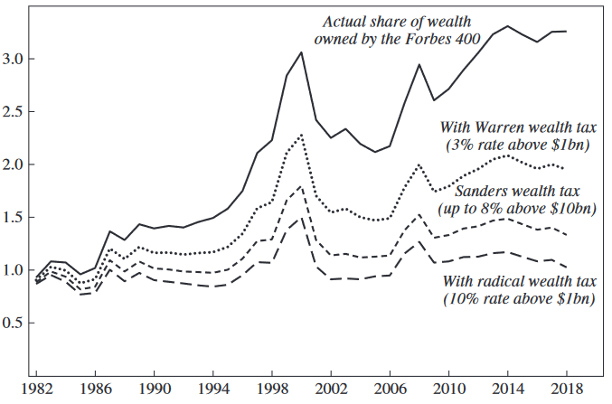
```

A capital tax rate at 5-8%, as proposed by Sanders in the US, may seem confiscatory (since it corresponds to a taxation on profits of up to 100% or more), but in fact, it would only control the income share of the Forbes 400 over the past 40 years `r Citep(myBib, "saez2019progressive")`

---
class: middle
## Tax on wealth

Although today only a few countries have taxation on wealth, this tax would by no means be an invention (or "jabuticaba"): Finland, Sweden and Switzerland already had wealth taxes of up to 4%, and today parts of Spain reach 3,75%

Most of these countries abandoned this policy in the last decades, which may point to practical difficulties (or be a matter of political economy)

Recent proposals in the US have much higher marginal rates (up to 8%) and reach much less people (only 75.000 households under the Warren plan, with 600 families at the maximum rate)

---
class: middle

```{r, echo=FALSE, out.width = '85%'}
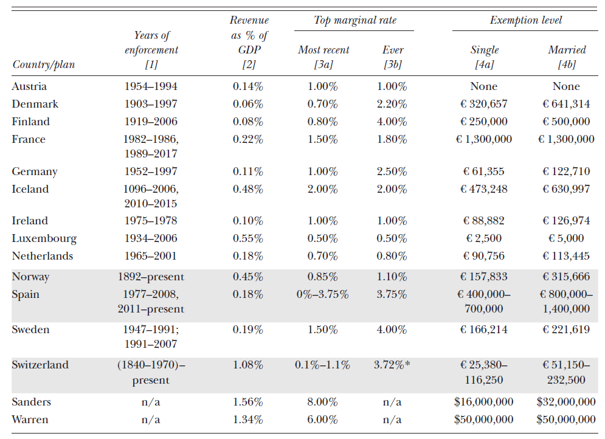
```

Several European countries had already implemented a wealth tax for many decades &mdash; but experiments with this tax had always generated small revenue and had lower rates than more recent proposals `r Citep(myBib, "scheuer")`

---
class: middle
## Taxation on wealth and property

As we have seen, **property taxation** is a form of wealth taxation, but with some negative particularities

Property taxation does not allow deduction for liabilities: a house financed entirely with debt represents zero net worth, but people still pay IPTU

Furthermore, it violetes the **horizontal equity** by taxing one type of asset but not others &mdash; and worse, it is not an asset especially held by the richest: while housing represents 62% of the gross assets of the middle 3 quintiles, only 8% of the richest 1% is real state

---
class: middle
## Taxation on wealth and inheritance

Another form of capital *stock* taxation is inheritance taxation: this is more similar to the wealth tax, but it is levied only once at time of death

This facilitates **tax evasion**: it is easier to do tax planning for a once in a generation event than an annual tax collection

On the other hand, it reduces administrative costs of the tax, which does not involve a (often difficult) calculation of the taxpayer's net worth every fiscal year

---
class: middle
## Empirical evidence

In Switzerland, a reduction of 1p.p. (quite a lot!) in tax increased reported wealth by 43%: 25% of the effect would come from mobility, 20% from property **capitalization**, and the effect on the savings rate is very small

In Denmark, a reduction of 1p.p. increased reported wealth by 21% in 8 years &mdash; half of the effect is *mechanical*, since a higher rate reduces wealth even without behavioral change

The evidence for other countries is of smaller effects: in the Netherlands, a reduction of 1p.p. increased reported wealth by 14%, and in Sweden, there was a nearly zero effect of 0,1-0,27%

---
class: middle
## Real effects

A possible effect of wealth taxation is to reduce entrepreneurship (69% of Forbes 400 are founders of their own companies) &mdash; but because success in entrepreneurship is highly asymmetric, the marginal utility in the case of success is quite small

However, if this tax reduces capital accumulation, it may reduce the wage rate in the long run

Wealth taxation can also encourage emigration: the evidence is that this effect is significant, but it comes from where the tax is regional (and in Spain, the effect came entirely from fraudulent misrepresentation)

---
class: middle

```{r, echo=FALSE, out.width = '70%'}
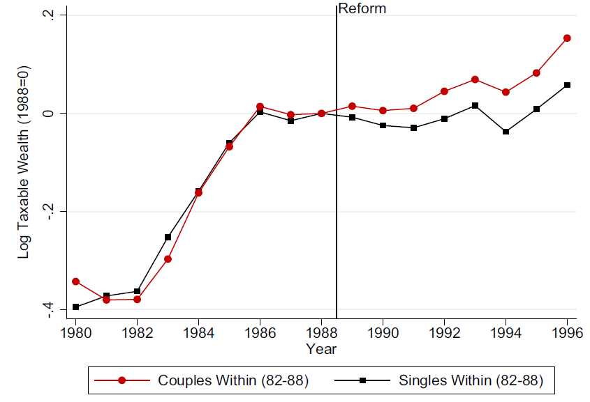
```

In Denmark, a reduction in wealth tax from 2,2% to 1% for couples in 1989 increased its wealth by 18% vs single people after 8 years, with 11% as a *mechanical effect* &mdash; the effect doubles between the ultra-rich and in 30 years: long-term elasticity is 0,7 for the rich and 1,15 for the ultra-rich `r Citep(myBib, "jakobsen2020wealth")`


---
class: middle

```{r, echo=FALSE, out.width = '50%', fig.show='hold'}
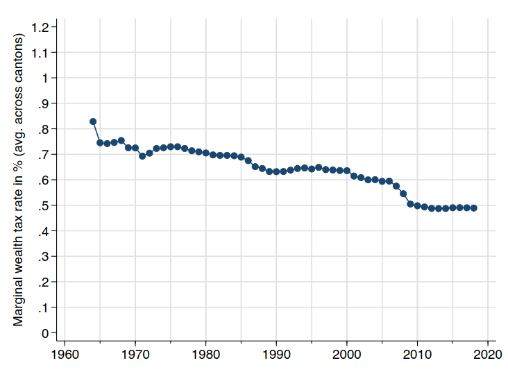
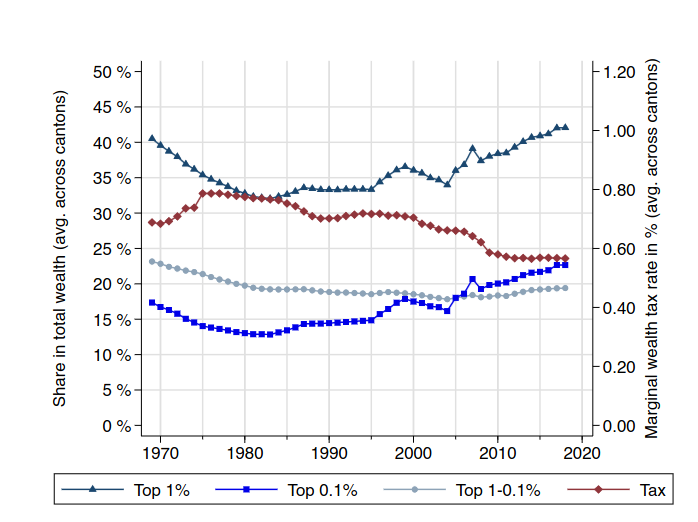
```

Contrar `r Citep(myBib, "marti2023does")`


---
class: middle

```{r, echo=FALSE, out.width = '70%', fig.align="center"}
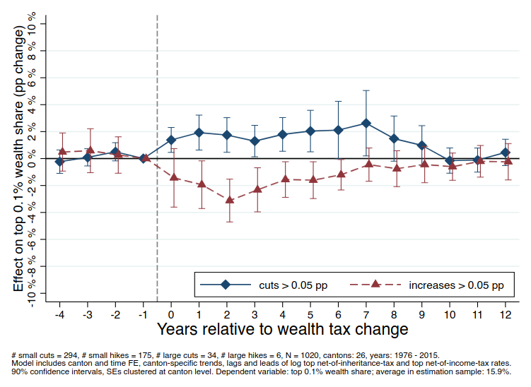
```

Conrar `r Citep(myBib, "marti2023does")`

---
class: middle
## Tax avoidance and evasion

When Spain gave wealth tax exemptions to some forms of closed corporations (and not others), their proportion rose from 15% to 77% of privately held companies

This form of tax avoidance can generate significant economic distortions, as firms try to hide their owners' properties by keeping the capital private, even when going public would be efficient

The implementation of this tax could also plausibly intensify tax evasion of wealth in tax havens, which already represents 3-8% of the world's wealth

---
class: middle

```{r, echo=FALSE, out.width = '75%'}
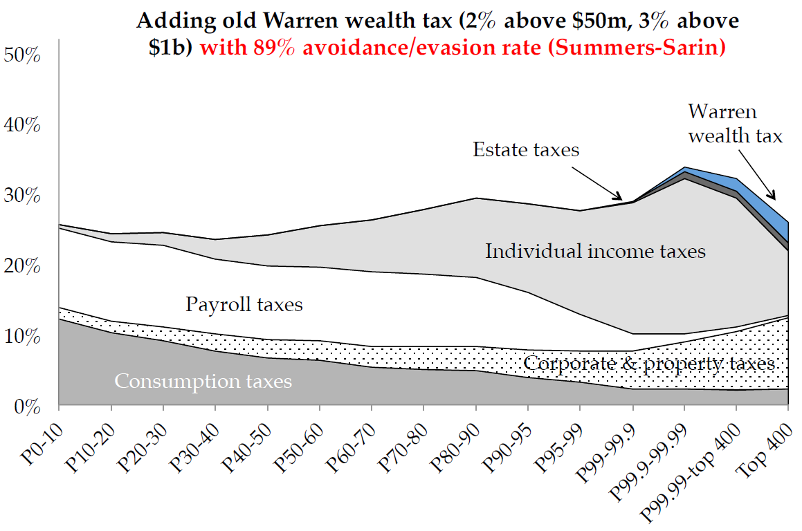
```

There is no consensus about the evasion level of a potential tax on wealth &mdash; and high evasion would harm a lot the tax progressivity, while increasing its efficiency cost (Saez)

---
class: middle
## Lump-sum tax on wealth

In principle, wealth inequality could be alleviated by a one-time unanticipated wealth tax, which is effectively **lump-sum**

Because it is *one-time and unanticipated*, it does not distort behavior &mdash; in fact, profit on capital already invested is **pure profit**, and taxation of economic profit is not distortive

This policy, however, only works if it is in fact one-time (and agents believing that it will be one-time): in practice, they often become long-lasting tax policies or happen repeatedly, making this argument unfeasible

---
class:middle
# References
<small>
```{r refs, echo=FALSE, results="asis"}
PrintBibliography(myBib, start=1, end=5)
```
</small>

---
class:middle
# References
<small>
```{r refs2, echo=FALSE, results="asis"}
PrintBibliography(myBib, start=6, end=10)
```
</small>

---
class:middle
# References
<small>
```{r refs3, echo=FALSE, results="asis"}
PrintBibliography(myBib, start=11)
```
</small>
